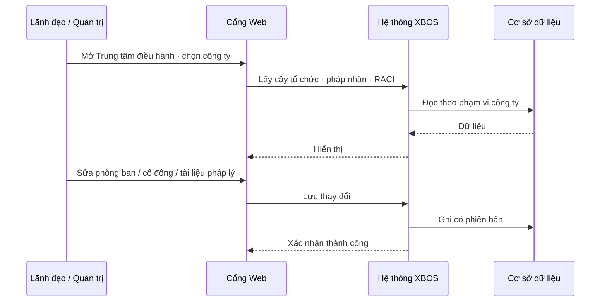
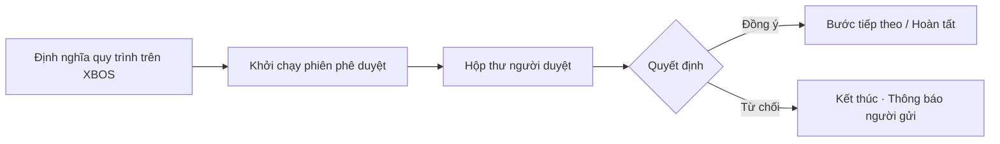
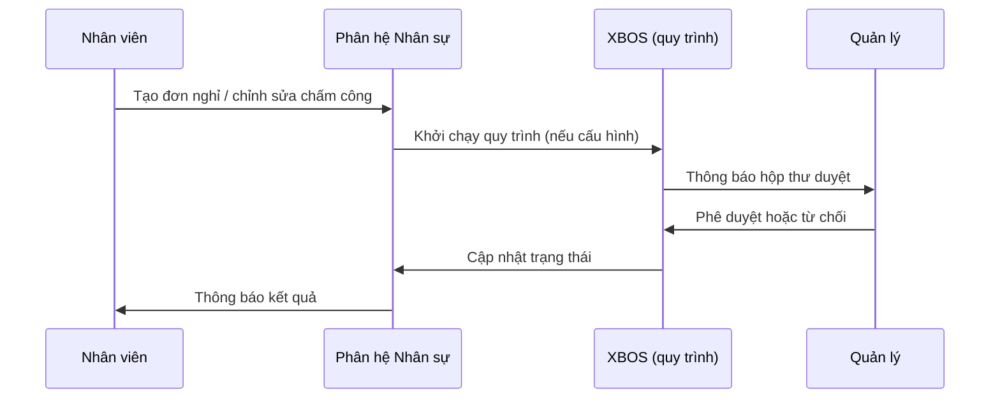
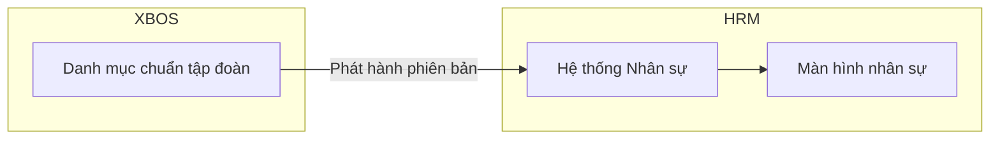
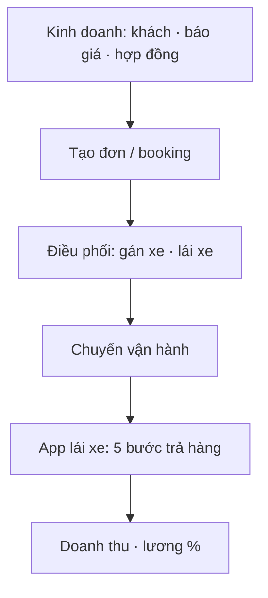
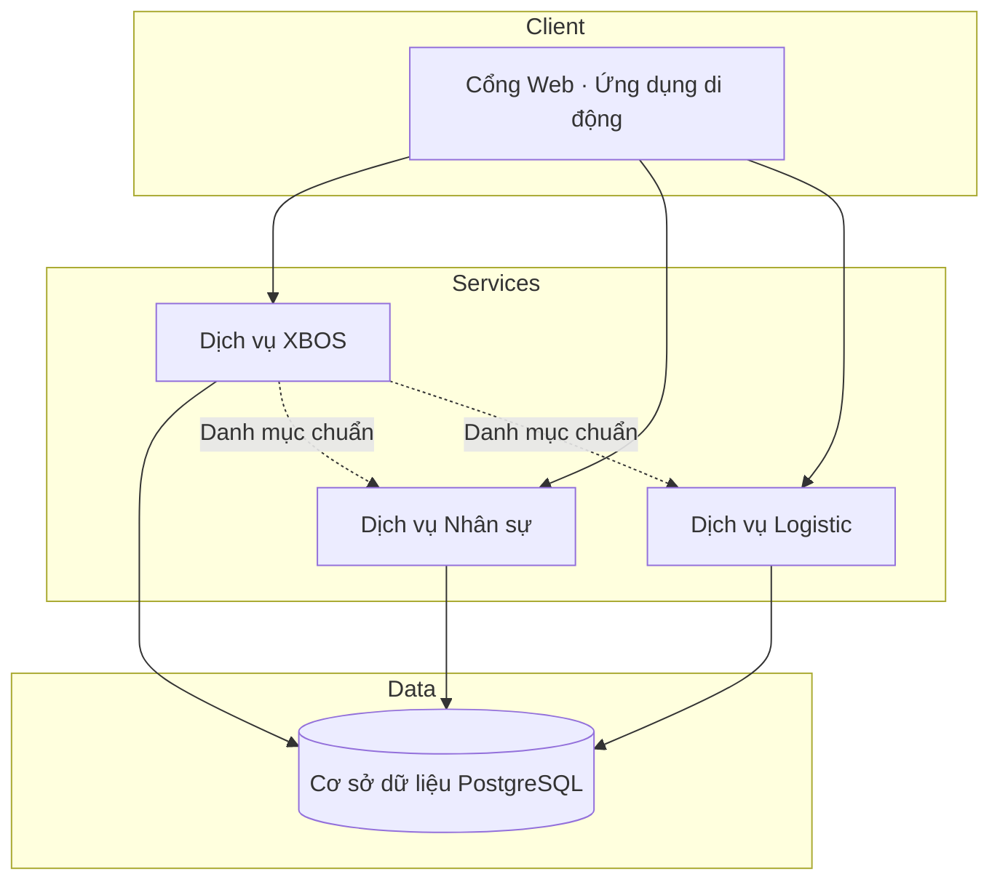

# BRD Tổng hợp — Hệ sinh thái XeVN OS

## Kiểm soát tài liệu

| Mục | Giá trị |
|-----|---------|
| Tên tài liệu | BRD Tổng hợp — Hệ sinh thái XeVN OS |
| Phiên bản | 1.0 |
| Trạng thái | Bản trình bày / làm việc |
| Ngày hiệu lực | Tháng 5/2026 |
| Phạm vi | Toàn bộ phân hệ: Cổng Web, XBOS, Nhân sự (HRM), Logistic |
| Đối tượng | Ban điều hành, chủ đầu tư, phòng IT, nghiệp vụ |

**Mục đích:** Một tài liệu nghiệp vụ thống nhất mô tả kiến trúc, luồng vận hành, phạm vi theo giai đoạn và **toàn bộ** tình huống sử dụng (use case) của hệ sinh thái — làm căn cứ triển khai, nghiệm thu và trình bày điều hành.

**Tài liệu liên quan (chi tiết từng phân hệ):** BRD Phân hệ XBOS · BRD Phân hệ HRM · BRD quy tắc phạm vi dữ liệu toàn hệ · Lộ trình Phase 1 & Phase 2 — XeVN OS · Bảng tổng hợp use case toàn hệ sinh thái XeVN.

---

## 1. Tóm tắt điều hành

XeVN OS là hệ sinh thái phần mềm **đa công ty** phục vụ tập đoàn vận tải — logistics, gồm:

| Thành phần | Vai trò |
|------------|---------|
| **Cổng Web (Portal)** | Một điểm vào: bảng điều hành, trung tâm điều hành, cài đặt, nhúng nhân sự |
| **XBOS** | Lõi: tổ chức, danh mục chuẩn, quy trình phê duyệt, RACI, dữ liệu master |
| **Nhân sự (HRM)** | Hồ sơ nhân viên, chấm công, lương, tuyển dụng, ứng dụng nhân viên |
| **Logistic** | Kinh doanh → điều phối → vận đơn/chuyến → ứng dụng lái xe |

**Quy mô đã chuẩn hóa:** 373 tình huống sử dụng phần mềm · 183 mục danh mục cấu hình trên XBOS.

**Lộ trình triển khai:** Giai đoạn 1 — XBOS + Nhân sự + khai danh mục Logistic. Giai đoạn 2 — Logistic nghiệp vụ đầy đủ.

---

## 2. Kiến trúc tổng thể

### 2.1 Bốn tầng kiến trúc

| Tầng | Mô tả |
|------|--------|
| Trình bày | Cổng Web tập đoàn — giao diện điều hành thống nhất |
| Nghiệp vụ | HRM và Logistic — xử lý giao dịch hàng ngày |
| Nền tảng | XBOS — chuẩn hóa danh mục, quy trình, tổ chức |
| Dữ liệu | Cơ sở dữ liệu tập trung, phân tách theo công ty con |

### 2.2 Vai trò và luồng tích hợp

| Thành phần | Trách nhiệm | Không thay thế |
|------------|-------------|----------------|
| Cổng Web | Điều hành, lọc theo công ty, nhúng module | Nghiệp vụ chuyên sâu từng phân hệ |
| XBOS | Danh mục chuẩn, quy trình, RACI, tổ chức | Từng đơn vận chuyển / bảng lương chi tiết |
| Nhân sự | Vòng đời nhân viên | Quản lý chuyến xe |
| Logistic | Chuỗi kinh doanh → vận hành | Tự định nghĩa danh mục gốc |

---

## 3. Quy tắc nghiệp vụ toàn hệ (tóm tắt)

*Nguồn chi tiết: BRD — Quy tắc định danh và phạm vi dữ liệu toàn hệ sinh thái XeVN*

| Mã quy tắc | Tóm tắt |
|-----------|---------|
| Phạm vi chưa đăng nhập | Trong môi trường cho phép: coi như quản trị hệ thống, thấy phạm vi rộng (phục vụ triển khai) |
| Phạm vi đã đăng nhập | Chỉ dữ liệu thuộc công ty / tenant được gán |
| Giao diện nhúng | Hộp thoại / menu phải phủ toàn màn hình cổng, không gói trong khung nhúng |
| Mở rộng danh mục | Công ty con thêm trường: có quy trình phê duyệt qua XBOS |
| Xóa trường danh mục | Không xóa trực tiếp — yêu cầu phê duyệt tập đoàn |

---

## 4. Phân tầng dữ liệu

| Tầng | Quản lý tại | Ví dụ |
|------|-------------|-------|
| Dùng chung tập đoàn | XBOS | Pháp nhân, cây tổ chức, RACI |
| Danh mục nghiệp vụ | XBOS (theo phân hệ) | Loại xe, nhóm trường hồ sơ, mẫu tuyến |
| Quy trình phê duyệt | XBOS | ~20 quy trình Logistic; duyệt mở rộng danh mục Nhân sự |
| Giao dịch vận hành | HRM / Logistic | Nhân viên, vận đơn, chuyến, phiếu lương |

---

## 5. Lộ trình triển khai theo giai đoạn

| | Giai đoạn 1 | Giai đoạn 2 |
|---|-------------|-------------|
| **Mục tiêu** | XBOS + Nhân sự vận hành; khai đủ danh mục Logistic | Logistic Web + ứng dụng lái xe |
| **Trong phạm vi** | 245 chức năng · 183 danh mục | 128 chức năng nghiệp vụ Logistic |
| **Ngoài phạm vi** | Đơn, chuyến, app lái xe | — |

---

## 6. Chuỗi giá trị Logistic

*Nguồn: Biên bản họp — Vận hành Logistics XEVN*

---

## 7. Phân hệ XBOS

### 7.1 Mục tiêu nghiệp vụ

XBOS là **nguồn chuẩn** cho dữ liệu dùng chung và điều phối cấu hình; không thay thế nghiệp vụ chuyên sâu của HRM hay Logistic.

### 7.2 Nhóm chức năng chính (104 chức năng nền tảng)

| Nhóm | Số lượng | Nội dung |
|------|----------|----------|
| Nền tảng và đồng bộ | 9 | Sức khỏe hệ thống, đồng bộ danh mục, kiểm toán |
| Master và KPI | 12 | Dữ liệu master, tính KPI điều hành |
| Tổ chức và phân quyền | 6 | Pháp nhân, phòng ban, ma trận quyền |
| Quy trình phê duyệt | 9 | Định nghĩa và chạy quy trình |
| Tài sản | 6 | Đăng ký tài sản, yêu cầu tài chính |
| Xác thực / phạm vi | 7 | Đăng nhập, chọn công ty |
| Trung tâm điều hành | 15 | Thiết lập công ty, RACI, hộp thư duyệt |
| Quản trị danh mục chung | 18 | Mẫu quản trị danh mục đa phân hệ |
| Governance danh mục HRM | 7 | Phê duyệt mở rộng danh mục nhân sự |
| Khác | 15 | Master toàn hệ, tích hợp cổng |

### 7.3 Luồng nghiệp vụ — Thiết lập công ty trên Trung tâm điều hành

### 7.4 Luồng nghiệp vụ — Phê duyệt quy trình

---

## 8. Phân hệ Nhân sự (HRM)

### 8.1 Mục tiêu

Quản trị vòng đời nhân sự đa công ty; đồng bộ danh mục và tổ chức từ XBOS.

### 8.2 Nhóm chức năng (119 chức năng)

| Nhóm | Số lượng |
|------|----------|
| Quản trị danh mục trên XBOS (Nhân sự) | 15 |
| Nền tảng và đồng bộ | 8 |
| Chấm công và đơn từ | 13 |
| Yêu cầu dịch vụ và thông báo | 8 |
| Nhân sự, lương, tuyển dụng, hợp đồng | 24 |
| Metadata và danh mục HRM | 18 |
| Công việc, đánh giá, đội xe | 9 |
| Nhúng Trung tâm điều hành | 8 |
| Ứng dụng di động nhân viên | 15 |

### 8.3 Luồng nghiệp vụ — Đơn nghỉ / phê duyệt

### 8.4 Luồng — Đồng bộ danh mục từ XBOS

---

## 9. Phân hệ Logistic

### 9.1 Mục tiêu

Chuỗi **kinh doanh → vận hành → hiện trường**; app lái xe bắt buộc khi go-live.

### 9.2 Nhóm chức năng (150 chức năng, gồm quản trị danh mục)

| Nhóm | Số lượng | Giai đoạn |
|------|----------|-----------|
| Quản trị danh mục Logistic trên XBOS | 22 | 1 |
| Kinh doanh đầu chuỗi | 8 | 2 |
| Master tuyến và lộ trình | 8 | 2 |
| Điều phối | 16 | 2 |
| Vận đơn, đội xe, kho… | 70+ | 2 |
| Ứng dụng lái xe | 28 | 2 |

### 9.3 Luồng nghiệp vụ — Từ báo giá đến chuyến

### 9.4 Danh mục cấu hình Logistic (111 mục)

Gồm 91 danh mục nghiệp vụ và 20 quy trình vận hành định nghĩa trên XBOS. *Chi tiết: Danh mục XBOS cho Logistic và use case phân hệ Logistic.*

---

## 10. Danh mục cấu hình trên XBOS (tổng hợp)

| Phân hệ | Số mục |
|---------|--------|
| Nhân sự | 72 |
| Logistic (danh mục + quy trình) | 111 |
| **Tổng** | **183** |

---

## 11. Luồng tích hợp phần mềm tổng thể

Mô hình triển khai: **Cổng Web** gọi **dịch vụ XBOS** và **dịch vụ Nhân sự**; Logistic (giai đoạn 2) tương tự.

| Luồng | Mô tả |
|-------|--------|
| Đăng nhập | Người dùng xác thực qua cổng → nhận phạm vi công ty được phép |
| Đọc danh mục | Phân hệ nghiệp vụ đọc danh mục đã phát hành từ XBOS |
| Ghi nghiệp vụ | Đơn, nhân viên, chuyến… lưu tại phân hệ tương ứng |
| Phê duyệt | Quy trình do XBOS điều phối, hộp thư trên cổng |

---

## 12. Ma trận tham chiếu tài liệu

| Loại | Tên tài liệu |
|------|----------------|
| Toàn hệ | BRD quy tắc phạm vi dữ liệu toàn hệ |
| | SRS định danh và phạm vi toàn hệ |
| | Kế hoạch dự án tổng thể hệ sinh thái XeVN |
| | Bảng tổng hợp use case toàn hệ |
| | Lộ trình Phase 1 & Phase 2 |
| XBOS | BRD / SRS / TechSpec Phân hệ XBOS |
| | SRS Thiết lập công ty — Trung tâm điều hành |
| | BRD / SRS Quản trị RACI |
| HRM | BRD / SRS / TechSpec Phân hệ HRM |
| | Danh mục XBOS cho Nhân sự |
| Logistic | Biên bản họp Vận hành Logistics |
| | Danh mục XBOS cho Logistic |

---

## 13. Tiêu chí chấp nhận tổng thể

| # | Tiêu chí | Bằng chứng |
|---|----------|------------|
| 1 | Đủ 373 chức năng có mô tả và phân loại | Phụ lục A |
| 2 | Đủ 183 danh mục khai trên XBOS (Giai đoạn 1) | Biên bản phát hành danh mục |
| 3 | Chuỗi Logistic chạy thật (Giai đoạn 2) | UAT pilot một công ty |
| 4 | Phân tách dữ liệu đúng công ty con | Kiểm thử hai tài khoản khác công ty |
| 5 | Phê duyệt tập trung qua XBOS | Demo quy trình + hộp thư |

---

## Phụ lục A. Danh sách đầy đủ 373 tình huống sử dụng

| STT | Mã | Tên use case | Lớp / phân hệ | Nhóm nghiệp vụ | Kênh |
|-----|-----|--------------|---------------|----------------|------|
| 1 | UC-XBOS-01 | Kiểm tra trạng thái dịch vụ | XBOS nền tảng | Nền tảng và đồng bộ | API |
| 2 | UC-XBOS-02 | Khởi tạo hoặc cập nhật danh mục dùng chung | XBOS nền tảng | Nền tảng và đồng bộ | API |
| 3 | UC-XBOS-03 | Lấy danh mục theo tên danh mục và phân hệ đích | XBOS nền tảng | Nền tảng và đồng bộ | API |
| 4 | UC-XBOS-04 | Liệt kê danh mục theo phân hệ đích | XBOS nền tảng | Nền tảng và đồng bộ | API |
| 5 | UC-XBOS-05 | Phát hành phiên bản hợp đồng dữ liệu | XBOS nền tảng | Nền tảng và đồng bộ | API |
| 6 | UC-XBOS-06 | Truy vấn nhật ký kiểm toán | XBOS nền tảng | Nền tảng và đồng bộ | API |
| 7 | UC-XBOS-07 | Tiếp nhận cảnh báo từ phân hệ vệ tinh | XBOS nền tảng | Nền tảng và đồng bộ | API |
| 8 | UC-XBOS-SYNC-01 | Bootstrap hệ sinh thái XEVN (danh mục nền) | XBOS nền tảng | Nền tảng và đồng bộ | API |
| 9 | UC-XBOS-MET-01 | Xem chỉ số vận hành dịch vụ API | XBOS nền tảng | Nền tảng và đồng bộ | API |
| 10 | UC-XBOS-08 | Thêm / sửa / xóa dữ liệu master theo lĩnh vực | XBOS nền tảng | Master data và KPI | API |
| 11 | UC-XBOS-KPI-01 | Tính KPI đơn lẻ trên máy chủ | XBOS nền tảng | Master data và KPI | API |
| 12 | UC-XBOS-KPI-02 | Tính KPI theo lô trên máy chủ | XBOS nền tảng | Master data và KPI | API |
| 13 | UC-XBOS-KPI-03 | Tổng hợp KPI đa cấp (rollup) | XBOS nền tảng | Master data và KPI | API |
| 14 | UC-XBOS-KPI-04 | Phát cảnh báo KPI lên cổng điều hành | XBOS nền tảng | Master data và KPI | API |
| 15 | UC-XBOS-MD-01 | Quản lý chức danh (master) | XBOS nền tảng | Master data và KPI | Web Portal |
| 16 | UC-XBOS-MD-02 | Quản lý nhà cung cấp (master) | XBOS nền tảng | Master data và KPI | Web Portal |
| 17 | UC-XBOS-MD-03 | Quản lý loại chi phí (master) | XBOS nền tảng | Master data và KPI | Web Portal |
| 18 | UC-XBOS-MD-04 | Quản lý chỉ số KPI (master) | XBOS nền tảng | Master data và KPI | Web Portal |
| 19 | UC-XBOS-MD-05 | Quản lý khách hàng (master) | XBOS nền tảng | Master data và KPI | Web Portal |
| 20 | UC-XBOS-MD-06 | Quản lý đối tác (master) | XBOS nền tảng | Master data và KPI | Web Portal |
| 21 | UC-XBOS-MD-07 | Quản lý loại xe / tài sản (master) | XBOS nền tảng | Master data và KPI | Web Portal |
| 22 | UC-XBOS-10 | Nâng mảng kinh doanh thành công ty con | XBOS nền tảng | Tổ chức, chức danh, phân quyền | API / Web |
| 23 | UC-XBOS-11 | Quản lý mẫu chức danh và gán vị trí (kiêm nhiệm) | XBOS nền tảng | Tổ chức, chức danh, phân quyền | API / Web |
| 24 | UC-XBOS-12 | Gán hoặc thu hồi quyền; kiểm tra xung đột quyền | XBOS nền tảng | Tổ chức, chức danh, phân quyền | API / Web |
| 25 | UC-XBOS-ORG-01 | Xem và sửa cây pháp nhân / đơn vị tổ chức | XBOS nền tảng | Tổ chức, chức danh, phân quyền | Web Portal |
| 26 | UC-XBOS-ORG-02 | Thêm / sửa / xóa phòng ban (đơn vị tổ chức) | XBOS nền tảng | Tổ chức, chức danh, phân quyền | Web Portal |
| 27 | UC-XBOS-ORG-03 | Lưu hồ sơ pháp nhân (mã số thuế, đại diện, vốn…) | XBOS nền tảng | Tổ chức, chức danh, phân quyền | Web Portal |
| 28 | UC-XBOS-13 | Định nghĩa quy trình (workflow) | XBOS nền tảng | Quy trình và phê duyệt | API / Web |
| 29 | UC-XBOS-14 | Chạy quy trình — phê duyệt từng vai (multi-hat) | XBOS nền tảng | Quy trình và phê duyệt | API / Web |
| 30 | UC-XBOS-15 | Cấu hình tuyến báo cáo và tổng hợp kết quả quy trình | XBOS nền tảng | Quy trình và phê duyệt | API / Web |
| 31 | UC-XBOS-WF-01 | Lưu sơ đồ quy trình trên canvas | XBOS nền tảng | Quy trình và phê duyệt | Web Portal |
| 32 | UC-XBOS-WF-02 | Xem danh sách phiên bản quy trình | XBOS nền tảng | Quy trình và phê duyệt | Web Portal |
| 33 | UC-XBOS-WF-03 | Khởi tạo phiên chạy quy trình | XBOS nền tảng | Quy trình và phê duyệt | API / Web |
| 34 | UC-XBOS-WF-04 | Hoàn thành bước phê duyệt trong phiên | XBOS nền tảng | Quy trình và phê duyệt | API / Web |
| 35 | UC-XBOS-WF-05 | Xem chi tiết phiên và các bước đang chờ | XBOS nền tảng | Quy trình và phê duyệt | API / Web |
| 36 | UC-XBOS-WF-06 | Từ chối bước phê duyệt trong phiên | XBOS nền tảng | Quy trình và phê duyệt | API / Web |
| 37 | UC-XBOS-16 | Yêu cầu tài sản — quy trình xác nhận kế toán (5 bước) | XBOS nền tảng | Tài sản và yêu cầu tài chính | API / Web |
| 38 | UC-XBOS-AR-01 | Danh sách yêu cầu tài sản | XBOS nền tảng | Tài sản và yêu cầu tài chính | API / Web |
| 39 | UC-XBOS-AR-02 | Tạo yêu cầu tài sản mới | XBOS nền tảng | Tài sản và yêu cầu tài chính | API / Web |
| 40 | UC-XBOS-AR-03 | Chuyển trạng thái yêu cầu tài sản | XBOS nền tảng | Tài sản và yêu cầu tài chính | API / Web |
| 41 | UC-XBOS-AST-01 | Đăng ký tài sản | XBOS nền tảng | Tài sản và yêu cầu tài chính | API / Web |
| 42 | UC-XBOS-AST-02 | Theo dõi vòng đời tài sản | XBOS nền tảng | Tài sản và yêu cầu tài chính | API / Web |
| 43 | UC-XBOS-AUTH-01 | Đăng nhập cổng Web Portal | XBOS nền tảng | Xác thực và phạm vi | Web Portal |
| 44 | UC-XBOS-AUTH-02 | Xem thông tin phiên đăng nhập | XBOS nền tảng | Xác thực và phạm vi | API / Web |
| 45 | UC-XBOS-TENANT-01 | Liệt kê tenant / công ty người dùng được truy cập | XBOS nền tảng | Xác thực và phạm vi | API / Web |
| 46 | UC-XBOS-TENANT-02 | Xem tổng quan tổ chức tập đoàn theo quyền | XBOS nền tảng | Xác thực và phạm vi | API / Web |
| 47 | UC-XBOS-TENANT-03 | Liệt kê đơn vị thành viên trong tập đoàn | XBOS nền tảng | Xác thực và phạm vi | API / Web |
| 48 | UC-ECO-SCOPE-01 | Truy cập khi chưa đăng nhập (phạm vi quản trị hệ thống) | XBOS nền tảng | Xác thực và phạm vi | Web Portal |
| 49 | UC-ECO-SCOPE-02 | Truy cập khi đã đăng nhập (một tenant) | XBOS nền tảng | Xác thực và phạm vi | Web Portal |
| 50 | UC-CC-P0-01 | Quản lý cổ đông theo pháp nhân | XBOS nền tảng | Command Center P0 | Web Portal |
| 51 | UC-CC-P0-02 | Quản lý tài liệu pháp lý và tải / xem file | XBOS nền tảng | Command Center P0 | Web Portal |
| 52 | UC-CC-P0-03 | Lưu và xóa phòng ban | XBOS nền tảng | Command Center P0 | Web Portal |
| 53 | UC-CC-P0-04 | Ma trận phân quyền theo vai trò | XBOS nền tảng | Command Center P0 | Web Portal |
| 54 | UC-CC-P0-05 | Danh mục văn bản / đo lường / giá (Command Center) | XBOS nền tảng | Command Center P0 | Web Portal |
| 55 | UC-CC-P0-06 | Hộp thư — mở chi tiết tác vụ quy trình | XBOS nền tảng | Command Center P0 | Web Portal |
| 56 | UC-CC-P0-08 | Thông tin tổng quan không gian làm việc | XBOS nền tảng | Command Center P0 | Web Portal |
| 57 | UC-CC-P0-09 | Chính sách hiển thị dữ liệu tạm khi API chưa sẵn sàng | XBOS nền tảng | Command Center P0 | Web Portal |
| 58 | UC-CC-01 | Cấu hình phòng ban theo từng pháp nhân | XBOS nền tảng | Command Center mở rộng | Web Portal |
| 59 | UC-CC-03 | Chi tiết đơn vị thành viên — hồ sơ pháp nhân và RACI | XBOS nền tảng | Command Center mở rộng | Web Portal |
| 60 | UC-CC-04 | Lưu thông tin pháp nhân | XBOS nền tảng | Command Center mở rộng | Web Portal |
| 61 | UC-XBOS-CC-05 | Thanh điều hành — KPI / tác vụ / cảnh báo | XBOS nền tảng | Command Center mở rộng | Web Portal |
| 62 | UC-XBOS-CC-06 | Canvas quy trình | XBOS nền tảng | Command Center mở rộng | Web Portal |
| 63 | UC-XBOS-CC-07 | Hạ tầng — danh mục nền | XBOS nền tảng | Command Center mở rộng | Web Portal |
| 64 | UC-XBOS-CC-08 | Hệ thống phòng ban mẫu | XBOS nền tảng | Command Center mở rộng | Web Portal |
| 65 | UC-RACI-01 | Xem danh mục hoạt động RACI theo khối nghiệp vụ | XBOS nền tảng | Quản trị RACI | Web Portal |
| 66 | UC-RACI-02 | Xem và chỉnh ma trận RACI tại chi tiết pháp nhân | XBOS nền tảng | Quản trị RACI | Web Portal |
| 67 | UC-RACI-03 | Xem ánh xạ chức năng phân hệ cho hoạt động | XBOS nền tảng | Quản trị RACI | Web Portal |
| 68 | UC-RACI-04 | Gán cột RACI với chức danh | XBOS nền tảng | Quản trị RACI | Web Portal |
| 69 | UC-RACI-05 | Nhập hoặc nâng phiên bản catalog RACI | XBOS nền tảng | Quản trị RACI | API |
| 70 | UC-RACI-06 | Báo cáo độ phủ số hóa theo công ty | XBOS nền tảng | Quản trị RACI | Web Portal |
| 71 | UC-XBOS-DASH-01 | Cockpit tổng hợp KPI điều hành | XBOS nền tảng | Bảng điều hành | Web Portal |
| 72 | UC-XBOS-DASH-02 | Bảng KPI theo công ty | XBOS nền tảng | Bảng điều hành | Web Portal |
| 73 | UC-XBOS-DASH-03 | Chính sách KPI | XBOS nền tảng | Bảng điều hành | Web Portal |
| 74 | UC-XBOS-INF-01 | Xem và sửa cấu hình hạ tầng danh mục nền | XBOS nền tảng | Hạ tầng và cài đặt | Web Portal |
| 75 | UC-XBOS-INF-02 | Quản lý mẫu siêu dữ liệu theo pháp nhân | XBOS nền tảng | Hạ tầng và cài đặt | Web Portal |
| 76 | UC-XBOS-INF-03 | Xem tóm tắt trạng thái hạ tầng danh mục | XBOS nền tảng | Hạ tầng và cài đặt | API / Web |
| 77 | XBOS-DM-01 | Xem tổng quan danh mục theo phân hệ | XBOS nền tảng | Quản trị danh mục chung | XBOS |
| 78 | XBOS-DM-02 | Tạo nhóm danh mục | XBOS nền tảng | Quản trị danh mục chung | XBOS |
| 79 | XBOS-DM-03 | Thêm giá trị danh mục | XBOS nền tảng | Quản trị danh mục chung | XBOS |
| 80 | XBOS-DM-04 | Sửa giá trị danh mục | XBOS nền tảng | Quản trị danh mục chung | XBOS |
| 81 | XBOS-DM-05 | Ngừng hoặc kích hoạt giá trị | XBOS nền tảng | Quản trị danh mục chung | XBOS |
| 82 | XBOS-DM-06 | Sắp xếp phân cấp cha–con | XBOS nền tảng | Quản trị danh mục chung | XBOS |
| 83 | XBOS-DM-07 | Gán danh mục cho phân hệ đích | XBOS nền tảng | Quản trị danh mục chung | XBOS |
| 84 | XBOS-DM-08 | Gán danh mục theo công ty | XBOS nền tảng | Quản trị danh mục chung | XBOS |
| 85 | XBOS-DM-09 | Sao chép bộ danh mục | XBOS nền tảng | Quản trị danh mục chung | XBOS |
| 86 | XBOS-DM-10 | Xuất danh mục | XBOS nền tảng | Quản trị danh mục chung | XBOS |
| 87 | XBOS-DM-11 | Nhập danh mục từ file | XBOS nền tảng | Quản trị danh mục chung | XBOS |
| 88 | XBOS-DM-12 | Gửi phê duyệt thay đổi nhạy cảm | XBOS nền tảng | Quản trị danh mục chung | XBOS |
| 89 | XBOS-DM-13 | Phê duyệt hoặc từ chối | XBOS nền tảng | Quản trị danh mục chung | XBOS |
| 90 | XBOS-DM-14 | Xem lịch sử thay đổi | XBOS nền tảng | Quản trị danh mục chung | XBOS |
| 91 | XBOS-DM-15 | Yêu cầu bổ sung trường (công ty con) | XBOS nền tảng | Quản trị danh mục chung | XBOS |
| 92 | XBOS-DM-16 | Yêu cầu xóa trường — phê duyệt tập đoàn | XBOS nền tảng | Quản trị danh mục chung | XBOS |
| 93 | XBOS-DM-17 | Phát hành phiên bản danh mục | XBOS nền tảng | Quản trị danh mục chung | XBOS |
| 94 | XBOS-DM-18 | Thông báo phân hệ có danh mục mới | XBOS nền tảng | Quản trị danh mục chung | XBOS |
| 95 | UC-ECO-MASTER-01 | Quản lý master data theo tenant và công ty | XBOS nền tảng | Master toàn hệ | API / Web |
| 96 | UC-ECO-MASTER-02 | Mở rộng tenant mới với tenant master | XBOS nền tảng | Master toàn hệ | API |
| 97 | UC-ECO-FE-01 | Thay thế dữ liệu giả lập trên Web Portal bằng API thật | XBOS nền tảng | Tích hợp FE | Web Portal |
| 98 | XBOS-DM-LOG-01 | Xem tổng quan danh mục theo phân hệ Logistic | Logistic | Quản trị danh mục XBOS | XBOS |
| 99 | XBOS-DM-LOG-02 | Tạo nhóm danh mục mới | Logistic | Quản trị danh mục XBOS | XBOS |
| 100 | XBOS-DM-LOG-03 | Thêm giá trị vào danh mục | Logistic | Quản trị danh mục XBOS | XBOS |
| 101 | XBOS-DM-LOG-04 | Sửa giá trị danh mục | Logistic | Quản trị danh mục XBOS | XBOS |
| 102 | XBOS-DM-LOG-05 | Ngừng hoặc kích hoạt giá trị | Logistic | Quản trị danh mục XBOS | XBOS |
| 103 | XBOS-DM-LOG-06 | Sắp xếp phân cấp cha–con | Logistic | Quản trị danh mục XBOS | XBOS |
| 104 | XBOS-DM-LOG-07 | Gán danh mục cho phân hệ Logistic | Logistic | Quản trị danh mục XBOS | XBOS |
| 105 | XBOS-DM-LOG-08 | Gán danh mục theo công ty thành viên | Logistic | Quản trị danh mục XBOS | XBOS |
| 106 | XBOS-DM-LOG-09 | Sao chép bộ danh mục sang công ty mới | Logistic | Quản trị danh mục XBOS | XBOS |
| 107 | XBOS-DM-LOG-10 | Xuất danh mục ra file | Logistic | Quản trị danh mục XBOS | XBOS |
| 108 | XBOS-DM-LOG-11 | Nhập danh mục từ file mẫu | Logistic | Quản trị danh mục XBOS | XBOS |
| 109 | XBOS-DM-LOG-12 | Gửi phê duyệt khi sửa danh mục nhạy cảm | Logistic | Quản trị danh mục XBOS | XBOS |
| 110 | XBOS-DM-LOG-13 | Phê duyệt hoặc từ chối thay đổi danh mục | Logistic | Quản trị danh mục XBOS | XBOS |
| 111 | XBOS-DM-LOG-14 | Xem lịch sử thay đổi danh mục | Logistic | Quản trị danh mục XBOS | XBOS |
| 112 | XBOS-DM-LOG-15 | Công ty con yêu cầu bổ sung trường danh mục | Logistic | Quản trị danh mục XBOS | XBOS |
| 113 | XBOS-DM-LOG-16 | Công ty con yêu cầu xóa trường — chuyển phê duyệt tập đoàn | Logistic | Quản trị danh mục XBOS | XBOS |
| 114 | XBOS-DM-LOG-17 | Phát hành phiên bản danh mục mới | Logistic | Quản trị danh mục XBOS | XBOS |
| 115 | XBOS-DM-LOG-18 | Thông báo phân hệ Logistic có danh mục mới | Logistic | Quản trị danh mục XBOS | XBOS |
| 116 | XBOS-DM-LOG-19 | Kiểm tra danh mục thiếu trước vận hành | Logistic | Quản trị danh mục XBOS | XBOS |
| 117 | XBOS-DM-LOG-20 | Khai báo đủ 3 tầng dịch vụ vận tải | Logistic | Quản trị danh mục XBOS | XBOS |
| 118 | XBOS-DM-LOG-21 | Khai báo đủ 3 tầng loại phương tiện | Logistic | Quản trị danh mục XBOS | XBOS |
| 119 | XBOS-DM-LOG-22 | Rà soát sản phẩm dịch vụ chưa gắn bảng giá | Logistic | Quản trị danh mục XBOS | XBOS |
| 120 | LG-KD-01 | Quản lý khách hàng doanh nghiệp và liên hệ | Logistic | Kinh doanh đầu chuỗi | Web |
| 121 | LG-KD-02 | Đăng ký khách lẻ / khách gửi một lần | Logistic | Kinh doanh đầu chuỗi | Web |
| 122 | LG-KD-03 | Lập báo giá / chào giá | Logistic | Kinh doanh đầu chuỗi | Web |
| 123 | LG-KD-04 | Phê duyệt báo giá (workflow XBOS) | Logistic | Kinh doanh đầu chuỗi | Web |
| 124 | LG-KD-05 | Lập và quản lý hợp đồng vận tải | Logistic | Kinh doanh đầu chuỗi | Web |
| 125 | LG-KD-06 | Tạo đơn từ hợp đồng (tuyến cố định, lặp theo kỳ) | Logistic | Kinh doanh đầu chuỗi | Web |
| 126 | LG-KD-07 | Tạo đơn phát sinh / ghép hàng / nguyên chuyến | Logistic | Kinh doanh đầu chuỗi | Web |
| 127 | LG-KD-08 | Chuyển đơn đã chốt sang vận hành | Logistic | Kinh doanh đầu chuỗi | Web |
| 128 | LG-RT-01 | Thiết lập tuyến cố định (điểm đầu–cuối, mô tả, tổng km) | Logistic | Master tuyến và lộ trình | Web |
| 129 | LG-RT-02 | Khai báo lộ trình chi tiết (điểm dừng, thứ tự, km từng đoạn) | Logistic | Master tuyến và lộ trình | Web |
| 130 | LG-RT-03 | Gắn trạm thu phí và chi phí trên lộ trình | Logistic | Master tuyến và lộ trình | Web |
| 131 | LG-RT-04 | Cấu hình thời gian tối thiểu / tối đa và cách tính SLA chuyến | Logistic | Master tuyến và lộ trình | Web |
| 132 | LG-RT-05 | Cấu hình chi phí tuyến theo từng loại xe | Logistic | Master tuyến và lộ trình | Web |
| 133 | LG-RT-06 | Lưu lộ trình / điểm trả riêng theo khách hàng | Logistic | Master tuyến và lộ trình | Web |
| 134 | LG-RT-07 | Chọn tuyến hoặc lộ trình đã lưu khi tạo chuyến | Logistic | Master tuyến và lộ trình | Web |
| 135 | LG-RT-08 | Chỉnh sửa tuyến / lộ trình (phiên bản, lịch sử) | Logistic | Master tuyến và lộ trình | Web |
| 136 | LG-HS-01 | Nhập danh sách xe từ file | Logistic | Hạ tầng xe và liên thông nhân sự | Web |
| 137 | LG-HS-02 | Xuất danh sách xe | Logistic | Hạ tầng xe và liên thông nhân sự | Web |
| 138 | LG-HS-03 | Khai báo quy cách thùng và tải trọng từng xe | Logistic | Hạ tầng xe và liên thông nhân sự | Web |
| 139 | LG-HS-04 | Ghi nhận bán / chuyển giao xe | Logistic | Hạ tầng xe và liên thông nhân sự | Web |
| 140 | LG-HS-05 | Tự gỡ lái xe khi nhân sự nghỉ việc (từ HRM) | Logistic | Hạ tầng xe và liên thông nhân sự | Web |
| 141 | LG-HS-06 | Lập biên bản bàn giao xe / tài sản khi nghỉ việc | Logistic | Hạ tầng xe và liên thông nhân sự | Web |
| 142 | LG-OV-01 | Xem bảng điều hành tổng quan | Logistic | Tổng quan điều hành | Web |
| 143 | LG-OV-02 | Xem biểu đồ doanh thu – chi phí theo kỳ | Logistic | Tổng quan điều hành | Web |
| 144 | LG-OV-03 | Xem tổng quan đội xe | Logistic | Tổng quan điều hành | Web |
| 145 | LG-OV-04 | Lọc số liệu theo công ty / vùng / loại dịch vụ | Logistic | Tổng quan điều hành | Web |
| 146 | LG-DP-01 | Tạo yêu cầu vận chuyển mới | Logistic | Điều phối | Web |
| 147 | LG-DP-02 | Sửa yêu cầu chưa chạy | Logistic | Điều phối | Web |
| 148 | LG-DP-03 | Hủy yêu cầu | Logistic | Điều phối | Web |
| 149 | LG-DP-04 | Xem danh sách yêu cầu theo trạng thái | Logistic | Điều phối | Web |
| 150 | LG-DP-05 | Gán xe nội bộ cho yêu cầu | Logistic | Điều phối | Web |
| 151 | LG-DP-06 | Gán xe đối tác cho yêu cầu | Logistic | Điều phối | Web |
| 152 | LG-DP-07 | Xem trung tâm điều phối | Logistic | Điều phối | Web |
| 153 | LG-DP-08 | Ưu tiên xử lý đơn sắp quá hạn | Logistic | Điều phối | Web |
| 154 | LG-DP-09 | Gán xuất kho / nguồn hàng cho đơn | Logistic | Điều phối | Web |
| 155 | LG-DP-10 | Xem lịch sử dùng xe | Logistic | Điều phối | Web |
| 156 | LG-DP-11 | Sắp lịch xe theo ngày / ca | Logistic | Điều phối | Web |
| 157 | LG-DP-12 | Đổi xe trên lịch | Logistic | Điều phối | Web |
| 158 | LG-DP-13 | Lập lịch tuyến cố định | Logistic | Điều phối | Web |
| 159 | LG-DP-14 | Gán chuyến vào tuyến | Logistic | Điều phối | Web |
| 160 | LG-DP-15 | Kiểm tra giấy tờ trước khi xuất chuyến | Logistic | Điều phối | Web |
| 161 | LG-DP-16 | Cho phép chạy chuyến dù chưa đủ giấy tờ | Logistic | Điều phối | Web |
| 162 | LG-AP-01 | Xem hàng đợi phê duyệt | Logistic | Phê duyệt | Web |
| 163 | LG-AP-02 | Phê duyệt yêu cầu điều phối / báo giá / ngoại lệ | Logistic | Phê duyệt | Web |
| 164 | LG-AP-03 | Từ chối phê duyệt | Logistic | Phê duyệt | Web |
| 165 | LG-AP-04 | Xem gợi ý rủi ro từ hệ thống hỗ trợ | Logistic | Phê duyệt | Web |
| 166 | LG-AP-05 | Xem lịch sử quyết định phê duyệt | Logistic | Phê duyệt | Web |
| 167 | LG-AP-06 | Cấu hình quy trình phê duyệt | Logistic | Phê duyệt | Web |
| 168 | LG-TR-01 | Xem danh sách vận đơn | Logistic | Vận đơn và theo dõi | Web |
| 169 | LG-TR-02 | Tạo vận đơn nhiều chặng | Logistic | Vận đơn và theo dõi | Web |
| 170 | LG-TR-03 | Cập nhật trạng thái từng chặng | Logistic | Vận đơn và theo dõi | Web |
| 171 | LG-TR-04 | Bàn giao hàng giữa các chặng | Logistic | Vận đơn và theo dõi | Web |
| 172 | LG-TR-05 | Theo dõi tiến độ trên bản đồ | Logistic | Vận đơn và theo dõi | Web |
| 173 | LG-TR-06 | Ghi nhận trễ / sự cố trên hành trình | Logistic | Vận đơn và theo dõi | Web |
| 174 | LG-TR-07 | Xem chi phí từng chặng | Logistic | Vận đơn và theo dõi | Web |
| 175 | LG-TR-08 | Mở hồ sơ ngoại lệ | Logistic | Vận đơn và theo dõi | Web |
| 176 | LG-TR-09 | Quản lý chuyến hành khách | Logistic | Vận đơn và theo dõi | Web |
| 177 | LG-FL-01 | Quản lý hồ sơ từng xe | Logistic | Đội xe | Web |
| 178 | LG-FL-02 | Tạo lệnh bảo dưỡng | Logistic | Đội xe | Web |
| 179 | LG-FL-03 | Ghi nhật ký đổ nhiên liệu | Logistic | Đội xe | Web |
| 180 | LG-FL-04 | So sánh tiêu hao với định mức | Logistic | Đội xe | Web |
| 181 | LG-FL-05 | Quản lý xuất – nhập phụ tùng | Logistic | Đội xe | Web |
| 182 | LG-FL-06 | Ghi sự cố / tai nạn liên quan xe | Logistic | Đội xe | Web |
| 183 | LG-FL-07 | Thiết lập và điều chỉnh định mức | Logistic | Đội xe | Web |
| 184 | LG-FL-08 | Xem điểm sức khỏe xe và cảnh báo | Logistic | Đội xe | Web |
| 185 | LG-FL-09 | Xem hành vi lái | Logistic | Đội xe | Web |
| 186 | LG-FL-10 | Xem bảng điểm KPI tài xế | Logistic | Đội xe | Web |
| 187 | LG-PT-01 | Quản lý danh sách xe đối tác | Logistic | Đối tác | Web |
| 188 | LG-PT-02 | Quản lý tài xế đối tác | Logistic | Đối tác | Web |
| 189 | LG-PT-03 | Đối soát cước theo chuyến | Logistic | Đối tác | Web |
| 190 | LG-PT-04 | Ghi nhận phạt / thưởng đối tác | Logistic | Đối tác | Web |
| 191 | LG-CP-01 | Quản lý hồ sơ giấy tờ tài xế | Logistic | Tuân thủ | Web |
| 192 | LG-CP-02 | Cảnh báo giấy tờ sắp hết hạn | Logistic | Tuân thủ | Web |
| 193 | LG-CP-03 | Hồ sơ tài xế — thông tin và lịch sử sự cố | Logistic | Tuân thủ | Web |
| 194 | LG-CP-04 | Báo cáo tuân thủ tổng hợp | Logistic | Tuân thủ | Web |
| 195 | LG-CP-05 | Quản lý giấy tờ đội xe | Logistic | Tuân thủ | Web |
| 196 | LG-FN-01 | Quản lý khách hàng | Logistic | Khách hàng, giá, báo giá | Web |
| 197 | LG-FN-02 | Quản lý bảng giá và quy tắc tính cước | Logistic | Khách hàng, giá, báo giá | Web |
| 198 | LG-FN-03 | Mô phỏng tính giá | Logistic | Khách hàng, giá, báo giá | Web |
| 199 | LG-FN-04 | Lập báo giá | Logistic | Khách hàng, giá, báo giá | Web |
| 200 | LG-FN-05 | Theo dõi công nợ khách | Logistic | Khách hàng, giá, báo giá | Web |
| 201 | LG-FN-06 | Kế toán xác nhận đối soát | Logistic | Khách hàng, giá, báo giá | Web |
| 202 | LG-WH-01 | Thiết kế sơ đồ kho | Logistic | Kho | Web |
| 203 | LG-WH-02 | Tạo phiếu nhập kho | Logistic | Kho | Web |
| 204 | LG-WH-03 | Nhập hàng bằng file mẫu | Logistic | Kho | Web |
| 205 | LG-WH-04 | Tạo lệnh xuất kho | Logistic | Kho | Web |
| 206 | LG-WH-05 | Pick – pack – xuất giao | Logistic | Kho | Web |
| 207 | LG-WH-06 | Kiểm kê và xử lý chênh lệch | Logistic | Kho | Web |
| 208 | LG-WH-07 | Báo cáo tồn kho | Logistic | Kho | Web |
| 209 | LG-WH-08 | Xem hàng đang chờ tại kho | Logistic | Kho | Web |
| 210 | LG-MA-01 | Danh mục vật tư | Logistic | Vật tư và tài sản | Web |
| 211 | LG-MA-02 | Phiếu xuất – nhập vật tư | Logistic | Vật tư và tài sản | Web |
| 212 | LG-MA-03 | Đăng ký tài sản | Logistic | Vật tư và tài sản | Web |
| 213 | LG-AI-01 | Gợi ý kế hoạch điều phối | Logistic | Hỗ trợ thông minh | Web |
| 214 | LG-AI-02 | Trung tâm cảnh báo | Logistic | Hỗ trợ thông minh | Web |
| 215 | LG-AI-03 | Báo cáo phân tích sâu | Logistic | Hỗ trợ thông minh | Web |
| 216 | LG-SY-01 | Xem sơ đồ module hệ thống | Logistic | Hệ thống | Web |
| 217 | LG-SY-02 | Cấu hình tham số vận hành | Logistic | Hệ thống | Web |
| 218 | LG-SY-03 | Báo cáo tổng hợp | Logistic | Hệ thống | Web |
| 219 | LG-SY-04 | Cài đặt người dùng | Logistic | Hệ thống | Web |
| 220 | LG-MB-01 | Đăng nhập tài xế | Logistic | Mobile — nền tảng | Mobile |
| 221 | LG-MB-02 | Xem danh sách chuyến được giao | Logistic | Mobile — nền tảng | Mobile |
| 222 | LG-MB-03 | Xem chi tiết chuyến (lộ trình, điểm trả, SLA) | Logistic | Mobile — nền tảng | Mobile |
| 223 | LG-MB-04 | Nhận hoặc từ chối chuyến | Logistic | Mobile — nền tảng | Mobile |
| 224 | LG-MB-05 | Bắt đầu / kết thúc chuyến | Logistic | Mobile — nền tảng | Mobile |
| 225 | LG-MB-06 | Báo trạng thái trên hành trình | Logistic | Mobile — nền tảng | Mobile |
| 226 | LG-MB-07 | Gửi vị trí định kỳ | Logistic | Mobile — nền tảng | Mobile |
| 227 | LG-MB-08 | Mở chỉ đường theo lộ trình | Logistic | Mobile — nền tảng | Mobile |
| 228 | LG-MB-16 | Làm việc khi mất mạng, đồng bộ sau | Logistic | Mobile — nền tảng | Mobile |
| 229 | LG-MB-20 | Gọi khách hàng — xác nhận giờ đến, địa chỉ, thăm dò đường | Logistic | Mobile — trả hàng | Mobile |
| 230 | LG-MB-21 | Ghi nhận vướng mắc — trả trực tiếp hoặc thuê xe trung chuyển | Logistic | Mobile — trả hàng | Mobile |
| 231 | LG-MB-22 | Chụp ảnh tình trạng niêm phong trước khi cắt seal | Logistic | Mobile — trả hàng | Mobile |
| 232 | LG-MB-23 | Cắt niêm phong, hạ hàng, kiểm đếm | Logistic | Mobile — trả hàng | Mobile |
| 233 | LG-MB-24 | Ký xác nhận bàn giao và niêm phong lại | Logistic | Mobile — trả hàng | Mobile |
| 234 | LG-MB-09 | Chụp ảnh biên nhận / chứng từ giao hàng | Logistic | Mobile — chứng từ và sự cố | Mobile |
| 235 | LG-MB-10 | Ký nhận trên màn hình | Logistic | Mobile — chứng từ và sự cố | Mobile |
| 236 | LG-MB-11 | Nhập mã xác nhận từ khách | Logistic | Mobile — chứng từ và sự cố | Mobile |
| 237 | LG-MB-12 | Quét mã kiện hàng | Logistic | Mobile — chứng từ và sự cố | Mobile |
| 238 | LG-MB-13 | Báo không giao được / khách từ chối | Logistic | Mobile — chứng từ và sự cố | Mobile |
| 239 | LG-MB-14 | Báo tai nạn / hỏng xe | Logistic | Mobile — chứng từ và sự cố | Mobile |
| 240 | LG-MB-15 | Gọi điều phối từ ứng dụng | Logistic | Mobile — chứng từ và sự cố | Mobile |
| 241 | LG-MB-17 | Ghi phiếu đổ dầu kèm ảnh hóa đơn | Logistic | Mobile — chứng từ và sự cố | Mobile |
| 242 | LG-MB-30 | Xem doanh thu từng chuyến | Logistic | Mobile — doanh thu và lương | Mobile |
| 243 | LG-MB-31 | Xem các khoản khấu trừ (xăng, phí đường, bốc xếp, chiết khấu…) | Logistic | Mobile — doanh thu và lương | Mobile |
| 244 | LG-MB-32 | Xem doanh thu tính lương sau khấu trừ | Logistic | Mobile — doanh thu và lương | Mobile |
| 245 | LG-MB-33 | Xem tổng hợp tháng: số chuyến, doanh thu, lương % | Logistic | Mobile — doanh thu và lương | Mobile |
| 246 | LG-MB-34 | Xem quãng đường thực tế và so với lộ trình chuẩn | Logistic | Mobile — doanh thu và lương | Mobile |
| 247 | LG-MB-35 | Xem phụ cấp đi đường theo ngưỡng km và loại xe | Logistic | Mobile — doanh thu và lương | Mobile |
| 248 | XBOS-DM-HRM-01 | Xem tổng quan danh mục theo phân hệ Nhân sự | HRM | Quản trị danh mục XBOS | XBOS |
| 249 | XBOS-DM-HRM-02 | Cấu hình 6 nhóm trường hồ sơ nhân viên | HRM | Quản trị danh mục XBOS | XBOS |
| 250 | XBOS-DM-HRM-03 | Bổ sung trường mở rộng theo công ty | HRM | Quản trị danh mục XBOS | XBOS |
| 251 | XBOS-DM-HRM-04 | Gửi phê duyệt khi công ty con thêm hoặc xóa trường | HRM | Quản trị danh mục XBOS | XBOS |
| 252 | XBOS-DM-HRM-05 | Phê duyệt hoặc từ chối mở rộng danh mục | HRM | Quản trị danh mục XBOS | XBOS |
| 253 | XBOS-DM-HRM-06 | Khai bộ phòng ban và chức vụ theo từng công ty | HRM | Quản trị danh mục XBOS | XBOS |
| 254 | XBOS-DM-HRM-07 | Sao chép thư viện chức danh sang công ty con | HRM | Quản trị danh mục XBOS | XBOS |
| 255 | XBOS-DM-HRM-08 | Gán danh mục cho phân hệ Nhân sự | HRM | Quản trị danh mục XBOS | XBOS |
| 256 | XBOS-DM-HRM-09 | Phát hành phiên bản danh mục mới | HRM | Quản trị danh mục XBOS | XBOS |
| 257 | XBOS-DM-HRM-10 | Đồng bộ danh mục xuống HRM | HRM | Quản trị danh mục XBOS | XBOS |
| 258 | XBOS-DM-HRM-11 | Kiểm tra danh mục thiếu trước import nhân sự | HRM | Quản trị danh mục XBOS | XBOS |
| 259 | XBOS-DM-HRM-12 | Cấu hình preset biểu mẫu theo công ty (Command Center) | HRM | Quản trị danh mục XBOS | XBOS |
| 260 | XBOS-DM-HRM-13 | Khai danh mục hồ sơ xe (du lịch) | HRM | Quản trị danh mục XBOS | XBOS |
| 261 | XBOS-DM-HRM-14 | Gán mã quy trình cho loại đơn HRM | HRM | Quản trị danh mục XBOS | XBOS |
| 262 | XBOS-DM-HRM-15 | Xem lịch sử thay đổi danh mục | HRM | Quản trị danh mục XBOS | XBOS |
| 263 | UC-HRM-01 | Kiểm tra trạng thái dịch vụ | HRM | Nền tảng, quản trị, đồng bộ | API |
| 264 | UC-HRM-02 | Tạo quản trị nền tảng | HRM | Nền tảng, quản trị, đồng bộ | API |
| 265 | UC-HRM-03 | Tạo hoặc cập nhật quản trị doanh nghiệp | HRM | Nền tảng, quản trị, đồng bộ | API |
| 266 | UC-HRM-04 | Mời nhân viên hàng loạt | HRM | Nền tảng, quản trị, đồng bộ | API |
| 267 | UC-HRM-05 | Cập nhật thông tin nhạy cảm tài khoản | HRM | Nền tảng, quản trị, đồng bộ | API |
| 268 | UC-HRM-06 | Đồng bộ dữ liệu dùng chung từ XBOS | HRM | Nền tảng, quản trị, đồng bộ | API |
| 269 | UC-HRM-07 | Lấy dữ liệu dùng chung theo khóa danh mục | HRM | Nền tảng, quản trị, đồng bộ | API |
| 270 | UC-HRM-08 | Liệt kê dữ liệu dùng chung theo phân hệ | HRM | Nền tảng, quản trị, đồng bộ | API |
| 271 | HRM-AT-01 | Ghi nhận bản ghi chấm công | HRM | Chấm công và đơn từ | API / Web |
| 272 | HRM-AT-02 | Xem danh sách bản ghi chấm công | HRM | Chấm công và đơn từ | API / Web |
| 273 | HRM-AT-03 | Cập nhật trạng thái bản ghi chấm công | HRM | Chấm công và đơn từ | API / Web |
| 274 | HRM-AT-04 | Tạo đơn chỉnh sửa chấm công | HRM | Chấm công và đơn từ | API / Web |
| 275 | HRM-AT-05 | Xem danh sách đơn chỉnh sửa chấm công | HRM | Chấm công và đơn từ | API / Web |
| 276 | HRM-AT-06 | Sửa đơn chỉnh sửa chấm công | HRM | Chấm công và đơn từ | API / Web |
| 277 | HRM-AT-07 | Phê duyệt đơn chỉnh sửa chấm công | HRM | Chấm công và đơn từ | API / Web |
| 278 | HRM-AT-08 | Từ chối đơn chỉnh sửa chấm công | HRM | Chấm công và đơn từ | API / Web |
| 279 | HRM-AT-09 | Xóa đơn chỉnh sửa chấm công | HRM | Chấm công và đơn từ | API / Web |
| 280 | HRM-AT-10 | Tạo đơn nghỉ phép | HRM | Chấm công và đơn từ | API / Web |
| 281 | HRM-AT-11 | Xem danh sách đơn nghỉ phép | HRM | Chấm công và đơn từ | API / Web |
| 282 | HRM-AT-12 | Phê duyệt đơn nghỉ phép | HRM | Chấm công và đơn từ | API / Web |
| 283 | HRM-AT-13 | Từ chối đơn nghỉ phép | HRM | Chấm công và đơn từ | API / Web |
| 284 | HRM-SV-01 | Tạo yêu cầu dịch vụ nội bộ | HRM | Yêu cầu dịch vụ nội bộ | API / Web |
| 285 | HRM-SV-02 | Xem danh sách yêu cầu dịch vụ | HRM | Yêu cầu dịch vụ nội bộ | API / Web |
| 286 | HRM-SV-03 | Cập nhật yêu cầu dịch vụ | HRM | Yêu cầu dịch vụ nội bộ | API / Web |
| 287 | HRM-SV-04 | Xóa yêu cầu dịch vụ | HRM | Yêu cầu dịch vụ nội bộ | API / Web |
| 288 | HRM-SV-05 | Phê duyệt yêu cầu dịch vụ | HRM | Yêu cầu dịch vụ nội bộ | API / Web |
| 289 | HRM-SV-06 | Từ chối yêu cầu dịch vụ | HRM | Yêu cầu dịch vụ nội bộ | API / Web |
| 290 | UC-HRM-12 | Đọc hộp thư thông báo nghiệp vụ | HRM | Hộp thư thông báo | API / Web |
| 291 | HRM-NT-01 | Đánh dấu thông báo đã đọc | HRM | Hộp thư thông báo | API / Web |
| 292 | HRM-NT-02 | Đăng ký token thông báo đẩy (mobile) | HRM | Hộp thư thông báo | API / Mobile |
| 293 | HRM-EM-01 | Tạo hồ sơ nhân viên | HRM | Quản lý nhân viên | API / Web |
| 294 | HRM-EM-02 | Xem danh sách nhân viên | HRM | Quản lý nhân viên | API / Web |
| 295 | HRM-EM-03 | Cập nhật hồ sơ nhân viên | HRM | Quản lý nhân viên | API / Web |
| 296 | HRM-EM-04 | Lưu trữ (xóa mềm) nhân viên | HRM | Quản lý nhân viên | API / Web |
| 297 | HRM-EM-05 | Khôi phục nhân viên đã lưu trữ | HRM | Quản lý nhân viên | API / Web |
| 298 | HRM-PR-01 | Tạo kỳ lương | HRM | Lương | API / Web |
| 299 | HRM-PR-02 | Xem danh sách kỳ lương | HRM | Lương | API / Web |
| 300 | HRM-PR-03 | Xử lý tính lương theo kỳ | HRM | Lương | API / Web |
| 301 | HRM-PR-04 | Chốt kỳ lương | HRM | Lương | API / Web |
| 302 | HRM-PR-05 | Xem phiếu lương | HRM | Lương | API / Web |
| 303 | HRM-PR-06 | Báo cáo đối soát lương | HRM | Lương | API / Web |
| 304 | HRM-RC-01 | Tạo yêu cầu tuyển dụng | HRM | Tuyển dụng | API / Web |
| 305 | HRM-RC-02 | Xem danh sách yêu cầu tuyển dụng | HRM | Tuyển dụng | API / Web |
| 306 | HRM-RC-03 | Tạo hồ sơ ứng viên | HRM | Tuyển dụng | API / Web |
| 307 | HRM-RC-04 | Xem danh sách ứng viên | HRM | Tuyển dụng | API / Web |
| 308 | HRM-RC-05 | Lên lịch phỏng vấn | HRM | Tuyển dụng | API / Web |
| 309 | HRM-RC-06 | Cập nhật kết quả phỏng vấn | HRM | Tuyển dụng | API / Web |
| 310 | HRM-CI-01 | Tạo hợp đồng lao động | HRM | Hợp đồng và bảo hiểm | API / Web |
| 311 | HRM-CI-02 | Ghi nhận bảo hiểm nhân viên | HRM | Hợp đồng và bảo hiểm | API / Web |
| 312 | HRM-CI-03 | Xem danh sách hợp đồng | HRM | Hợp đồng và bảo hiểm | API / Web |
| 313 | HRM-CI-04 | Cảnh báo hợp đồng sắp hết hạn | HRM | Hợp đồng và bảo hiểm | API / Web |
| 314 | HRM-CI-05 | Cập nhật hợp đồng | HRM | Hợp đồng và bảo hiểm | API / Web |
| 315 | HRM-CI-06 | Xóa hợp đồng | HRM | Hợp đồng và bảo hiểm | API / Web |
| 316 | HRM-CI-07 | Cảnh báo bảo hiểm sắp hết hạn | HRM | Hợp đồng và bảo hiểm | API / Web |
| 317 | HRM-MD-01 | Gửi yêu cầu thay đổi metadata hồ sơ | HRM | Thay đổi metadata hồ sơ | API / Web |
| 318 | HRM-MD-02 | Xem hàng chờ thay đổi metadata | HRM | Thay đổi metadata hồ sơ | API / Web |
| 319 | HRM-MD-03 | Phê duyệt thay đổi metadata | HRM | Thay đổi metadata hồ sơ | API / Web |
| 320 | HRM-MD-04 | Từ chối thay đổi metadata | HRM | Thay đổi metadata hồ sơ | API / Web |
| 321 | HRM-MD-05 | Xem nhật ký thay đổi metadata | HRM | Thay đổi metadata hồ sơ | API / Web |
| 322 | HRM-SC-01 | Xem tổng quan danh mục cấu hình HRM | HRM | Cấu hình danh mục HRM | API / Web |
| 323 | HRM-SC-02 | Đồng bộ toàn bộ danh mục từ XBOS | HRM | Cấu hình danh mục HRM | API / Web |
| 324 | HRM-SC-03 | Bổ sung giá trị danh mục mở rộng | HRM | Cấu hình danh mục HRM | API / Web |
| 325 | HRM-SC-04 | Yêu cầu xóa trường danh mục | HRM | Cấu hình danh mục HRM | API / Web |
| 326 | HRM-SC-05 | Phê duyệt lô mở rộng danh mục | HRM | Cấu hình danh mục HRM | API / Web |
| 327 | HRM-SC-06 | Từ chối lô mở rộng danh mục | HRM | Cấu hình danh mục HRM | API / Web |
| 328 | HRM-SC-07 | Khởi tạo mẫu import nhân sự tập đoàn | HRM | Cấu hình danh mục HRM | API / Web |
| 329 | HRM-SC-08 | Khởi tạo danh mục phòng ban – chức vụ theo công ty | HRM | Cấu hình danh mục HRM | API / Web |
| 330 | HRM-SC-09 | Khởi tạo danh mục hồ sơ xe du lịch | HRM | Cấu hình danh mục HRM | API / Web |
| 331 | HRM-IM-01 | Xem trước import nhân sự từ file | HRM | Import / export nhân sự | API / Web |
| 332 | HRM-IM-02 | Xác nhận import nhân sự | HRM | Import / export nhân sự | API / Web |
| 333 | HRM-IM-03 | Export danh sách nhân sự | HRM | Import / export nhân sự | API / Web |
| 334 | HRM-IM-04 | Tải file mẫu import | HRM | Import / export nhân sự | API / Web |
| 335 | HRM-OP-01 | Tạo công việc vận hành | HRM | Công việc vận hành (tasks) | API / Web |
| 336 | HRM-OP-02 | Xem danh sách công việc | HRM | Công việc vận hành (tasks) | API / Web |
| 337 | HRM-OP-03 | Cập nhật trạng thái công việc | HRM | Công việc vận hành (tasks) | API / Web |
| 338 | HRM-OP-04 | Báo cáo tổng hợp công việc | HRM | Công việc vận hành (tasks) | API / Web |
| 339 | HRM-PF-01 | Tạo chu kỳ đánh giá hiệu suất | HRM | Đánh giá hiệu suất | API / Web |
| 340 | HRM-PF-02 | Xem danh sách chu kỳ đánh giá | HRM | Đánh giá hiệu suất | API / Web |
| 341 | HRM-PF-03 | Tạo phiếu đánh giá | HRM | Đánh giá hiệu suất | API / Web |
| 342 | HRM-PF-04 | Xem danh sách phiếu đánh giá | HRM | Đánh giá hiệu suất | API / Web |
| 343 | HRM-FL-01 | Xem danh sách hồ sơ xe (fleet) | HRM | Hồ sơ xe (du lịch) | API / Web |
| 344 | UC-HRM-20 | Embed — Tổng quan HRM | HRM | Embed Command Center | Web Portal |
| 345 | UC-HRM-21 | Embed — Danh sách nhân sự | HRM | Embed Command Center | Web Portal |
| 346 | UC-HRM-22 | Embed — Tuyển dụng | HRM | Embed Command Center | Web Portal |
| 347 | UC-HRM-23 | Embed — Chấm công | HRM | Embed Command Center | Web Portal |
| 348 | UC-HRM-24 | Embed — Lương | HRM | Embed Command Center | Web Portal |
| 349 | UC-HRM-25 | Embed — Hợp đồng và bảo hiểm xã hội | HRM | Embed Command Center | Web Portal |
| 350 | UC-HRM-26 | Embed — Hàng chờ duyệt metadata | HRM | Embed Command Center | Web Portal |
| 351 | UC-HRM-27 | Embed — Quyết định và báo cáo (backlog) | HRM | Embed Command Center | Web Portal |
| 352 | UC-HRM-MOB-01 | Đăng nhập và thiết lập phiên an toàn | HRM | Mobile — nền tảng | Mobile |
| 353 | UC-HRM-MOB-02 | Chọn và xác nhận phạm vi công ty | HRM | Mobile — nền tảng | Mobile |
| 354 | UC-HRM-MOB-03 | Xem bảng điều khiển cá nhân | HRM | Mobile — nền tảng | Mobile |
| 355 | UC-HRM-MOB-04 | Ghi nhận chấm công / điểm danh | HRM | Mobile — chấm công | Mobile |
| 356 | UC-HRM-MOB-05 | Xem lịch sử chấm công | HRM | Mobile — chấm công | Mobile |
| 357 | UC-HRM-MOB-06 | Tạo đơn chỉnh sửa chấm công hoặc đơn nghỉ phép | HRM | Mobile — đơn từ | Mobile |
| 358 | UC-HRM-MOB-07 | Xem danh sách đơn và trạng thái | HRM | Mobile — đơn từ | Mobile |
| 359 | UC-HRM-MOB-08 | Phê duyệt hoặc từ chối đơn chờ | HRM | Mobile — đơn từ | Mobile |
| 360 | UC-HRM-MOB-09 | Xem tóm tắt lương theo kỳ | HRM | Mobile — lương | Mobile |
| 361 | UC-HRM-MOB-10 | Xem hợp đồng và bảo hiểm | HRM | Mobile — hợp đồng | Mobile |
| 362 | UC-HRM-MOB-11 | Quản lý công việc và yêu cầu dịch vụ | HRM | Mobile — dịch vụ | Mobile |
| 363 | UC-HRM-MOB-12 | Xem và cập nhật hồ sơ cá nhân | HRM | Mobile — hồ sơ | Mobile |
| 364 | UC-HRM-MOB-13 | Nhận thông báo (in-app / realtime / push) | HRM | Mobile — thông báo | Mobile |
| 365 | UC-HRM-MOB-14 | Làm việc ngoại tuyến có kiểm soát | HRM | Mobile — nền tảng | Mobile |
| 366 | UC-HRM-MOB-15 | Đăng xuất và thu hồi phiên | HRM | Mobile — nền tảng | Mobile |
| 367 | UC-XBOS-CAT-01 | Xem yêu cầu mở rộng danh mục HRM đang chờ | XBOS governance | Governance danh mục HRM | XBOS |
| 368 | UC-XBOS-CAT-02 | Khởi chạy quy trình phê duyệt danh mục | XBOS governance | Governance danh mục HRM | XBOS |
| 369 | UC-XBOS-CAT-03 | Xem hộp thư duyệt danh mục | XBOS governance | Governance danh mục HRM | XBOS |
| 370 | UC-XBOS-CAT-04 | Xem chi tiết phiên duyệt danh mục | XBOS governance | Governance danh mục HRM | XBOS |
| 371 | UC-XBOS-CAT-05 | Phê duyệt bước duyệt danh mục | XBOS governance | Governance danh mục HRM | XBOS |
| 372 | UC-XBOS-CAT-06 | Từ chối bước duyệt danh mục | XBOS governance | Governance danh mục HRM | XBOS |
| 373 | UC-XBOS-CAT-07 | Khởi tạo quy trình duyệt danh mục mẫu (theo công ty) | XBOS governance | Governance danh mục HRM | XBOS |

## Phụ lục B. Danh mục cấu hình Logistic (tóm tắt nhóm)

| Nhóm | Số mục |
|------|--------|
| Tổ chức và phạm vi | 5 |
| Địa điểm và hạ tầng | 4 |
| Dịch vụ vận tải (3 cấp) | 3 |
| Phương tiện (3 cấp) | 6 |
| Thiết bị, công cụ, vật tư | 11 |
| Khách hàng, đối tác | 10 |
| Điều phối, vận đơn | 8 |
| Tuân thủ, giá, kho | 22 |
| Tuyến, lộ trình, lái xe | 16 |
| Kinh doanh đầu chuỗi | 4 |
| Quy trình vận hành | 20 |

## Phụ lục C. Danh mục cấu hình Nhân sự (tóm tắt nhóm)

| Nhóm | Số mục |
|------|--------|
| Tổ chức và pháp nhân | 6 |
| Chức danh và phân quyền | 8 |
| Biểu mẫu hồ sơ | 12 |
| Hợp đồng, chấm công, lương | 10 |
| Tuyển dụng | 6 |
| Hồ sơ, hồ sơ xe | 12 |
| Quy trình, RACI, Command Center | 14 |

---

*Tài liệu nội bộ XEVN · XeVN OS · Tháng 5/2026*
