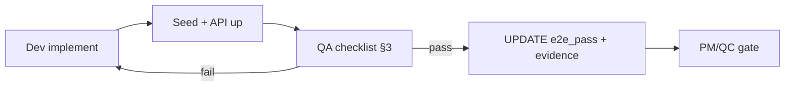

# Tiêu chuẩn đánh giá “thông luồng” — XEVN Ecosystem

> Mục đích: Một capability chỉ được **`e2e_pass = true`** khi FE + BE + DB + dữ liệu thật + QA cases đều chứng minh được. Không pass theo cảm giác hoặc “code có vẻ đủ”.

Bảng nút ↔ mã capability: [ACTION_BUTTON_INVENTORY.md](./ACTION_BUTTON_INVENTORY.md).

---

## 1. Định nghĩa PASS (bắt buộc cả 5 lớp)

| Lớp | Trạng thái DB `fe_status` / `be_status` / `db_status` | Bằng chứng tối thiểu |
|-----|--------------------------------------------------------|----------------------|
| **FE** | `done` | Nút/action gọi API thật; loading/error/empty; `VITE_ALLOW_MOCK_FALLBACK=false` không hiện mock khi API 200 có data |
| **BE** | `done` | Endpoint tồn tại, auth/scope đúng, validation + mã lỗi ổn định |
| **DB** | `done` | Bảng/migration + seed; đọc lại sau reload khớp dữ liệu ghi |
| **E2E dữ liệu** | `e2e_pass = true` | Script hoặc QA checklist chạy trên DB dev có seed; curl/UI log không 4xx/5xx trên happy path |
| **QA** | ghi `evidence_path` | Ít nhất: happy + 1 alternate + 1 exception có expected behavior |

**Cấm PASS khi:** console còn 400/500 trên luồng chính; nút “Xác nhận” chỉ đổi state local; API approval nhưng UI báo “thành công” mà DB chưa đổi.

---

## 2. Registry trong DB (nguồn sự thật)

Bảng: `public.xevn_ecosystem_capabilities` (XBOS DB `xevn_xbos`).

```bash
node scripts/migrate-apply.mjs xbos
pnpm seed:ecosystem:capabilities
```

Truy vấn nhanh:

```sql
SELECT capability_code, fe_status, be_status, db_status, e2e_pass, last_verified_at
FROM xevn_ecosystem_capabilities
ORDER BY module_code, capability_code;
```

Chỉ QC được cập nhật `e2e_pass`, `last_verified_*`, `evidence_path`, `qa_notes` sau khi chạy đủ checklist §3.

---

## 3. Checklist QA mỗi capability (bắt buộc)

Cho mỗi `capability_code`:

1. **Happy path** — thao tác UI → network 2xx → DB đúng 1 bản ghi / count tăng.
2. **Alternate** — filter/tenant khác / empty có message (không mock).
3. **Exception** — API tắt → banner lỗi rõ; scope sai → 400 có message.
4. **Regression** — `pnpm verify:dev-stack` + không lỗi console trên màn đó.
5. **Ghi evidence** — path log, screenshot, hoặc `docs/qa/evidence/<capability_code>.md`.

---

## 4. Ma trận trạng thái kỹ thuật

| fe/be/db | Ý nghĩa |
|----------|---------|
| `none` | Chưa có hoặc placeholder |
| `partial` | Có code nhưng mock/fallback/ thiếu case |
| `done` | Đủ cho layer đó, chờ E2E xác nhận |

`e2e_pass` chỉ `true` khi **cả ba** `done` **và** §3 hoàn tất.

---

## 5. Quy trình review mỗi sprint



---

## 6. Lỗi thường gặp (đã xử lý / cần kiểm)

| Triệu chứng | Nguyên nhân | Cách verify |
|-------------|-------------|-------------|
| `portal-alerts` HTTP 400 `companyId is required` | BE dùng `resolveScopeContext` thiếu company | Đã chuyển `resolveTenantOnlyContext`; FE truyền `companyId` |
| Nút **Xác nhận** catalog HS không đồng bộ | HRM API tắt hoặc thiếu `x-catalog-write-mode: immediate` | Bật `pnpm dev:hrm-api`; xem message lỗi trên banner Command Center |
| Inbox trống | Chưa seed workflow | `pnpm seed:workflow:inbox` |

---

## 7. Mở rộng danh sách capability

1. Thêm dòng vào `apps/api/xbos-api/data/ecosystem-capability-registry.seed.json`.
2. `pnpm seed:ecosystem:capabilities`.
3. Map `srs_ref` ↔ `docs/ecosystem/FE_MOCK_TO_API_AUDIT.md` (G#).
4. Không đánh `e2e_pass` cho đến khi §3 xong.

---

## 8. Lệnh smoke chuẩn (trước demo)

```bash
pnpm dev:xbos-api    # 28002
pnpm dev:hrm-api     # 28001 — bắt buộc cho đồng bộ catalog HS
pnpm seed:workflow:inbox
pnpm verify:dev-stack
```

Portal: `VITE_ALLOW_MOCK_FALLBACK=false`, `VITE_INTERNAL_API_KEY`, proxy 28002/28001.
