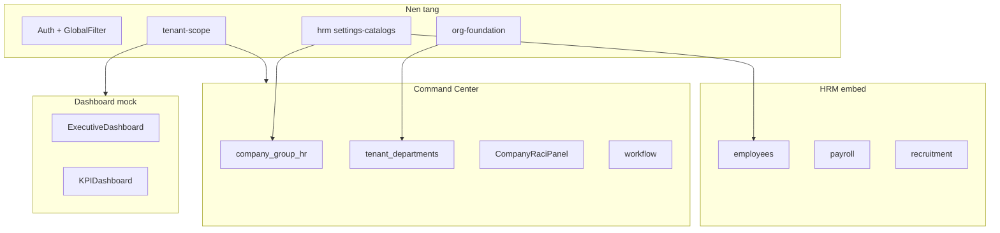

# Web Portal — Rà soát Mock FE → API thật

> Cập nhật: 2026-05-16  
> Phạm vi: `apps/web/web-portal`  
> Mục tiêu: Không hiển thị dữ liệu mock cho người dùng nghiệp vụ; mọi danh sách pháp nhân/tenant phải lấy từ XBOS/HRM API.

**Capability registry & nút action:** bảng nút → `capability_code` trong [ACTION_BUTTON_INVENTORY.md](./ACTION_BUTTON_INVENTORY.md); seed DB `pnpm seed:ecosystem:capabilities`; smoke `node scripts/verify-capability-e2e.mjs`; gate [ECOSYSTEM_CAPABILITY_GATE.md](./ECOSYSTEM_CAPABILITY_GATE.md). Cột G# dưới đây map sang `ecosystem-capability-registry.seed.json`.

---

## Tóm tắt

| Trạng thái | Số màn / module (ước lượng) |
|------------|------------------------------|
| Đã nối API (một phần hoặc đủ) | Command Center (core), GlobalFilter, một số Settings |
| Chủ yếu mock / fallback | Dashboard KPI, HRM tabs P3, CC rail inbox, app HRM salary UI |
| Một phần API | Settings master, HRM embed tabs, HRPage, Command Center core |

---

## Đã sửa trong phiên này

| Màn | Vấn đề | Cách xử lý |
|-----|--------|------------|
| **Hồ sơ nhân sự tập đoàn** | Dùng `legalEntityList` khởi tạo từ `mockCompanies` (XEVN-HQ, HN, DN, CT) | Chuyển sang `settingsLegalEntities` ← `GET /api/xbos/tenant-scope/group-member-units` |
| **Hạ tầng / Workflow / Phòng ban** (phạm vi pháp nhân) | Checkbox pháp nhân từ mock | Cùng `settingsLegalEntities` |
| **pullGroupHrCatalogsFromHrm** | `resolveIdentityScope(entityId)` sai — truyền id UI thay vì `tenantId` | Dùng `entity.tenantId` từ hàng API |
| **Ánh xạ phân hệ RACI** | Hiển thị mã kỹ thuật | Nhãn tiếng Việt (`raci-ecosystem-display-labels.ts`) |
| **Popup cấu hình khối HS** | Chỉ form “Thêm field”, không liệt kê trường con theo khối | Bảng **Danh mục trường trong khối** + sửa/xóa; sidebar hiển thị số trường/khối |
| **Đồng bộ HRM catalog** | FE map `general/location/capacity` → 4 catalog cũ, lệch BE (`contact_fields`, `address_fields`, …) | `integrations/groupHrCatalogApi.ts`: map khối `personal/contact/work/…` → đúng `hrm_employee_*_fields` |

### Ma trận FE ↔ BE — Danh mục hồ sơ nhân sự (Command Center)

| Bước | FE | BE | Trạng thái |
|------|----|----|------------|
| Danh sách công ty | `fetchGroupMemberUnitsForCommandCenter` | `GET /api/xbos/tenant-scope/group-member-units` | ✅ |
| Preset khối/trường (xe-du-lich) | `group-hr-catalog-presets.ts` | `group-employee-import-catalog.ts` (seed) | ✅ map qua `groupHrCatalogApi` |
| Đọc catalog | `fetchGroupHrCatalogFieldDefs` | `GET /api/hrm/settings-catalogs` | ✅ (8 catalog keys) |
| Ghi catalog | `syncGroupHrFieldDefsToHrm` | `POST .../settings-catalogs/{key}/extension-items` | ✅ |
| Xác nhận popup | `syncGroupHrFieldsToHrmCatalogs` | HRM API + scope `x-tenant-id` | ✅ |
| Seed DB lần đầu | — | `pnpm seed:hrm:group-employee-catalog` (nếu có script) | ⚠️ cần chạy tay trên môi trường dev |
| HRM Workspace dùng catalog | — | Module nhân sự đọc `effectiveItems` | ⚠️ chưa audit end-to-end form nhập HS |

**API pháp nhân / tenant (ưu tiên dùng):**

- `GET /api/xbos/tenant-scope/group-member-units` — danh sách holding + đơn vị thành viên (Command Center)
- `GET /api/xbos/tenant-scope/accessible` — tenant user được phép (GlobalFilter / Auth)
- `GET /api/xbos/org-foundation/legal-entities` — pháp nhân theo tenant (BE có, **FE chưa có client**)

---

## Command Center (`CommandCenterPage.tsx`)

| Khu vực | Nguồn dữ liệu hiện tại | API đích | Ghi chú |
|---------|------------------------|----------|---------|
| Đơn vị thành viên (list) | API `group-member-units` | ✅ | Fallback mock nếu API lỗi |
| Hồ sơ nhân sự tập đoàn | API (sau fix) | ✅ + HRM `settings-catalogs` | Metadata: HRM API; fallback `createDefaultEmployeeMetadataRows` |
| Lưu pháp nhân mới | `orgFoundationApi` create/update | `POST/PUT /api/xbos/org-foundation/legal-entities` | ✅ |
| Chi tiết ĐVTV tabs | Chỉ legal + RACI (`CompanyRaciPanel`) | — | ✅ |
| `orgFoundationApi.ts` | legal-entities + org tree | ✅ | |
| Phòng/Ban (org tree) | API `org-foundation/org-units/tree` | ✅ | Theo `tenantId` từng hàng |
| Hạ tầng cơ sở | API `infrastructure/settings` | ✅ | Danh mục nền vẫn seed tĩnh `INITIAL_INFRASTRUCTURE_*` |
| Hệ thống Phòng/Ban (template) | Mock `INITIAL_DEPT_SYSTEM_TEMPLATES` | Chưa có API CRUD template | Cần BRD + BE |
| Quy trình (workflow canvas) | API `workflow-engine/definitions` + mock graph seed | Một phần ✅ | Graph prototype vẫn từ `workflow-graph.ts` |
| RACI | API `raci-governance/*` | ✅ | |
| Duyệt danh mục HRM | API `catalog-governance/*` | ✅ | `CatalogGovernancePanel` |
| Phân quyền chức danh | `GET/PUT /position-rbac/matrix` | ✅ P0 | Debounce save, không `publishVersionChange` |
| Cổ đông / tài liệu pháp lý | `legal-entity-profile` APIs + upload file | ✅ P0 | UC-CC-P0-01/02 |
| Phòng ban (lưu dòng) | `POST/PUT/DELETE org-units` | ✅ P0 | UC-CC-P0-03 |
| Inbox chi tiết | `workflow-engine/instances/:id/detail` + drawer | ✅ P0 | UC-CC-P0-06 |
| Dashboard `asOf` | `GET /command-center/workspace-meta` | ✅ P0 | UC-CC-P0-08; strict mock banner |
| Catalog văn bản/đo lường/giá | `commandCenterCatalogApi` debounce | ✅ P0 | UC-CC-P0-05 |
| KPI rail / tasks / alerts | API inbox + mock fallback flag | Một phần | UC-CC-P0-09 |
| Publish version | `POST /version/publish` | Deprecated SoT | Không dùng cho P0 persist |

---

## HRM Workspace (`HrmWorkspacePanel.tsx`)

| Tab / khối | Nguồn | API HRM | Trạng thái |
|------------|-------|---------|------------|
| Danh sách công ty | `fetchGroupMemberUnitsForCommandCenter` | tenant-scope | ✅ |
| Nhân sự / dashboard | `listHrmEmployees` + fallback | `employees` | B |
| Metadata change | `listEmployeeMetadataQueue` | `change-requests` | ✅ |
| Tuyển dụng / Chấm công / HĐ / BHXH | API + fallback mock | `recruitment/*`, `attendance/records`, `contracts-insurance/*` | B |
| Lương | `listHrmPayslips` + fallback | `payroll/payslips` | B |
| Quyết định / Báo cáo | `HRM_MOCK_DECISIONS/REPORTS` | Chưa có module | C |
| AI / Tasks / Processes / … | `HRM_MOCK_*` | `operations/*` một phần | A/C |

Chi tiết UC: `docs/hrm/SRS.md` §13–14.

**Ghi chú:** `hrmApiClient.ts` đã có pattern gọi API có scope; cần thay từng tab mock bằng client tương ứng.

---

## Settings & Master data

| Trang | List data | Company filter | API |
|-------|-----------|----------------|-----|
| `ExpenseCategoriesSettingsPage` | `businessMasterApi` | `mockCompanies` | Một phần ✅ |
| `PositionsSettingsPage` | `businessMasterApi` | `mockCompanies` | Một phần ✅ |
| `VendorsSettingsPage` | `businessMasterApi` | `mockCompanies` | Một phần ✅ |
| `KPIMetricsSettingsPage` | `businessMasterApi` | `mockCompanies` | Một phần ✅ |
| `VehicleTypesSettingsPage` | Mock only | `mockCompanies` | ❌ |
| `CustomersPage` | `businessMasterApi` + mock fallback | — | Một phần ✅ |
| `PartnersPage` | `businessMasterApi` + mock | `mockCompanies` | Một phần ✅ |

**Việc cần làm chung:** Thay `mockCompanies` trong filter bằng `fetchGroupMemberUnitsForCommandCenter()` hoặc `fetchAccessibleTenants()`.

---

## Dashboard & KPI

| Trang | Nguồn | API đích |
|-------|-------|----------|
| `ExecutiveDashboardPage` | `mockExecutiveDashboardData` | `kpi-engine/*`, aggregation XBOS | ❌ |
| `KPIDashboardPage` | `mockData` | `kpi-engine/*` | ❌ |
| `KPIPolicyPage` | `mockKPIMetrics`, `mockCompanies` | `business-master` + policy API | ❌ |

---

## Khác

| Trang | Nguồn | API đích |
|-------|-------|----------|
| `OrganizationPage` | API org tree / group overview | `org-foundation`, `tenant-scope` | ✅ (không fallback mock) |
| `HRPage` | `mockEmployees` | HRM employees API | ❌ |
| `GlobalFilterContext` | Auth memberships → API; fallback `mockCompanies` | `tenant-scope/accessible` | Một phần ✅ |

---

## Client API đã có (`apps/web/web-portal/src/integrations/`)

| File | Endpoint chính |
|------|----------------|
| `tenantScopeApi.ts` | `tenant-scope/accessible`, `group-member-units`, `group-org-overview` |
| `orgFoundationApi.ts` | `org-units/tree`, `legal-entities` CRUD |
| `raciGovernanceApi.ts` | `raci-governance/*` |
| `workflowEngineApi.ts` | `workflow-engine/definitions` |
| `catalogGovernanceApi.ts` | `catalog-governance/*` |
| `positionRbacApi.ts` | `position-rbac/*` |
| `businessMasterApi.ts` | `business-master/:domain/items` |
| `assetRequestApi.ts` | `asset-request/*` |

---

## Backlog ưu tiên (đề xuất PM/Dev)

### P0 — Ảnh hưởng Command Center / tenant

1. **FE client** `fetchLegalEntities()` → `GET org-foundation/legal-entities`
2. **Lưu pháp nhân** form → `POST/PUT org-foundation/legal-entities` (bỏ `setLegalEntityList` mock)
3. **GlobalFilter + Settings** — bỏ `mockCompanies`, dùng `accessible` / `group-member-units`

### P1 — HRM embed

4. Thay `HrmWorkspacePanel` mock arrays bằng `hrmApiClient` theo từng module BE đã có
5. Employees list → HRM API (thay `mockEmployees` trên `HRPage`)

### P2 — Dashboard & org chart

6. Executive dashboard → `kpi-engine`
7. `OrganizationPage` → `org-units/tree` + legal entities

### P3 — Template tĩnh

8. Dept system templates, infrastructure foundation catalog → API metadata (XBOS config-sync hoặc catalog-governance)

---

## Cách kiểm tra sau khi sửa

```bash
# Stack local
pnpm dev:xbos-api   # cổng 28002
pnpm dev:hrm-api    # cổng 28001
# Portal vite 5175 — proxy trong apps/web/web-portal/.env

# Smoke tenant list
curl -s -H "x-internal-api-key: $KEY" -H "x-tenant-id: xevn" \
  http://127.0.0.1:28002/api/xbos/tenant-scope/group-member-units | jq '.data.members | length'
```

Trên UI: **Cài đặt → Thiết lập công ty → Hồ sơ nhân sự tập đoàn** — danh sách phải khớp seed org (`org-seed-member-companies.json`), không còn XEVN-HN/DN/CT mock nếu DB đã seed tenant thật.

---

## Tham chiếu env proxy

| Biến | Mặc định local |
|------|----------------|
| `VITE_DEV_PROXY_XBOS_API` | `http://127.0.0.1:28002` |
| `VITE_DEV_PROXY_HRM_API` | `http://127.0.0.1:28001` |
| `VITE_INTERNAL_API_KEY` | Khớp `XBOS_INTERNAL_API_KEY` / HRM |

---

## Program `WI-FE-MOCK-API-2026-05` — BA package

### Use case catalog

| UC | Mô tả | Happy | Alternate | Exception |
|----|--------|-------|-----------|-----------|
| UC-CC-01 | Cấu hình PB theo pháp nhân (menu `tenant_departments`) | Chọn công ty → sửa cây PB → Lưu dòng | Đổi công ty, draft local theo `departmentRowsByEntity` | Org tree lỗi → banner + dòng trống |
| UC-CC-02 | Danh mục HS tập đoàn (`company_group_hr`) | Cấu hình chi tiết khối → Lưu → HRM | Preset `xe-du-lich` / load HRM | Sync 4xx → toast |
| UC-CC-03 | Chi tiết ĐVTV | Tab Hồ sơ pháp nhân + Nhiệm vụ & RACI | RACI matrix / capabilities | RACI API fail → message panel |
| UC-CC-04 | Lưu pháp nhân | POST/PUT `legal-entities` | Sửa entity có sẵn | Validation BE → field error |
| UC-HRM-01 | Form HS dùng catalog | `effectiveItems` từ settings-catalogs | Governance pending | Catalog trống → cảnh báo |
| UC-HRM-02 | Workspace tab | List HRM API | Empty state | 401 → login |

### Data contract (trích)

| Field | Source of truth | Consumer |
|-------|-----------------|----------|
| `tenantId` | `group-member-units` | `x-tenant-id` HRM/XBOS |
| Catalog key | 8× `hrm_employee_*_fields` | `groupHrCatalogApi.ts` |
| Legal entity | `LegalEntityInput` (XBOS) | `orgFoundationApi.ts` |

### Acceptance criteria

| ID | PASS khi |
|----|----------|
| AC-CC-01 | Form ĐVTV không còn tab PB/HS |
| AC-CC-02 | Tab RACI load matrix API, nhãn Việt |
| AC-CC-03 | F5 sau lưu pháp nhân khớp GET legal-entities |
| AC-HR-01 | Seed xong: 8 catalog trên `xe-du-lich` |
| AC-HR-02 | Popup Lưu → GET khớp extension items |
| AC-HR-03 | Form NV hiển thị field catalog |
| AC-NO-MOCK | Filter Settings/GlobalFilter không XEVN-HN/DN/CT giả |

### Traceability

| Req | Implementation | Test |
|-----|----------------|------|
| REQ-CC-PB-MENU | `tenant_departments` | QA-CC-01, T6 |
| REQ-CC-HR-CAT | `groupHrCatalogApi` | QA-CC-02, T7 |
| REQ-CC-DVTV-TABS | `CompanyRaciPanel` | QA-CC-03/04, T8/T9 |
| REQ-CC-LEGAL-API | `orgFoundationApi` legal-entities | T3, AC-CC-03 |
| REQ-NO-MOCK-CO | `GlobalFilterContext` + settings pages | QA-GLOBAL-01 |
| REQ-HRM-WORKSPACE | `HrmWorkspacePanel` + `hrmApiClient` | QA-HRM-01 |

---

## SA — Integration decisions (2026-05-16)

| Decision | Choice | Rationale |
|----------|--------|-----------|
| Company list | `tenant-scope/group-member-units` | Single source Command Center |
| Legal CRUD | `org-foundation/legal-entities` | BE ready |
| Dept tree | `org-units/tree` top-level menu only | No duplicate in ĐVTV form |
| HR catalog write | HRM `extension-items` | Mapped in `groupHrCatalogApi` |
| RACI | `CompanyRaciPanel` + `raciGovernanceApi` | Isolated component |
| Mock fallback | Banner + empty, not silent mock | AC-NO-MOCK |

**NFR:** `tsc --noEmit`; proxy 28001/28002; no PII in logs; 10s HRM client timeout.

Pointer: [`docs/xbos/TECHSPEC.md`](../xbos/TECHSPEC.md) — portal integration uses XBOS tenant-scope + org-foundation + HRM settings-catalogs.

---

## QA evidence log (Dev/QC)

| Test | Command / step | Result | Date |
|------|----------------|--------|------|
| T1 qc:dev-stack | `pnpm qc:dev-stack` | Portal 200; XBOS cần `pnpm dev:xbos-api` (28002) | 2026-05-16 |
| T2 tsc | `cd apps/web/web-portal && pnpm exec tsc --noEmit` | exit 0 | 2026-05-16 |
| T4 seed | `pnpm seed:hrm:group-employee-catalog` | 110 upserted; xe-du-lich 22/catalog lane | 2026-05-16 |
| T5 curl catalogs | `GET /api/hrm/settings-catalogs` + `x-tenant-id: xe-du-lich` | Chạy khi HRM API 28001 up | 2026-05-16 |

---

## HRM form journey (Command Center → form nhập HS)

| Bước | Thành phần | Ghi chú |
|------|------------|---------|
| 1 | Command Center `syncGroupHrFieldsToHrmCatalogs` | `groupHrCatalogApi.ts` → `POST .../extension-items` |
| 2 | HRM `settings-catalogs` | 8 keys `hrm_employee_*_fields`; seed `pnpm seed:hrm:group-employee-catalog` |
| 3 | HRM employee form / metadata | `effectiveItems` từ catalog; portal embed `HrmWorkspacePanel` + app `apps/web/hrm` |
| 4 | Field code map | Preset `emf-*` → BE codes (`full_name`, …) trong `groupHrCatalogApi` |

**Evidence:** sau seed, curl catalogs; UI popup xe-du-lich; tạo NV trên HRM kiểm tra nhãn trường.

---

## QC verdict (slice P0/P1 — 2026-05-16)

| Gate | Kết quả | Ghi chú |
|------|---------|---------|
| Build/tsc | **PASS** | `apps/web/web-portal` |
| Seed catalog | **PASS** | `pnpm seed:hrm:group-employee-catalog` |
| qc:dev-stack | **GO WITH CONDITIONS** | Portal OK; start `pnpm dev:xbos-api` + `pnpm dev:hrm-api` cho full stack |
| HRM tabs AI/Tasks | **Defer P3** | Vẫn mock |
| Program DONE | **NOT DONE** | P2 dashboard KPI inbox, vehicle types API còn backlog |

**Handoff:** `ack_status: READY_FOR_QC` — evidence tại `docs/ecosystem/FE_MOCK_TO_API_AUDIT.md` (mục QA evidence log).

---

## Mock inventory — toàn bộ màn chưa tích hợp API đủ (2026-05-16)

**Phân loại:** **A** = mock thuần; **B** = API một phần + fallback mock/seed; **C** = BE chưa có endpoint.

### Web Portal (`apps/web/web-portal`)

| ID | Route / vị trí | File | Nguồn mock | API đích | Mức |
|----|----------------|------|------------|----------|-----|
| W1 | `/cockpit` | `ExecutiveDashboardPage.tsx` | `mockExecutiveDashboardData.ts` | KPI aggregation (chưa có) | A/C |
| W2 | `/dashboard/kpi-dashboard` | `KPIDashboardPage.tsx` | `mockKPIDashboardData` | `kpi-engine` + `business-master` | A |
| W3 | `/dashboard/kpi-policy` | `KPIPolicyPage.tsx` | `mockPolicies` inline | Policy API (chưa có) | A/C |
| W4 | `/dashboard/hr` | `HRPage.tsx` | `mockEmployees` fallback | `GET /api/hrm/employees` | B |
| W5 | `/dashboard/customers` | `CustomersPage.tsx` | `mockCustomers` fallback | `business-master/customers` | B |
| W6 | `/dashboard/partners` | `PartnersPage.tsx` | `mockPartners` fallback | `business-master/partners` | B |
| W7 | `/settings/vehicles` | `VehicleTypesSettingsPage.tsx` | `mockVehicleTypes` | `asset-registry` | B |
| W8 | Settings positions/vendors/expense/kpi-metrics | `*SettingsPage.tsx` | mock on catch | `businessMasterApi` | B |
| W9 | Settings placeholders | `App.tsx` | `PlaceholderPage` | Chưa có | C |
| W10 | Global filter | `GlobalFilterContext.tsx` | `fallbackMaster` | `tenant-scope/accessible` | B |
| W11 | CC rail KPI/tasks/alerts | `command-center-mock.ts` | Mock | Inbox API (chưa có) | C |
| W12 | CC workflow graph | `workflow-graph.ts` | Seed layout | `workflow-engine/definitions` | B |
| W13 | CC hạ tầng danh mục nền | `INITIAL_INFRASTRUCTURE_*` | Seed TS | `infrastructure/settings` | B/C |
| W14 | CC hệ thống PB mẫu | `INITIAL_DEPT_SYSTEM_TEMPLATES` | Seed TS | Template CRUD (chưa có) | C |
| W15 | HRM embed dashboard | `HrmWorkspacePanel.tsx` | `HRM_MOCK_PENDING_PAYROLL` | `payroll/payslips` | B |
| W16 | HRM recruitment/attendance/HĐ/BHXH | `HrmWorkspacePanel.tsx` | `HRM_MOCK_*` fallback | HRM modules | B |
| W17 | HRM payroll tab | `HrmWorkspacePanel.tsx` | `HRM_MOCK_PAYROLL` | `payroll/payslips` | B |
| W18 | HRM decisions/reports | `HrmWorkspacePanel.tsx` | Mock | Module chưa có | C |
| W19 | HRM AI/tasks/processes/… | `HrmWorkspacePanel.tsx` | Mock | `operations/*` một phần | A/C |
| W20 | HRM employees embed | `HrmWorkspacePanel.tsx` | `mockEmployees` fallback | `listHrmEmployees` | B |

### App HRM native (`apps/web/hrm`)

| ID | Màn | File | Mock | API | Mức |
|----|-----|------|------|-----|-----|
| H1 | NV — Lương (chi tiết) | `EmployeeSalary.tsx` | `mockSalaryData` | `payroll/*` | A |
| H2 | NV — Lịch sử CV / Job | `EmployeeWorkHistory.tsx`, `EmployeeJobList.tsx` | Mock arrays | `employees` + org | A |
| H3 | Tuyển dụng | `Recruitment.tsx` | Mock state | `recruitment/*` | B |
| H4 | Lương | `Payroll.tsx` | Mock rows | `payroll/*` | B |
| H5 | Chấm công | `Attendance.tsx` | Legacy comment | `attendance/*` | B |

### Đã nối API (không liệt kê chi tiết)

Organization, Command Center (tenant, legal entities, RACI, group HR catalog, PB menu), Catalog Governance, metadata queue (API), recruitment/attendance/contracts (API + fallback).

---

## BA — phụ thuộc liên màn và cụm nghiệp vụ



| Cụm | Nghiệp vụ | Phụ thuộc | Phụ thuộc bởi |
|-----|-----------|-----------|---------------|
| Điều hành W1–W3 | Cockpit KPI, policy | GlobalFilter, business-master | Toàn dashboard |
| Master data W5–W10 | CRUD danh mục theo công ty | tenant-scope, business-master | KPI, CC infrastructure, HRM catalogs |
| CC cấu hình W11–W14 | Inbox, workflow, hạ tầng, PB mẫu | RACI, workflow-engine | PB instance menu, infrastructure runtime |
| HRM embed W15–W20 | Tab HRM trong Command Center | settings-catalogs, employees API | Form NV app HRM, metadata governance |
| App HRM H1–H5 | Vận hành NV đầy đủ | employees, payroll, attendance | Portal embed (read-only cockpit) |

### Business rules (mock → API)

| Rule | Điều kiện | Hành động |
|------|-----------|-----------|
| BR-MOCK-01 | API 200 + data rỗng | Empty state; không mock |
| BR-MOCK-02 | API 4xx/5xx | Banner lỗi; mock chỉ khi `import.meta.env.DEV` + flag |
| BR-SCOPE-01 | Gọi HRM | `x-tenant-id` từ `group-member-units` |
| BR-SCOPE-02 | Ghi master data | `company_id` khớp scope member |

---

## Traceability REQ → SRS → code

| REQ-ID | SRS | Implementation | Test |
|--------|-----|----------------|------|
| REQ-MOCK-DASH | `docs/xbos/SRS.md` § SRS-XBOS-PORTAL-MOCK | `ExecutiveDashboardPage`, `KPIDashboardPage` | QA-DASH-01 |
| REQ-MOCK-HRM-TAB | `docs/hrm/SRS.md` §13 UC-HRM-20.. | `HrmWorkspacePanel` | QA-HRM-tab |
| REQ-MOCK-MD | `docs/xbos/SRS.md` § SRS-XBOS-PORTAL-MOCK UC-XBOS-MD | Settings pages | QA-GLOBAL-01 |
| REQ-MOCK-CC | `docs/xbos/SRS.md` UC-XBOS-CC-05..08 | `CommandCenterPage` | QA-CC-config |
| REQ-MOCK-HRM-APP | `docs/hrm/SRS.md` §14 UC-HRM-28.. | `apps/web/hrm` pages | QA-HRM-app |
| REQ-ECO-FE-01 | `docs/ecosystem/SRS.md` UC-ECO-FE-01 | Toàn portal | QA-GLOBAL-01 |

**Tài liệu SRS/TechSpec:** `docs/hrm/SRS.md` (§13–14), `docs/hrm/TECHSPEC.md` (§11–12), `docs/xbos/SRS.md` (§ SRS-XBOS-PORTAL-MOCK), `docs/xbos/TECHSPEC.md` (§12–13), `docs/ecosystem/SRS.md` (§11 UC-ECO-FE-01).

---

## Cập nhật 2026-05-17 — Đã nối thêm & backlog còn lại

### Đã làm trong phiên này

| Hạng mục | API / lưu trữ | Ghi chú |
|----------|---------------|---------|
| Workflow CC | `GET/POST/PUT workflow-engine/definitions` | Load khi mở menu Quy trình; lưu graph vào `graph` JSONB |
| Inbox CC (tasks) | `GET workflow-engine/tasks?status=pending` | Map → `UnifiedTask`; fallback mock chỉ khi `VITE_ALLOW_MOCK_FALLBACK=true` |
| KPI Policy | `business-master/kpi_policies` + `kpi_metrics` | `useKpiPolicySnapshot` |
| Văn bản / Đo lường / Giá (CC) | `business-master/command_center_catalogs` | Load + auto-save debounce |
| Khung PB mẫu | `business-master/dept_system_templates` | Load + upsert |
| Hạ tầng | `infrastructure/settings` | Scope master `xevn` |
| Settings filter công ty | `tenant-scope` + `group-member-units` | `useCompanyFilterOptions` fallback |
| HTTP layer | `xbosHttp` + `apiLogger` | tenant-scope, org-foundation, business-master, workflow |

### Ma trận còn thiếu API / mock / phụ thuộc seed (để phân tích chung)

**Chú thích:** ✅ = đã API đủ cho happy path · 🟡 = API có, fallback mock/seed · ❌ = chưa có API · 📦 = cần seed/migration trước khi UI có dữ liệu

| ID | Vùng | Trạng thái | API / nguồn sự thật | Phụ thuộc dữ liệu / việc cần làm |
|----|------|------------|---------------------|----------------------------------|
| G1 | CC rail KPI sparkline | ❌ mock | Chưa có aggregation cockpit | KPI engine + time-series store |
| G2 | CC rail `mockPortalAlerts` | ❌ mock | Chưa có alerts bus | Event/notification service |
| G3 | CC rail module links | 🟡 | Static href trong `command-center-mock` | Không blocker — chỉ navigation |
| G4 | Workflow instances runtime | 📦 | `workflow-engine/instances` có, UI chưa đầy đủ | Seed instances + step tasks để inbox có thẻ |
| G5 | Executive dashboard stats/cards | 🟡 | KPI hook + workflow rollup một phần | `mockExecutiveDashboardData` vẫn cho layout cards |
| G6 | KPI Dashboard | 🟡 | `kpi-engine/evaluate-batch` + `kpi_metrics` | Seed metrics + actuals cho từng tenant |
| G7 | KPI Policy | ✅ | `kpi_policies` + `kpi_metrics` | Lần đầu DB trống → cần import policy rows hoặc mock flag |
| G8 | Settings Placeholder (dept/regions/formulas) | ❌ | Chưa có route API | BRD + `business-master` domain mới |
| G9 | Customers / Partners | 🟡 | `business-master/customers|partners` | Seed master; bỏ mock khi `ALLOW_MOCK=false` |
| G10 | Vehicle types | 🟡 | `asset-registry` (đã gọi) | Registry assets seed theo tenant |
| G11 | Expense/Positions/Vendors/KPI metrics settings | 🟡 | `business-master/*` | Seed per tenant; empty = empty state |
| G12 | GlobalFilter | 🟡 | `tenant-scope/accessible` | `seed-org-foundation`, membership users |
| G13 | CC member units | ✅ | `group-member-units` | `org-seed-member-companies.json` |
| G14 | CC legal entities CRUD | ✅ | `org-foundation/legal-entities` | Cùng seed org |
| G15 | CC org tree (PB) | ✅ | `org-units/tree` | Org units seed theo tenant |
| G16 | CC group HR catalog | ✅ | HRM `settings-catalogs` | `pnpm seed:hrm:group-employee-catalog` |
| G17 | CC RACI | ✅ | `raci-governance/*` | `seed-raci-*` scripts |
| G18 | CC catalog governance | ✅ | `catalog-governance/*` | HRM pending items |
| G19 | CC infrastructure sites | 🟡 | `infrastructure/settings` | Lưu sites qua PUT; danh mục nền có thể trống lần đầu |
| G20 | CC permission matrix UI | 🟡 | `position-rbac/*` client có | UI vẫn seed `RACI_PERMISSION_BOOTSTRAP` local |
| G21 | HRM embed employees | 🟡 | `listHrmEmployees` | HRM DB employees seed |
| G22 | HRM recruitment/attendance/HĐ/BHXH | 🟡 | HRM API + mock fallback | Module data seed từng tenant |
| G23 | HRM payroll/decisions/reports/AI/tasks | ❌/🟡 | Payslips API một phần; còn lại mock | BE modules + `operations/*` |
| G24 | App HRM native (salary, CV, …) | ❌/🟡 | `apps/web/hrm` nhiều màn mock | Đồng bộ với portal embed |
| G25 | `/version/publish` | 🟡 | Endpoint tùy deploy | Không blocker catalog; audit trail tùy chọn |
| G26 | Auth / JWT production | 🟡 | Dev: internal key + `VITE_DEV_USER_ID` | Production IdP + membership |

### Thứ tự xử lý đề xuất (PM/Dev)

1. **P0 dữ liệu:** `pnpm dev:xbos-api` + `pnpm dev:hrm-api` + org seed + group-employee-catalog seed (G12–G17).
2. **P1 inbox thật:** tạo workflow instances/tasks mẫu (G4) để CC không cần mock tasks.
3. **P2 cockpit:** aggregation KPI + alerts (G1–G2, G5–G6).
4. **P3 HRM tabs mock** (G21–G24) theo SRS §13–14.
5. **P4 Settings placeholder routes** (G8).

### Verify sau mỗi đợt

```bash
node scripts/qc-dev-stack.mjs
cd apps/web/web-portal && pnpm exec tsc --noEmit
# Workflow definitions
curl -s -H "x-internal-api-key: $KEY" -H "x-tenant-id: xevn" -H "x-company-id: xevn" \
  http://127.0.0.1:28002/api/xbos/workflow-engine/definitions | jq '.data.items | length'
# Inbox tasks
curl -s -H "x-internal-api-key: $KEY" "http://127.0.0.1:28002/api/xbos/workflow-engine/tasks?tenantId=xevn&status=pending" | jq '.data.items | length'
```

---

## QA evidence — P0–P4 (2026-05-17)

| Phase | Script / verify | Trạng thái G# |
|-------|-----------------|---------------|
| **P0** | `pnpm seed:stack:p0` · `pnpm qc:dev-stack` | G12–G17 📦→✅ sau seed |
| **P1** | `pnpm seed:workflow:inbox` · CC rail ≥3 pending | G4 ✅ |
| **P2a** | `portalAlertsApi` + `useCommandCenterSparkline` · `pnpm seed:business-master:kpi` | G1 🟡 rollup/snapshot · G2 ✅ · G5 🟡 |
| **P2b** | `GET kpi-engine/rollup` · `GET kpi-engine/portal-alerts` · `pnpm seed:kpi:actuals` | G1 🟡 time-series DB |
| **P3 embed** | `hrmApiClient` operations · `pnpm seed:hrm:operations-sample` | G23 🟡 tasks/SR ✅; decisions/AI ❌ empty |
| **P3 app** | `EmployeeSalary` → `listPayrollPayslips` · Recruitment/Attendance hooks sẵn | G24 🟡 |
| **P4** | `Departments/Regions/KpiFormulas` settings · `pnpm seed:business-master:settings-md` | G8 ✅ |
| **Gate** | `pnpm verify:dev-stack` (`qc-dev-stack` + `tsc --noEmit`) | BR-MOCK-01 khi `VITE_ALLOW_MOCK_FALLBACK=false` |

**Package scripts mới:** `seed:stack:p0`, `seed:workflow:inbox`, `seed:business-master:kpi`, `seed:business-master:settings-md`, `seed:hrm:operations-sample`, `seed:kpi:actuals`, `verify:dev-stack`.
