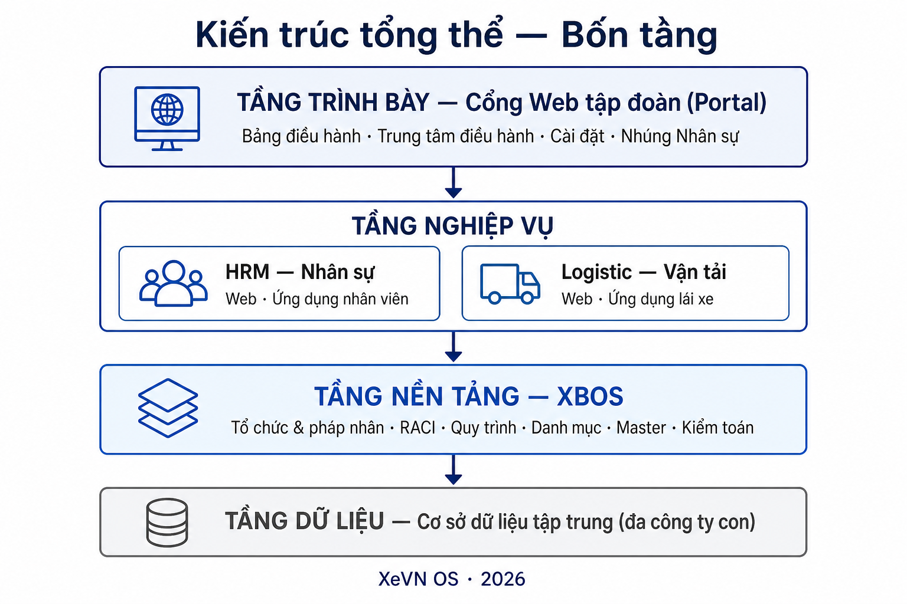
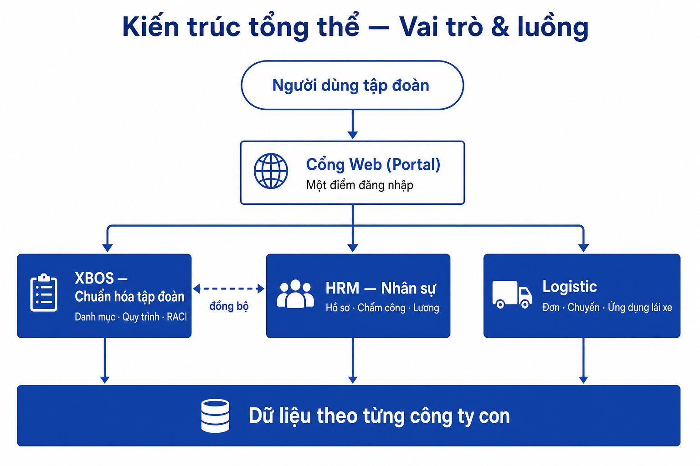
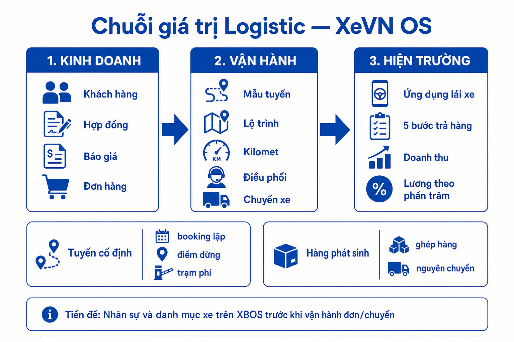
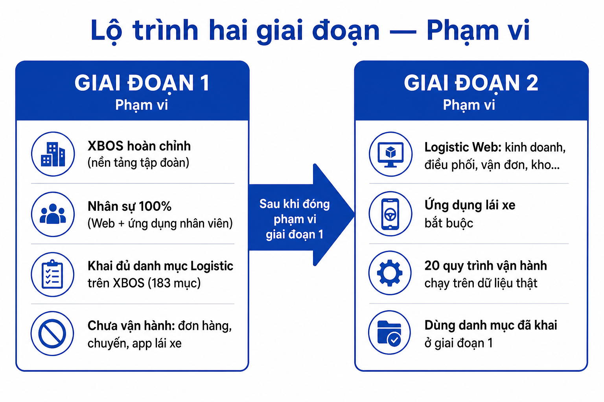

<!-- _class: lead title -->

# XeVN OS
## Hệ sinh thái quản trị & vận hành tập đoàn vận tải

**Trình bày:** Ban điều hành · Chủ tịch XEVN  
**Phiên bản:** Tháng 5/2026

---

# 1. Bài toán điều hành

Tập đoàn vận tải **nhiều công ty con** cần một nền tảng thống nhất:

| Thách thức | Hệ quả nếu không giải quyết |
|------------|----------------------------|
| Mỗi đơn vị một công cụ rời (bảng tính, phần mềm lẻ) | Không so sánh KPI, không kiểm soát danh mục chung |
| Nhân sự – xe – đơn hàng tách rời | Không chạy được chuỗi **kinh doanh → vận hành** |
| Phê duyệt & RACI chưa số hóa | Trách nhiệm mơ hồ, chậm quyết định |

> **XeVN OS** = một cổng điều hành + lõi dữ liệu tập đoàn (**XBOS**) + các phân hệ nghiệp vụ (Nhân sự, Logistic) trên cùng kiến trúc **đa công ty**.

*Nguồn: Kế hoạch dự án tổng thể hệ sinh thái XeVN · BRD quy tắc phạm vi dữ liệu toàn hệ*

---

<!-- _class: img-slide -->

# 2. Kiến trúc tổng thể — Bốn tầng

---

<!-- _class: img-slide -->

# 3. Kiến trúc tổng thể — Vai trò & luồng

| Thành phần | Trách nhiệm | Không làm gì |
|------------|-------------|--------------|
| **Portal** | Giao diện điều hành, lọc theo công ty, nhúng module | Không thay nghiệp vụ chuyên sâu |
| **XBOS** | Danh mục chuẩn, quy trình, tổ chức, RACI | Không thay thế từng đơn vận chuyển / bảng lương |
| **HRM** | Hồ sơ nhân viên, chấm công, lương, tuyển dụng | Không quản lý chuyến xe |
| **Logistic** | Kinh doanh → điều phối → giao hàng | Không tự định nghĩa danh mục gốc |

*Nguồn: BRD Phân hệ XBOS · BRD Phân hệ HRM · Danh mục XBOS cho Logistic*

---

# 4. Phân tầng dữ liệu (một nguồn chuẩn)

| Tầng | Quản lý tại | Ví dụ minh họa |
|------|-------------|----------------|
| **Dùng chung tập đoàn** | XBOS | Pháp nhân, cây tổ chức, thư viện chức danh, ma trận RACI |
| **Danh mục nghiệp vụ** | XBOS (khai theo từng phân hệ) | Loại xe, loại phí, nhóm trường hồ sơ nhân viên, mẫu tuyến |
| **Quy trình phê duyệt** | XBOS (định nghĩa) | Khoảng 20 quy trình vận hành Logistic; quy trình duyệt mở rộng danh mục Nhân sự |
| **Dữ liệu giao dịch hàng ngày** | HRM / Logistic | Từng nhân viên, từng vận đơn, từng chuyến, từng phiếu lương |

**Lợi ích:** thay đổi danh mục có **phiên bản và phê duyệt**; công ty con không tự ý làm lệch chuẩn tập đoàn.

*Nguồn: BRD quy tắc định danh và phạm vi dữ liệu toàn hệ sinh thái XeVN*

---

# 5. Quy mô đã chuẩn hóa (minh bạch phạm vi)

| Hạng mục | Số lượng | Ý nghĩa với Ban lãnh đạo |
|----------|----------|---------------------------|
| **Chức năng phần mềm** (tình huống sử dụng) | **373** | Mỗi việc người dùng làm được đã liệt kê, có nhóm và kênh (Web / điện thoại) |
| **Mục danh mục cấu hình trên XBOS** | **183** | 72 cho Nhân sự + 111 cho Logistic (gồm 20 quy trình vận hành) |
| **Bộ tài liệu nghiệp vụ & kỹ thuật** | Đầy đủ theo phân hệ | Căn cứ nghiệm thu và triển khai theo **khung**, mở rộng được |

| Phân hệ | Chức năng | Danh mục cấu hình |
|---------|----------:|------------------:|
| Nền tảng XBOS | 104 | 18 mẫu quản trị chung |
| Nhân sự (HRM) | 119 | 72 |
| Logistic (gồm quản trị danh mục) | 150 | 111 |

*Nguồn: Bảng tổng hợp use case toàn hệ sinh thái XeVN*

---

<!-- _class: img-slide -->

# 6. Chuỗi giá trị Logistic

*Nguồn: Biên bản họp — Vận hành Logistics XEVN · Đối chiếu phân tích với biên bản họp Logistics*

---

<!-- _class: img-slide -->

# 7. Lộ trình hai giai đoạn — Phạm vi

*Nguồn: Lộ trình Phase 1 & Phase 2 — XeVN OS*

---

# 8. Giai đoạn 1 — Nội dung giao

| Khối | Nội dung | Quy mô (chức năng) |
|------|----------|-------------------:|
| **XBOS hoàn chỉnh** | Trung tâm điều hành, RACI, quy trình, tổ chức, dữ liệu master, đăng nhập đa công ty | 104 |
| **Danh mục Nhân sự** | 72 mục + quy trình duyệt mở rộng danh mục | 22 |
| **Danh mục Logistic** | 91 danh mục + 20 quy trình (chưa vận hành đơn) | 22 |
| **Nhân sự 100%** | Hệ thống nhân sự + cổng Web + ứng dụng nhân viên | 119 |

**Điều kiện mở giai đoạn 2:** Nhân sự đưa vào sử dụng · 183/183 mục danh mục phát hành · kiểm tra “đủ danh mục Logistic”.

---

# 9. Giai đoạn 2 — Logistic & ứng dụng lái xe

| Nhóm | Nội dung |
|------|---------|
| **Web Logistic** | Kinh doanh, điều phối, vận đơn, đội xe, kho, đối soát… |
| **Ứng dụng lái xe** | Năm bước tại điểm trả hàng; chứng từ; doanh thu và **lương theo phần trăm** theo chuyến và km — **bắt buộc** khi go-live |
| **Quy trình** | 20 quy trình đã định nghĩa ở giai đoạn 1 → gắn dữ liệu vận hành thật |

**Pilot đề xuất:** một công ty con — chuỗi **chào giá → đơn → chuyến → app lái → chốt lương tháng**.

*Nguồn: Danh mục XBOS cho Logistic và use case phân hệ Logistic*

---

# 10. Trung tâm điều hành — Một màn hình tập đoàn

| Chức năng | Giá trị với Ban lãnh đạo |
|----------|---------------------------|
| **Cây pháp nhân và phòng ban** | Nhìn một lần toàn tập đoàn; chuẩn hóa cấu trúc |
| **Ma trận RACI** | Ai chịu trách nhiệm / phê duyệt / hỗ trợ / được thông báo trên từng hoạt động |
| **Hồ sơ pháp lý và cổ đông** | Minh bạch pháp nhân; tài liệu có phiên bản |
| **Quy trình và hộp thư duyệt** | Phê duyệt tập trung, không email rời |
| **Nhúng Nhân sự** | Quản trị nhân sự tập đoàn trên cùng cổng, không đăng nhập riêng |

*Nguồn: SRS Thiết lập công ty — Trung tâm điều hành · SRS Quản trị RACI & số hóa nhiệm vụ*

---

# 11. Giá trị cốt lõi cho XEVN

| # | Giá trị | Bằng chứng / chỉ số |
|---|---------|---------------------|
| 1 | **Một chuẩn — nhiều công ty** | 183 danh mục + phạm vi theo công ty con |
| 2 | **Truy vết và kiểm soát** | Nhật ký thay đổi, phát hành phiên bản danh mục |
| 3 | **Chuỗi kinh doanh → vận hành** | Logistic giai đoạn 2 trên nền đã chuẩn bị |
| 4 | **Minh bạch với lái xe** | Ứng dụng: doanh thu, khấu trừ, lương theo chuyến |
| 5 | **Mở rộng theo khung** | 373 chức năng đã định nghĩa — thêm module không làm lại nền |

---

# 12. Tiến độ hiện tại (ước lượng)

| Hạng mục | Trạng thái |
|----------|------------|
| **Phân tích và danh sách chức năng / danh mục** | Hoàn thành gom **373 chức năng + 183 danh mục**; đối chiếu biên bản họp Logistic |
| **XBOS và cổng Web** | Trung tâm điều hành, RACI, tổ chức, quy trình — **đang hoàn thiện** |
| **Nhân sự** | Khoảng **một nửa** hệ thống; ứng dụng nhân viên đang hoàn thiện bản cài |
| **Logistic nghiệp vụ** | Chủ yếu tài liệu và mô hình thử — **giai đoạn 2** |

**Việc ưu tiên:** đóng giai đoạn 1 trước khi mở vận đơn và chuyến.

---

# 13. Đề xuất quyết định Ban lãnh đạo

| # | Đề xuất | Kỳ vọng |
|---|---------|---------|
| 1 | **Phê duyệt lộ trình hai giai đoạn** | Tránh triển khai lộn xộn giữa các module |
| 2 | **Xác nhận thứ tự:** nhân sự và danh mục trước · Logistic sau | Khớp biên bản họp vận hành |
| 3 | **Chỉ định một công ty pilot giai đoạn 2** | Một chuỗi kinh doanh → chuyến → app lái |
| 4 | **Ứng dụng lái xe là bắt buộc** khi go-live Logistic | Không go-live chỉ trên Web |

---

# 14. Nguồn tài liệu tham chiếu (nội bộ)

| Nhóm | Tên tài liệu |
|------|----------------|
| **Toàn hệ** | Kế hoạch dự án tổng thể hệ sinh thái XeVN |
| | BRD — Quy tắc định danh và phạm vi dữ liệu toàn hệ sinh thái XeVN |
| | SRS — Định danh và phạm vi dữ liệu toàn hệ sinh thái XeVN |
| | Bảng tổng hợp use case toàn hệ sinh thái XeVN |
| | Lộ trình Phase 1 & Phase 2 — XeVN OS |
| **XBOS** | BRD Phân hệ XBOS · SRS Phân hệ XBOS |
| | Danh sách use case tổng thể — Phân hệ XBOS |
| | SRS Thiết lập công ty — Trung tâm điều hành |
| | BRD / SRS Quản trị RACI & số hóa nhiệm vụ |
| **Nhân sự** | BRD Phân hệ HRM · SRS Phân hệ HRM |
| | Danh mục XBOS phải khai cho phân hệ Nhân sự |
| | Bảng tổng hợp use case — HRM & XBOS (danh mục Nhân sự) |
| **Logistic** | Biên bản họp — Vận hành Logistics XEVN |
| | Danh mục XBOS cho Logistic và use case phân hệ Logistic |
| | Bảng tổng hợp use case — Logistic & XBOS (danh mục Logistic) |
| | Đối chiếu phân tích sản phẩm với biên bản họp Logistics |

---

<!-- _class: lead -->

# Cảm ơn Quý Ban lãnh đạo

**XeVN OS** — Một nền tảng · Một chuẩn dữ liệu · Nhiều công ty con

Tháng 5/2026

