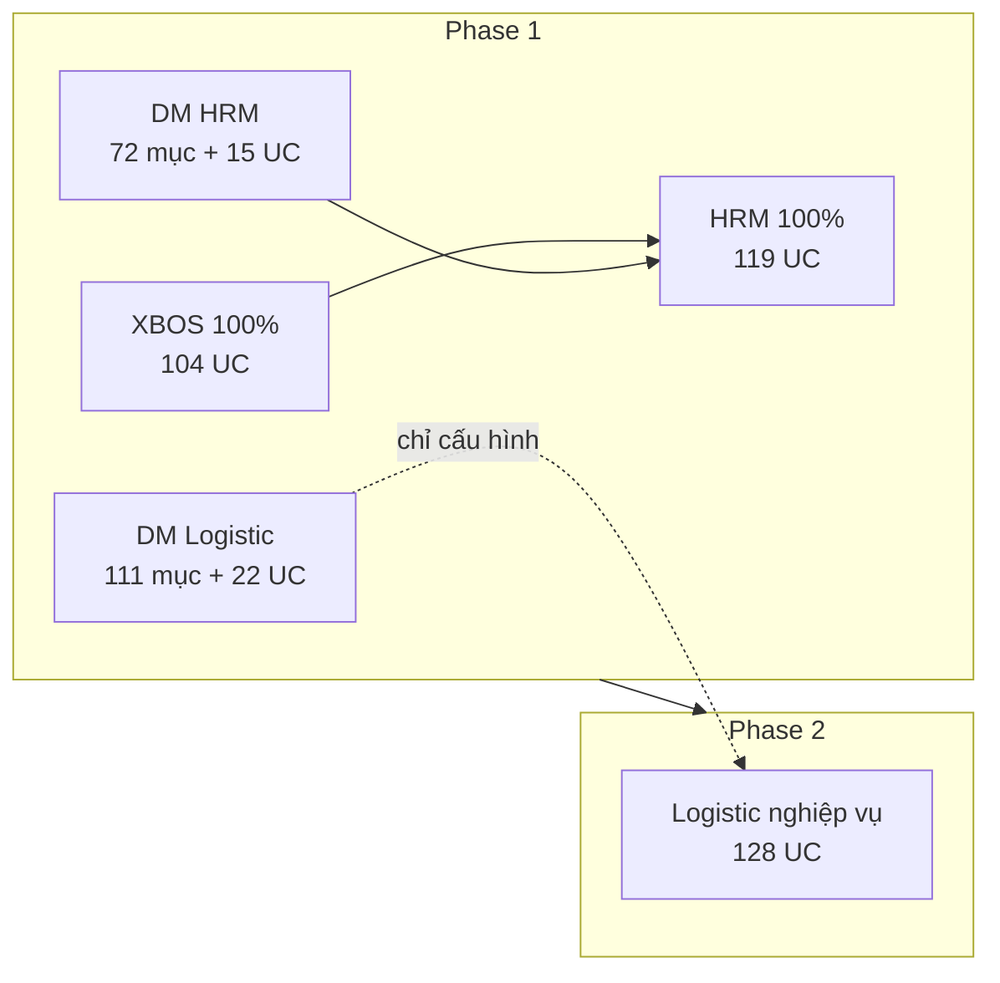
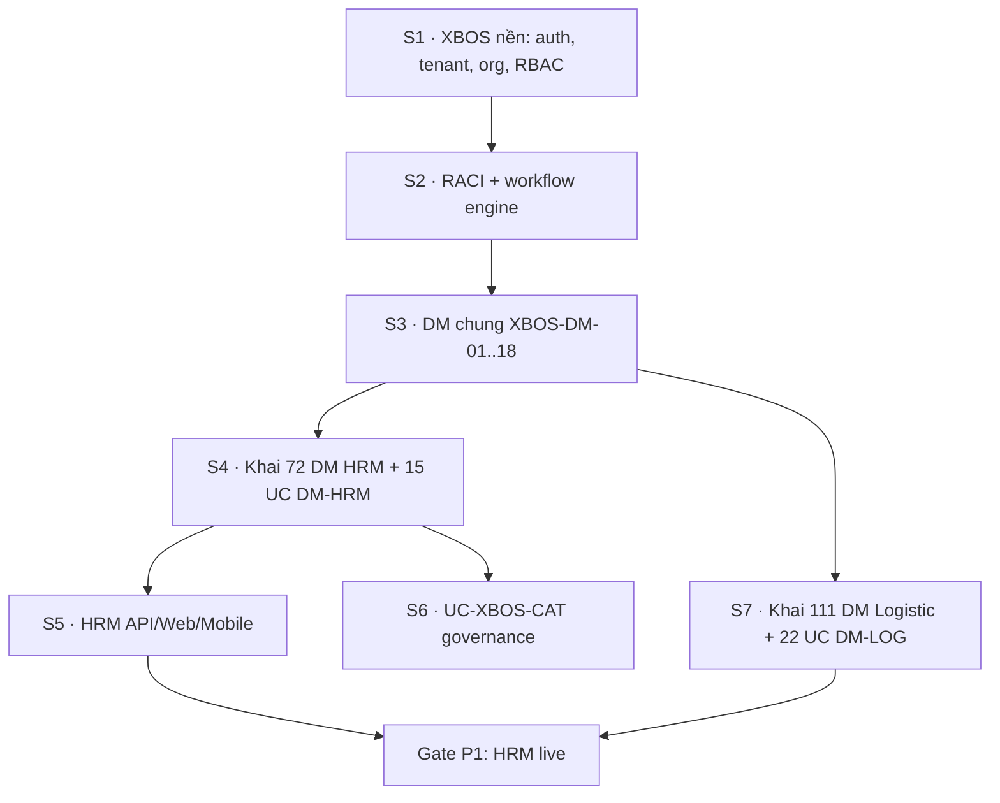

# Lộ trình Phase 1 & Phase 2 — XeVN OS

> Slide trình bày: [`GIOI_THIEU_HE_SINH_THAI_XEVN_SLIDES.md`](./GIOI_THIEU_HE_SINH_THAI_XEVN_SLIDES.md)

## 1. Tóm tắt hai phase

| Phase | Mục tiêu go-live | Use case phần mềm | Cấu hình danh mục trên XBOS |
|-------|------------------|-------------------|-----------------------------|
| **Phase 1** | Tập đoàn vận hành **XBOS + HRM**; Logistic **chỉ khai cấu hình**, chưa vận hành đơn/chuyến | **245** | **183** (72 HRM + 111 Logistic) |
| **Phase 2** | **Logistic** Web + app lái xe — nghiệp vụ vận tải end-to-end | **128** | *(dùng danh mục đã khai ở P1)* |
| **Toàn chương trình** | | **373** | **183** |

---

## 2. Phase 1 — XBOS + danh mục (HRM & Logistic) + HRM 100%

### 2.1 Phạm vi (IN / OUT)

| Hạng mục | Trong Phase 1 | Ngoài Phase 1 |
|----------|---------------|---------------|
| XBOS nền tảng (Command Center, org, RACI, workflow, master, auth, tenant…) | ✅ 100% | |
| Quản trị danh mục chung `XBOS-DM-01` … `XBOS-DM-18` | ✅ (trong 97 UC nền) | |
| Governance duyệt danh mục HRM `UC-XBOS-CAT-*` | ✅ | |
| **Định nghĩa + khai danh mục HRM** (72 mục) | ✅ seed + phê duyệt + đồng bộ HRM | |
| **Định nghĩa + khai danh mục Logistic** (111 mục, gồm 20 quy trình) | ✅ seed + phê duyệt; **chưa** chạy đơn/chuyến | |
| Use case quản trị DM `XBOS-DM-HRM-*` | ✅ 15 UC | |
| Use case quản trị DM `XBOS-DM-LOG-*` | ✅ 22 UC | |
| HRM API + Web Portal + Mobile | ✅ 100% (`UC-HRM-*`, `HRM-*`, mobile) | |
| Logistic nghiệp vụ `LG-*`, `LG-MB-*` | ❌ | → Phase 2 |

### 2.2 Use case Phase 1 (245 mã)

| Khối | Số UC | Mã / nhóm | File chi tiết |
|------|------:|-----------|---------------|
| **A. XBOS 100%** | **104** | `UC-XBOS-*`, `UC-CC-*`, `UC-RACI-*`, `UC-ECO-*`, `XBOS-DM-01`…`18` | [`BANG_TONG_HOP_USECASE_XBOS.md`](../xbos/BANG_TONG_HOP_USECASE_XBOS.md) (97) + `UC-XBOS-CAT-01`…`07` (7) |
| **B. Định nghĩa danh mục Logistic (quản trị)** | **22** | `XBOS-DM-LOG-*` | [`BANG_TONG_HOP_USECASE_LOGISTIC.md`](../logistics/BANG_TONG_HOP_USECASE_LOGISTIC.md) (dòng 1–22) |
| **C. HRM 100%** | **119** | `XBOS-DM-HRM-*`, `UC-HRM-*`, `HRM-*`, mobile | [`BANG_TONG_HOP_USECASE_HRM.md`](../hrm/BANG_TONG_HOP_USECASE_HRM.md) |
| **Tổng Phase 1** | **245** | | 104 + 22 + 119 |

*Ghi chú: 15 UC `XBOS-DM-HRM-*` nằm trong khối C (119 HRM), không cộng thêm.*

### 2.3 Cấu hình danh mục Phase 1 (183 mục)

| Phân hệ | Số mục | Nội dung | Tài liệu định nghĩa |
|---------|------:|----------|---------------------|
| HRM | **72** | Tổ chức, chức danh, 6 nhóm trường hồ sơ, HĐ/chấm công/lương, tuyển dụng, hồ sơ xe… | [`DANH_MUC_XBOS_CHO_HRM.md`](../hrm/DANH_MUC_XBOS_CHO_HRM.md) |
| Logistic | **91** | Danh mục nghiệp vụ (nhóm 1–21) | [`DANH_MUC_XBOS_VA_USECASE_LOGISTIC.md`](../logistics/DANH_MUC_XBOS_VA_USECASE_LOGISTIC.md) |
| Logistic | **20** | Quy trình vận hành (nhóm 22) — *định nghĩa trên XBOS, chạy thật khi có đơn ở P2* | cùng file trên |
| **Tổng** | **183** | | |

**Tiêu chí DONE danh mục (Phase 1):** mỗi mục có seed DB, gán phân hệ/tenant, phiên bản phát hành, kiểm tra “thiếu danh mục” trước nghiệp vụ (HRM import; Logistic checklist P2).

### 2.4 Deliverable Phase 1

| # | Deliverable | Bằng chứng |
|---|-------------|------------|
| 1 | Web Portal: Command Center + RACI + workflow canvas + master | `e2e_pass` capability registry |
| 2 | `xbos-api` + `hrm-api` đủ contract SRS | Build + smoke script |
| 3 | HRM Web (embed CC) + Mobile P0/P1 theo SRS | QA checklist HRM |
| 4 | 72 + 111 mục cấu hình đã khai trên XBOS | Seed + export catalog version |
| 5 | Logistic: **không** go-live vận đơn; chỉ UAT “đủ danh mục để mở P2” | Checklist `XBOS-DM-LOG-19` |

### 2.5 Thứ tự triển khai gợi ý (trong Phase 1)

### 2.6 Ước lượng thời gian Phase 1 (1 FTE + Cursor)

| Kịch bản | Thời lượng | Mốc (từ 05/2026) |
|----------|------------|------------------|
| Lạc quan | 5–6 tháng | **Q4 2026** |
| Thực tế | 7–9 tháng | **Q1 2027** |
| Part-time | 14–18 tháng | **2027** |

*Giả định ~55–70% effort còn lại trên khối XBOS+HRM; khối khai 183 DM song song từ tháng 2–3.*

---

## 3. Phase 2 — Logistic 100%

### 3.1 Phạm vi

| Hạng mục | Trong Phase 2 |
|----------|---------------|
| Toàn bộ nghiệp vụ Web Logistic | ✅ `LG-*` (~100 UC) |
| Ứng dụng lái xe | ✅ `LG-MB-*` (28 UC) |
| Chạy quy trình đã định nghĩa ở P1 (nhóm 22) | ✅ gắn đơn/chuyến thật |
| Dữ liệu nghiệp vụ: vận đơn, chuyến, kho, báo giá… | ✅ |
| Sửa lại danh mục Logistic (trừ CR nhỏ) | ❌ *chỉ CR có kiểm soát* |

**Tiền đề Phase 2:** Phase 1 đóng gate — đặc biệt **111 mục cấu hình Logistic** + master tuyến/lộ trình đủ để pilot.

### 3.2 Use case Phase 2 (128 mã)

| Khối | Số UC | Mã | File chi tiết |
|------|------:|-----|---------------|
| Logistic — Web | ~100 | `LG-*` | [`BANG_TONG_HOP_USECASE_LOGISTIC.md`](../logistics/BANG_TONG_HOP_USECASE_LOGISTIC.md) (dòng 23–122) |
| Logistic — Mobile lái xe | 28 | `LG-MB-*` | cùng file (dòng 123–150) |
| **Tổng Phase 2** | **128** | | 150 − 22 (`XBOS-DM-LOG`) |

### 3.3 Nhóm nghiệp vụ Phase 2 (theo ưu tiên)

| Thứ tự | Nhóm | Số UC (ước) | Ghi chú |
|--------|------|------------:|---------|
| 1 | Master tuyến / lộ trình / km / trạm phí | 8 | Bắt buộc trước điều phối |
| 2 | Kinh doanh → báo giá → hợp đồng → đơn | 14 | Đầu chuỗi biên bản họp |
| 3 | Điều phối + vận đơn + chuyến | 25 | Core P2 |
| 4 | Đội xe + tuân thủ + đối tác | 19 | |
| 5 | Kho + giá + tài chính đối soát | 17 | |
| 6 | Mobile 5 bước trả hàng + lương % | 28 | Có thể song song từ sprint 3 |

### 3.4 Deliverable Phase 2

| # | Deliverable |
|---|-------------|
| 1 | Module Logistic trên Web Portal (hoặc app riêng) nối API |
| 2 | App lái xe: 5 công đoạn trả hàng + chứng từ + doanh thu/lương |
| 3 | 20 quy trình P1 được kích hoạt trên dữ liệu thật |
| 4 | QC Go/No-Go Logistic + đối chiếu biên bản họp |

### 3.5 Ước lượng thời gian Phase 2 (sau khi P1 xong)

| Kịch bản | Thời lượng | Ghi chú |
|----------|------------|---------|
| Lạc quan | 5–6 tháng | Tận dụng prototype `XEVNM-LOGISTICOPPS` |
| Thực tế | 7–10 tháng | ~980h PERT prototype ≈ 1 FTE năm, Cursor rút ~30% |
| 2 dev + Cursor | 4–6 tháng | |

**Toàn chương trình (P1 + P2, thực tế, 1 FTE):** ~**14–19 tháng** → hoàn thành **giữa 2027 – đầu 2028**.

---

## 4. Ma trận traceability Phase ↔ bảng tổng hợp

| Cột trong `BANG_TONG_HOP_USECASE_XEVN` | Phase |
|----------------------------------------|-------|
| Lớp `XBOS nền tảng` + `XBOS governance` | **1** |
| Lớp `Logistic` + mã `XBOS-DM-LOG-*` | DM → **1**; `LG-*` / `LG-MB-*` → **2** |
| Lớp `HRM` (toàn bộ) | **1** |

---

## 5. Tiêu chí đóng gate

### Gate Phase 1 (GO → mở Phase 2)

- [ ] 104/104 UC khối XBOS: `e2e_pass` hoặc waiver có hạn
- [ ] 119/119 UC HRM: QA sign-off
- [ ] 183/183 mục danh mục: có phiên bản phát hành trên XBOS
- [ ] 22/22 `XBOS-DM-LOG-*`: checklist “đủ danh mục” PASS (chưa cần LG nghiệp vụ)
- [ ] Không blocker P0 security / tenant scope

### Gate Phase 2 (GO production Logistic)

- [ ] 128/128 UC Logistic + mobile: evidence UAT
- [ ] Pilot ≥ 1 công ty con: chuỗi KD → đơn → chuyến → app lái xe → chốt lương %
- [ ] QC Go/No-Go + residual risk ghi nhận

---

## 6. Liên kết tài liệu

| Tài liệu | Vai trò |
|----------|---------|
| [`BANG_TONG_HOP_USECASE_XEVN.md`](./BANG_TONG_HOP_USECASE_XEVN.md) | Đếm 373 UC |
| [`PROJECT_PLAN_XEVN_ECOSYSTEM.md`](../PROJECT_PLAN_XEVN_ECOSYSTEM.md) | Wave W0–W4 (map P1 ≈ W0–W2, P2 ≈ W3) |
| [`FE_MOCK_TO_API_AUDIT.md`](./FE_MOCK_TO_API_AUDIT.md) | Rà mock còn lại trong P1 |
