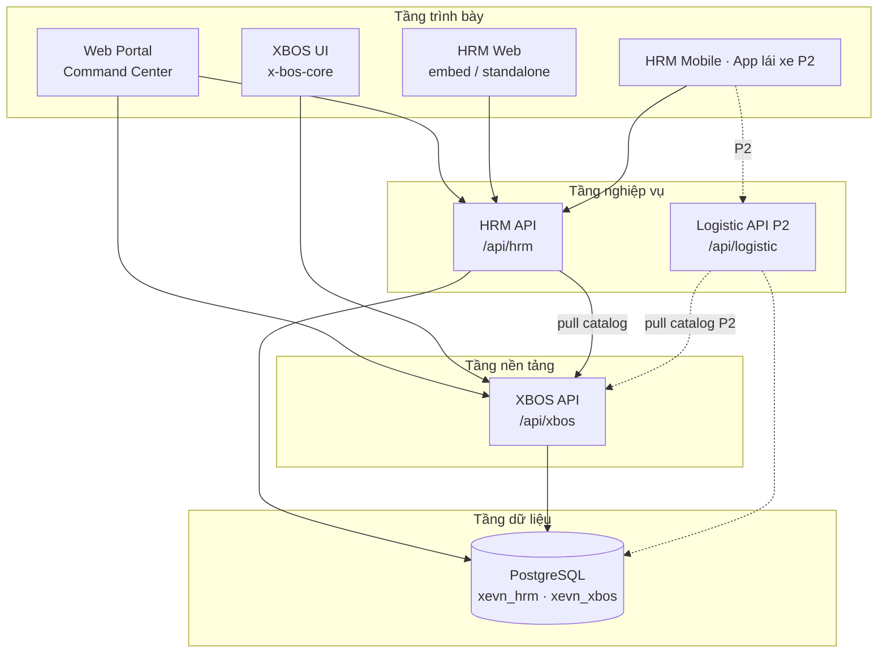
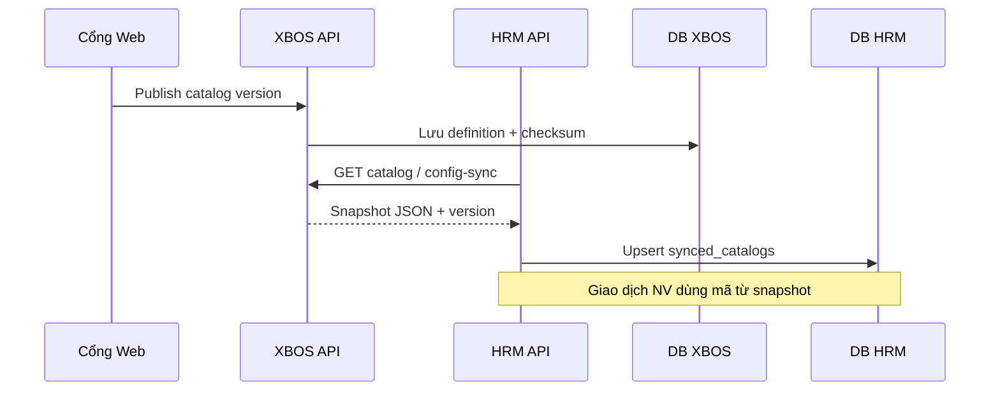
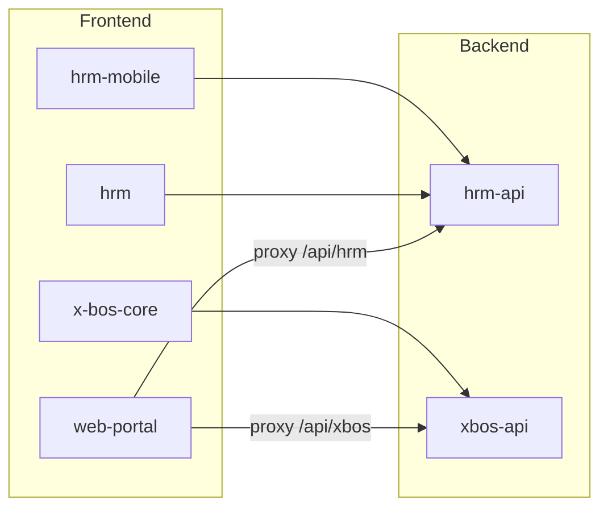
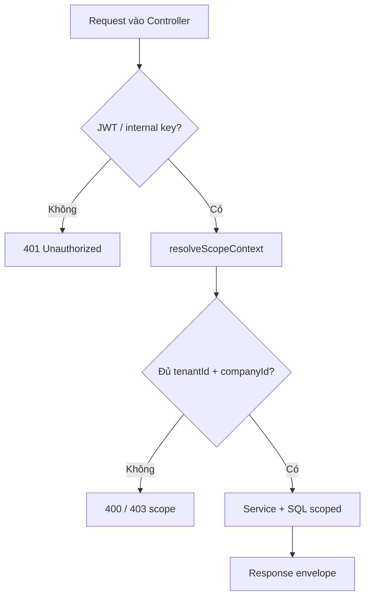
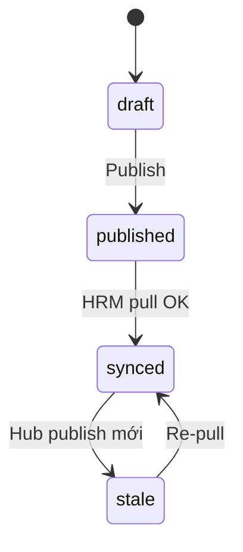
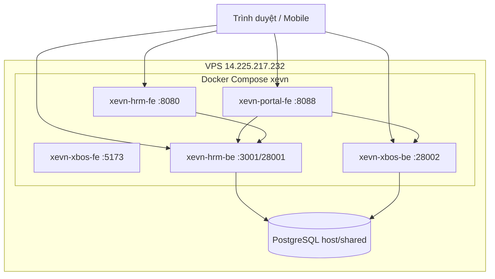

# Đặc tả thiết kế kỹ thuật — XeVN Ecosystem OS

| Thuộc tính | Giá trị |
|-----------|---------|
| **Mã tài liệu** | UNICOM/TECHSPEC-XEVN-OS-001 |
| **Phiên bản** | 1.0 |
| **Ngày hiệu lực** | Tháng 5/2026 |
| **Trạng thái** | Bản làm việc — căn cứ SRS khách & mã nguồn monorepo |
| **Dựa trên** | `docs/client-delivery/02_SRS_XeVN_OS.html` (373 FR), `docs/ecosystem/BRD_TONG_HOP_HE_SINH_THAI_XEVN.md` |
| **Tác giả** | UNICOM Technology Solutions Co., Ltd. |

> **Mục đích:** Mô tả **thiết kế kỹ thuật chi tiết** toàn hệ sinh thái — kiến trúc, thành phần, dữ liệu, API, tích hợp, triển khai và ánh xạ SRS → mã nguồn. Tài liệu này **bổ sung** SRS (yêu cầu *what*) bằng thiết kế *how*; không thay thế TechSpec từng phân hệ khi đi sâu module.

**Tài liệu liên quan (chi tiết theo phân hệ):**

| Tài liệu | Phạm vi |
|----------|---------|
| `docs/ecosystem/TECHSPEC.md` | Phạm vi tenant, iframe portal, business-master (trích dẫn, không nhân bản) |
| `docs/hrm/TECHSPEC.md` | HRM API/Web, envelope, notification pipeline |
| `docs/hrm/TECHSPEC_MOBILE.md` | Expo, mobile auth, offline queue |
| `docs/xbos/TECHSPEC.md` | XBOS schema org/workflow, portal clients |
| `docs/ops/DEPLOY_GUIDE.md` | VPS, cổng, compose |
| `docs/ecosystem/PHASE1_UC_SRS_TECHSPEC_MATRIX.md` | **245 UC Phase 1** × SRS × TechSpec (bảng đầy đủ) |

---

## 1. Phân tích khoảng trống: SRS đã có — TechSpec cần bổ sung gì?

SRS khách (`02_SRS_XeVN_OS.html`, v2.1) đã chuẩn hóa **373 FR** (7 mục/FR), **NFR**, ràng buộc và giao diện ngoài. Các TechSpec phân hệ hiện tại mô tả **một phần** runtime. Bảng dưới là checklist việc **cần có ở tầng hệ sinh thái** (file này) so với đã có ở SRS/phân hệ.

| Hạng mục | SRS (đã có) | TechSpec hệ sinh thái (file này) | TechSpec phân hệ / code |
|----------|-------------|----------------------------------|-------------------------|
| Kiến trúc 4 tầng, Hub-Spoke | Chương 2 (tổng quan) | §3–4: logic + vật lý, sơ đồ triển khai | Assets PNG trong `docs/ecosystem/assets/` |
| 373 FR × luồng/sequence | Chương 3 (đầy đủ) | §9: ánh xạ MOD → app/API | `srs-api-map.mjs`, controller từng UC |
| NFR SEC/PERF/AVAIL | Chương 4 | §11: cách triển khai (middleware, health, backup) | Rate limit trong `main.ts` |
| Giao diện ngoài | Chương 5 | §5–8: prefix API, proxy FE | `vite.config`, `hrmApiClient` |
| Ràng buộc BR-ECO-* | Chương 6 | §6: `resolveScopeContext`, JWT | `scope-context.ts`, `identityScope.ts` |
| **Ma trận sở hữu dữ liệu** | Rải rác BRD §4 | §7 (bảng đầy đủ) | Migration SQL |
| **Catalog publish/pull** | FR MOD-M02 | §8.1–8.2 (sequence + bảng trạng thái) | `catalog-sync`, `catalog-governance` |
| **Workflow runtime** | FR MOD-M04 | §8.3 | `workflow-engine` |
| **Logistic API (P2)** | FR MOD-M07/M08 | §10.5 (khung thiết kế) | Chưa có `logistic-api` |
| **Observability / SLO** | NFR-AVAIL/PERF | §11 + backlog §13 | Metrics chưa thống nhất |
| **ER / dictionary bảng** | Không có | §7.3–7.4 | Migration `migrations/hrm`, `apps/api/xbos-api/migrations` |
| **Ma trận biến môi trường** | Không có | §12 | `deploy/xevn-ecosystem/.env` |

**Kết luận:** Sau SRS, ưu tiên hoàn thiện TechSpec hệ sinh thái (file này) + **mở rộng** `docs/logistics/TECHSPEC.md` (P2) + đồng bộ Prisma/observability theo §13.

---

## 2. Tổng quan hệ thống

### 2.1 Định nghĩa sản phẩm kỹ thuật

**XeVN Ecosystem OS** là monorepo đa ứng dụng:

- **Hub:** XBOS API — danh mục, tổ chức, workflow, tenant scope, business master.
- **Spoke nghiệp vụ:** HRM API (+ HRM Web, HRM Mobile); Logistic API/Web/Mobile (giai đoạn 2).
- **Điểm vào điều hành:** Web Portal (Command Center) — proxy tới XBOS/HRM.

**Quy mô đối chiếu nghiệm thu:** 373 UC/FR · 183 danh mục XBOS · Phase 1 = 245 FR · Phase 2 = 128 FR Logistic.

### 2.2 Kiến trúc logic (4 tầng)



| Tầng | Trách nhiệm kỹ thuật | Không làm |
|------|----------------------|-----------|
| Trình bày | UI, routing, i18n, gọi API qua proxy, nhúng iframe | Logic phân quyền nghiệp vụ độc lập khỏi BE |
| Nghiệp vụ | Giao dịch OLTP, validation, audit theo `company_id` | Định nghĩa danh mục gốc |
| Nền tảng | Catalog version, workflow instance, org/RBAC | CRUD đơn/chuyến chi tiết |
| Dữ liệu | ACID, migration, backup | — |

### 2.3 Mô hình Hub-and-Spoke (dữ liệu chuẩn)



| Nguyên tắc | Triển khai |
|------------|------------|
| Ghi catalog chuẩn | XBOS `catalog-governance`, `config-sync` |
| Đọc tại spoke | HRM `catalog-sync`, `settings-catalogs`; cache `synced_catalogs` |
| Tham chiếu mã | Cột/text `*_code` + JSON `custom_fields`; validate trước insert |
| Mở rộng tenant | `hrm_catalog_extension_items` + workflow duyệt (xem `docs/ecosystem/TECHSPEC.md` §4.2) |

---

## 3. Bản đồ thành phần monorepo

| Thành phần | Đường dẫn | Stack | Global prefix / cổng dev |
|------------|-----------|-------|---------------------------|
| Web Portal | `apps/web/web-portal` | React 18, Vite | Host **8088** → container 5175 |
| HRM Web | `apps/web/hrm` | React, Vite | **8080** (embed `?portal=1`) |
| XBOS UI | `apps/web/x-bos-core` | React, Vite | **5173** |
| HRM API | `apps/api/hrm-api` | NestJS, `pg` pool | `/api/hrm` — **3001** / deploy **28001** |
| XBOS API | `apps/api/xbos-api` | NestJS | `/api/xbos` — **28002** |
| HRM Mobile | `apps/mobile/hrm-mobile` | Expo, RN, TS | Gọi `HRM_API_BASE_URL` |
| Logistic API | *(dự kiến P2)* `apps/api/logistic-api` | NestJS | `/api/logistic` — TBD |
| Migration HRM | `migrations/hrm/*.sql` | SQL | DB `xevn_hrm` |
| Migration XBOS | `migrations/xbos`, `apps/api/xbos-api/migrations` | SQL | DB `xevn_xbos` |
| Deploy | `deploy/xevn-ecosystem` | Docker Compose | `docs/ops/DEPLOY_GUIDE.md` |



---

## 4. Chuẩn giao tiếp API

### 4.1 Envelope JSON (bắt buộc mọi phân hệ)

**Thành công:**

```json
{
  "success": true,
  "code": "HRM-2001",
  "message": "Mô tả ngắn",
  "data": {},
  "timestamp": "2026-05-21T10:00:00.000Z"
}
```

**Lỗi:**

```json
{
  "success": false,
  "code": "HRM-ERR-4031",
  "message": "Mô tả lỗi",
  "details": {},
  "timestamp": "2026-05-21T10:00:00.000Z"
}
```

| Quy tắc | Mô tả |
|---------|--------|
| Prefix mã | `HRM-*`, `XBOS-*`, `LG-*` (P2), `ECO-*` (toàn hệ) |
| HTTP status | 4xx/5xx đồng bộ với `success: false`; filter `GlobalHttpExceptionFilter` |
| `details` | Validation errors, field-level; không chứa stack trace production |

### 4.2 Header và correlation

| Header | Bắt buộc | Mô tả |
|--------|----------|--------|
| `Authorization` | API bảo vệ | `Bearer <JWT>` |
| `x-tenant-id` | Runtime tenant | UUID/slug tenant — khóa phân vùng |
| `x-company-id` | Runtime company | UUID company con trong tenant |
| `x-request-id` | Khuyến nghị | UUID — BE gán nếu thiếu; trả lại response |
| `x-internal-api-key` | Portal → BE | Service-to-service khi proxy (không lộ browser production) |

### 4.3 Xác thực (tóm tắt)

| Kênh | Endpoint / cơ chế | Token |
|------|-------------------|-------|
| Portal / XBOS UI | `POST /api/xbos/auth/login` | JWT access; membership list |
| HRM Web | JWT portal hoặc session HRM admin | Cùng scope headers |
| HRM Mobile | `POST /api/hrm/auth/mobile/login` | access + refresh; `select-membership` |
| Service nội bộ | `x-internal-api-key` + scope headers | Không thay JWT user |

**JWT claims chuẩn (HRM mobile / đồng bộ toàn hệ):**

| Claim | Ý nghĩa |
|-------|---------|
| `sub` | User id |
| `tenantId` | Tenant đang làm việc |
| `companyId` | Company scope |
| `employee_id` | Hồ sơ NV (mobile) |
| `roles` | Mảng role code |

Chi tiết: `docs/hrm/TECHSPEC_MOBILE.md` §5.2, `apps/api/hrm-api/src/common/jwt-sign.ts`.

### 4.4 Bản đồ prefix API XBOS (đã triển khai)

| Prefix controller | Domain kỹ thuật |
|-------------------|-------------------|
| `/api/xbos/auth` | Đăng nhập, refresh |
| `/api/xbos/tenant-scope` | Tenant, membership, global filter |
| `/api/xbos/org-foundation` | Pháp nhân, cây tổ chức |
| `/api/xbos/legal-entity-profile` | Hồ sơ ĐKKD (cùng module org) |
| `/api/xbos/position-rbac` | Chức danh, grant quyền |
| `/api/xbos/raci-governance` | RACI |
| `/api/xbos/workflow-engine` | Định nghĩa + instance + inbox task |
| `/api/xbos/catalog-governance` | Publish, extension approval |
| `/api/xbos/config-sync` | Export catalog cho downstream |
| `/api/xbos/business-master/:domain` | CRUD master data (whitelist domain) |
| `/api/xbos/command-center` | KPI, alerts, capability registry |
| `/api/xbos/kpi-engine` | Tính KPI batch |
| `/api/xbos/asset-requests` | Yêu cầu tài sản |
| `/api/xbos/infrastructure` | Health, meta |

### 4.5 Bản đồ prefix API HRM (đã triển khai)

| Prefix | Domain |
|--------|--------|
| `/api/hrm/employees` | Hồ sơ nhân viên |
| `/api/hrm/attendance` | Chấm công, đơn nghỉ, yêu cầu chỉnh sửa |
| `/api/hrm/payroll` | Phiếu lương, kỳ lương |
| `/api/hrm/recruitment` | Tuyển dụng |
| `/api/hrm/contracts-insurance` | Hợp đồng, BHXH |
| `/api/hrm/employee-metadata` | Thay đổi metadata + queue duyệt |
| `/api/hrm/settings-catalogs` | Extension, removal request |
| `/api/hrm/catalog-sync` | Pull từ XBOS |
| `/api/hrm/notifications` | Inbox, push tokens |
| `/api/hrm/auth/mobile` | Login, refresh, select membership |
| `/api/hrm/admin` | Vòng đời admin |
| `/api/hrm/fleet`, `/operations`, `/performance`, `/spreadsheet` | Mở rộng nghiệp vụ |

**Realtime:** namespace Socket.IO `/hrm-realtime` trên cùng host HRM API (không qua `/api/hrm` HTTP prefix).

### 4.6 OpenAPI M01 — Sprint S1 package (`P1-S1-SA-01`)

| Artifact | Mục đích |
|----------|----------|
| `docs/api/openapi/xbos-api.yaml` | Contract 3.1 — planes M01-Catalog / KPI / Org / Tenant / Master |
| `docs/decisions/ADR-XBOS-M01-OPENAPI-BOUNDARIES.md` | Bounded contexts, scope invariants, defer S2 |
| `pnpm verify:openapi-m01` | Static gate — required `operationId` + scope doc fragments |
| `pnpm verify:openapi-contract` | Runtime health/metrics (stack phải chạy) |

**Ranh giới bắt buộc (tóm tắt):**

| Plane | Prefix | Scope | Không làm |
|-------|--------|-------|-----------|
| Catalog publish | `config-sync` | `resolveScopeContext` | CRUD NV HRM |
| Catalog approval | `catalog-governance` | Internal auth (bổ sung scope S1-BE-01) | Publish version |
| KPI math | `kpi-engine` | Rollup full scope; alerts tenant-only | Dashboard aggregation trùng |
| Org | `org-foundation`, `position-rbac` | Full / tenant-only theo endpoint | Payroll |
| Tenant filter | `tenant-scope` | JWT user | `companyId` mismatch gate |
| Master | `business-master/:domain` | Whitelist domain + scope | Catalog version |
| Audit REST | — | **S1:** emit `platform_audit_events` only (`P1-S1-BE-04`) | — |

**Pilot:** Portal gọi rollup với `companyId` khớp JWT (`holding` cho `ceo@xe.vn`) — tránh `409 SCOPE_CONTEXT_MISMATCH` (P-CC-04).

### 4.7 OpenAPI P1-S2 / HRM-S3b extension (`P1-TODAY-GOV-SA`, 2026-05-24)

U18 delta — **bổ sung contract**, không viết lại SRS:

| Artifact | Version | Nội dung |
|----------|---------|----------|
| `docs/api/openapi/xbos-api.yaml` | 1.2.0-p1-s2 | Planes M01-WF, Asset, Infra, Audit, CC executive-rail, DM export/import |
| `docs/api/openapi/hrm-api.yaml` | 1.3.0-p1-s3b | Metadata, Spreadsheet, Operations, Performance |
| `docs/architecture/P1-TECHSPEC-OPENAPI-DELTA-U18-20260524.md` | — | UC map, scope rules, Dev backlog |
| `docs/logistics/TECHSPEC_M03_DM_LOG_P1.md` | — | Khối B pattern-reuse (22 UC `data`) |

Scope bắt buộc: [`ADR-GROUP-CEO-MAIN-HOLDING-SCOPE.md`](../architecture/ADR-GROUP-CEO-MAIN-HOLDING-SCOPE.md) §4 trên mọi list/catalog mới.

CI đề xuất: `pnpm verify:openapi-p1-s2` (static operationId gate mở rộng từ `verify:openapi-m01`).

---

## 5. Thiết kế phân vùng, bảo mật và UX portal

> Chi tiết điều kiện BR-ECO-SCOPE: `docs/ecosystem/TECHSPEC.md`, `docs/ecosystem/BRD.md`.

### 5.1 Ma trận chế độ phạm vi

| Chế độ | Điều kiện | Hành vi BE | Hành vi FE |
|--------|-----------|------------|------------|
| System / pre-login | Không session + env cho phép | API tổng hợp / admin route | `identityScope` dev fallback |
| Tenant user | JWT có `tenantId` | Mọi query `WHERE tenant_id = $1` (+ company) | Global filter cố định |
| Cross-tenant attempt | User T truy cập T' | `403` + `HRM-ERR-*` / `XBOS-ERR-*` | Ẩn menu, không gửi header lạ |

### 5.2 Luồng resolve scope (backend)



**File tham chiếu:** `apps/api/hrm-api/src/common/scope-context.ts`, `apps/api/xbos-api/src/common/` (tương đương).

### 5.3 Nhúng HRM trong Portal (BR-ECO-UX-01)

| Yêu cầu | Thiết kế |
|---------|----------|
| Modal/dialog full viewport | Portal container top-level; `getDialogPortalContainer()` |
| Cùng origin | Sync stylesheet iframe → `parent.document` |
| Khác origin | Fallback iframe-bound; backlog `postMessage` contract |

**File:** `apps/web/hrm/src/lib/hrmDialogPortal.ts`, `hrmPortalMode.ts`.

### 5.4 CORS, rate limit, security headers

| Control | HRM API | XBOS API |
|---------|---------|----------|
| Rate limit | `HRM_RATE_LIMIT_*` — mặc định 300 req/phút/IP | `XBOS_RATE_LIMIT_*` |
| Headers | `x-request-id`, CSP, `X-Frame-Options: SAMEORIGIN` | Giống |
| CORS | `origin: true` dev — production whitelist theo NFR-SEC-006 | Giống |

---

## 6. Thiết kế dữ liệu

### 6.1 Ma trận sở hữu dữ liệu (logical)

| Loại dữ liệu | Sở hữu (SoT) | Lưu trữ | Consumer |
|--------------|--------------|---------|----------|
| Tenant, membership | XBOS | `xevn_xbos` | Portal, HRM, LG |
| Pháp nhân, org tree, RACI | XBOS | `xbos_legal_entity`, `xbos_org_unit`, … | Portal CC |
| Danh mục chuẩn (183) | XBOS | Catalog tables + publish log | HRM, LG |
| Workflow definition | XBOS | `xbos_workflow_definition` | HRM đơn từ, CAT extension |
| Workflow instance / task | XBOS | `xbos_workflow_instance`, `xbos_workflow_step_task` | Portal inbox |
| Business master | XBOS | `xbos_business_master_entries` | Portal settings |
| Employee, attendance, payroll | HRM | `xevn_hrm` | HRM Web/Mobile |
| Catalog snapshot | HRM (replica) | `synced_catalogs` | Validate import/form |
| Extension field HRM | HRM | `hrm_catalog_extension_items` | Settings + workflow |
| Vận đơn, chuyến (P2) | Logistic | `xevn_logistic` *(dự kiến)* | LG Web/Mobile |

### 6.2 Phân tách database

| Database | Mục đích | Ghi chú |
|----------|----------|---------|
| `xevn_xbos` | Hub — org, catalog, workflow, auth | Migration trong `apps/api/xbos-api/migrations` |
| `xevn_hrm` | Spoke HR — OLTP nhân sự | `migrations/hrm/*.sql` |
| `xevn_logistic` | Spoke logistic P2 | Chưa khởi tạo — thiết kế tương tự HRM |

**Không** dùng Supabase làm runtime chuẩn; thư mục `apps/web/hrm/supabase/` là di sản — loại bỏ dần (xem `docs/hrm/TECHSPEC.md` §3).

### 6.3 Sơ đồ thực thể cốt lõi (rút gọn)

```mermaid
erDiagram
  XBOS_LEGAL_ENTITY ||--o{ XBOS_ORG_UNIT : contains
  XBOS_ORG_UNIT ||--o{ XBOS_POSITION_ASSIGNMENT : has
  XBOS_WORKFLOW_DEFINITION ||--o{ XBOS_WORKFLOW_INSTANCE : spawns
  XBOS_WORKFLOW_INSTANCE ||--o{ XBOS_WORKFLOW_STEP_TASK : has
  SYNCED_CATALOGS ||--o{ EMPLOYEES : validates
  EMPLOYEES ||--o{ ATTENDANCE_RECORDS : has
  EMPLOYEES ||--o{ LEAVE_REQUESTS : submits
  EMPLOYEES ||--o{ PAYROLL_PAYSLIPS : receives
  HRM_INBOX_NOTIFICATIONS }o-- EMPLOYEES : notifies
```

### 6.4 Danh mục bảng HRM (`xevn_hrm`) — baseline

| Bảng | Mục đích | Khóa phân vùng |
|------|----------|----------------|
| `synced_catalogs` | Snapshot catalog từ XBOS | `catalog_key` (global per deploy; payload scoped) |
| `sync_audit_logs` | Audit pull/push catalog | — |
| `employees` | Hồ sơ NV | `company_id`, `custom_fields.tenant_id` |
| `attendance_records` | Công theo ngày | `company_id`, `employee_id`, `attendance_date` |
| `attendance_events` | Sự kiện check-in/out | FK `attendance_record_id` |
| `leave_requests` | Đơn nghỉ | `company_id`, `status` |
| `attendance_update_requests` | Yêu cầu sửa công | `company_id` |
| `payroll_payslips` | Phiếu lương | `company_id`, kỳ |
| `hrm_inbox_notifications` | Inbox + broadcast | `company_id`, `recipient_employee_id` |
| `hrm_catalog_extension_items` | Field mở rộng | `tenant_id`, `company_id` |
| `hrm_catalog_field_removal_requests` | Xóa field — chờ duyệt | `status = pending` |

*Migration bổ sung:* `0003`–`0008` recruitment, metadata, leave extend — xem `migrations/hrm/`.

### 6.5 Danh mục bảng XBOS (`xevn_xbos`) — nhóm chính

| Nhóm bảng | Mục đích |
|-----------|----------|
| `xbos_business_master_entries` | Master data đa domain (`companies`, `kpi_metrics`, …) |
| `xbos_legal_entity`, `xbos_org_unit` | Tổ chức |
| `xbos_position_template`, `xbos_position_assignment` | RACI / chức danh |
| `xbos_permission_definition`, `xbos_permission_grant` | RBAC |
| `xbos_workflow_definition`, `instance`, `step_task` | Workflow runtime |
| `xbos_reporting_route` | Rollup báo cáo |
| Catalog governance tables | Version, checksum, extension batch |

Chi tiết cột: `docs/xbos/TECHSPEC.md` §10–11, SQL `20260515_meeting_foundation.sql`.

### 6.6 Quy tắc toàn vẹn

| ID | Quy tắc | Cơ chế |
|----|---------|--------|
| DATA-01 | Ghi giao dịch quan trọng trong transaction | Service layer `BEGIN`/`COMMIT` |
| DATA-02 | Migration có version; không sửa tay prod | Chỉ `migrations/*` + CI |
| DATA-03 | Seed idempotent | Script `scripts/seed-*.mjs` |
| DATA-04 | Không DELETE cross-tenant | Code review + guard admin |
| DATA-05 | Soft-delete master | `status = 'deleted'` trên business_master |

---

## 7. Thiết kế tích hợp nghiệp vụ

### 7.1 Catalog: trạng thái và API

| Trạng thái (logical) | Mô tả | Trigger |
|---------------------|--------|---------|
| `DRAFT` | Đang soạn trên XBOS | Admin edit |
| `PUBLISHED` | Đã phát hành, có version + checksum | `catalog-governance` publish |
| `SYNCED` (spoke) | HRM đã pull | `POST/GET catalog-sync` |
| `STALE` | Spoke version < hub | Alert settings / pre-import check |



### 7.2 Extension danh mục HRM

| Bước | Actor | Hệ thống |
|------|-------|----------|
| 1 | HR tenant | Tạo extension item (`settings-catalogs`) |
| 2 | HRM | Gửi workflow XBOS (batch pending) |
| 3 | Tập đoàn | Duyệt trên Portal / XBOS |
| 4 | HRM | Merge vào form + validation import |

### 7.3 Workflow tập trung

| Thành phần | Trách nhiệm |
|------------|-------------|
| `workflow-engine` | Khởi tạo instance, bước, assignee |
| Portal inbox | Hiển thị `step_task`, approve/reject |
| HRM attendance | Gắn `workflow_instance_id` trên leave/update request |
| Callback | Cập nhật `status` đơn HRM khi task `completed` |

**Catalog workflow Logistic (20 QT):** định nghĩa Phase 1 trên XBOS; **thực thi** khi có entity đơn/chuyến Phase 2.

### 7.4 Pipeline thông báo HRM

Thứ tự cố định mỗi sự kiện (`HrmRealtimeEventEnvelope`):

1. Socket.IO publish  
2. Ghi `hrm_inbox_notifications`  
3. Webhook outbound (nếu bật)  
4. Push FCM/Expo  

Chi tiết: `docs/hrm/TECHSPEC.md` §6.2.

### 7.5 Mobile offline (P1)

| Thành phần | Thiết kế |
|------------|----------|
| Queue | `offlineQueue.ts` — persist action khi mất mạng |
| Sync | Replay khi online; idempotent server |
| Conflict | Server wins + thông báo user |

Chi tiết: `docs/hrm/TECHSPEC_MOBILE.md`.

---

## 8. Ánh xạ SRS (MOD) → triển khai kỹ thuật

| MOD SRS | FR (ước lượng) | Frontend | Backend | DB chính |
|---------|----------------|----------|---------|----------|
| M00 Phạm vi & CC | ~20 | `web-portal` Command Center | `xbos-api` tenant-scope, command-center | xevn_xbos |
| M01 XBOS nền | ~104 | `x-bos-core`, portal | xbos modules §4.4 | xevn_xbos |
| M02 DM HRM | ~22 | portal catalog panels | catalog-governance, config-sync | xevn_xbos + sync HRM |
| M03 DM Logistic | ~22 | portal (khai DM) | catalog-governance | xevn_xbos |
| M04 RACI & WF | (trong M01) | RACI panel, workflow canvas | raci-governance, workflow-engine | xevn_xbos |
| M05 HRM Web/API | ~119 | `hrm`, portal embed | `hrm-api` controllers §4.5 | xevn_hrm |
| M06 HRM Mobile | ~15 | `hrm-mobile` | `auth/mobile`, attendance, payroll | xevn_hrm |
| M07 Logistic Web | ~122 | *(P2)* | *(P2)* logistic-api | xevn_logistic |
| M08 App lái xe | ~28 | *(P2)* | *(P2)* | xevn_logistic |

**Traceability:** Mỗi FR `FR-{Mã UC}` trong SRS phải có ít nhất một trong: endpoint, migration, hoặc mục backlog §13 với owner.

---

## 9. Thiết kế theo phân hệ

### 9.1 Web Portal (Command Center)

| Khía cạnh | Thiết kế |
|-----------|----------|
| Proxy dev | `vite.config.ts` — `VITE_DEV_PROXY_XBOS_API`, `VITE_DEV_PROXY_HRM_API` |
| Identity | `authSession.ts`, `identityScope.ts` |
| Module HRM embed | `HrmWorkspacePanel.tsx`, `hrmApiClient.ts` |
| XBOS panels | `CatalogGovernancePanel`, workflow, RACI |
| Anti-mock | `VITE_ALLOW_MOCK_FALLBACK` chỉ DEV — xem `docs/hrm/TECHSPEC.md` §11.3 |

### 9.2 XBOS

| Khía cạnh | Thiết kế |
|-----------|----------|
| Bootstrap schema | `FoundationSchemaService.ensureAll()` on init |
| Business master | Whitelist domain — không mở domain tùy ý |
| KPI | `kpi-engine` + `command-center` (Option A/B trong xbos TECHSPEC §12.2) |
| Auth | Membership multi-company; chọn scope sau login |

### 9.3 HRM Web & API

| Khía cạnh | Thiết kế |
|-----------|----------|
| Layering | Controller → Service → `HrmDbService` (pg) |
| DTO validation | `class-validator` global pipe whitelist |
| Catalog | Pre-check trước import employee |
| Tests | `*.spec.ts` cạnh service — contract 401/403 |

### 9.4 HRM Mobile

| Khía cạnh | Thiết kế |
|-----------|----------|
| Auth flow | login → (select membership) → scoped headers |
| Storage | SecureStore refresh; không plaintext password |
| API client | `hrmApiClient.ts`, `mapApiError.ts` |
| Push | `pushRegistration.ts` → `POST .../push-tokens` |

### 9.5 Logistic (Phase 2 — khung thiết kế)

| Hạng mục | Quyết định đề xuất |
|----------|-------------------|
| API | NestJS `apps/api/logistic-api`, prefix `/api/logistic` |
| DB | `xevn_logistic` riêng; tham chiếu mã catalog từ XBOS |
| FE | Module portal + app lái xe (Expo, pattern HRM mobile) |
| Workflow | Dùng `workflow-engine` XBOS — 20 QT đã khai P1 |
| Integration | Pull catalog giống HRM; không duplicate DM gốc |

**Deliverable TechSpec P2:** tạo `docs/logistics/TECHSPEC.md` mở rộng từ khung §9.5 + ER đơn/chuyến.

---

## 10. Yêu cầu phi chức năng — chỉ dẫn triển khai

Ánh xạ từ SRS chương 4 → hành động kỹ thuật.

### 10.1 Bảo mật (NFR-SEC)

| Mã SRS | Triển khai |
|--------|------------|
| NFR-SEC-001 | TLS termination tại reverse proxy (VPS/nginx) |
| NFR-SEC-002 | Refresh rotate; mobile `auth/mobile/refresh` |
| NFR-SEC-003 | bcrypt password; audit không log password |
| NFR-SEC-004 | Guard + `resolveScopeContext` mọi route protected |
| NFR-SEC-005 | `x-request-id` + log structured (userId, tenantId) |
| NFR-SEC-006 | CORS whitelist file env production |
| NFR-SEC-007 | Rate limit middleware `main.ts` |

### 10.2 Hiệu năng (NFR-PERF)

| Mã SRS | Triển khai |
|--------|------------|
| NFR-PERF-001 | Index `(company_id, …)`; tránh N+1 list |
| NFR-PERF-002 | Transaction gọn; async notification sau commit |
| NFR-PERF-003 | Horizontal scale stateless API (P2 ops) |
| NFR-PERF-004 | Catalog pull chunked hoặc progress endpoint |

### 10.3 Khả dụng (NFR-AVAIL)

| Mã SRS | Triển khai |
|--------|------------|
| NFR-AVAIL-001 | Health `/api/hrm/health`, `/api/xbos/health` |
| NFR-AVAIL-002 | `pg_dump` cron — doc ops |
| NFR-AVAIL-003 | Compose restart policy `unless-stopped` |

### 10.4 Tương thích (NFR-COMPAT)

| Mã SRS | Triển khai |
|--------|------------|
| NFR-COMPAT-001 | Portal responsive; Chrome/Edge/Firefox mới |
| NFR-COMPAT-002 | Expo SDK pin; iOS 15+, Android 10+ |
| NFR-COMPAT-003 | `i18n/vi.ts` — không hardcode EN trên UI pilot |

---

## 11. Triển khai và vận hành

### 11.1 Sơ đồ triển khai dev/VPS



### 11.2 Biến môi trường then chốt (toàn hệ)

| Biến | Phân hệ | Mục đích |
|------|---------|----------|
| `SERVICE_JWT_SECRET` | HRM, XBOS | Ký JWT nội bộ |
| `MASTER_TENANT_ID` / `DEFAULT_TENANT_ID` | Bootstrap | Seed catalog — **không** thay runtime scope |
| `DEFAULT_COMPANY_ID` | Bootstrap | DDL mặc định |
| `HRM_BE_PORT` / `XBOS_BE_PORT` | API bind | 28001 / 28002 deploy |
| `HRM_MOBILE_PILOT_PASSWORD` | Mobile dev | Pilot — không production |
| `HRM_XBOS_LEADERSHIP_EMAILS` | Extension removal | Workflow email |
| `VITE_DEV_PROXY_*` | Portal vite | Proxy local |
| `VITE_STRICT_IDENTITY` | Portal | Tắt dev fallback |

File mẫu: `deploy/xevn-ecosystem/.env`, `apps/mobile/hrm-mobile/.env.example`.

### 11.3 CI / chất lượng (đề xuất)

| Gate | Lệnh / artifact |
|------|-----------------|
| Build API | `pnpm --filter hrm-api build`, `xbos-api` |
| Unit test | `pnpm test` trong từng API |
| SRS audit | `pnpm docs:srs:audit` |
| Mermaid BRD | `pnpm docs:mermaid:audit` |
| Smoke mobile | `scripts/mobile-hrm-smoke.mjs` |

---

## 12. Observability và vận hành sự cố

| Khía cạnh | Hiện trạng | Mục tiêu |
|-----------|------------|----------|
| Log | Console + `x-request-id` | JSON log tập trung (Loki/ELK) |
| Metrics | Chưa thống nhất | Prometheus `/metrics` per API |
| Trace | Chưa | OpenTelemetry W3C traceparent |
| Alert | Portal hot-point | Pager khi health fail |

**Chuẩn log một dòng:**

```
level=info requestId=... tenantId=... path=... durationMs=... code=HRM-2001
```

---

## 13. Backlog thiết kế kỹ thuật (sau SRS)

| ID | Hạng mục | Ưu tiên | Owner đề xuất | Phụ thuộc |
|----|----------|---------|---------------|-----------|
| TS-01 | `docs/logistics/TECHSPEC.md` đầy đủ (ER, API, app lái xe) | P2 | Dev-BE + Mobile | Phase 2 kickoff |
| TS-02 | Khởi tạo `apps/api/logistic-api` + `xevn_logistic` migration | P2 | Dev-BE | TS-01 |
| TS-03 | Prisma hóa HRM/XBOS (thay `pg` pool dần) | P1 | Dev-BE | `docs/hrm/TECHSPEC.md` §9 |
| TS-04 | `postMessage` overlay cross-origin portal↔HRM | P2 | Dev-FE | BR-ECO-UX-01 |
| TS-05 | OpenAPI 3.1 aggregate `/api/hrm` + `/api/xbos` | P1 | Dev-BE | Contract test |
| TS-06 | Metrics + dashboards NFR-PERF | P1 | Ops | TS-05 |
| TS-07 | RLS PostgreSQL (optional hardening) | P3 | SA | Policy sign-off |
| TS-08 | Logistic catalog sync consumer | P2 | Dev-BE | TS-02 |
| TS-09 | Dedupe mã lỗi FR ↔ implementation registry | P1 | QA | `docs/qa/MOBILE_TRACEABILITY.md` |
| TS-10 | HTML TechSpec khách (tùy chọn) | P3 | BA-Docs | Script build như BRD |

---

## 14. Ma trận traceability (mẫu)

| FR (SRS) | Module code | Endpoint / artifact | Test evidence |
|----------|-------------|---------------------|---------------|
| FR-UC-HRM-09 | MOD-M05 | `POST /api/hrm/attendance/leave-requests` | `leave-requests.service.spec.ts` |
| FR-UC-XBOS-CAT-01 | MOD-M02 | `catalog-governance/publish` | Manual + seed script |
| FR-UC-ECO-SCOPE-02 | MOD-M00 | `resolveScopeContext` | Portal e2e 2 tenant |

*Bảng đầy đủ 373 dòng:* duy trì trong `docs/qa/MOBILE_TRACEABILITY.md` (mobile) và bổ sung `docs/qa/ECOSYSTEM_TRACEABILITY.md` (đề xuất TS-09).

---

## 15. Lịch sử phiên bản

| Phiên bản | Ngày | Mô tả |
|-----------|------|--------|
| 1.0 | 05/2026 | Khởi tạo TechSpec hệ sinh thái căn SRS v2.1 + monorepo hiện tại |

---

*Tài liệu này là nguồn thiết kế kỹ thuật tổng cho XeVN OS. Mọi thay đổi breaking API hoặc schema phải cập nhật file này (hoặc TechSpec phân hệ) **trước hoặc đồng thời** với merge code — theo quy tắc giao hàng trong `docs/hrm/TECHSPEC.md` §1.1.*
