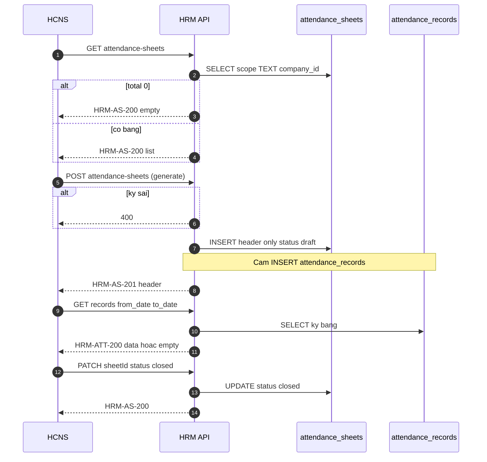

# API_DESIGN — HRM Attendance sheets (list / get / generate / close)

| Field | Value |
|-------|--------|
| **work_item_id** | `SA-U71-HRM-ATT-SHEET-DESIGN-01` |
| **change_mode** | ADD |
| **ref_srs** | `docs/client-delivery/hrm/SRS_HRM_KHACH.md` **§3.4 FR-HRM-AT-14** Diễn biến #1–#12 · team **UC-HRM-23 / HRM-AT-14 / UC-HRM-32** · **AC-ATT-SHEET-01..06** |
| **ref_techspec** | `docs/hrm/TECHSPEC.md` **§12.1** · **§13** · **§14.4** |
| **ref_db** | `docs/hrm/DB_DESIGN_HRM_ATT_SHEET.md` |
| **Template** | `_vibe-team-os/templates/TECHSPEC_API_CONTRACT.md` (Mục đích · Nghiệp vụ · Bước SRS) |
| **U71** | Physical API slice before Dev/QA claim on attendance sheets |
| **Date** | 2026-07-27 |
| **Runtime** | `AttendanceController` · `AttendanceCatalogService` · `AttendanceService.listRecords` |
| **OpenAPI** | `docs/api/openapi/hrm-api.yaml` → `/attendance/attendance-sheets*` (thin; codes below are SoT) |

> **must_keep:** TEXT `company_id` slug; header-only generate (no roster seed); AC-ATT-SHEET-01..06; leave pair untouched; scope parity list↔get↔mutate.  
> **Alias map (PM ↔ TechSpec):** **list** = `listAttendanceSheets` · **get** = get-by-id header · **generate** = `createAttendanceSheet` · **close** = PATCH `status=closed` (lifecycle). Companion **open grid** = `listAttendanceRecords`.

Prefix: `/api/hrm/attendance`

---

## 0. Op inventory

| Business op | Method / path | Success code | Runtime note |
|-------------|---------------|--------------|--------------|
| **List** | `GET /attendance-sheets?company_id=` | **`HRM-AS-200`** | Present |
| **Get** | `GET /attendance-sheets/{sheetId}?company_id=` | **`HRM-AS-200`** | **Design SoT** — runtime may hydrate from list; Dev ADD route for U19 parity |
| **Generate** | `POST /attendance-sheets` | **`HRM-AS-201`** | Present (`createAttendanceSheet`) |
| **Close** | `PATCH /attendance-sheets/{sheetId}?company_id=` body `{ "status": "closed" }` | **`HRM-AS-200`** | Status column exists; **residual:** Update DTO/SQL must ACCEPT `status` (currently metadata-only) |
| Open grid (companion) | `GET /records?company_id=&from_date=&to_date=` | **`HRM-ATT-200`** | Present — Diễn biến #9–#10 |
| Update metadata | `PATCH …/{sheetId}` (name/dates/filters) | **`HRM-AS-200`** | Present — TechSpec §12.1.2 |
| Delete | `DELETE …/{sheetId}?company_id=` | **`HRM-AS-200`** | Present — out of PM F.1 quartet; keep must_keep |

---

## 1. Endpoint A — List attendance sheets

### Identity

| Item | Value |
|------|--------|
| Method / path | `GET /api/hrm/attendance/attendance-sheets` |
| Success | **200** envelope · code **`HRM-AS-200`** |
| Query | `company_id` (required for scope resolve) |
| Auth | Bearer / internal business access |

### Mục đích

Cấp **danh sách bảng chấm công theo kỳ** trong phạm vi đơn vị đang làm việc để màn Chấm công (tab Bảng chấm công) hiển thị tên/kỳ/trạng thái, cho phép chọn bảng mở lưới hoặc báo empty trung thực khi chưa có bảng.

### Nghiệp vụ xử lý

1. `assertBusinessAccess` + `resolveScopeContext` (tenant/company).
2. `resolveHrmListScope(authorization, company_id)` → filter `company_id` TEXT set (slug ladder; holding/`main` rollup rules).
3. `SELECT * FROM attendance_sheets WHERE company_id ∈ scope ORDER BY start_date DESC`.
4. Envelope `{ total, data: AttendanceSheetRow[] }` — **empty = 200** + `total:0` / `data:[]` (not error).
5. Anti-storm: client ≤2 GET / 10s after settle (AC-ATT-SHEET-04) — server idempotent read.

### Bước SRS

| UC / FR | Diễn biến # | API role |
|---------|-------------|----------|
| **FR-HRM-AT-14** | **#1** mở danh sách · **#3** tải danh sách · **#4** empty trung thực · **#11** F5 re-list | **This endpoint** |
| **UC-HRM-23 / HRM-AT-14** | List tab bảng công | Same |
| AC | AC-ATT-SHEET-03 · AC-04 · AC-05 | Same |

### Response ↔ DB

| Wire | DB column | UI |
|------|-----------|-----|
| `id` | `id` | Row key / selectedSheetId |
| `company_id` | `company_id` TEXT | Scope chip |
| `name` | `name` | Tên bảng |
| `start_date` / `end_date` | DATE → ISO `yyyy-MM-dd` | Kỳ `dd/MM/yyyy`–`dd/MM/yyyy` |
| `attendance_type` / `standard_type` | same | Loại / Công chuẩn |
| `department` / `positions` | same | Lọc header |
| `status` | `status` | draft/open/closed |
| `notes` / `created_by` / timestamps | same | Detail |

### Errors

| Condition | Code | HTTP |
|-----------|------|------|
| Auth / scope context | auth / `SCOPE_CONTEXT_MISMATCH` | 401/409 |
| Empty list | **`HRM-AS-200`** + empty | **200** |

### FE after 2xx (U65)

Table rows **or** empty copy «Chưa có bảng chấm công»; **no** ERROR banner on empty; RQ key `['attendance-sheets', companyId]` singleflight.

---

## 2. Endpoint B — Get attendance sheet (by id)

### Identity

| Item | Value |
|------|--------|
| Method / path | `GET /api/hrm/attendance/attendance-sheets/{sheetId}` |
| Success | **`HRM-AS-200`** |
| Query | `company_id` |
| Auth | Bearer / internal |

### Mục đích

Trả **một header bảng** theo khóa để FE deep-link / mở lại đúng kỳ (khóa mang) với **cùng scope assert** như PATCH/DELETE — tránh lệch list vs get-by-id (U19).

### Nghiệp vụ xử lý

1. Auth + `resolveHrmListScope` / `resolveScopeContext`.
2. `SELECT` row by `id`; `assertResourceInHrmScope` → **`HRM-AS-404`** (missing) / **`HRM-AS-409`** (company mismatch).
3. Return `AttendanceSheetRow` (same shape as list item).
4. **Does not** load `attendance_records` — open grid = companion Endpoint E.

### Bước SRS

| UC / FR | Diễn biến # | API role |
|---------|-------------|----------|
| **FR-HRM-AT-14** | **#9** mở bảng (header bind trước lưới) · **#11** mở lại đúng kỳ | **This endpoint** (or list-pick interim) |
| Kết quả trả về | Khóa mang: định danh bảng + kỳ + đơn vị | Same |

### Response ↔ DB

Same field map as List (single object, not `{total,data}`).

### Errors

| Condition | Code | HTTP |
|-----------|------|------|
| Not found | **`HRM-AS-404`** | 404 |
| Scope mismatch | **`HRM-AS-409`** | 409 |
| Auth | auth | 401 |

### Runtime residual

If route absent, FE **may** select from list by `id` — **must** still enforce scope on subsequent PATCH/close. Dev ADD GET when coding wave opens (parity with leave get-style patterns).

---

## 3. Endpoint C — Generate attendance sheet (create header)

### Identity

| Item | Value |
|------|--------|
| Method / path | `POST /api/hrm/attendance/attendance-sheets` |
| Success | **201** · code **`HRM-AS-201`** |
| DTO | `CreateAttendanceSheetDto` |
| Auth | Bearer / internal |
| TechSpec opId | `createAttendanceSheet` · business alias **generate** |

### Mục đích

Cho phép HCNS **sinh / tạo header bảng chấm công theo kỳ** (tên, từ–đến, Công chuẩn, lọc tùy chọn): ghi **một** dòng `attendance_sheets`, hiện ngay trên danh sách — **không** tự tạo roster điểm danh.

### Nghiệp vụ xử lý

1. Validate DTO: `company_id` string ≤64; `name` non-empty; `start_date`/`end_date` ISO date strings.
2. `start_date > end_date` or missing dates → **400** (BR-ATT-SHEET-04 / Diễn biến #6) — message Việt phía FE.
3. Persist company: `resolveHrmPersistCompanyIdText` → **TEXT slug** (never LE UUID type).
4. Optional soft-unique overlap (same company+period+filters) → **409** when product forbids (Diễn biến #7).
5. `INSERT attendance_sheets` **only** — `status='draft'`; defaults `attendance_type=daily`, `standard_type=standard` (or body).
6. **Forbidden side-effect:** any `INSERT INTO attendance_records` / full employee materialize.
7. Return header row `HRM-AS-201`.

### Bước SRS

| UC / FR | Diễn biến # | API role |
|---------|-------------|----------|
| **FR-HRM-AT-14** | **#5** nhập · **#6** kỳ sai · **#7** trùng · **#8** lưu thành công · **#11** F5 còn | **This endpoint** |
| AC | **AC-ATT-SHEET-01** · **AC-05** · BR-ATT-SHEET-01/04/06 | Same |
| TechSpec §13 | «Bản ghi bảng chấm công mới» / «Header ≠ roster» | Same |

### DTO ↔ DB

| Request field | DB column | Notes |
|---------------|-----------|-------|
| `company_id` | `company_id` TEXT | Normalized slug |
| `name` | `name` | Required |
| `start_date` / `end_date` | DATE | Wire ISO; UI `dd/MM/yyyy` |
| `attendance_type` | `attendance_type` | Optional default `daily` |
| `standard_type` | `standard_type` | «Công chuẩn» → `standard` / `fixed` |
| `department` / `positions` | same | Optional null = tất cả |
| `notes` | `notes` | Optional |
| — | `status` | Server set `draft` |
| — | `id` / timestamps | Server |

### Errors

| Condition | Code | HTTP |
|-----------|------|------|
| Validation DTO / whitelist | `HRM-ERR-VALIDATION` / pipe | 400 |
| Date order / missing | validation / AS date | 400 |
| Overlap (if enforced) | `HRM-AS-409` or domain code | 409 |
| Scope / auth | auth / scope | 401/403/409 |
| Insert fail | `HRM-AS-500` (or 500 envelope) | 500 |

### FE after 2xx (U65)

Toast success · **invalidate** `attendance-sheets` **once** · list shows row kỳ **01/07/2026–31/07/2026** without F5 · Network **`HRM-AS-201`** · F5 still present (AC-05).

---

## 4. Endpoint D — Close attendance sheet

### Identity

| Item | Value |
|------|--------|
| Method / path | `PATCH /api/hrm/attendance/attendance-sheets/{sheetId}?company_id=` |
| Success | **`HRM-AS-200`** |
| Body (close) | `{ "status": "closed" }` (may accompany optional notes) |
| Auth | Bearer / internal |
| Alias | Lifecycle **close** on TechSpec `updateAttendanceSheet` |

### Mục đích

Cho phép HCNS **đóng kỳ bảng chấm công** sau đối soát / hết kỳ: chuyển `status → closed` trong phạm vi đơn vị, giữ header để xem lại lưới lịch sử nhưng không coi là bảng đang mở vận hành.

### Nghiệp vụ xử lý

1. Auth + load row by `sheetId`; `assertResourceInHrmScope` → **`HRM-AS-404`** / **`HRM-AS-409`**.
2. Accept `status` on Update DTO (whitelist: `draft` \| `open` \| `closed`).
3. Transition to `closed` → `UPDATE … SET status='closed', updated_at=NOW()`.
4. Reject illegal transition if already constraints added (optional: reopen requires product CR — default allow only →`closed` from `draft`/`open`).
5. **Does not** delete records; **does not** cascade delete sheet children (none).
6. Return updated `AttendanceSheetRow`.

### Bước SRS

| UC / FR | Diễn biến # | API role |
|---------|-------------|----------|
| **FR-HRM-AT-14** | Kết quả trả về «Trạng thái sau» / mở khóa đối soát lương khi kỳ ổn định | **Close** locks operating status |
| Team SRS | Hậu điều kiện bảng trong phạm vi; UC kế payroll đối soát | Same |
| TechSpec §12.1.2 | `updateAttendanceSheet` PATCH | Same path |

### DTO ↔ DB

| Request field | DB column | Notes |
|---------------|-----------|-------|
| `status` | `status` | **`closed`** for this op |
| optional metadata fields | name/dates/… | Prefer **reject** date edits when `status=closed` (Dev rule) |

### Errors

| Condition | Code | HTTP |
|-----------|------|------|
| Not found | **`HRM-AS-404`** | 404 |
| Scope mismatch | **`HRM-AS-409`** | 409 |
| Invalid status value | validation | 400 |
| Auth | auth | 401 |

### Runtime residual (document, not invent silent success)

| Gap | Spec says | Code (2026-07-27) | Exit |
|-----|-----------|-------------------|------|
| Close field | PATCH may set `status` | `UpdateAttendanceSheetDto` = Partial create (**no** `status`); SQL UPDATE omits `status` | Dev-BE ADD `status?` + SQL COALESCE when wave opens |

### FE after 2xx

List/detail shows trạng thái đóng · F5 còn · optional hide «đang mở» filters.

---

## 5. Endpoint E — Open weekly grid (companion records list)

### Identity

| Item | Value |
|------|--------|
| Method / path | `GET /api/hrm/attendance/records` |
| Success | **`HRM-ATT-200`** |
| Query | `company_id`, `from_date`, `to_date`, `page`, `page_size` |
| DTO | `ListAttendanceRecordsQueryDto` |
| TechSpec | §12.1.2 `listAttendanceRecords` *(weekly open)* |

### Mục đích

Sau khi chọn / get sheet, cấp **bản ghi chấm trong kỳ bảng** để FE dựng lưới tuần — empty hợp lệ khi chưa điểm danh (không ERROR, không storm).

### Nghiệp vụ xử lý

1. Auth + workforce list scope (parity with other attendance reads).
2. Bind `from_date`/`to_date` = sheet `start_date`/`end_date` (ISO primitives).
3. `SELECT` `attendance_records` in range; paginate.
4. **200 + empty** = PASS (AC-ATT-SHEET-02/06 · Diễn biến #10).
5. **4xx/5xx** → FE ERROR path — **không** che bằng empty copy (AC-03 honesty).

### Bước SRS

| UC / FR | Diễn biến # | API role |
|---------|-------------|----------|
| **FR-HRM-AT-14** | **#9** mở bảng → lưới · **#10** empty chưa điểm danh | **This endpoint** |
| AC | AC-ATT-SHEET-02 · **AC-06** · BR-ATT-SHEET-05/06/07 | Same |

### Response ↔ DB

| Wire | DB |
|------|-----|
| record fields | `attendance_records.*` (`company_id` TEXT) |
| empty | `total:0` / `data:[]` |

### Errors

| Condition | Code | HTTP |
|-----------|------|------|
| Auth / scope | auth / scope | 401/409 |
| Empty period | **`HRM-ATT-200`** + empty | **200** |

### FE after 2xx

`useWeeklyAttendanceSummary` · ≤2 GET same from/to / 10s · live-empty copy when empty · no auto-reload loop.

---

## 6. Sequence (list → generate → open → close)



---

## 7. Scope parity rules (copy Dev)

```text
MUST:
  list/get/generate/close/delete use resolveHrmListScope + assertResourceInHrmScope
  persist company_id = resolveHrmPersistCompanyIdText → TEXT slug
  generate INSERT attendance_sheets ONLY

MUST NOT:
  Persist sheet.company_id as LE UUID type
  Auto-seed attendance_records on generate
  Treat empty list/grid as hard ERROR when HTTP 200
  Storm ≥5 identical GETs / 10s from client loop
```

---

## 8. QA evidence expectations (U65)

```markdown
### UF-HRM-ATT-SHEET / J-HRM-06b — Tạo bảng → lưới → F5
- Persona: ceo@xe.vn · companyId=main · /command-center/hrm/attendance
- Action: Thêm → kỳ 01/07/2026–31/07/2026 · Công chuẩn → Lưu
- Network: POST …/attendance-sheets → **201** `HRM-AS-201`
- FE: list có row ngay; mở lưới → GET records **200** (data hoặc empty ổn định)
- Anti-storm: ≤2 GET sheets + ≤2 GET records / 10s
- F5: sheet còn
- Close (khi Dev wired): PATCH status=closed → list hiện closed
- Cấm: seed sheet/records để pass
- Verdict: 🟢 / 🔴
- spec_ref: DB_DESIGN_HRM_ATT_SHEET · API_DESIGN_HRM_ATT_SHEET · FR-HRM-AT-14 · AC-ATT-SHEET-01..06
```

---

## 9. Out of scope

- Leave create/approve/balance (`API_DESIGN_HRM_LEAVE.md` — **must_keep**)
- Auto-roster generate product CR
- Work-shifts CRUD F.1 pack
- OpenAPI full deepen (optional Dev sync)
- Seed for PASS (U65)
