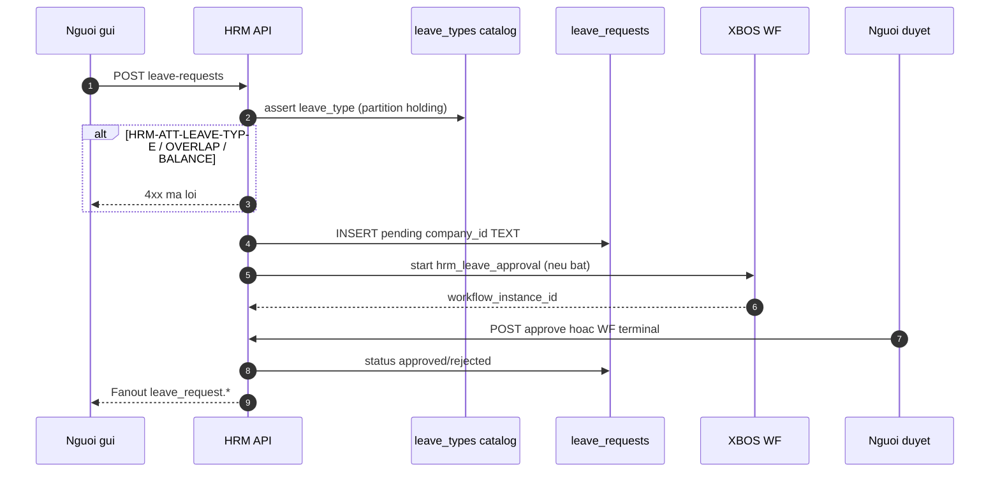

# API_DESIGN — HRM Leave requests · balance · WF bridge

| Field | Value |
|-------|--------|
| **work_item_id** | `SA-U71-HRM-LEAVE-DESIGN-01` |
| **change_mode** | ADD |
| **ref_srs** | `docs/client-delivery/hrm/SRS_HRM_KHACH.md` **FR-HRM-AT-10/12/13** Diễn biến · delta **FR-HRM-AT-WF-01** · team **UC-HRM-10** |
| **ref_techspec** | `docs/hrm/TECHSPEC.md` **§14.5** · **§16.1** · must_keep leave-workflow bridge |
| **ref_db** | `docs/hrm/DB_DESIGN_HRM_LEAVE.md` |
| **Template** | `_vibe-team-os/templates/TECHSPEC_API_CONTRACT.md` (Mục đích · Nghiệp vụ · Bước SRS) |
| **U71** | Physical API slice before Dev/QA claim on leave |
| **Date** | 2026-07-27 |
| **Runtime** | `AttendanceController` · `LeaveRequestsService` · `LeaveBalanceService` · `LeaveWorkflowController` / `LeaveWorkflowBridge` |
| **OpenAPI** | `docs/api/openapi/hrm-api.yaml` → `/attendance/leave-requests*` (thin; codes below are SoT) |

> **must_keep:** `company_id` TEXT slug ladder; catalog assert `HRM-ATT-LEAVE-TYPE`; overlap/balance codes; WF spawn + internal terminal callback.

Prefix: `/api/hrm/attendance`

---

## 1. Endpoint A — Create leave request

### Identity

| Item | Value |
|------|--------|
| Method / path | `POST /api/hrm/attendance/leave-requests` |
| Success | `201` envelope · code **`HRM-LEAVE-201`** |
| Auth | Bearer / internal business access |
| DTO | `CreateLeaveRequestDto` |

### Mục đích

Cho phép NV / HCNS **gửi đơn nghỉ phép** từ màn Chấm công (web) hoặc Mobile: ghi bản ghi `pending`, hiện trên danh sách chờ duyệt, fanout thông báo, và (khi cấu hình) mở việc duyệt XBOS.

### Nghiệp vụ xử lý

1. Auth + validate DTO (`company_id` string ≤64, `employee_id` UUID, dates, `total_days` ≥ 0.5).
2. `start_date > end_date` → **400** `HRM-LEAVE-VAL-DATES`.
3. Persist company: `resolveHrmPersistCompanyIdText` → **TEXT slug** (UUID holding → `holding`).
4. Catalog: `resolveHrmSettingsCatalogCompanyId` + `assertCodeInEffectiveCatalog(leave_types)` — fail → **`HRM-ATT-LEAVE-TYPE`**.
5. Overlap pending/approved cùng NV + khoảng ngày → **409** `HRM-LEAVE-VAL-OVERLAP`.
6. Tracked balance insufficient → **400** `HRM-LEAVE-VAL-BALANCE`; untracked → allow.
7. `INSERT leave_requests` status `pending`; fanout `leave_request.created`.
8. `LeaveWorkflowBridge.startLeaveWorkflowIfConfigured` → set `workflow_instance_id` khi spawn OK.

### Bước SRS

| UC / FR | Diễn biến # | API role |
|---------|-------------|----------|
| **FR-HRM-AT-10** | #1 auth · #3 thiếu field · #4 ngày sai · #5 chồng · #6 hết phép · **#7 gửi thành công** · #9 fanout | **This endpoint** |
| **FR-HRM-AT-WF-01** | #1 gửi · #2 mở việc (side-effect) · #3 thiếu cấu hình | Spawn after insert |
| **UC-HRM-10** | Tạo → fanout `leave_request.created` | Same |

### DTO ↔ DB

| Request field | DB column | Notes |
|---------------|-----------|-------|
| `company_id` | `company_id` TEXT | Normalized slug — never LE UUID as type |
| `employee_id` | `employee_id` | Soft FK |
| `employee_code` / `employee_name` | same | Required display denorm |
| `department` / `position` | same | Optional |
| `leave_type` | `leave_type` | Catalog code only |
| `start_date` / `end_date` | DATE | Wire `yyyy-MM-dd`; UI `dd/MM/yyyy` |
| `total_days` | `total_days` | ≥ 0.5 |
| `reason` | `reason` | Optional |
| `handover_to` / `handover_tasks` | same | Optional |
| `attachment_url` | `attachment_url` | Relative `/api/hrm/files/...` |

### Errors

| Condition | Code | HTTP |
|-----------|------|------|
| Validation DTO | `HRM-ERR-VALIDATION` / pipe | 400 |
| Date order | `HRM-LEAVE-VAL-DATES` | 400 |
| leave_type ∉ catalog | **`HRM-ATT-LEAVE-TYPE`** | 400 |
| Overlap | `HRM-LEAVE-VAL-OVERLAP` | 409 |
| Insufficient balance | `HRM-LEAVE-VAL-BALANCE` | 400 |
| Insert fail | `HRM-LEAVE-500` | 500 |
| Scope / auth | `HRM-ERR-SCOPE-INVALID` / auth | 403/401 |

### FE after 2xx (U65)

Toast gửi OK · row `pending` trên list · F5 còn · Network `HRM-LEAVE-201`.

---

## 2. Endpoint B — List leave requests

### Identity

| Item | Value |
|------|--------|
| Method / path | `GET /api/hrm/attendance/leave-requests` |
| Success | **`HRM-LEAVE-200`** |
| Query | `company_id` (+ filters page/status as implemented) |

### Mục đích

Cấp danh sách đơn nghỉ trong **phạm vi scope ladder** để màn Attendance / Mobile My Leaves / manager queue hiển thị trạng thái và chọn duyệt.

### Nghiệp vụ xử lý

1. `resolveScopeContext` + list scope normalize (`normalizePayrollListCompanyId` / list ladder).
2. `SELECT` from `leave_requests` filtered by scoped `company_id`(s).
3. Empty list = honest empty (not error).
4. Scope parity with create persist slug (holding/`main` rollup rules).

### Bước SRS

| UC / FR | Diễn biến # | API role |
|---------|-------------|----------|
| **FR-HRM-AT-10** | #7 / #10 — đơn trên danh sách sau gửi | Read-back |
| **FR-HRM-AT-12** | #2 mở đơn chờ | List source |
| **UC-HRM-10** | Vòng đời list | Same |
| TechSpec | HRM-AT-11 list alias | Same codes `HRM-LEAVE-200` |

### Response ↔ DB

| Wire | DB | UI |
|------|-----|-----|
| `id`, `company_id`, `employee_*`, `leave_type`, dates, `total_days`, `status`, `reason`, `rejected_reason`, `attachment_url`, `workflow_instance_id`, timestamps | `leave_requests.*` | List/detail; `leave_type` → catalog label |

### Errors

| Condition | Code | HTTP |
|-----------|------|------|
| Auth / scope | auth / `SCOPE_CONTEXT_MISMATCH` | 401/409 |
| Empty | `HRM-LEAVE-200` + `[]` | 200 |

---

## 3. Endpoint C — Approve leave request

### Identity

| Item | Value |
|------|--------|
| Method / path | `POST /api/hrm/attendance/leave-requests/{requestId}/approve` |
| Success | **`HRM-LEAVE-203`** |
| Body | `DecideLeaveRequestDto` — `reviewer_name` (required); optional `reviewer_employee_id` |

### Mục đích

Cho phép quản lý / HCNS **phê duyệt** đơn `pending` trong phạm vi — cập nhật trạng thái đã duyệt + fanout người gửi (và khớp terminal WF khi bridge dùng path này / callback).

### Nghiệp vụ xử lý

1. Load row by id; normalize query/`x-company-id` UUID→slug.
2. `assertResourceInHrmScope` — mismatch → **`HRM-LEAVE-409`**; missing/not pending → **`HRM-LEAVE-404`**.
3. `UPDATE status='approved'`, `reviewed_at`, `reviewed_by`.
4. Fanout `leave_request.approved`.
5. Must not approve when WF terminal path owns decision inconsistently (AT-WF-01: không «ảo» duyệt nếu QT bắt buộc và chưa terminal — policy F4).

### Bước SRS

| UC / FR | Diễn biến # | API role |
|---------|-------------|----------|
| **FR-HRM-AT-12** | #3 trạng thái · #4 phạm vi · **#6 duyệt thành công** · #7 thông báo | **This endpoint** |
| **FR-HRM-AT-WF-01** | #4 duyệt cuối | Direct approve **or** after terminal |
| **UC-HRM-10** | fanout `leave_request.approved` | Same |
| **FR-HRM-MOB-08** | Manager mobile approve | Same API |

### DTO ↔ DB

| Body | DB |
|------|-----|
| `reviewer_name` | `reviewed_by` |
| (optional) `reviewer_employee_id` | `approver_employee_id` |
| — | `status='approved'`, `reviewed_at=NOW()` |

### Errors

| Condition | Code | HTTP |
|-----------|------|------|
| Not found / not pending | `HRM-LEAVE-404` | 404 |
| Scope mismatch | `HRM-LEAVE-409` | 409 |
| Auth | auth codes | 401/403 |

### FE after 2xx

Row → «đã duyệt» · F5 còn · inbox fanout khi bật.

---

## 4. Endpoint D — Reject leave request

### Identity

| Item | Value |
|------|--------|
| Method / path | `POST /api/hrm/attendance/leave-requests/{requestId}/reject` |
| Success | **`HRM-LEAVE-204`** |
| Body | `DecideLeaveRequestDto` — `reviewer_name`; `rejected_reason` per policy |

### Mục đích

Từ chối đơn `pending` kèm lý do — trạng thái `rejected`, không ghi nhận nghỉ như đã duyệt, fanout người gửi.

### Nghiệp vụ xử lý

1. Scope + pending guards (parity approve).
2. `UPDATE status='rejected'`, `rejected_reason`, review fields.
3. Fanout `leave_request.rejected`.
4. Balance: không trừ khi reject (SRS); pending_days policy if tracked — keep service parity.

### Bước SRS

| UC / FR | Diễn biến # | API role |
|---------|-------------|----------|
| **FR-HRM-AT-13** | #3–#5 fail · **#6 xác nhận từ chối** · #7 số dư · #8 thông báo | **This endpoint** |
| **FR-HRM-AT-WF-01** | #5 từ chối | Direct or terminal |
| **UC-HRM-10** | fanout `leave_request.rejected` | Same |

### DTO ↔ DB

| Body | DB |
|------|-----|
| `reviewer_name` | `reviewed_by` |
| `rejected_reason` | `rejected_reason` |
| — | `status='rejected'`, `reviewed_at` |

### Errors

| Condition | Code | HTTP |
|-----------|------|------|
| Not found / not pending | `HRM-LEAVE-404` | 404 |
| Scope | `HRM-LEAVE-409` | 409 |
| Missing reason (when required by config) | validation | 400 |

---

## 5. Endpoint E — Leave balance

### Identity

| Item | Value |
|------|--------|
| Method / path | `GET /api/hrm/attendance/leave-balance` |
| Success | **`HRM-LEAVE-BAL-200`** |
| Query DTO | `GetLeaveBalanceQueryDto` — `company_id`, `employee_id`, optional `leave_type`, `year` |

### Mục đích

Cấp **số dư phép** (entitled / used / pending / remaining) cho chip form tạo đơn và Mobile LeaveBalanceChip — trước hoặc khi gửi đơn (AT-10 #6).

### Nghiệp vụ xử lý

1. Scope resolve; normalize `company_id` TEXT.
2. Read `employee_leave_balances` for `(company, employee, leave_type, year)`.
3. Fallback `custom_fields` / default source when no row (`source` discriminant).
4. Compute `remaining_days` / `available_days` = entitled − used − pending (≥ 0).

### Bước SRS

| UC / FR | Diễn biến # | API role |
|---------|-------------|----------|
| **FR-HRM-AT-10** | #6 hết phép (input cho assert create) · form chip | **This endpoint** (read) |
| **FR-HRM-AT-12** | #2 xem số dư trước duyệt | Supporting read |
| MOB AC-LEAVE-BAL-* | J-MOB-25/28 | Same |

### Response ↔ DB

| Wire | DB / derived |
|------|----------------|
| `company_id`, `employee_id`, `leave_type`, `balance_year` / `year` | row keys |
| `entitled_days`, `used_days`, `pending_days` | columns |
| `remaining_days`, `available_days` | derived |
| `source` | `employee_leave_balances` \| `custom_fields` \| `default` |
| `as_of` | `updated_at` ISO |

### Errors

| Condition | Code | HTTP |
|-----------|------|------|
| Auth / scope | auth / 409 | 401/409 |
| Missing employee | validation | 400 |
| No tracked row | **200** with `source=default` (or custom_fields) — not 404 | 200 |

---

## 6. Endpoint F — WF bridge: resolve manager (internal)

### Identity

| Item | Value |
|------|--------|
| Method / path | `GET /api/hrm/attendance/workflow-resolver/manager` |
| Success | **`HRM-WF-RESOLVE-200`** |
| Auth | **Internal** (`x-internal-api-key` / internal bearer) |
| Query | `employee_id` (required), `company_id` optional |

### Mục đích

Cấp người duyệt **direct_manager** (escalate khi thiếu) cho XBOS workflow-engine khi spawn `hrm_leave_approval` — ADR dynamic resolver F4.

### Nghiệp vụ xử lý

1. Assert internal auth.
2. Expand `company_id` TEXT match set (slug ↔ UUID list) — **never** `employees.company_id::uuid`.
3. Resolve `employees.manager_id` under scope; escalate per BR-CD-F4-*.

### Bước SRS

| UC / FR | Diễn biến # | API role |
|---------|-------------|----------|
| **FR-HRM-AT-WF-01** | #2 mở việc · #3 thiếu cấu hình / resolve | Supporting S2S |
| ADR-WORKFLOW-RESOLVER-DYNAMIC | §5/§9 | SoT resolve |

### Errors

| Condition | Code | HTTP |
|-----------|------|------|
| Unauthorized internal | `HRM-AUTH-001` | 401 |
| Missing `employee_id` | `HRM-VAL-001` | 400 |

---

## 7. Endpoint G — WF bridge: terminal callback (internal)

### Identity

| Item | Value |
|------|--------|
| Method / path | `POST /api/hrm/attendance/leave-workflow/terminal` |
| Success | **`HRM-WF-CALLBACK-200`** |
| Auth | **Internal** only |
| Body | `leaveRequestId`, `terminalStatus` (`completed`\|`rejected`), `reviewerUserId`, optional `workflowInstanceId`, `reviewerName`, `rejectedReason` |

### Mục đích

Nhận quyết định **cuối** từ XBOS WF và cập nhật `leave_requests` khớp approved/rejected + fanout — đóng chuỗi AT-WF-01 (không để đơn pending khi QT đã xong).

### Nghiệp vụ xử lý

1. Internal auth.
2. Load leave by id; ensureSchema cold path.
3. `terminalStatus=completed` → approve semantics; `rejected` → reject + reason.
4. Persist `workflow_instance_id` if provided; fanout events.
5. Missing leave → `HRM-LEAVE-404`.

### Bước SRS

| UC / FR | Diễn biến # | API role |
|---------|-------------|----------|
| **FR-HRM-AT-WF-01** | **#4 duyệt cuối** · **#5 từ chối** · #6 F5 còn | **This endpoint** |
| **FR-HRM-AT-12 / AT-13** | Kết quả trạng thái khớp | Terminal writer |
| Gap note | G-ORPH-03: khách AT-10 body shallow on bridge — **delta FR-HRM-AT-WF-01** is authoritative Diễn biến for this API | Cite delta |

### Body ↔ DB

| Body | DB |
|------|-----|
| `leaveRequestId` | `id` |
| `workflowInstanceId` | `workflow_instance_id` |
| `terminalStatus=completed` | `status='approved'` |
| `terminalStatus=rejected` | `status='rejected'` + `rejected_reason` |
| `reviewerName` / `reviewerUserId` | `reviewed_by` / audit |

### Errors

| Condition | Code | HTTP |
|-----------|------|------|
| Unauthorized | `HRM-AUTH-001` | 401 |
| Missing fields | `HRM-VAL-001` | 400 |
| Leave not found | `HRM-LEAVE-404` | 404 |

---

## 8. Sequence (create → inbox → approve)



---

## 9. Catalog partition rules (create assert — copy Dev)

```text
MUST:
  catalogCompanyId = resolveHrmSettingsCatalogCompanyId(auth, tenantId, body.company_id)
  assert leave_type ∈ effective leave_types @ catalogCompanyId
  persist leave_requests.company_id = resolveHrmPersistCompanyIdText(...)  # TEXT slug

MUST NOT:
  Persist company_id as holding legal-entity UUID type
  Accept free-text leave_type outside catalog
  Cast employees.company_id ::uuid in WF manager resolve
```

---

## 10. QA evidence expectations (U65)

```markdown
### UF-HRM-LEAVE — Tạo → list → duyệt
- Persona: ceo@xe.vn hoặc member CEO · /command-center/hrm/attendance (Leave)
- leave_type từ catalog picker (không hardcode bootstrap)
- Action: Gửi → Network POST leave-requests **HRM-LEAVE-201**
- FE: row pending; F5 còn; company_id slug trên JSON
- Fail cases: type lạ → HRM-ATT-LEAVE-TYPE; chồng → OVERLAP; hết phép tracked → BALANCE
- Approve: POST …/approve → HRM-LEAVE-203 · status approved + F5
- Verdict: 🟢 / 🔴
- spec_ref: DB_DESIGN_HRM_LEAVE · API_DESIGN_HRM_LEAVE · FR-HRM-AT-10/12/13
```

---

## 11. Out of scope

- Settings CRUD for `leave_types` (separate U71 settings design)
- Hard FK migration G-DB-02
- OpenAPI full schema expand (optional Dev sync — codes here SoT)
- Seed leave for PASS (U65)
