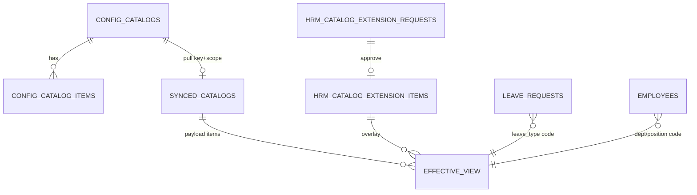

# DB_DESIGN — HRM Settings tenant catalogs (leave / departments / positions)

| Field | Value |
|-------|--------|
| **work_item_id** | `SA-U71-HRM-SETTINGS-CATALOG-DESIGN-01` |
| **change_mode** | ADD · preserve_default |
| **ref_srs** | `docs/hrm/SRS.md` §16.0–16.2 · **FR-HRM-SC-01** · **FR-HRM-SC-POS-01** · **FR-HRM-SC-LEAVE-01** · UC-HRM-06..08 · `docs/client-delivery/hrm/SRS_HRM_KHACH_DELTA_CAI_DAT_20260723.md` §2 · §4 |
| **ref_techspec** | `docs/hrm/TECHSPEC.md` **§11.4** · **§14.8** · **§16.2** (#28–29) · **§18.1** |
| **ref_adr** | `docs/decisions/ADR-HRM-SETTINGS-SOT-REC-WF-COMPANY-20260723.md` **S1** (XBOS SoT) · **S3** (Settings UX on L1/L2a) |
| **ref_xbos** | `docs/xbos/TECHSPEC.md` **FR-XBOS-CAT-02** · **FR-XBOS-CAT-05** · `DANH_MUC_XBOS_CHO_HRM.md` §1–§5 · §3 STT 7–10 · §5 STT 30 |
| **ref_api** | `docs/hrm/API_DESIGN_HRM_SETTINGS_CATALOG.md` |
| **Template** | `_vibe-team-os/templates/TECHSPEC_PHYSICAL_DB_TABLE.md` |
| **U71** | Physical DB slice **before** Dev claim on Settings catalog CRUD/sync |
| **Date** | 2026-07-27 |

> **Invariant (must_keep):** XBOS = SoT khung danh mục tập đoàn. HRM stores **pulled snapshot** + **tenant extension overlay** only. Free-text codes on consumer forms as SoT = **forbidden** (BR-HRM-MD-01).

---

## E1-B APPEND — Settings UI expand + DEC alias (2026-07-28)

| Field | Value |
|-------|--------|
| **work_item_id** | `BA-ERP-E1B-DB-API-01` |
| **Slice SoT** | **`docs/hrm/DB_DESIGN_HRM_SETTINGS_E1B.md`** (normative for ≥10 buckets + `decision_types`↔`hr_decision_types`) |
| **API sibling** | `docs/hrm/API_DESIGN_HRM_SETTINGS_E1B.md` |
| **change_mode** | ADD pointer only — **no** table rewrite · **no** migration |

**Supersedes for E1-B scope:** §2.2 row `decision_types` “cite only” → full alias + expand registry lives in E1-B slice. Base §1–§15 remain SoT for L0/L1/L2a physical tables.

---

## 1. Ownership layers (normative)

```text
L0 XBOS SoT ── publish ──► config_catalogs + config_catalog_items
                              │
                              │ HRM pull / sync-from-xbos
                              ▼
L1 HRM snapshot ──────────► synced_catalogs (payload JSONB items[])
                              │
                              │ mergeEffective (code collision → policy)
                              ▼
L2a HRM extension ────────► hrm_catalog_extension_items (+ requests / removal)
                              │
                              ▼
                    effectiveItems → Settings UI + pickers + leave/employee guards
```

| Layer | Owner service | Tables | Mutate master group codes? |
|-------|---------------|--------|----------------------------|
| **L0** | `xbos-api` config-sync / catalog-governance | `config_catalogs`, `config_catalog_items`, `catalog_audit_logs` | **Yes** (XBOS FE / WF) |
| **L1** | `hrm-api` catalog-sync | `synced_catalogs`, `sync_audit_logs` | **No** — overwrite only via pull |
| **L2a** | `hrm-api` settings-catalogs | `hrm_catalog_extension_items`, `hrm_catalog_extension_requests`, `hrm_catalog_field_removal_requests` | **No** — extension / request only |

**Reject:** HRM as independent SoT that invents group master codes without XBOS (ADR Option S2).

---

## 2. Canonical `catalog_key` (publish / pull keys)

Keys are **TEXT**, normalized `trim().toLowerCase()`, pattern `^[a-z0-9_][a-z0-9_-]{1,62}$`.

### 2.1 P0 tenant catalogs (this slice)

| Business catalog | Canonical `catalog_key` | Aliases accepted (runtime) | DANH_MUC | `ref_srs` |
|------------------|-------------------------|----------------------------|----------|-----------|
| **Loại nghỉ** | **`leave_types`** | — | §5 STT 30 | **FR-HRM-SC-LEAVE-01** · consumer UC-HRM-10 |
| **Phòng ban** | **`departments`** | `department_catalog`, `org_departments` | §3 STT 9 · §2 STT 3 | **FR-HRM-SC-POS-01** |
| **Chức danh / vị trí** | **`job_titles`** | `positions` | §3 STT 7–8 · STT 10 | **FR-HRM-SC-POS-01** · WF `position_template` |

> Runtime constants: `apps/api/hrm-api/.../hrm-settings-master-keys.ts` (`HRM_SC_LEAVE_KEY`, `HRM_SC_POS_KEYS`). Design treats aliases as **same logical catalog family** for merge/picker; XBOS publish **should** use canonical keys above for new publishes.

### 2.2 Related keys (cite only — out of CRUD depth this file)

| Key | FR | Note |
|-----|----|------|
| `decision_types` | FR-HRM-SC-DEC-01 | Same L0→L1→L2a pattern |
| `salary_components` / `payroll_templates` | FR-HRM-SC-PAY-01 | Same pattern |
| `hrm_employee_*_fields` | §11.4 field groups | Extension/import templates — not leave/dept/pos |

### 2.3 XBOS ↔ HRM pull contract key

| Direction | Key identity | Scope partition |
|-----------|--------------|-----------------|
| XBOS publish | `(tenant_id, company_id, catalog_key)` on `config_catalogs` | Holding / member company |
| HRM pull | Same triple → upsert `synced_catalogs` | `resolveHrmSettingsCatalogCompanyId` / `resolveHrmCatalogSyncScope` (`main`→holding UUID/slug rules) |
| Upstream GET | `GET /api/xbos/config-sync/catalog/{catalogKey}?target=hrm&tenantId=&companyId=` | Must match HRM pull scope |

---

## 3. Table — `public.config_catalogs` (XBOS L0 header)

| Item | Value |
|------|--------|
| Schema | `public` |
| Owner | XBOS (`ConfigSyncService`) |
| Role | Header + version/checksum for one catalog_key in tenant×company |

| Column | Type | Null | Meaning (VI) | `ref_srs` |
|--------|------|------|--------------|-----------|
| `id` | BIGSERIAL | NO | Surrogate PK | — |
| `tenant_id` | TEXT | NO | Partition tenant | UC-HRM-06 · FR-XBOS-CAT-* |
| `company_id` | TEXT | NO | Holding / member slug or partition id | FR-HRM-SC-POS-01 Diễn biến #1 |
| `catalog_key` | TEXT | NO | Publish key (`leave_types`, `departments`, `job_titles`, …) | FR-HRM-SC-* |
| `name` | TEXT | NO | Tên danh mục HIỂN THỊ | FR-HRM-SC-01 |
| `domain` | TEXT | NO | Nhóm domain (HR / org / …) | DANH_MUC |
| `assigned_systems` | JSONB | NO | Systems nhận catalog (must include `hrm` for pull) | UC-HRM-06 |
| `version` | INT | NO | Tăng khi publish | UC-HRM-06 |
| `checksum` | TEXT | NO | Integrity of items set | UC-HRM-06 |
| `updated_at` | TIMESTAMPTZ | NO | Last publish | — |

**Constraints**

| Constraint | Purpose |
|------------|---------|
| `UNIQUE (tenant_id, company_id, catalog_key)` | One header per scope×key |
| GIN on `assigned_systems` | Filter catalogs assigned to HRM |

---

## 4. Table — `public.config_catalog_items` (XBOS L0 items)

| Column | Type | Null | Meaning (VI) | Used by leave/dept/pos |
|--------|------|------|--------------|------------------------|
| `id` | BIGSERIAL | NO | Surrogate PK | — |
| `tenant_id` | TEXT | NO | Same as header | Partition |
| `company_id` | TEXT | NO | Same as header | Partition |
| `catalog_key` | TEXT | NO | FK logical → header key | Join key |
| `code` | TEXT | NO | **Mã nghiệp vụ ổn định** (picker value) | leave_type / dept / position code |
| `label` | TEXT | NO | **Nhãn tiếng Việt** | UI / U72 |
| `unit` | TEXT | YES | Metadata (color, entitlement hint, select options) | Optional leave/chart |
| `status` | TEXT | NO | `active` \| `draft` / inactive family | Picker filter |

**Constraints**

| Constraint | Purpose |
|------------|---------|
| `UNIQUE (tenant_id, company_id, catalog_key, code)` | No duplicate codes in scope |
| FK `(tenant_id, company_id, catalog_key)` → `config_catalogs` | Header must exist before items |

**Semantic lock**

| IS | IS NOT |
|----|--------|
| `code` = persist key on `leave_requests.leave_type`, employee dept/position fields | Free-text label as SoT |
| `label` = display VI | Org `entity_type` / LE UUID |

---

## 5. Table — `public.synced_catalogs` (HRM L1 snapshot)

| Column | Type | Null | Meaning (VI) | `ref_srs` |
|--------|------|------|--------------|-----------|
| `id` | BIGSERIAL | NO | Surrogate PK | — |
| `tenant_id` | TEXT | NO | HRM partition | UC-HRM-06 |
| `company_id` | TEXT | NO | Catalog company after scope resolve | FR-HRM-SC-POS-01 #1 |
| `catalog_key` | TEXT | NO | Pull key = XBOS key | FR-HRM-06 / FR-HRM-08 |
| `source_system` | TEXT | NO | Typically `xbos` / `xevn_group` | Trace origin |
| `payload` | JSONB | NO | Snapshot body: `{ key, name, domain, items[{code,label,unit,status}] }` | FR-HRM-SC-01 |
| `version` | INT | NO | Bump on each successful pull | UC-HRM-06 |
| `checksum` | TEXT | NO | Hash of payload | Integrity |
| `synced_at` | TIMESTAMPTZ | NO | Last pull time | Overview “đã đồng bộ” |

**Constraints**

| Constraint | Purpose |
|------------|---------|
| `UNIQUE (tenant_id, company_id, catalog_key)` | One snapshot row per scope×key |

**DDL bootstrap:** env `MASTER_TENANT_ID` / `DEFAULT_TENANT_ID` + company defaults required → else `HRM-SYNC-CONF` (TechSpec § bootstrap). No hardcoded tenant fallback in product path.

### 5.1 `payload.items[]` shape (logical rows)

| JSON field | Maps from XBOS | Consumer bind |
|------------|----------------|---------------|
| `code` | `config_catalog_items.code` | Persist on leave / employee / requisition |
| `label` | `.label` | Picker + list VI |
| `unit` | `.unit` | Optional |
| `status` | `.status` | active filter |

---

## 6. Table — `public.sync_audit_logs` (HRM L1 audit)

| Column | Type | Null | Meaning |
|--------|------|------|---------|
| `id` | BIGSERIAL | NO | PK |
| `catalog_key` | TEXT | NO | Key pulled |
| `source_system` | TEXT | NO | Upstream |
| `action` | TEXT | NO | e.g. pull / status |
| `payload` | JSONB | YES | Optional detail |
| `created_at` | TIMESTAMPTZ | NO | Audit time |

---

## 7. Table — `public.hrm_catalog_extension_items` (HRM L2a overlay)

Tenant **extension** codes that merge into `effectiveItems` (origin `hrm`).

| Column | Type | Null | Meaning (VI) | `ref_srs` |
|--------|------|------|--------------|-----------|
| `id` | BIGSERIAL | NO | PK | — |
| `tenant_id` | TEXT | NO | Partition | FR-HRM-SC-POS-01 |
| `company_id` | TEXT | NO | Company catalog partition | AC-SC-POS-03 |
| `catalog_key` | TEXT | NO | Same keys as §2.1 | FR-HRM-SC-* |
| `code` | TEXT | NO | Extension code | Diễn biến #2 Thêm |
| `label` | TEXT | NO | Nhãn VI | Diễn biến #2 |
| `unit` | TEXT | YES | Metadata | — |
| `status` | TEXT | NO | `active` \| `draft` (ngưng = non-active) | Diễn biến #4 |
| `created_at` | TIMESTAMPTZ | NO | Audit | F5 / AC |

**Constraints:** `UNIQUE (tenant_id, company_id, catalog_key, code)`.

**Policy**

| Rule | Behavior |
|------|----------|
| Soft stop | Prefer `status` inactive/draft over hard DELETE when consumers reference code |
| No silent overwrite of XBOS master | Merge keeps XBOS item when policy forbids HRM override of same `code` (service `mergeEffective`) |
| Group master invent | **Forbidden** without extension-request / XBOS governance (FR-XBOS-CAT-02/05) |

---

## 8. Table — `public.hrm_catalog_extension_requests` (L2a WF bridge)

| Column | Type | Null | Meaning | `ref_srs` |
|--------|------|------|---------|-----------|
| `id` | UUID | NO | PK | FR-HRM-SC-EXT-01 |
| `batch_id` | UUID | NO | Batch of codes | FR-XBOS-CAT-02 |
| `tenant_id` / `company_id` / `catalog_key` | TEXT | NO | Scope | — |
| `code` / `label` / `unit` | TEXT | NO/YES | Proposed item | — |
| `status` | TEXT | NO | `pending` / approved / rejected | FR-XBOS-CAT-05 |
| `workflow_instance_id` | UUID | YES | XBOS WF instance | FR-XBOS-CAT-02 |
| `requested_by_*` / `reviewed_*` | TEXT/TIMESTAMPTZ | YES | Audit | — |
| `created_at` | TIMESTAMPTZ | NO | — | — |

**Indexes:** `(status, created_at DESC)`, `(tenant_id, company_id, catalog_key, status)`, `(batch_id, status)`.

On approve → upsert into `hrm_catalog_extension_items` (or XBOS publish path per product bridge).

---

## 9. Table — `public.hrm_catalog_field_removal_requests`

| Column | Type | Null | Meaning |
|--------|------|------|---------|
| `id` | UUID | NO | PK |
| `tenant_id` / `company_id` / `catalog_key` / `code` | TEXT | NO | Target item |
| `label` / `reason` | TEXT | YES | Request context |
| `requested_by_name` / `requested_by_email` | TEXT | YES | Actor |
| `leadership_emails` | TEXT[] | NO | Notify list |
| `status` | TEXT | NO | `pending` … |
| `reviewed_note` / `reviewed_at` | TEXT / TIMESTAMPTZ | YES | Review |
| `created_at` | TIMESTAMPTZ | NO | — |

---

## 10. Consumer FK / soft references (not catalog tables)

Catalogs are **code dictionaries**. Consumers store **codes**, not hard FK to extension rows (soft referential integrity via assert).

| Consumer table / field | Catalog key | Soft rule | `ref_srs` |
|------------------------|-------------|-----------|-----------|
| `leave_requests.leave_type` | `leave_types` | Must ∈ `effectiveItems` active | FR-HRM-SC-LEAVE-01 Diễn biến #2 · UC-HRM-10 |
| `employee_leave_balances.leave_type` | `leave_types` | Same | FR-HRM-SC-LEAVE-01 #3 |
| Employee / requisition department fields | `departments` (+ aliases) | Picker code only | FR-HRM-SC-POS-01 #5 |
| Employee / requisition / WF position | `job_titles` / `positions` | Picker code only | FR-HRM-SC-POS-01 · position_template |
| `employee_work_timeline.position_key` | `job_titles` / `positions` | Soft assert · snapshot `position` | **E1-A** `DB_DESIGN_HRM_MD_BIND_E1A.md` §3 |
| `hr_decisions.position_key` / `signer_position_key` | `job_titles` / `positions` | Soft assert · type still `decision_types` | E1-A §4 · UC-HRM-27 |
| `job_postings.position_key` · `headcount_proposals.position_key` | `job_titles` / `positions` | Lane B menu bind — **not** FR-RC-01 SoT | E1-A §5–6 |
| `employee_contracts.position_key` / `signer_position_key` | `job_titles` / `positions` | Soft assert | E1-A §7 · FR-CI-01 |

> **DOC-DELTA 2026-07-28 (`BA-ERP-E1A-DB-API-01`):** Consumer soft-refs above APPEND for MD-BIND Layer A. Physical ADD columns + API assert = `docs/hrm/DB_DESIGN_HRM_MD_BIND_E1A.md` · `docs/hrm/API_DESIGN_HRM_MD_BIND_E1A.md`. Naming: timeline/decisions/postings/contracts use **`position_key`** (not `employees.job_title_key`).

**Anti-join:** Never join catalog codes to Plane A `xbos_legal_entity.id` UUID as company catalog partition — use settings `company_id` slug/holding resolve (same ladder as list APIs).

---

## 11. Merge model (effective row)

```text
effectiveItems(catalog_key) =
  merge(
    items from synced_catalogs.payload  → origin 'xbos',
    rows from hrm_catalog_extension_items → origin 'hrm'
  )
```

| Conflict on same `code` | Normative |
|-------------------------|-----------|
| XBOS active + HRM extension | Documented merge in service — **must not** invent second SoT; prefer documented overlay rules in CODE-MEMORY |
| Missing L1 snapshot | Overview empty / «chưa đồng bộ» honest — **no** mock items (FR-HRM-SC-01) |
| Empty effective | Consumer assert → 400 (no free-text fallback) |

---

## 12. ERD (logical)



(`EFFECTIVE_VIEW` = runtime merge, not a physical table.)

---

## 13. Acceptance (DB plane)

| Check | PASS |
|-------|------|
| Unique scope×key on `synced_catalogs` and `config_catalogs` | information_schema / `\d` |
| Unique scope×key×code on items + extension | same |
| Pull writes `leave_types` / `departments` / `job_titles` (or alias) into `synced_catalogs` | SQL after sync |
| Extension INSERT does not require deleting XBOS snapshot | coexistence |
| Seed endpoints exist for bootstrap only — **not** U65 evidence | ADR + U65 |

---

## 14. Out of scope

- Full XBOS catalog-governance inbox schema depth → `SA-U71-XBOS-CATALOG-GOV-DESIGN-01`
- Job templates JD library table (FR-HRM-SC-JT-01) as separate physical design
- `employee_leave_balances` column matrix → `SA-U71-HRM-LEAVE-DESIGN-01`
- Path bootstrap `docs/tech-spec/` → `SA-U71-PATH-CONVENTION-01`

---

## 15. must_keep / forbidden

| must_keep | forbidden |
|-----------|-----------|
| XBOS L0 SoT for group master | HRM fork inventing group master codes |
| Soft code refs on consumers | Free-text SoT for leave_type / dept / position |
| Honest empty when unsynced | Fake mock catalog rows for UAT |
| Alias keys documented | Treating `entity_type` / LE UUID as catalog_key |
