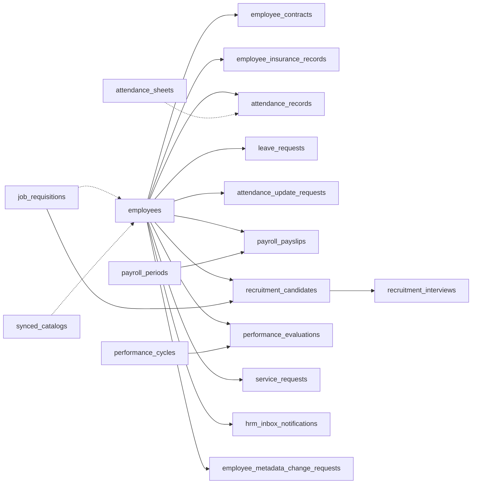

# HRM — Data linkage ↔ SRS khách FR ↔ TechSpec §14/§16

**work_item_id:** `BA-HRM-DATA-LINKAGE-TRACE-01`  
**Owner:** BA-Data · **lane:** governance  
**Status:** COMPLETE (docs ADD) · **ack:** PASS_TO_PM  
**change_mode:** ADD-only · **cấm:** `apps/**` · seed · Phase1 DONE · wipe matrix fidelity  

| Artifact | Path / version |
|----------|----------------|
| Khách SoT | `docs/client-delivery/hrm/SRS_HRM_KHACH.md` **v3.0-W2c** — **44** FR |
| Team annex | `docs/hrm/SRS.md` §15 INT/SCOPE · UC-HRM-* · **must_keep** AC-ATT-SHEET-01..06 |
| TechSpec | `docs/hrm/TECHSPEC.md` **§14** (W1) + **§16** (W2a/b/c) |
| Menu density | `docs/hrm/HRM_MENU_DATA_LINKAGE_MATRIX.md` (G-FID) |
| Cardinality | `docs/hrm/HRM_SEED_CARDINALITY_RULES.md` |
| Journeys | `docs/program/PROGRAM_JOURNEY_MAP.md` J-HRM-* / J-HRM-INT-* |

**Purpose:** Normative **entity → FK → ref_srs → API → journey** map for the HRM spine so Dev/QA/TM can close TechSpec §16.9 gaps without inventing new SoT.

---

## 1. Spine domain map (entities & FK)

| Entity (table) | Parent FK | Same-`company_id` slug required | Catalog / soft ref |
|----------------|-----------|----------------------------------|--------------------|
| `employees` | — (master) | partition key | `job_titles`, field catalogs |
| `employee_contracts` | `employee_id → employees.id` | **YES** (BR-INT-02 / FR-HRM-INT-02) | `contract_types` |
| `employee_insurance_records` | `employee_id → employees.id` | **YES** | BHXH / insurer codes |
| `attendance_sheets` | company + period | sheet header (no roster auto) | — |
| `attendance_records` | `employee_id → employees.id` | **YES** | `shifts` |
| `leave_requests` | `employee_id → employees.id` | **YES** (G-AT10-01 CLOSED — TEXT/slug) | `leave_types` |
| `attendance_update_requests` | `employee_id` (+ record ref) | **YES** | — |
| `payroll_periods` | company slug | period SoT | templates |
| `payroll_payslips` | `employee_id` + `period_id` | **YES** (FR-HRM-INT-03) | salary components |
| `job_requisitions` | company slug | — | channels / grades |
| `recruitment_candidates` | optional `requisition_id`; hire → `employee_id` | company partition | — |
| `recruitment_interviews` | candidate (+ requisition) | company | — |
| `performance_cycles` | company | — | `kpi_library` |
| `performance_evaluations` | `employee_id` + cycle | **YES** | kpi |
| `service_requests` | `employee_id` **optional** | if set → same company | `operations_request_types` |
| `hrm_inbox_notifications` | `employee_id` in payload | fanout scope | — |
| `synced_catalogs` | tenant + company | XBOS SoT | catalogKey |
| `employee_metadata_change_requests` | `employee_id` | **YES** | field catalogs |

**Orphan rule (BR-LINK-02 / VAL-FK-01):** any child with non-null `employee_id` MUST resolve to `employees.id` with **same** `company_id` text slug; else FAIL fidelity / reject mutate.

---

## 2. Scope parity contract (U19)

| Surface | List semantics | Get-by-id / deep link | FAIL class |
|---------|----------------|----------------------|------------|
| Group CEO `company_id=main` | Rollup `GROUP_MEMBER_SLUGS` via `resolveHrmListScope` | **Same** rollup / `companyScopeMatches` | `scope_parity` if list id → detail **404** |
| Member CEO | Exact member slug | Exact member slug | Cross-company row = FAIL |
| OU filter (SCOPE-03) | Query/header company override | Must match list filter | J-HRM-INT-05 |

**ref_srs:** khách §3.21–3.23 FR-HRM-SCOPE-01..03 · team SRS §15.1–15.2 · TechSpec §16.2 · ADR group-CEO main/holding.

**Standing gap:** TechSpec **G-SCOPE-01** — regression `hrm-list-scope` + persona probes mỗi wave đụng list/detail.

---

## 3. Entity ↔ ref_srs matrix (44 FR)

> Columns: **ref_srs** = khách FR + § · **TechSpec** = §14.x / §16.x · **Team UC** · **Primary table** · **FK spine** · **J-* / menu** · **SA status** (from TechSpec; not product DONE).

### 3.1 W1 spine — TechSpec §14 (8 FR)

| # | ref_srs (khách) | TechSpec | Team UC | Table(s) | FK / linkage | Journey / menu | SA |
|---|-----------------|----------|---------|----------|--------------|----------------|-----|
| 1 | §3.1 **FR-HRM-EM-01** | §14.1 | UC-HRM-21 | `employees` | master `(company_id, employee_code)` unique | J-HRM-02 · employees | PARTIAL |
| 2 | §3.2 **FR-HRM-CI-01** | §14.2 | UC-HRM-25 | `employee_contracts` | `employee_id → employees` | J-HRM-01/03 · contracts | PARTIAL |
| 3 | §3.3 **FR-HRM-CI-02** | §14.3 | UC-HRM-25 | `employee_insurance_records` | `employee_id → employees` | J-HRM-04 · insurance | ALIGNED |
| 4 | §3.4 **FR-HRM-AT-14** | §14.4 · §12.1 | UC-HRM-23/32 | `attendance_sheets` (+ records GET) | sheet header; records FK employee | **J-HRM-06b** | ALIGNED **must_keep AC** |
| 5 | §3.5 **FR-HRM-AT-10** | §14.5 | UC-HRM-10 | `leave_requests` | `employee_id` | attendance / mobile leave | PARTIAL |
| 6 | §3.6 **FR-HRM-PR-05** | §14.6 | UC-HRM-24/28 | `payroll_payslips` | `employee_id` + period | J-HRM-07 · payroll | ALIGNED |
| 7 | §3.7 **FR-HRM-RC-01** | §14.7 | UC-HRM-22 | `job_requisitions` | company; `headcount ≥1` | J-HRM-05 · recruitment | PARTIAL — **G-RC-01 VERIFY CLOSED** 2026-07-22 |
| 8 | §3.8 **FR-HRM-SC-01** | §14.8 | UC-HRM-06..08 | `synced_catalogs` / settings snapshot | no employee FK | settings | ALIGNED |

### 3.2 W2a — TechSpec §16.1 (12 FR)

| # | ref_srs | TechSpec | Team UC | Table(s) | FK / linkage | Journey / menu | SA |
|---|---------|----------|---------|----------|--------------|----------------|-----|
| 9 | §3.9 **FR-HRM-AT-01** | §16.1 | UC-HRM-32 | `attendance_records` | `employee_id` | J-HRM-06 | ALIGNED |
| 10 | §3.10 **FR-HRM-AT-02** | §16.1 | UC-HRM-23/32 | `attendance_records` | list/get parity | J-HRM-06 / 06b | ALIGNED |
| 11 | §3.11 **FR-HRM-AT-03** | §16.1 | AT-03 | `attendance_records` | status mutate same row | attendance | ALIGNED |
| 12 | §3.12 **FR-HRM-09** | §16.1 | UC-HRM-09 | `attendance_update_requests` | employee + fanout inbox | attendance | ALIGNED |
| 13 | §3.13 **FR-HRM-AT-12** | §16.1 | UC-HRM-10 | `leave_requests` | approve → terminal WF | leave | ALIGNED |
| 14 | §3.14 **FR-HRM-AT-13** | §16.1 | UC-HRM-10 | `leave_requests` | reject | leave | ALIGNED |
| 15 | §3.15 **FR-HRM-PR-01** | §16.1 | UC-HRM-24 | `payroll_periods` | company slug | payroll | ALIGNED |
| 16 | §3.16 **FR-HRM-PR-03** | §16.1 | UC-HRM-24 | `payroll_payslips` gen | period → payslips / employee | J-HRM-07 | PARTIAL |
| 17 | §3.17 **FR-HRM-PR-04** | §16.1 | UC-HRM-24 | `payroll_periods` | close | payroll | ALIGNED |
| 18 | §3.18 **FR-HRM-RC-03** | §16.1 | UC-HRM-22 | candidates pool | optional `requisition_id` | J-HRM-05 | ALIGNED |
| 19 | §3.19 **FR-HRM-RC-05** | §16.1 | UC-HRM-22 | interviews | → candidate | J-HRM-05 | ALIGNED |
| 20 | §3.20 **FR-HRM-PF-01** | §16.1 | HRM-PF-01 | `performance_cycles` | company | performance | ALIGNED |

### 3.3 W2b — TechSpec §16.2 (12 FR)

| # | ref_srs | TechSpec | Team UC | Table / store | FK / linkage | Journey / menu | SA |
|---|---------|----------|---------|---------------|--------------|----------------|-----|
| 21 | §3.21 **FR-HRM-SCOPE-01** | §16.2 | SCOPE-01 | multi-company lists | rollup parity | embed OU | ALIGNED |
| 22 | §3.22 **FR-HRM-SCOPE-02** | §16.2 | SCOPE-02 | member partition | exact slug | member portal | ALIGNED |
| 23 | §3.23 **FR-HRM-SCOPE-03** | §16.2 | SCOPE-03 | FE filter → API | query company | **J-HRM-INT-05** | ALIGNED |
| 24 | §3.24 **FR-HRM-02** | §16.2 | UC-HRM-02 | admin/membership | — | platform admin | ALIGNED |
| 25 | §3.25 **FR-HRM-03** | §16.2 | UC-HRM-03 | company admin | — | admin | ALIGNED |
| 26 | §3.26 **FR-HRM-04** | §16.2 | UC-HRM-04 | invite → employee link | invite batch | admin | ALIGNED |
| 27 | §3.27 **FR-HRM-05** | §16.2 | UC-HRM-05 | credentials | sensitive | admin | ALIGNED |
| 28 | §3.28 **FR-HRM-06** | §16.2 | UC-HRM-06 | `synced_catalogs` | XBOS→HRM | settings | ALIGNED |
| 29 | §3.29 **FR-HRM-08** | §16.2 | UC-HRM-08 | catalog list | snapshot | settings | ALIGNED |
| 30 | §3.30 **FR-HRM-12** | §16.2 | UC-HRM-12 | `hrm_inbox_notifications` | `employee_id` payload | inbox | ALIGNED |
| 31 | §3.31 **FR-HRM-MD-01** | §16.2 | HRM-MD-01 | metadata change requests | `employee_id` | UC-HRM-26 | ALIGNED |
| 32 | §3.32 **FR-HRM-IM-01** | §16.2 | HRM-IM-01 | import preview | no commit | import | PARTIAL |

### 3.4 W2c — TechSpec §16.3 (12 FR) — cross-link spine

| # | ref_srs | TechSpec | Team UC | Persistence / link | FK rule | Journey | SA |
|---|---------|----------|---------|-------------------|---------|---------|-----|
| 33 | §3.33 **FR-HRM-INT-01** | §16.3 | INT-01 | requisition/candidate → `employees` | hire ⇒ `employee_id` NOT NULL | **J-HRM-INT-01** | PARTIAL |
| 34 | §3.34 **FR-HRM-INT-02** | §16.3 | INT-02 | `employee_contracts` | FK + same company slug | J-HRM-01 | ALIGNED |
| 35 | §3.35 **FR-HRM-INT-03** | §16.3 | INT-03 | `payroll_payslips` | FK + period company | J-HRM-07 | ALIGNED |
| 36 | §3.36 **FR-HRM-INT-04** | §16.3 | INT-04 | cross-module one `employee_id` | list→detail parity | **J-HRM-INT-04** | PARTIAL |
| 37 | §3.37 **FR-HRM-11** | §16.3 | UC-HRM-11 | `service_requests` | optional `employee_id` | internal_services | ALIGNED |
| 38 | §3.38 **FR-HRM-20** | §16.3 | UC-HRM-20 | dashboard aggregates | derived counts | dashboard | PARTIAL |
| 39 | §3.39 **FR-HRM-21** | §16.3 | UC-HRM-21 | `employees` | master list embed | J-HRM-02 | ALIGNED |
| 40 | §3.40 **FR-HRM-23** | §16.3 | UC-HRM-23 | records/sheets | inherits AT-14 AC | J-HRM-06/06b | ALIGNED |
| 41 | §3.41 **FR-HRM-MOB-01** | §16.3 | MOB-01 | JWT / membership | session → employee | mobile login | ALIGNED |
| 42 | §3.42 **FR-HRM-MOB-04** | §16.3 | MOB-04 | `attendance_records` | self `employee_id` | mobile check-in | ALIGNED |
| 43 | §3.43 **FR-HRM-MOB-06** | §16.3 | MOB-06 | leave / update_requests | self | mobile leave | ALIGNED |
| 44 | §3.44 **FR-HRM-MOB-08** | §16.3 | MOB-08 | `leave_requests` | manager approve | mobile manager | ALIGNED |

**Coverage check:** 8+12+12+12 = **44** = khách body · TechSpec §16.0 · **≠** 119/120 UC inventory (out of scope claim).

---

## 4. Validation matrix (data integrity)

| VAL ID | Condition | Rule | Expected outcome | Error / evidence |
|--------|-----------|------|------------------|------------------|
| **VAL-FK-01** | Child `employee_id` set | EXISTS employee same `company_id` | Mutate OK | 400/404; SQL orphan = 0 |
| **VAL-FK-02** | Contract create | INT-02: FK + slug match | `HRM-CON-201` + row | Reject cross-company |
| **VAL-FK-03** | Payslip row | INT-03: employee ∈ period company | List shows NV | Orphan FAIL FID |
| **VAL-FK-04** | Hire success | INT-01: `employee_id` NOT NULL on filled path | Linked NV | G-INT-01 open |
| **VAL-FK-05** | Candidate `requisition_id` | Requisition exists same company | 201 | Dangling FAIL FID |
| **VAL-FK-06** | Sheet POST | Header-only; **no** auto roster | Empty records 200 OK | AC-ATT-SHEET |
| **VAL-FK-07** | Leave mutate | `company_id` text/slug parity with persist helper | Approve/reject OK | **G-AT10-01 CLOSED** |
| **VAL-SC-01** | List then get-by-id | Same `resolveHrmListScope` | 200 or in-scope 404 | **G-SCOPE-01** / `scope_parity` |
| **VAL-SC-02** | Member JWT | No group rollup rows | 403/409 out-of-scope | SCOPE-02 |
| **VAL-CAT-01** | Type/key fields | Code ∈ synced catalog (or honest missing badge) | Display OK | BR-LINK-03 |
| **VAL-DEN-01** | Fidelity gate | CARD-* / AC-FID ratios | `verify:hrm:menu-density` | Menu matrix §5 |
| **VAL-EMP-HC** | Reports vs list | `active_count` ≠ `total` BY-DESIGN | BR-DQ-HEADCOUNT-01 | DQ rules |

---

## 5. Lifecycle & illegal transitions (spine)

| Entity | Legal transitions (summary) | Invalid → outcome |
|--------|----------------------------|-------------------|
| `employees` | create → active/inactive → archive | Duplicate code → `HRM-EMP-DUPLICATE` |
| `employee_contracts` | draft/active → expired/terminated | Orphan employee → reject; end_date rules **G-CI-01 CLOSED** |
| `leave_requests` | pending → approved \| rejected | Overlap/balance → deterministic reject **G-AT10-02** |
| `attendance_update_requests` | create → approve/reject + inbox | Wrong company → 409 |
| `payroll_periods` | create → process → close | Process without payslip visibility → **G-PR-03** |
| `job_requisitions` | open/(draft gap) → filled / closed | Hire without `employee_id` → **G-INT-01** FAIL AC |
| `attendance_sheets` | create header → list → open grid | Auto-seed records on POST → **cấm**; storm GET → FAIL AC-04/06 |

---

## 6. Envelope / error expectations (consumer)

| Class | HTTP | Typical codes | FE must |
|-------|------|---------------|---------|
| Scope mismatch | 409 | `SCOPE_CONTEXT_MISMATCH` / HRM scope codes | Banner recoverable; **not** empty-as-OK |
| Validation | 400 | `HRM-*-VAL*` / Nest ValidationPipe | Field messages |
| Not found in scope | 404 | module envelopes | Deep-link honesty |
| Auth | 401 | `HRM-AUTH-*` | Re-login |
| Success create | 201 | `HRM-EMP-201`, `HRM-CON-201`, `HRM-LEAVE-201`, `HRM-REC-201`, `HRM-AS-201`, … | Row + F5 (U65) |
| Success list empty | 200 | `HRM-*-200` + `[]`/`total:0` | Live-empty copy; **no mock** |

---

## 7. Traceability — requirement → API → DB → FE → test

| BRD/SRS (khách) | API (primary) | DB | FE surface | Test / journey |
|-----------------|---------------|-----|------------|----------------|
| FR-HRM-EM-01 | `POST/GET /employees` | `employees` | Employees list/create | J-HRM-02 · UF employees |
| FR-HRM-CI-01/02 · INT-02 | `/contracts-insurance/*` | contracts + insurance | Contracts / Insurance tabs | J-HRM-01/03/04 |
| FR-HRM-AT-14 · 23 | `/attendance/attendance-sheets` + `/records` | sheets + records | Attendance sheet UX | **J-HRM-06b** · AC-ATT-SHEET |
| FR-HRM-AT-10/12/13 · MOB-06/08 | `/attendance/leave-requests` | `leave_requests` | Leave web/mobile | UF leave · MOB |
| FR-HRM-PR-01/03/04/05 · INT-03 | `/payroll/periods` · `/payslips` | periods + payslips | Payroll | J-HRM-07 |
| FR-HRM-RC-01/03/05 · INT-01 | `/recruitment/*` | requisitions / candidates / interviews | Recruitment | J-HRM-05 · J-HRM-INT-01 |
| FR-HRM-INT-04 | multi | one `employee_id` | cross-tab | **J-HRM-INT-04** L2.5 |
| FR-HRM-SCOPE-* | all lists | slug partition | OU filter | J-HRM-INT-05 · persona |
| FR-HRM-SC-01 · 06 · 08 | settings-catalogs / catalog-sync | `synced_catalogs` | Settings | AC-FID-10 |
| FR-HRM-12 · 09 · 11 | inbox + fanout sources | notifications + SR/leave/update | Inbox | UC-HRM-12 |

---

## 8. Gap register (data-facing) — from TechSpec §16.9

| Pri | Gap | Entity impact | Owner | Exit (data AC) |
|-----|-----|---------------|-------|----------------|
| ~~P0 VERIFY~~ **CLOSED** | G-RC-01 | `job_requisitions.headcount` | qc | CLOSED 2026-07-22 — `qc-hrm-g-rc-01-u65-01-20260722.md` |
| ~~P0/P1~~ **CLOSED** | G-AT10-01 | `leave_requests.company_id` type | `qa` U65 | CLOSED 2026-07-22 BE — slug/TEXT + approve normalize; evidence `be-hrm-g-at10-01-20260722.md` |
| P0 standing | G-SCOPE-01 | all list/detail | be+qa | VAL-SC-01 green |
| ~~P1~~ **CLOSED** | G-CI-01 | `employee_contracts.end_date` | be | Optional by type — CLOSED 2026-07-22 `be-hrm-g-ci-01-20260722.md` |
| P1 | G-EM-01 | `employees.employee_code` | be | Optional / allocate |
| P1 | G-AT10-02 | leave overlap/balance | be+qa | Deterministic reject codes |
| P1 | G-AT01-01 | `attendance_records` unique day | be | Conflict code |
| P1 | G-PR-03 | process → payslips | be+fe | Payslip visible PR-05 |
| P1 | G-INT-01 | hire → `employee_id` | be+qa | VAL-FK-04 + J-HRM-INT-01 |
| P1 | G-INT-04 | cross-module spine | qa | J-HRM-INT-04 L2.5 |
| Info | G-IM-01 / G-MOB-LEFT | import commit / leftover MOB FR | ba-docs optional | Non-goal W2c |

**Stale note vs older menu matrix:** R-FID-01 «no GET insurance» — TechSpec §14.3 now lists `GET …/insurance` **ALIGNED**; treat R-FID-01 as **superseded for list existence** — residual = density AC-FID-04 / UI bind only.

---

## 9. Data quality risks

| Risk | Impact | Mitigation |
|------|--------|------------|
| Leave `company_id` UUID DTO vs slug persist | Approve path 400/409 under member slug | **CLOSED** G-AT10-01 2026-07-22 |
| Hire without employee attach | INT-01 / INT-04 journeys FAIL | G-INT-01 + WF terminal AC |
| Scope list≠detail | User sees row then 404 | G-SCOPE-01 standing tests |
| Fidelity density ≠ SRS 44 FR | Confuse seed gate with FR DONE | Keep G-FID matrix separate; U65 FE for FR |
| Catalog drift | Labels wrong / Khác join | XBOS publish→pull; BR-DQ-01 |

---

## 10. Handoff

| Field | Value |
|-------|-------|
| `completion_report` | Published entity FK map + 44-FR `ref_srs` matrix + VAL-* + scope_parity; linked menu matrix §11 |
| `next_owner` | `pm` → dispatch `qa` G-RC-01 U65 and/or `dev-be` G-AT10-01 |
| `evidence_path` | `docs/qa/evidence/ba-hrm-data-linkage-trace-01-20260721.md` |
| `ack_status` | **PASS_TO_PM** |

---

*Document version: 2026-07-21 · BA-Data · BA-HRM-DATA-LINKAGE-TRACE-01*
