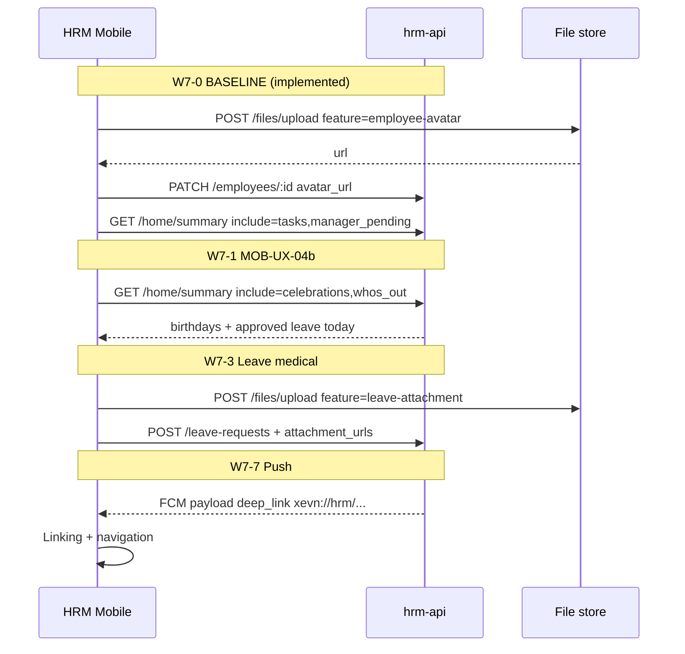

# TechSpec Mobile — Delta W7 (U51)

**work_item_id:** `PCOMP-W7-BA-SRS-01`  
**from_role:** ba-process  
**to_role:** pm → sa → dev-*  
**ack_status:** `PASS_TO_PM`  
**Ngày:** 2026-06-07  
**Baseline:** `docs/hrm/TECHSPEC_MOBILE.md` v1.0  
**SRS pair:** `docs/hrm/MOBILE_W7_SRS_DELTA.md`  
**Gap sources:** `docs/program/MOBILE_WEB_PROFILE_AVATAR_GAP_AUDIT.md` · `docs/program/MOBILE_HOME_HUB_AC_DELTA.md` · `docs/program/MOBILE_W7_GAP_ORCHESTRATION.md`

---

## 1. Mục tiêu kỹ thuật delta

Chuẩn hóa contract API, component mobile, upload flows, scope policy và NFR cho wave **P1-MOBILE-W7**. Mọi thay đổi trong `apps/mobile/hrm-mobile` và `apps/api/hrm-api` **phải** cite mục tương ứng trong file này (U51 gate).

---

## 2. Kiến trúc tổng quan W7



---

## 3. API contracts

### 3.1 BASELINE — Avatar upload + PATCH (W7-0 / PROFILE-AVATAR-01)

#### `POST /api/hrm/files/upload`

| Param (query) | Type | Required | Mô tả |
|---------------|------|----------|-------|
| `feature` | string | Y | `employee-avatar` |
| `company_id` | UUID/slug | Y | Scope write — `resolveHrmWriteHeaderId` |

| Header | Required |
|--------|----------|
| `Authorization` | Y |
| `x-company-id` | Y (write path) |
| `x-tenant-id` | N |
| `x-request-id` | Khuyến nghị UUID |

**Body:** `multipart/form-data` field `file`

**Response 201**

```json
{
  "success": true,
  "code": "HRM-FILE-201",
  "data": {
    "url": "/api/hrm/files/{company_slug}/{filename}",
    "company_id": "holding"
  }
}
```

**Errors**

| HTTP | Code | Khi |
|------|------|-----|
| 400 | `HRM-FILE-400` | Thiếu file / company_id |
| 401 | `HRM-AUTH-001` | Unauthorized |
| 409 | `HRM-ERR-SCOPE-INVALID` | company_id lệch scope |
| 413 | `HRM-FILE-413` | Vượt size server (nếu có) |

**Implementation:** `catalog-extensions.controller.ts` L336+

---

#### `PATCH /api/hrm/employees/:id`

**Body (self-service):**

```json
{ "avatar_url": "/api/hrm/files/holding/abc.jpg" }
```

**Body (xóa ảnh):**

```json
{ "avatar_url": null }
```

**Policy (server):** `employee-update-policy.ts`

```typescript
const SELF_PATCH_FIELDS = ['avatar_url'] as const;
// canFullEmployeeUpdate → hr_manager, group_ceo, ...
```

**Response 202:** `HRM-EMP-202`

**Errors**

| HTTP | Code | Khi |
|------|------|-----|
| 403 | `HRM-EMP-403` | Self PATCH field khác `avatar_url` hoặc `:id` ≠ JWT `employee_id` |
| 404 | `HRM-EMP-404` | Employee không tồn tại |
| 409 | `HRM-ERR-SCOPE-INVALID` | Scope |

**List/GET:** `EmployeeRow` **phải** trả `avatar_url: string | null` trên `GET /employees/:id` và list rows.

---

#### Mobile integration map

| Module | Path | Vai trò |
|--------|------|---------|
| `hrmFileUpload.ts` | `uploadHrmAvatarFile` | Multipart + validate MIME/size |
| `hrmEmployees.ts` | `patchEmployeeAvatarUrl` | PATCH body |
| `resolveHrmAvatarUrl.ts` | `resolveHrmAvatarUrl`, `withAvatarCacheBust` | Image source |
| `AvatarUploadField.tsx` | UI 96pt + overlay | ProfileScreen |
| `ProfileScreen.tsx` | Orchestrate upload → PATCH → reload | UC-HRM-MOB-12 ext |

**Client validation constants:**

```typescript
AVATAR_MAX_BYTES = 5 * 1024 * 1024;
AVATAR_ALLOWED_MIME = Set(['image/jpeg', 'image/png', 'image/webp']);
```

---

### 3.2 BASELINE — Leave request metadata hydration (W7-0)

| Function | File | Order |
|----------|------|-------|
| `resolveEmployeeMetaFromMemberships` | `hrmEmployees.ts` | 1 — sync từ JWT |
| `fetchEmployeeById` | `hrmEmployees.ts` | 2 — GET `/:id` then list scan |
| `mergeEmployeeRequestMeta` | `hrmEmployees.ts` | 3 — API wins |
| `hydrateEmployeeMetaForRequest` | `hrmEmployees.ts` | Wrapper async |

**Consumers:** `CreateLeaveRequestScreen.tsx`, `CreateUpdateRequestScreen.tsx`

**POST payload fields (required for submit):**

```json
{
  "company_id": "uuid",
  "employee_id": "uuid",
  "employee_code": "NV0001",
  "employee_name": "Nguyễn Văn A",
  "department": "optional",
  "leave_type": "annual",
  "start_date": "2026-06-07",
  "end_date": "2026-06-07",
  "total_days": 1
}
```

**Không** thay đổi contract POST — chỉ đảm bảo client hydration trước submit.

---

### 3.3 BASELINE — `GET /api/hrm/home/summary` (MOB-UX-04a)

**Controller:** `home.controller.ts` — `@Controller('home')` → full path `/api/hrm/home/summary`

**Query DTO:** `GetHomeSummaryQueryDto`

| Field | Type | Required |
|-------|------|----------|
| `company_id` | string ≤64 | Y |
| `employee_id` | UUID | Y |
| `include` | CSV ≤128 | N — default `tasks,manager_pending` |

**Include tokens:**

| Token | 04a | 04b (W7-1) |
|-------|-----|------------|
| `tasks` | ✅ | ✅ |
| `manager_pending` | ✅ (if manager) | ✅ |
| `celebrations` | stub `[]` | ✅ populate |
| `whos_out` | stub `[]` | ✅ populate |

**Response type:** `home-summary.types.ts` → `HomeSummaryData`

**Sub-builders (04a implemented):**

| Method | Source APIs |
|--------|-------------|
| `buildTasks` | inbox + own leave/update pending |
| `buildManagerPending` | leave/update pending `manager_employee_id` |
| `buildAttendanceToday` | attendance records today |
| `loadViewer` | `employees` + `is_birthday_today` |

**Errors:** `HRM-AUTH-001`, `HRM-HOME-404`, `HRM-ERR-SCOPE-INVALID`, `HRM-ERR-VALIDATION`

**Mobile 04a:** Option A compose **hoặc** consume aggregate — evidence `pcomp-w4-mob-ux-04a` dùng compose; W7-1 khuyến nghị chuyển sang aggregate cho 04b.

---

### 3.4 PLANNED — `home/summary` celebrations + whos_out (MOB-UX-04b / W7-1)

#### `celebrations` population

**Query logic (server):**

```sql
-- Pseudocode: employees in scope WHERE
--   status = 'active'
--   AND archived_at IS NULL
--   AND to_char((custom_fields->>'date_of_birth')::date, 'MM-DD') = :today_mm_dd
-- Timezone for :today_mm_dd: Asia/Ho_Chi_Minh
```

**Item shape (extend `home-summary.types.ts`):**

```typescript
type HomeCelebrationItem = {
  employee_id: string;
  display_name: string;
  month_day: string;      // "06-07" — BR-BDAY-02
  display_date: string;   // "07/06" VN
  avatar_url: string | null;
  avatar_initials: string; // fallback 1-2 chars
  // birth_year: FORBIDDEN
};
```

**Optional dedicated endpoint (alternative):**

```
GET /api/hrm/employees/celebrations?company_id={}&on_date={YYYY-MM-DD}
```

→ Trả cùng item shape; `home/summary` gọi nội bộ.

---

#### `whos_out` population

**Query logic:**

```sql
-- leave_requests WHERE status = 'approved'
--   AND company_id in scope
--   AND :today BETWEEN start_date AND end_date
```

**Preferred query param (new):**

```
GET /api/hrm/attendance/leave-requests?company_id&status=approved&covering_date=2026-06-07
```

**Item shape:**

```typescript
type HomeWhosOutItem = {
  employee_id: string;
  display_name: string;
  leave_type: string;
  leave_request_id: string;
  avatar_url: string | null;
};
```

**Scope:** `resolveHrmListScope` on all queries — same resolver as `GET /employees` list.

---

### 3.5 PLANNED — Leave medical attachment (W7-3)

#### Upload

```
POST /api/hrm/files/upload?feature=leave-attachment&company_id={uuid}
```

| Constraint | Value |
|------------|-------|
| MIME | `image/jpeg`, `image/png`, `image/webp`, `application/pdf` |
| Max size | 10 MB |
| Max files per request | 1 (client loops) |

#### Extend `POST /api/hrm/attendance/leave-requests`

**Body addition:**

```json
{
  "attachment_urls": [
    "/api/hrm/files/holding/med-001.pdf"
  ]
}
```

**Storage:** `leave_requests.custom_fields.attachment_urls` (JSON array) **hoặc** bảng `leave_request_attachments` (SA decision).

**GET detail:** Trả `attachment_urls` cho owner + manager trong scope.

---

### 3.6 PLANNED — Leave balance (W7-4)

```
GET /api/hrm/attendance/leave-balance
```

| Query | Type | Required |
|-------|------|----------|
| `company_id` | string | Y |
| `employee_id` | UUID | Y |
| `leave_type` | string | N — default `annual` |
| `year` | number | N — default calendar year HCM |

**Response 200**

```json
{
  "success": true,
  "code": "HRM-ATT-BAL-200",
  "data": {
    "employee_id": "uuid",
    "leave_type": "annual",
    "year": 2026,
    "entitled_days": 12,
    "used_days": 3,
    "pending_days": 1,
    "remaining_days": 8
  }
}
```

**Computation:** `entitled_days` từ policy/seed; `used_days` = sum approved days in year; `pending_days` = sum pending.

**Errors:** `HRM-ERR-SCOPE-INVALID`, `HRM-ATT-BAL-404` (no policy)

**Mobile:** `integrations/hrmLeaveBalance.ts` + chip on `CreateLeaveRequestScreen` step 0.

---

### 3.7 PLANNED — Employee directory (W7-5)

```
GET /api/hrm/employees/directory
```

| Query | Type | Default |
|-------|------|---------|
| `company_id` | string | required |
| `q` | string | optional search (name, code) |
| `page` | number | 1 |
| `page_size` | number | 30 (max 50) |
| `status` | string | `active` |

**Response 200:** `HRM-EMP-DIR-200`

```json
{
  "success": true,
  "code": "HRM-EMP-DIR-200",
  "data": {
    "items": [
      {
        "id": "uuid",
        "employee_code": "NV0001",
        "full_name": "Nguyễn Văn A",
        "job_title_key": "developer",
        "department": "IT",
        "avatar_url": null,
        "work_phone": "+84..."
      }
    ],
    "page": 1,
    "page_size": 30,
    "total": 120
  }
}
```

**Scope:** `resolveHrmListScope` + `pushWorkforceEmployeeScopeFilter` — parity với list employees.

**Alternative (Phase 1 thin):** Reuse `GET /employees` với `fields=summary` query — document trong OpenAPI nếu không tạo route mới.

---

### 3.8 PLANNED — Push payload + deep link (W7-7)

#### Token registration (existing)

```
POST /api/hrm/notifications/push-tokens
```

```json
{
  "company_id": "uuid",
  "employee_id": "uuid",
  "platform": "android|ios",
  "token": "ExponentPushToken[...]"
}
```

**Gate:** `EXPO_PUBLIC_ENABLE_PUSH_REGISTRATION` — default dev only (`pushRegistration.ts`).

#### Outbound push envelope (BE extension)

```json
{
  "to": "ExponentPushToken[...]",
  "title": "Đơn nghỉ mới",
  "body": "Trần B — 01/07–03/07",
  "data": {
    "deep_link": "xevn://hrm/leave/{leave_request_id}",
    "event_type": "leave_request.created",
    "company_id": "uuid"
  }
}
```

#### Mobile deep link registry

| URI pattern | Navigator screen | Params |
|-------------|------------------|--------|
| `xevn://hrm/leave/:id` | `LeaveRequestDetail` | `{ id }` |
| `xevn://hrm/approvals` | `ManagerApprovals` | — |
| `xevn://hrm/update/:id` | `UpdateRequestDetail` | `{ id }` |
| `xevn://hrm/inbox` | `InAppNotifications` | — |
| `xevn://hrm/profile` | `Profile` | — |

**New modules:**

```
src/navigation/deepLink.ts       — parse + map URI → route
src/integrations/pushDeepLink.ts — notification response handler
App.tsx                          — Linking config + cold start
```

**Expo config (`app.json` / `app.config.ts`):**

```json
{
  "expo": {
    "scheme": "xevn",
    "android": { "intentFilters": [...] },
    "ios": { "associatedDomains": [] }
  }
}
```

---

## 4. Mobile components (W7)

### 4.1 BASELINE (implemented)

| Component | Path | UC |
|-----------|------|-----|
| `AvatarUploadField` | `components/ui/AvatarUploadField.tsx` | MOB-12 ext |
| `ProfileScreen` | `features/profile/ProfileScreen.tsx` | MOB-12 ext |
| Smart Hub sections | `features/dashboard/DashboardScreen.tsx` + `utils/dashboardHub.ts` | MOB-03 04a |
| `LeaveHeroCard` | uses `resolveHrmAvatarUrl` | MOB-12 display |

### 4.2 PLANNED (W7-1..W7-7)

| Component | Wave | Mô tả |
|-----------|------|-------|
| `CelebrationStrip` | W7-1 | Horizontal avatar list; hide if count=0 |
| `BirthdayBanner` | W7-1 | Confetti optional 04c; text only P1 |
| `WhosOutCard` | W7-1 | List + tap → LeaveRequestDetail |
| `homeSummaryClient.ts` | W7-1 | `fetchHomeSummary(include)` wrapper |
| `AttachmentPicker` | W7-3 | PDF/image picker; progress per file |
| `LeaveBalanceChip` | W7-4 | Wizard step 0 + optional Home chip |
| `EmployeeDirectoryScreen` | W7-5 | Search + pagination FlatList |
| `EmployeeDirectoryDetailScreen` | W5-5 | Read-only profile lite |
| `DynamicProfileForm` | W7-6 | Catalog-driven fields |
| `usePushDeepLink` | W7-7 | Hook: listener + pending queue |

---

## 5. Upload flows

### 5.1 Avatar (BASELINE — sequence)

```text
1. User taps AvatarUploadField
2. expo-image-picker → { uri, mimeType, fileName, byteSize }
3. validateAvatarUpload() — client
4. POST /files/upload?feature=employee-avatar&company_id={writeScopeId}
5. PATCH /employees/{selfId} { avatar_url: data.url }
6. setAvatarUrl(withAvatarCacheBust(resolveHrmAvatarUrl(...)))
7. On PATCH fail after upload: show error; optional DELETE file backlog (P2)
```

### 5.2 Leave medical (PLANNED)

```text
1. leave_type triggers requiresAttachment(leaveType) === true
2. User adds 1..3 files via AttachmentPicker
3. For each: POST /files/upload?feature=leave-attachment
4. Collect urls[] — disable submit until required count met
5. POST /leave-requests { ...existing, attachment_urls: urls }
6. Detail screen: Linking.openURL(resolveHrmFileUrl(url)) read-only
```

### 5.3 Error recovery

| Scenario | Client behavior |
|----------|-----------------|
| Upload OK, PATCH fail | Keep local preview; retry PATCH; show `HRM-EMP-403` message |
| Upload fail mid multi-file | Allow remove failed item; retry single file |
| Offline | `useOfflineWriteGuard` — block write; `HRM-MOB-ERR-OFFLINE` |

---

## 6. Scope policy

Mọi endpoint W7 **bắt buộc** cùng stack scope với list employees:

| Layer | Function | File |
|-------|----------|------|
| HTTP ingress | `resolveScopeContext` | `scope-context.ts` |
| List/query | `resolveHrmListScope` | `hrm-list-scope.ts` |
| Row assert | `assertResourceInHrmScope` | `hrm-list-scope.ts` |
| Write header | `resolveHrmWriteHeaderId` | mobile `hrmApiClient.ts` |
| Self PATCH | `assertEmployeeUpdateAllowed` | `employee-update-policy.ts` |

**Parity checklist (SA/Dev-BE):**

- [ ] `GET /home/summary` viewer employee ∈ scope
- [ ] `celebrations` query dùng cùng filter workforce như `GET /employees`
- [ ] `whos_out` leave rows ∈ company scope
- [ ] `directory` ≡ list employees field projection
- [ ] `leave-balance` chỉ viewer self hoặc HR role
- [ ] Attachment download assert leave request ∈ scope

**Group CEO `company_id=main`:** Rollup theo ADR scope ladder — không leak member slug ngoài `companyIds` resolver.

---

## 7. NFR (W7)

| ID | Mục tiêu | Đo | Wave |
|----|----------|-----|------|
| NFR-W7-01 | Home summary latency | P95 ≤ 800ms aggregate (04b include full) | W7-1 |
| NFR-W7-02 | Dashboard parallel calls | ≤4 concurrent HTTP (compose fallback) | 04a |
| NFR-W7-03 | Avatar upload | P95 ≤ 3s on 2MB JPEG pilot LTE | W7-0 |
| NFR-W7-04 | Directory search debounce | 300ms; cancel stale request | W7-5 |
| NFR-W7-05 | Deep link cold start | Tap → target screen ≤ 2s after auth | W7-7 |
| NFR-W7-06 | Privacy | No `birth_year` in hub JSON logs | W7-1 |
| NFR-W7-07 | TZ | `Asia/Ho_Chi_Minh` for today calculations | W7-1 |
| NFR-W7-08 | File size | Avatar 5MB; attachment 10MB — enforced client+server | W7-0/3 |

**Observability:** Mọi request giữ `x-request-id`; log `feature` on upload (`employee-avatar`, `leave-attachment`).

**Security:**

- Không log token / file bytes
- Attachment URLs require auth cookie/header on download
- Push `deep_link` ids validated server-side before navigate (client re-fetch detail)

---

## 8. Kiểm thử kỹ thuật

| Loại | Path / command | Wave |
|------|----------------|------|
| Unit BE | `home.service.spec.ts` — celebrations/whos_out | W7-1 |
| Unit BE | `employee-update-policy.spec.ts` — self avatar | W7-0 ✅ |
| Unit mobile | `resolveHrmAvatarUrl.test.ts`, `hrmEmployees.test.ts` | W7-0 ✅ |
| Unit mobile | `dashboardHub.test.ts`, `homeSummaryClient.test.ts` | W7-1 |
| Unit mobile | `deepLink.test.ts` | W7-7 |
| Integration | `qc:fe-be-health` + mobile pilot account | all |
| Device L2.5 | J-MOB-08/09, J-AVT-01..03 | QA-Device |

---

## 9. Biến môi trường bổ sung

| Biến | Layer | Mô tả |
|------|-------|-------|
| `EXPO_PUBLIC_ENABLE_PUSH_REGISTRATION` | mobile | `true` bật push token register |
| `EXPO_PUBLIC_EAS_PROJECT_ID` | mobile | Expo push project UUID |
| `FIREBASE_SERVICE_ACCOUNT_JSON` | hrm-api | FCM send (W7-7) |
| `EXPO_ACCESS_TOKEN` | hrm-api | Expo push API |
| `HRM_LEAVE_ATTACHMENT_MAX_MB` | hrm-api | Default 10 |
| `HRM_AVATAR_MAX_MB` | hrm-api | Default 5 — align client |

---

## 10. Lộ trình triển khai kỹ thuật (W7)

| Step | Owner | Deliverable | Gate |
|------|-------|-------------|------|
| 1 | BA | SRS + TechSpec delta (file này) | U51 ✅ |
| 2 | SA | Skim + ADR nếu cần | PASS_TO_PM |
| 3 | Dev-BE | `home/summary` 04b populate | `home.service.spec` |
| 4 | Dev-Mobile | Wire 04b UI + `homeSummaryClient` | vitest |
| 5 | QA-Device | J-MOB-08/09 | evidence |
| 6 | Dev-BE→Mobile | leave-balance, directory, attachments | per wave |
| 7 | DevOps | FCM credentials pilot | W7-7 |
| 8 | QC | W7 gate GO/GWC | `docs/qa/evidence/qc-pcomp-w7-*` |

---

## 11. Definition of Done — Tech (W7 per wave)

- [ ] Contract khớp envelope `success` / `code` / `data` (`docs/hrm/TECHSPEC.md`)
- [ ] Scope tests: 409 on cross-tenant probe
- [ ] Mobile mapper lỗi → `HRM-MOB-ERR-*` hoặc `HRM-ERR-*` user-facing Vietnamese
- [ ] Không secret trong source
- [ ] Spec section cited trong bus `DISPATCHED` entry
- [ ] QA evidence path ghi rõ Option A compose vs `home/summary` aggregate

---

## 12. Completion contract

```yaml
completion_report: |
  Closed: W7 TechSpec delta — API contracts for avatar upload/PATCH (baseline), leave meta hydration,
  home/summary 04a+04b extensions, planned leave attachment/balance/directory/push deep link;
  mobile component map, upload sequences, scope policy parity checklist, NFR-W7-01..08, test matrix.
  Residual: SA ADR for attachment table vs JSONB; OpenAPI sync; implement 04b+ planned endpoints.

next_owner: sa

next_dispatch_prompt: |
  work_item_id: PCOMP-W7-SA-SKIM-01
  Dispatch sa: Skim docs/hrm/MOBILE_W7_TECHSPEC_DELTA.md §3.4–3.8 — confirm scope parity checklist §6,
  decide leave attachment storage (custom_fields vs join table), approve directory route vs employees reuse.
  Exit: arch note in docs/architecture/ or PASS comment on bus; PASS_TO_PM within 0.5d.
  PM then dispatch dev-be PCOMP-W7-BE-04b-01 per SRS delta §4.1 + TechSpec §3.4 (celebrations + whos_out).

evidence_path: docs/hrm/MOBILE_W7_TECHSPEC_DELTA.md
ack_status: PASS_TO_PM
```
