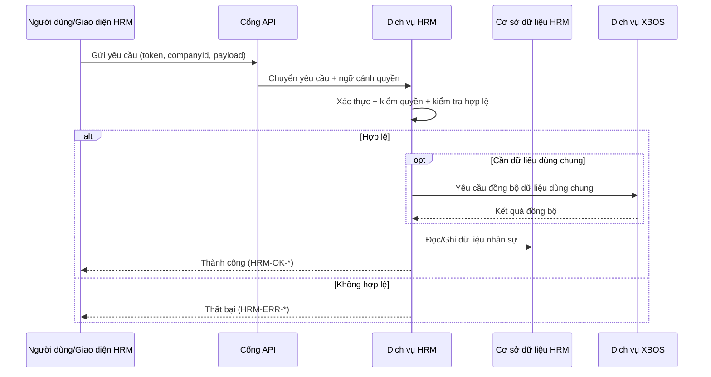
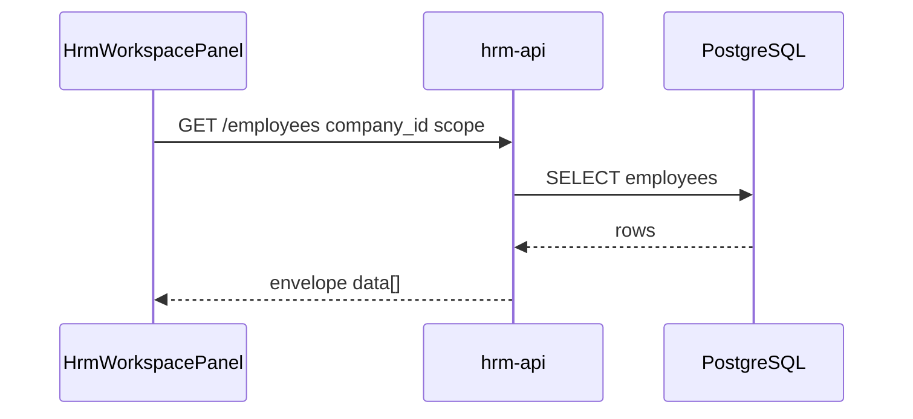
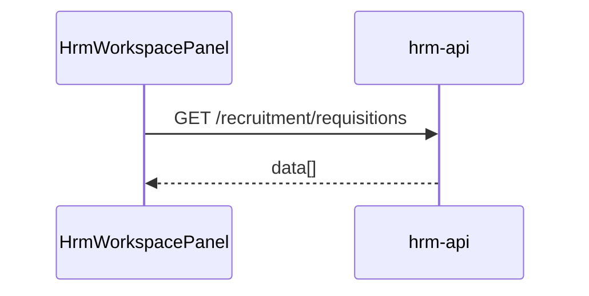
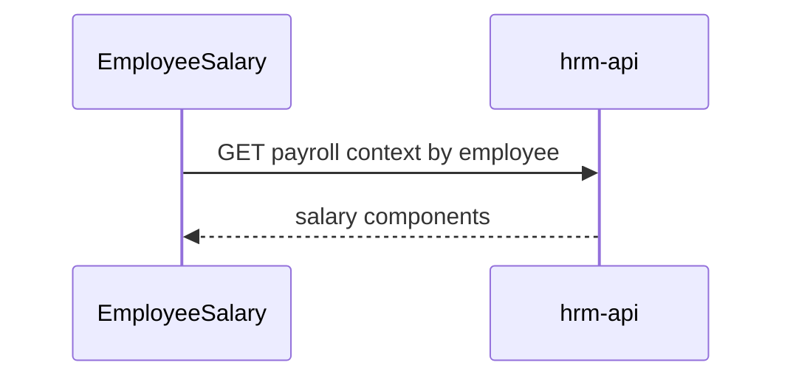

# SRS Phân Hệ HRM

## 1. Mục Đích

Đặc tả yêu cầu phần mềm cho HRM theo mức triển khai, bảo đảm:

- đồng nhất hoàn toàn với BRD HRM **2.3**,
- phản ánh thực tế HRM là một phân hệ nghiệp vụ trong hệ sinh thái,
- sử dụng thuật ngữ Việt hóa đầy đủ,
- đặc tả rõ nhánh điều kiện if/else, kiểm tra hợp lệ, thành công/thất bại, mã lỗi.

### 1.1 Tham chiếu bắt buộc — phạm vi dữ liệu toàn hệ

### 1.0 Quy tắc giao hàng (bắt buộc)

SRS là **nguồn đặc tả** cho kiểm thử và triển khai: mọi thay đổi hành vi API/UI phải **cập nhật SRS (và BRD/TechSpec liên quan) trước hoặc cùng commit** với code; không code “trước rồi mới bổ sung tài liệu sau” ngoại trừ hotfix có ghi rõ trong PR.

## 2. Danh Sách Use Case Chuẩn

| Mã use case | Tên | Điểm vào API chính |
|---|---|---|
| UC-HRM-01 | Kiểm tra trạng thái dịch vụ | `GET /api/hrm` |
| UC-HRM-02 | Tạo quản trị nền tảng | `POST /api/hrm/admin/platform-admin` |
| UC-HRM-03 | Tạo/cập nhật quản trị doanh nghiệp | `POST|PATCH /api/hrm/admin/company-admin` |
| UC-HRM-04 | Mời nhân viên hàng loạt | `POST /api/hrm/admin/invite-employees` |
| UC-HRM-05 | Cập nhật thông tin nhạy cảm tài khoản | `POST /api/hrm/admin/reset-user-password` |
| UC-HRM-06 | Đồng bộ dữ liệu dùng chung từ XBOS | `POST /api/hrm/catalog-sync/pull` |
| UC-HRM-07 | Lấy dữ liệu dùng chung theo khóa | `GET /api/hrm/catalog-sync/catalog/:catalogKey?target=...` |
| UC-HRM-08 | Liệt kê dữ liệu dùng chung theo phân hệ đích | `GET /api/hrm/catalog-sync/catalogs?target=...` |
| UC-HRM-09 | Vòng đời đơn chỉnh sửa chấm công + thông báo | `POST/GET/PATCH/DELETE /api/hrm/attendance/update-requests...`; sau ghi DB: fanout `attendance_update_request.*` |
| UC-HRM-10 | Vòng đời đơn nghỉ phép + thông báo | `POST/GET /api/hrm/attendance/leave-requests`, `POST .../:id/approve|reject`; fanout `leave_request.*` |
| UC-HRM-11 | Vòng đời yêu cầu dịch vụ + thông báo | `POST|GET|... /api/hrm/operations/service-requests...`; fanout `service_request.*` |
| UC-HRM-12 | Đọc hộp thư thông báo | `GET /api/hrm/notifications/inbox?company_id=&employee_id=`; `PATCH .../inbox/:id/read` |

## 3. Luồng Nghiệp Vụ Tổng Quát (Sequence)

## 4. Đặc Tả Use Case Chi Tiết

### UC-HRM-01 - Kiểm tra trạng thái dịch vụ

- If dịch vụ sẵn sàng -> `HRM-OK-HEALTH`.
- Else -> `HRM-ERR-SERVICE-UNAVAILABLE`.

### UC-HRM-02 - Tạo quản trị nền tảng

- If người gọi không có quyền nền tảng -> `HRM-ERR-FORBIDDEN`.
- Else if payload thiếu trường bắt buộc -> `HRM-ERR-VALIDATION`.
- Else if tài khoản đã tồn tại ở vai trò này -> `HRM-ERR-CONFLICT`.
- Else -> tạo thành công.

### UC-HRM-03 - Tạo/Cập Nhật quản trị doanh nghiệp

- If phạm vi công ty không hợp lệ -> `HRM-ERR-SCOPE-INVALID`.
- Else if dữ liệu định danh không hợp lệ -> `HRM-ERR-VALIDATION`.
- Else if tạo mới và chưa tồn tại -> tạo thành công.
- Else if cập nhật và đã tồn tại -> cập nhật thành công.
- Else -> `HRM-ERR-ADMIN-NOT-FOUND`.

### UC-HRM-04 - Mời nhân viên hàng loạt

- If danh sách rỗng -> `HRM-ERR-VALIDATION`.
- Else xử lý từng bản ghi:
  - If bản ghi hợp lệ -> tạo lời mời thành công.
  - Else -> gán lỗi cho bản ghi đó.
- If có bản ghi lỗi -> không dừng toàn bộ lô, vẫn trả kết quả theo từng bản ghi.

### UC-HRM-05 - Cập nhật thông tin nhạy cảm tài khoản

- If không đủ quyền nhạy cảm -> `HRM-ERR-FORBIDDEN`.
- Else if tài khoản không tồn tại -> `HRM-ERR-USER-NOT-FOUND`.
- Else if dữ liệu mới vi phạm chính sách -> `HRM-ERR-VALIDATION`.
- Else -> cập nhật thành công và ghi nhật ký.

### UC-HRM-06 - Đồng bộ dữ liệu dùng chung từ XBOS

- If thiếu khóa danh mục hoặc phân hệ đích -> `HRM-ERR-VALIDATION`.
- Else gọi XBOS:
  - If XBOS trả lỗi -> `HRM-ERR-DONG-BO-DANH-MUC`.
  - Else -> cập nhật ảnh chụp dữ liệu dùng chung tại HRM.

### UC-HRM-07 - Lấy dữ liệu dùng chung theo khóa

- If không có dữ liệu theo khóa -> `HRM-ERR-DANH-MUC-KHONG-TON-TAI`.
- Else if sai quyền/phạm vi -> `HRM-ERR-FORBIDDEN`.
- Else -> trả dữ liệu thành công.

### UC-HRM-08 - Liệt kê dữ liệu dùng chung theo phân hệ đích

- If phân hệ đích không hợp lệ -> `HRM-ERR-TARGET-INVALID`.
- Else -> trả danh sách theo điều kiện lọc.

### UC-HRM-09 — Vòng đời đơn chỉnh sửa chấm công + thông báo

- If thiếu quyền nghiệp vụ hoặc sai `company_id` UUID -> `HRM-ERR-FORBIDDEN` / `HRM-ERR-VALIDATION` theo nhánh.
- Else khi tạo đơn thành công -> ghi DB + fanout sự kiện `attendance_update_request.created` (Socket.IO + `hrm_inbox_notifications` broadcast theo công ty + webhook + push theo cấu hình).
- Else khi duyệt/từ chối -> cập nhật DB + fanout `attendance_update_request.approved|rejected` (một bản ghi broadcast + một bản ghi có `recipient_employee_id` = người gửi nếu có UUID nhân viên).

### UC-HRM-10 — Vòng đời đơn nghỉ phép + thông báo

- If validation DTO thất bại -> `HRM-ERR-VALIDATION`.
- Else khi tạo đơn -> fanout `leave_request.created` theo cùng pipeline UC-HRM-09.
- Else khi duyệt/từ chối -> fanout `leave_request.approved|rejected`; body quyết định dùng `reviewer_name` (và tuỳ chọn `reviewer_employee_id`).

### UC-HRM-11 — Vòng đời yêu cầu dịch vụ + thông báo

- If tạo/duyệt/từ chối hợp lệ -> cập nhật `service_requests` + fanout `service_request.created|approved|rejected` (cùng pipeline; nếu `employee_id` NULL thì không tạo bản ghi inbox đích danh cho nhân viên khi quyết định, vẫn có broadcast công ty).

### UC-HRM-12 — Đọc hộp thư thông báo

- If thiếu `company_id` / `employee_id` UUID hợp lệ -> `HRM-ERR-VALIDATION`.
- Else -> trả danh sách `hrm_inbox_notifications` mà `recipient_employee_id IS NULL` (broadcast công ty) **hoặc** bằng `employee_id` người xem (tin cá nhân).

## 5. Ma Trận Kiểm Tra Hợp Lệ Dữ Liệu

| Thành phần | Quy tắc | Mã lỗi |
|---|---|---|
| `token` | hợp lệ, chưa hết hạn | `HRM-ERR-AUTH-INVALID` |
| `role` | đúng vai trò yêu cầu | `HRM-ERR-FORBIDDEN` |
| `tenantId/companyId` | đúng phạm vi của người gọi | `HRM-ERR-SCOPE-INVALID` |
| `email` | đúng định dạng, không rỗng | `HRM-ERR-VALIDATION` |
| `inviteItems[]` | tối thiểu 1 bản ghi, kiểm tra từng bản ghi | `HRM-ERR-BATCH-ITEM-INVALID` |
| `catalogKey/target` | đúng quy tắc đồng bộ từ XBOS | `HRM-ERR-DONG-BO-DANH-MUC` |

## 6. Danh Mục Mã Lỗi Chuẩn

| Mã lỗi | HTTP | Ý nghĩa |
|---|---|---|
| `HRM-ERR-AUTH-INVALID` | 401 | Token không hợp lệ/hết hạn |
| `HRM-ERR-FORBIDDEN` | 403 | Không đủ quyền thao tác |
| `HRM-ERR-SCOPE-INVALID` | 403 | Sai phạm vi tenant/công ty |
| `HRM-ERR-VALIDATION` | 400 | Dữ liệu đầu vào không hợp lệ |
| `HRM-ERR-CONFLICT` | 409 | Xung đột dữ liệu đã tồn tại |
| `HRM-ERR-ADMIN-NOT-FOUND` | 404 | Không tìm thấy quản trị doanh nghiệp |
| `HRM-ERR-USER-NOT-FOUND` | 404 | Không tìm thấy tài khoản người dùng |
| `HRM-ERR-BATCH-ITEM-INVALID` | 400 | Có bản ghi trong lô không hợp lệ |
| `HRM-ERR-DONG-BO-DANH-MUC` | 502 | Lỗi đồng bộ dữ liệu dùng chung |
| `HRM-ERR-DANH-MUC-KHONG-TON-TAI` | 404 | Không có dữ liệu dùng chung theo khóa |
| `HRM-ERR-TARGET-INVALID` | 400 | Phân hệ đích không hợp lệ |
| `HRM-ERR-SERVICE-UNAVAILABLE` | 503 | Dịch vụ tạm không sẵn sàng |

## 7. Danh Mục Mã Thành Công

| Mã thành công | HTTP | Use case |
|---|---|---|
| `HRM-OK-HEALTH` | 200 | UC-HRM-01 |
| `HRM-OK-PLATFORM-ADMIN-CREATED` | 201 | UC-HRM-02 |
| `HRM-OK-COMPANY-ADMIN-SAVED` | 200/201 | UC-HRM-03 |
| `HRM-OK-BATCH-PROCESSED` | 200 | UC-HRM-04 |
| `HRM-OK-USER-SENSITIVE-UPDATED` | 200 | UC-HRM-05 |
| `HRM-OK-DONG-BO-DANH-MUC` | 200 | UC-HRM-06 |
| `HRM-OK-DANH-MUC-GET` | 200 | UC-HRM-07 |
| `HRM-OK-DANH-MUC-LIST` | 200 | UC-HRM-08 |

## 8. Quy Tắc Xử Lý Lô (UC-HRM-04)

- Mỗi bản ghi phải có `status`, `code`, `message`.
- Bản ghi lỗi không hoàn tác bản ghi thành công.
- Kết quả bắt buộc có:
  - `totalItems`,
  - `successCount`,
  - `failedCount`,
  - `itemResults[]`.

## 9. Yêu Cầu Phi Chức Năng

- Bảo mật: bắt buộc xác thực, kiểm quyền, kiểm tra phạm vi.
- Độ tin cậy: nhánh lỗi không tạo thay đổi trạng thái ngoài ý định.
- Hiệu năng: xử lý lô và truy vấn danh sách đáp ứng ổn định.
- Khả năng vận hành: nhật ký có mã tương quan giao dịch, không lộ dữ liệu nhạy cảm.

## 10. Tiêu Chí Chấp Nhận

- Use case UC-HRM-01..12 có kịch bản thành công/thất bại rõ ràng theo phạm vi đã triển khai.
- Mã lỗi và HTTP status đúng bảng chuẩn tại mục 6.
- Nội dung use case đồng nhất với BRD HRM **2.3** và thuật ngữ Việt hóa.

## 11. Import NS & Document Vault (họp 2026-05)

| Nhóm cột (20–30) | Validation | Ghi chú |
|---|---|---|
| Mã NV, Họ tên, CCCD, ngày sinh | Bắt buộc | Map `employees` |
| Công ty, phòng, chức danh | FK XBOS catalog | Không duplicate org tree HRM |
| Ảnh hồ sơ | URL hợp lệ | Không upload binary trong Excel |
| `workflow_code` | Optional | Metadata change → definition XBOS |

**Bảng:** `employee_document_versions` (PostgreSQL / `hrm-api`): `employee_id`, `folder_path`, `file_url`, `version`, `uploaded_by`, `uploaded_at`.

## 12. Tài Liệu Kèm Theo — Ứng Dụng Di Động HRM

- BRD mobile: `docs/hrm/BRD_MOBILE.md`
- SRS mobile: `docs/hrm/SRS_MOBILE.md` (use case `UC-HRM-MOB-*`, mã lỗi client bổ sung)
- TechSpec mobile: `docs/hrm/TECHSPEC_MOBILE.md`

## 13. Portal embed — Command Center (`HrmWorkspacePanel`)

**Hai surface HRM:** (1) **Embed** — `apps/web/web-portal` route `/command-center/hrm/:view`; (2) **Vận hành** — `apps/web/hrm` app đầy đủ. Catalog `settings-catalogs` là nguồn sự thật chung; cấu hình tại Command Center menu `company_group_hr`.

| Mã | Tên | API chính |
|---|---|---|
| UC-HRM-20 | Embed — Tổng quan HRM | `GET /api/hrm/employees`, `GET /api/hrm/payroll/payslips` |
| UC-HRM-21 | Embed — Danh sách nhân sự | `GET /api/hrm/employees` |
| UC-HRM-22 | Embed — Tuyển dụng | `GET /api/hrm/recruitment/requisitions` |
| UC-HRM-23 | Embed — Chấm công | `GET /api/hrm/attendance/records` |
| UC-HRM-24 | Embed — Lương | `GET /api/hrm/payroll/payslips` |
| UC-HRM-25 | Embed — Hợp đồng / BHXH | `GET /api/hrm/contracts-insurance/contracts` |
| UC-HRM-26 | Embed — Hàng chờ metadata | `GET /api/hrm/employee-metadata/change-requests` |
| UC-HRM-27 | Embed — Quyết định / Báo cáo | Chưa có API (BRD backlog) |

### UC-HRM-21 — Embed: danh sách nhân sự

**Purpose:** HCNS/CEO xem danh sách NV theo phạm vi tenant từ Command Center.

**Usecases:** Happy: API trả danh sách → bảng. Alternate: rỗng → empty state. Exception: 401 → đăng nhập; 5xx → banner (BR-MOCK-02).

**Activity Diagram:**

**Business Logic:** BR-SCOPE-01; không hiển thị mock khi BR-MOCK-01; map `employee_code`, `full_name`, `status`.

**Data Interaction:**

| Field | Nguồn | Validation |
|-------|--------|------------|
| `x-tenant-id` | GlobalFilter / member unit | Required |
| `x-company-id` | `MEMBER_DEFAULT_COMPANY_ID` | Required |
| `company_id` query | Scope resolver | UUID/slug |

**Acceptance:** Không còn `mockEmployees` khi API 200; empty state có hướng dẫn.

### UC-HRM-22 — Embed: tuyển dụng

**Purpose:** Xem TT tuyển dụng (requisitions) theo công ty.

**Usecases:** Happy: list requisitions. Alternate: empty. Exception: API fail → banner, không mock im lặng (BR-MOCK-02).

**Activity Diagram:**

**Business Logic:** Map `title` → cột Chiến dịch; `status` hiển thị tiếng Việt.

**Data Interaction:** `GET /api/hrm/recruitment/requisitions?company_id=`; headers `x-tenant-id`, `x-internal-api-key`.

### UC-HRM-23 — Embed: chấm công

**Purpose:** Xem bản ghi chấm công theo kỳ/tenant.

**Usecases:** Happy / empty / error như UC-HRM-22.

**Activity:** `GET /api/hrm/attendance/records?company_id=`.

**Business Logic:** Hiển thị `attendance_date`, `employee_id`, `status`; không aggregate mock period.

**Data Interaction:** Bảng `attendance_records` (BE).

### UC-HRM-24 — Embed: lương

**Purpose:** Xem payslip / kỳ lương tóm tắt trên cockpit.

**Activity:** `GET /api/hrm/payroll/payslips?company_id=`.

**Business Logic:** Fallback mock chỉ dev; production: empty hoặc API.

### UC-HRM-25 — Embed: hợp đồng và BHXH

**Purpose:** Danh sách HĐ lao động (tab contracts + insurance dùng chung nguồn).

**Activity:** `GET /api/hrm/contracts-insurance/contracts?company_id=`.

### UC-HRM-26 — Embed: duyệt metadata

**Purpose:** Duyệt yêu cầu đổi field hồ sơ sau khi sync catalog từ Command Center.

**Activity:** `GET .../change-requests`; `POST .../approve|reject`.

**Phụ thuộc:** UC-CC-02 (catalog sync), `company_group_hr`.

### UC-HRM-27 — Embed: quyết định / báo cáo (backlog)

**Purpose:** QSĐ nhân sự, báo cáo tổng hợp.

**Business Logic:** Hiện mock — chờ BRD module `decisions` / `reports`.

**Acceptance:** Ghi backlog REQ; không claim DONE.

## 14. Ứng dụng HRM native — bổ sung mock → API

| Mã | Tên | API chính |
|---|---|---|
| UC-HRM-28 | App — Cơ cấu lương NV | `GET/POST payroll/*` (theo BE hiện có) |
| UC-HRM-29 | App — Lịch sử công việc NV | `GET /employees/:id` + payload |
| UC-HRM-30 | App — Tuyển dụng đầy đủ | `recruitment/requisitions`, `candidates`, `interviews` |
| UC-HRM-31 | App — Kỳ lương | `payroll/periods`, `payslips` |
| UC-HRM-32 | App — Chấm công đầy đủ | `attendance/records`, `leave-requests` |

### UC-HRM-28 — App: cơ cấu lương (EmployeeSalary)

**Purpose:** Xem/sửa lương cơ bản, phụ cấp, biểu đồ lương trên hồ sơ NV.

**Usecases:** Happy: load từ payroll API. Alternate: NV chưa có kỳ lương. Exception: thay mock bằng empty (BR-MOCK-01).

**Activity:**

**Business Logic:** Không dùng `mockSalaryData` production; chart từ payslip history API.

**Data Interaction:** Liên kết `employee_id`, `company_id`; xem `payroll.controller.ts`.

### UC-HRM-30 — App: tuyển dụng

**Purpose:** Quản lý JD, ứng viên, lịch phỏng vấn.

**Activity:** CRUD qua `recruitment/*` endpoints đã có trên `hrm-api`.

**Phụ thuộc:** `business-master/positions`, org units (XBOS).

### UC-HRM-31 / UC-HRM-32

Tương tự UC-HRM-24/23 nhưng đủ CRUD trên app HRM; tham chiếu SRS UC-HRM-09..12 cho attendance notifications.
