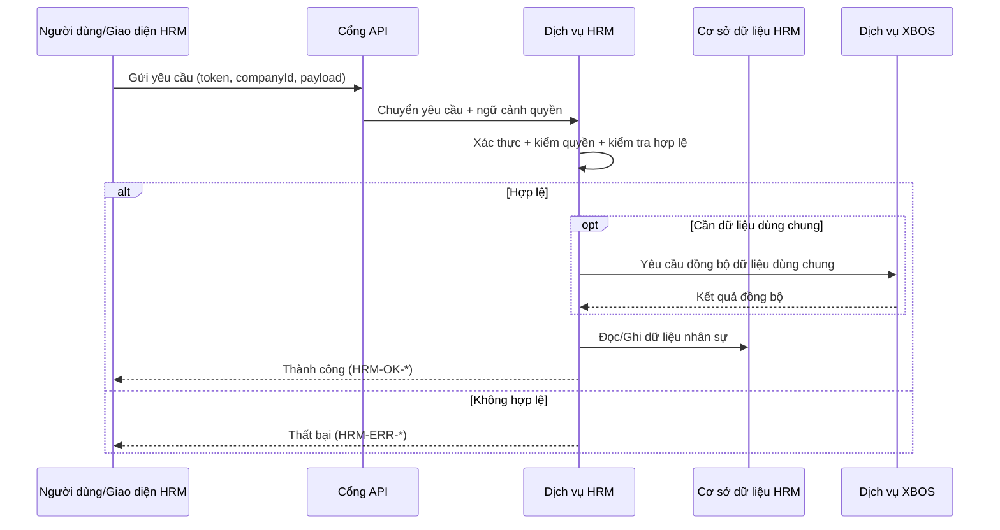
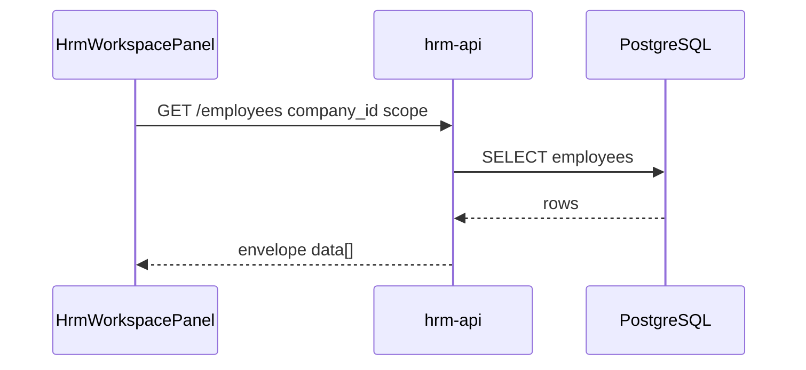
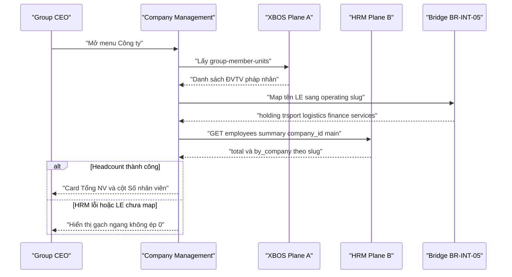
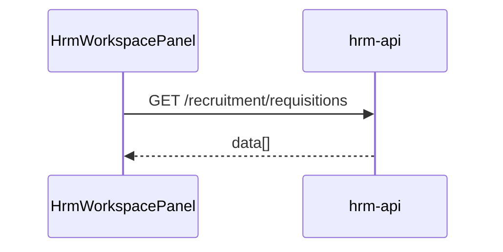
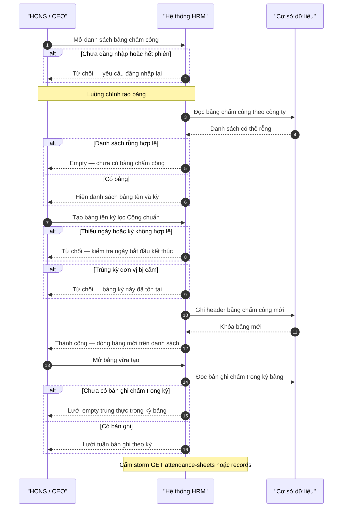
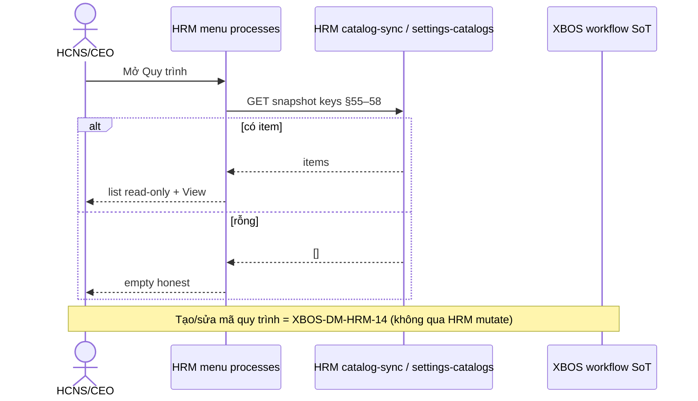
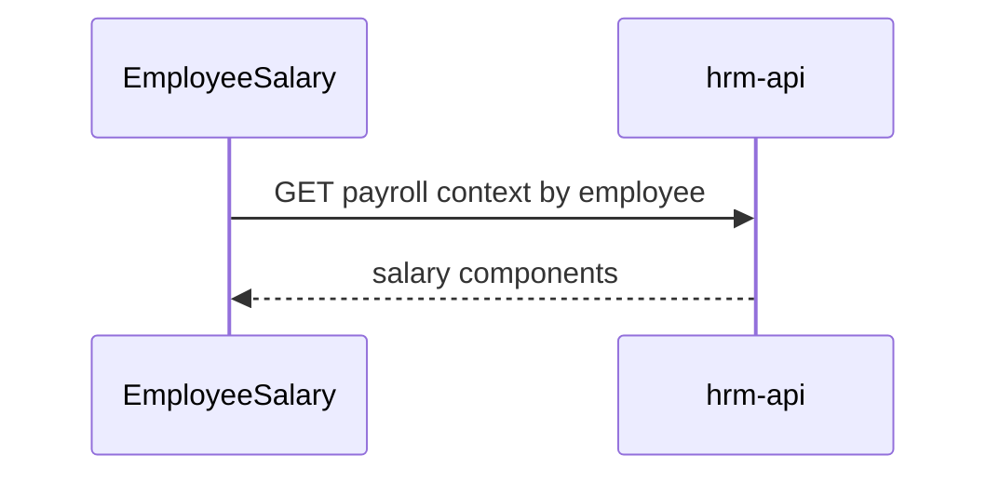

# SRS Phân Hệ HRM

> **SoT gửi khách (W2d 2026-07-22):** `docs/client-delivery/hrm/SRS_HRM_KHACH.md` — skeleton Bateco **Ch.1–6**, E2E spine, **52** FR đủ 7 mục + Kết quả trả về (W1: 8 + W2a: 12 + W2b: 12 + W2c: 12 + W2d: 8). AC-ATT-SHEET giữ trên FR-HRM-AT-14.  
> File này giữ **SRS đội ngũ** (API path, mã lỗi, ADR scope, AC kỹ thuật). **Cấm wipe** delta UC-HRM-23 / HRM-AT-14 / **AC-ATT-SHEET-01..06**.

## 1. Mục Đích

Đặc tả yêu cầu phần mềm cho HRM theo mức triển khai, bảo đảm:

- đồng nhất hoàn toàn với BRD HRM **2.3**,
- phản ánh thực tế HRM là một phân hệ nghiệp vụ trong hệ sinh thái,
- sử dụng thuật ngữ Việt hóa đầy đủ,
- đặc tả rõ nhánh điều kiện if/else, kiểm tra hợp lệ, thành công/thất bại, mã lỗi.

### 1.1 Tham chiếu bắt buộc — phạm vi dữ liệu toàn hệ

| Khái niệm | Quy tắc | Tài liệu |
|-----------|---------|----------|
| **Thang phạm vi (scope ladder)** | Rung 1 group CEO → rollup; Rung 2 member CEO → một công ty; Rung 3 manager → thu hẹp hàng (Target) | `docs/decisions/ADR-HRM-RBAC-SCOPE-LADDER.md` |
| **JWT vận hành HRM** | Mọi CEO (tập đoàn và thành viên) dùng **`companyId=main`** trên REST HRM; **không** dùng `holding` trên embed | ADR §3.1 · `ADR-GROUP-CEO-MAIN-HOLDING-SCOPE.md` |
| **Phân vùng dữ liệu** | Master: `employees.company_id` ∈ `holding`,`trsport`,`logistics`,`finance`,`services`; Member: `company_id=main` + `custom_fields.tenant_id=<member>` | `docs/hrm/HRM_SEED_CARDINALITY_RULES.md` §2–§4 |
| **Đa công ty U39** | UC-HRM-SCOPE-01..03, liên kết chéo UC-HRM-INT-01..04, BR-INT-01..05 | **SRS §15** (2026-06-07) |
| **Cardinality** | CARD-* per slug; rollup group CEO = tổng trên mọi slug thành viên | `HRM_SEED_CARDINALITY_RULES.md` §3 |
| **Company headcount (Plane A↔B)** | Danh sách ĐVTV = XBOS (Plane A); **Số NV / Tổng NV** = HRM COUNT theo **operating slug** (Plane B) qua bridge BR-INT-05 — **cấm** `null\|\|0`, COUNT theo LE UUID, XBOS-only làm SoT headcount | **UC-HRM-CO-01** / **FR-HRM-CO-HC-01** · §15.4 · matrix `company` |
| **Company industry display** | Cột «Ngành nghề» = ngành/business line (VI) từ XBOS `business_lines` / catalog ngành; **cấm** bind `entity_type` (`holding`/`subsidiary`) hoặc raw enum key chưa dịch | **UC-HRM-CO-01** / **FR-HRM-CO-IND-01** · **AC-CO-IND-*** · matrix `company` |
| **Field display (U72 — toàn HRM)** | Mọi enum/code/slug/UUID trên UI người dùng phải qua dictionary → nhãn VI; thiếu map → **«—»**; **cấm** fallback raw key. Không chỉ áp dụng cột Ngành nghề | **FR-HRM-U72-LABEL-01** · **BR-CO-LABEL-01** (HRM-wide) · slice `docs/hrm/SRS_FIELD_DISPLAY.md` · **AC-FD-*** / **AC-U72-*** |

### 1.0 Quy tắc giao hàng (bắt buộc)

SRS là **nguồn đặc tả** cho kiểm thử và triển khai: mọi thay đổi hành vi API/UI phải **cập nhật SRS (và BRD/TechSpec liên quan) trước hoặc cùng commit** với code; không code “trước rồi mới bổ sung tài liệu sau” ngoại trừ hotfix có ghi rõ trong PR.

## 2. Danh Sách Use Case Chuẩn

| Mã use case | Tên | Điểm vào API chính |
|---|---|---|
| UC-HRM-01 | Kiểm tra trạng thái dịch vụ | `GET /api/hrm` |
| UC-HRM-02 | Tạo quản trị nền tảng | `POST /api/hrm/admin/platform-admin` |
| UC-HRM-03 | Tạo/cập nhật quản trị doanh nghiệp | `POST|PATCH /api/hrm/admin/company-admin` |
| UC-HRM-04 | Mời nhân viên hàng loạt | `POST /api/hrm/admin/invite-employees` |
| UC-HRM-05 | Cập nhật thông tin nhạy cảm tài khoản | `POST /api/hrm/admin/reset-user-password` |
| UC-HRM-06 | Đồng bộ dữ liệu dùng chung từ XBOS | `POST /api/hrm/catalog-sync/pull` |
| UC-HRM-07 | Lấy dữ liệu dùng chung theo khóa | `GET /api/hrm/catalog-sync/catalog/:catalogKey?target=...` |
| UC-HRM-08 | Liệt kê dữ liệu dùng chung theo phân hệ đích | `GET /api/hrm/catalog-sync/catalogs?target=...` |
| UC-HRM-09 | Vòng đời đơn chỉnh sửa chấm công + thông báo | `POST/GET/PATCH/DELETE /api/hrm/attendance/update-requests...`; sau ghi DB: fanout `attendance_update_request.*` |
| UC-HRM-10 | Vòng đời đơn nghỉ phép + thông báo | `POST/GET /api/hrm/attendance/leave-requests`, `POST .../:id/approve|reject`; fanout `leave_request.*` |
| UC-HRM-11 | Vòng đời yêu cầu dịch vụ + thông báo | `POST|GET|... /api/hrm/operations/service-requests...`; fanout `service_request.*` |
| UC-HRM-12 | Đọc hộp thư thông báo | `GET /api/hrm/notifications/inbox?company_id=&employee_id=`; `PATCH .../inbox/:id/read` |

## 3. Luồng Nghiệp Vụ Tổng Quát (Sequence)



## 4. Đặc Tả Use Case Chi Tiết

### UC-HRM-01 - Kiểm tra trạng thái dịch vụ

- If dịch vụ sẵn sàng -> `HRM-OK-HEALTH`.
- Else -> `HRM-ERR-SERVICE-UNAVAILABLE`.

### UC-HRM-02 - Tạo quản trị nền tảng

- If người gọi không có quyền nền tảng -> `HRM-ERR-FORBIDDEN`.
- Else if payload thiếu trường bắt buộc -> `HRM-ERR-VALIDATION`.
- Else if email đã có hồ sơ / quyền nền tảng -> **cập nhật (upsert) quyền** trên `platform_admins` → thành công (`HRM-ADMIN-201` / alias `HRM-OK-PLATFORM-ADMIN-CREATED`) — **không** `HRM-ERR-CONFLICT` (SoT **BR-ADM-02-UPSERT-01** · `BA-HRM-ADM-CONFLICT-01`).
- Else -> tạo mới hồ sơ + quyền → thành công.

#### BR / AC — email trùng (ADD `BA-HRM-ADM-CONFLICT-01`)

| ID | Rule / AC | Pass khi | Fail khi |
|----|-----------|----------|----------|
| **BR-ADM-02-UPSERT-01** | Mặc định Phase1: gán quyền nền tảng **idempotent** (upsert). Cấm hiểu Diễn biến #4 là bắt buộc HTTP 409. | Spec + API_DESIGN + runtime cùng upsert | Spec đòi 409 trong khi runtime upsert (hoặc ngược lại không có waiver) |
| **AC-ADM-02-UPSERT-01** | Gọi `POST /api/hrm/admin/platform-admin` hai lần cùng email (đã auth đủ quyền, body hợp lệ) | Cả hai lần HTTP 2xx + envelope success code admin; `user_id` ổn định | Lần 2 = `409` / `HRM-ERR-CONFLICT` |
| **AC-ADM-02-UPSERT-02** | Sau lần 2: hàng `platform_admins` theo email/`user_id` vẫn tồn tại (grant còn) | Query/list hoặc F5 UI vẫn thấy quyền | Grant biến mất hoặc lỗi banner |
| **AC-ADM-02-UPSERT-03** | FE sau 2xx: thông báo thành công; **không** toast «đã tồn tại» kiểu conflict khi SoT upsert | Toast/success path | UI hiện lỗi conflict dù Network 2xx |

> **Out of scope (HOLD):** bật cờ sản phẩm «cấm trùng email nền tảng» → hard 409 — cần CR riêng, không mặc định.

### UC-HRM-03 - Tạo/Cập Nhật quản trị doanh nghiệp

- If người gọi **không** có quyền nền tảng (`platform_admin` / `group_ceo` / grant `platform_admins`) -> `HRM-ERR-FORBIDDEN` / wire `HRM-AUTH-002` (**BR-ADM-SCOPE-01** — Diễn biến #3 = platform gate; **không** yêu cầu `resolveHrmListScope` trên mutate này).
- Else if dữ liệu định danh không hợp lệ -> `HRM-ERR-VALIDATION`.
- Else if tạo mới và chưa tồn tại -> tạo thành công.
- Else if cập nhật và đã tồn tại -> cập nhật thành công (upsert membership).
- Else -> `HRM-ERR-ADMIN-NOT-FOUND`.

#### BR / AC — phạm vi admin (ADD `BA-HRM-ADM-SCOPE-01`)

| ID | Rule / AC | Pass khi | Fail khi |
|----|-----------|----------|----------|
| **BR-ADM-SCOPE-01** | SoT Phase1 cho `POST …/admin/company-admin` · `invite-employee` · `reset-user-password`: chỉ **platform privilege**. Diễn biến «ngoài phạm vi» = không đủ quyền nền tảng → 403. Cấm hiểu bắt buộc `resolveHrmListScope` / membership `company_admin` trên các mutate này trừ khi CR Option B. ADR ladder list/ops (FR-SCOPE) **không** đổi. | Spec + API_DESIGN + runtime cùng platform gate | Spec đòi membership scope trên admin mutate khi runtime chỉ assertPlatformAdmin |
| **AC-ADM-SCOPE-01** | Caller **không** platform (vd. JWT role member/`admin` đơn vị, không grant `platform_admins`) gọi `POST /api/hrm/admin/company-admin` | HTTP **403** · `HRM-AUTH-002` (hoặc alias forbidden) | HTTP 2xx hoặc 409 scope list-style |
| **AC-ADM-SCOPE-02** | Caller **đủ** platform privilege + `company_id` hợp lệ (slug Plane B) | HTTP 2xx · `HRM-ADMIN-202`; membership ghi đúng đơn vị | 403 giả / 409 invent |
| **AC-ADM-SCOPE-03** | `POST …/invite-employee` không Bearer platform và **không** service-role key | HTTP **403** `HRM-AUTH-002` (hoặc 401 thiếu Bearer) | 2xx invite từ persona hẹp không có waiver CR |

> **Out of scope (HOLD):** mở caller `company_admin` + lọc `company_id` bằng `resolveHrmListScope` — Option B / CR riêng; **không** invent persona matrix trong WI này.

### UC-HRM-04 - Mời nhân viên hàng loạt

- If người gọi không đủ quyền nền tảng và không phải kênh hệ thống nội bộ (service-role) -> `HRM-ERR-FORBIDDEN` (**BR-ADM-SCOPE-01**).
- If danh sách rỗng -> `HRM-ERR-VALIDATION`.
- Else xử lý từng bản ghi:
  - If bản ghi hợp lệ -> tạo lời mời thành công.
  - Else -> gán lỗi cho bản ghi đó.
- If có bản ghi lỗi -> không dừng toàn bộ lô, vẫn trả kết quả theo từng bản ghi.
- **BR-ADM-04-TEMP-PWD-01..08** (ADD `BA-HRM-ADM-INVITE-04` · SoT `API_DESIGN_HRM_ADMIN.md` §C.1):
  - New portal profile in batch → temporary password = CSPRNG, length ≥12, mixed letter+digit charset; store hash only.
  - **Cấm** fixed secret (incl. `12345678`).
  - Existing profile → membership only; do not overwrite password.
  - API/`results[]`/UI **không** trả plaintext password.
  - Email outbox / accept-invite state machine = **HOLD** (non-goal this wave).
- **AC-ADM-04-TEMP-01:** Invite create path has no literal fixed temp password.
- **AC-ADM-04-TEMP-02:** `HRM-ADMIN-203` success body has no password field.
- **AC-ADM-04-TEMP-03:** Two new-user invites → distinct stored password hashes.
- **AC-ADM-04-TEMP-04:** Re-invite existing email → `password_hash` unchanged.
- **AC-ADM-04-TEMP-05:** Generator unit test enforces length ≥12 + charset.

### UC-HRM-05 - Cập nhật thông tin nhạy cảm tài khoản

- If không đủ quyền nền tảng (platform privilege) -> `HRM-ERR-FORBIDDEN` / `HRM-AUTH-002` (**BR-ADM-SCOPE-01** — Diễn biến #3).
- Else if tài khoản không tồn tại -> `HRM-ERR-USER-NOT-FOUND`.
- Else if dữ liệu mới vi phạm chính sách -> `HRM-ERR-VALIDATION`.
- Else -> cập nhật thành công và ghi nhật ký.

### UC-HRM-06 - Đồng bộ dữ liệu dùng chung từ XBOS

- If thiếu khóa danh mục hoặc phân hệ đích -> `HRM-ERR-VALIDATION`.
- Else gọi XBOS:
  - If XBOS trả lỗi -> `HRM-ERR-DONG-BO-DANH-MUC`.
  - Else -> cập nhật ảnh chụp dữ liệu dùng chung tại HRM.

### UC-HRM-07 - Lấy dữ liệu dùng chung theo khóa

- If không có dữ liệu theo khóa -> `HRM-ERR-DANH-MUC-KHONG-TON-TAI`.
- Else if sai quyền/phạm vi -> `HRM-ERR-FORBIDDEN`.
- Else -> trả dữ liệu thành công.

### UC-HRM-08 - Liệt kê dữ liệu dùng chung theo phân hệ đích

- If phân hệ đích không hợp lệ -> `HRM-ERR-TARGET-INVALID`.
- Else -> trả danh sách theo điều kiện lọc.

### UC-HRM-09 — Vòng đời đơn chỉnh sửa chấm công + thông báo

- If thiếu quyền nghiệp vụ hoặc sai `company_id` UUID -> `HRM-ERR-FORBIDDEN` / `HRM-ERR-VALIDATION` theo nhánh.
- Else khi tạo đơn thành công -> ghi DB + fanout sự kiện `attendance_update_request.created` (Socket.IO + `hrm_inbox_notifications` broadcast theo công ty + webhook + push theo cấu hình).
- Else khi duyệt/từ chối -> cập nhật DB + fanout `attendance_update_request.approved|rejected` (một bản ghi broadcast + một bản ghi có `recipient_employee_id` = người gửi nếu có UUID nhân viên).

### UC-HRM-10 — Vòng đời đơn nghỉ phép + thông báo

- If validation DTO thất bại -> `HRM-ERR-VALIDATION`.
- Else khi tạo đơn -> fanout `leave_request.created` theo cùng pipeline UC-HRM-09.
- Else khi duyệt/từ chối -> fanout `leave_request.approved|rejected`; body quyết định dùng `reviewer_name` (và tuỳ chọn `reviewer_employee_id`).

### UC-HRM-11 — Vòng đời yêu cầu dịch vụ + thông báo

- If tạo/duyệt/từ chối hợp lệ -> cập nhật `service_requests` + fanout `service_request.created|approved|rejected` (cùng pipeline; nếu `employee_id` NULL thì không tạo bản ghi inbox đích danh cho nhân viên khi quyết định, vẫn có broadcast công ty).

### UC-HRM-12 — Đọc hộp thư thông báo

- If thiếu `company_id` / `employee_id` UUID hợp lệ -> `HRM-ERR-VALIDATION`.
- Else -> trả danh sách `hrm_inbox_notifications` mà `recipient_employee_id IS NULL` (broadcast công ty) **hoặc** bằng `employee_id` người xem (tin cá nhân).

## 5. Ma Trận Kiểm Tra Hợp Lệ Dữ Liệu

| Thành phần | Quy tắc | Mã lỗi |
|---|---|---|
| `token` | hợp lệ, chưa hết hạn | `HRM-ERR-AUTH-INVALID` |
| `role` | đúng vai trò yêu cầu | `HRM-ERR-FORBIDDEN` |
| `tenantId/companyId` | đúng phạm vi của người gọi | `HRM-ERR-SCOPE-INVALID` |
| `email` | đúng định dạng, không rỗng | `HRM-ERR-VALIDATION` |
| `inviteItems[]` | tối thiểu 1 bản ghi, kiểm tra từng bản ghi | `HRM-ERR-BATCH-ITEM-INVALID` |
| `catalogKey/target` | đúng quy tắc đồng bộ từ XBOS | `HRM-ERR-DONG-BO-DANH-MUC` |

## 6. Danh Mục Mã Lỗi Chuẩn

| Mã lỗi | HTTP | Ý nghĩa |
|---|---|---|
| `HRM-ERR-AUTH-INVALID` | 401 | Token không hợp lệ/hết hạn |
| `HRM-ERR-FORBIDDEN` | 403 | Không đủ quyền thao tác |
| `HRM-ERR-SCOPE-INVALID` | 403 | Sai phạm vi tenant/công ty |
| `HRM-ERR-VALIDATION` | 400 | Dữ liệu đầu vào không hợp lệ |
| `HRM-ERR-CONFLICT` | 409 | Xung đột dữ liệu đã tồn tại |
| `HRM-ERR-ADMIN-NOT-FOUND` | 404 | Không tìm thấy quản trị doanh nghiệp |
| `HRM-ERR-USER-NOT-FOUND` | 404 | Không tìm thấy tài khoản người dùng |
| `HRM-ERR-BATCH-ITEM-INVALID` | 400 | Có bản ghi trong lô không hợp lệ |
| `HRM-ERR-DONG-BO-DANH-MUC` | 502 | Lỗi đồng bộ dữ liệu dùng chung |
| `HRM-ERR-DANH-MUC-KHONG-TON-TAI` | 404 | Không có dữ liệu dùng chung theo khóa |
| `HRM-ERR-TARGET-INVALID` | 400 | Phân hệ đích không hợp lệ |
| `HRM-ERR-SERVICE-UNAVAILABLE` | 503 | Dịch vụ tạm không sẵn sàng |

## 7. Danh Mục Mã Thành Công

| Mã thành công | HTTP | Use case |
|---|---|---|
| `HRM-OK-HEALTH` | 200 | UC-HRM-01 |
| `HRM-OK-PLATFORM-ADMIN-CREATED` | 201 | UC-HRM-02 |
| `HRM-OK-COMPANY-ADMIN-SAVED` | 200/201 | UC-HRM-03 |
| `HRM-OK-BATCH-PROCESSED` | 200 | UC-HRM-04 |
| `HRM-OK-USER-SENSITIVE-UPDATED` | 200 | UC-HRM-05 |
| `HRM-OK-DONG-BO-DANH-MUC` | 200 | UC-HRM-06 |
| `HRM-OK-DANH-MUC-GET` | 200 | UC-HRM-07 |
| `HRM-OK-DANH-MUC-LIST` | 200 | UC-HRM-08 |

## 8. Quy Tắc Xử Lý Lô (UC-HRM-04)

- Mỗi bản ghi phải có `status`, `code`, `message`.
- Bản ghi lỗi không hoàn tác bản ghi thành công.
- Kết quả bắt buộc có:
  - `totalItems`,
  - `successCount`,
  - `failedCount`,
  - `itemResults[]`.

## 9. Yêu Cầu Phi Chức Năng

- Bảo mật: bắt buộc xác thực, kiểm quyền, kiểm tra phạm vi.
- Độ tin cậy: nhánh lỗi không tạo thay đổi trạng thái ngoài ý định.
- Hiệu năng: xử lý lô và truy vấn danh sách đáp ứng ổn định.
- Khả năng vận hành: nhật ký có mã tương quan giao dịch, không lộ dữ liệu nhạy cảm.

## 10. Tiêu Chí Chấp Nhận

- Use case UC-HRM-01..12 có kịch bản thành công/thất bại rõ ràng theo phạm vi đã triển khai.
- Mã lỗi và HTTP status đúng bảng chuẩn tại mục 6.
- Nội dung use case đồng nhất với BRD HRM **2.3** và thuật ngữ Việt hóa.

## 11. Import NS & Document Vault (họp 2026-05)

| Nhóm cột (20–30) | Validation | Ghi chú |
|---|---|---|
| Mã NV, Họ tên, CCCD, ngày sinh | Bắt buộc | Map `employees` |
| Công ty, phòng, chức danh | FK XBOS catalog | Không duplicate org tree HRM |
| Ảnh hồ sơ | URL hợp lệ | Không upload binary trong Excel |
| `workflow_code` | Optional | Metadata change → definition XBOS |

**Bảng:** `employee_document_versions` (PostgreSQL / `hrm-api`): `employee_id`, `folder_path`, `file_url`, `version`, `uploaded_by`, `uploaded_at`.

## 12. Tài Liệu Kèm Theo — Ứng Dụng Di Động HRM

- BRD mobile: `docs/hrm/BRD_MOBILE.md`
- SRS mobile: `docs/hrm/SRS_MOBILE.md` (use case `UC-HRM-MOB-*`, mã lỗi client bổ sung)
- TechSpec mobile: `docs/hrm/TECHSPEC_MOBILE.md`

## 13. Portal embed — Command Center (`HrmWorkspacePanel`)

**Hai surface HRM:** (1) **Embed** — `apps/web/web-portal` route `/command-center/hrm/:view`; (2) **Vận hành** — `apps/web/hrm` app đầy đủ. Catalog `settings-catalogs` là nguồn sự thật chung; cấu hình tại Command Center menu `company_group_hr`.

| Mã | Tên | API chính |
|---|---|---|
| UC-HRM-20 | Embed — Tổng quan HRM | `GET /api/hrm/employees`, `GET /api/hrm/payroll/payslips` |
| UC-HRM-21 | Embed — Danh sách nhân sự | `GET /api/hrm/employees` |
| UC-HRM-22 | Embed — Tuyển dụng | `GET /api/hrm/recruitment/requisitions` |
| UC-HRM-23 | Embed — Chấm công | `GET /api/hrm/attendance/records` · `GET/POST …/attendance/attendance-sheets` (`HRM-AS-200`/`201`) |
| UC-HRM-24 | Embed — Lương | `GET /api/hrm/payroll/payslips` |
| UC-HRM-25 | Embed — Hợp đồng / BHXH | `GET /api/hrm/contracts-insurance/contracts` |
| UC-HRM-26 | Embed — Hàng chờ metadata | `GET /api/hrm/employee-metadata/change-requests` |
| UC-HRM-27 | Embed — Quyết định nhân sự | `GET/POST/PATCH/DELETE /api/hrm/decisions` (`HRM-DEC-200`/`201`) — **Implemented-empty OK**; fidelity/CRUD density **chưa DONE** |
| **UC-HRM-CO-01** | Embed — Quản lý công ty: headcount ĐVTV + cột hiển thị (Ngành nghề) | XBOS `GET …/group-member-units` **+** HRM `GET /employees/summary` — **FR-HRM-CO-HC-01** · **FR-HRM-CO-IND-01** |
| *(menu `processes`)* | Embed/App — Quy trình & quy định | **XBOS read-only** — không UC CRUD HRM; SoT **XBOS-DM-HRM-14** + DM §55–58 (xem §13.1) |

### UC-HRM-21 — Embed: danh sách nhân sự

**Purpose:** HCNS/CEO xem danh sách NV theo phạm vi tenant từ Command Center.

**Usecases:** Happy: API trả danh sách → bảng. Alternate: rỗng → empty state. Exception: 401 → đăng nhập; 5xx → banner (BR-MOCK-02).

**Activity Diagram:**



**Business Logic:** BR-SCOPE-01; không hiển thị mock khi BR-MOCK-01; map `employee_code`, `full_name`, `status`.

**Data Interaction:**

| Field | Nguồn | Validation |
|-------|--------|------------|
| `x-tenant-id` | GlobalFilter / member unit | Required |
| `x-company-id` | `MEMBER_DEFAULT_COMPANY_ID` | Required |
| `company_id` query | Scope resolver | UUID/slug |

**Acceptance:** Không còn `mockEmployees` khi API 200; empty state có hướng dẫn.

### UC-HRM-CO-01 / FR-HRM-CO-HC-01 — Embed: Quản lý công ty (headcount ĐVTV)

> **ADD-only** `GOV-HRM-CO-EMP-SRS-01` (2026-07-27). **Không** rewrite UC-HRM-03 (CRUD company-admin).  
> **Align:** `HRM_MENU_DATA_LINKAGE_MATRIX.md` §2.1 `company` · §5 AC-CO-EMP · §6 BR-CO-* / BR-INT-05.  
> **Evidence BA:** `docs/qa/evidence/ba-hrm-co-emp-count-01-20260727.md` · `docs/qa/evidence/ba-data-hrm-co-emp-linkage-01-20260727.md`.  
> **ADD display fields** `D-HRM-CO-INDUSTRY-BA-01` (2026-07-27): **FR-HRM-CO-IND-01** / **AC-CO-IND-*** — evidence `docs/qa/evidence/ba-hrm-co-industry-01-20260727.md`. **Không** đè AC-CO-EMP.

#### Purpose

Cho Group CEO / HCNS trên **Company Management** (`/command-center/hrm/company` và `/company`) thấy danh sách đơn vị thành viên (ĐVTV / pháp nhân Plane A) **và** số nhân viên thật (Plane B) khớp Dashboard Nhân sự — không hiển thị toàn `0` khi workforce đã có. Cột **«Ngành nghề»** phải là ngành kinh doanh / business line **tiếng Việt** (hoặc nhãn catalog đã dịch), không phải lớp tổ chức pháp nhân.

#### Usecases

| Nhánh | Diễn biến | Kết quả |
|-------|-----------|---------|
| **Happy** | Login Group CEO → mở menu Công ty → XBOS trả ĐVTV **và** HRM trả headcount theo slug bridge → card «Tổng nhân viên» + cột «Số nhân viên» | Card ≈ `summary.main.total`; mỗi dòng = `by_company[slug].total` (hoặc COUNT tương đương) |
| **Alternate** | Slug đã bridge nhưng thật sự 0 NV active | Hiển thị **0** hợp lệ (sau khi HRM 2xx xác nhận) |
| **Exception — API fail** | HRM summary/COUNT 4xx/5xx/timeout | UI **«—»**; **cấm** ép `0` như thành công |
| **Exception — unmapped LE** | ĐVTV visible không map được operating slug | Ô headcount **«—»** + log; **cấm** COUNT theo LE UUID |
| **Exception — prior QA gap** | Chỉ «list ĐVTV visible» | **Không đủ** DONE — phải AC-CO-EMP-01..06 |
| **Happy — Ngành nghề** | XBOS trả `business_lines` / industry catalog có giá trị | Cột «Ngành nghề» = nhãn VI (vd. «Du lịch - Khách sạn», «Vận tải - Logistics») |
| **Alternate — thiếu ngành** | `business_lines` null/empty và không có industry trong payload | Ô «Ngành nghề» = **«—»** (holding hoặc ĐVTV) |
| **Exception — bind sai field** | Mapper gán `industry = entity_type` | **FAIL** — user thấy `subsidiary` / `holding` (AC-CO-IND-02) |
| **Exception — raw catalog key** | UI hiện `tourism` / `logistics` chưa qua dictionary VI | **FAIL** — AC-CO-IND-03 |

#### Activity Diagram



#### Business Logic

| BR | Điều kiện | Hành động | Kết quả |
|----|-----------|-----------|---------|
| **BR-INT-05** (§15.4) | Màn Company hiện ĐVTV XBOS | Mỗi ĐVTV vận hành map **đúng 1** slug ∈ `GROUP_MEMBER_SLUGS` (`holding`, `trsport`, `logistics`, `finance`, `services`) | Headcount dòng = NV của slug đó; gap map có owner |
| **BR-CO-HC-01** | Cần số NV trên Company UI | SoT = HRM `employees` lọc theo **operating slug**; XBOS **không** sở hữu workforce headcount | Derived projection — không tin XBOS-only |
| **BR-CO-EMP-01** | NV trên master `tenant_id=xevn` | `employees.company_id` ∈ slug đã bridge tới ĐVTV; orphan slug/null = 0 trên probe | Company + Dashboard cùng nguồn đếm |
| **BR-CO-EMP-02** | DTO/mapper thiếu `employee_count` | FE **không** `null \|\| 0`; bind HRM count hoặc «—» khi fail | AC-CO-EMP-04; UI trung thực |
| **BR-CO-IND-01** | Cột «Ngành nghề» trên Company list/detail | SoT = XBOS `xbos_legal_entity.business_lines` **hoặc** field ngành trong `payload.companyForm` (industry / businessLines) đã map qua **dictionary** `industries.*` (VI) | Hiển thị nhãn người đọc được; **không** dùng `entity_type` |
| **BR-CO-TYPE-01** (optional UI) | Cần hiện lớp pháp nhân (holding / subsidiary) | Cột/badge riêng **«Loại đơn vị»** với nhãn VI: `holding`→«Tập đoàn»; `subsidiary`→«Công ty thành viên» | **Không** ghi vào cột «Ngành nghề» |
| **BR-CO-LABEL-01** | Field UI là nhãn người dùng (**toàn HRM**, không chỉ Company) | Mọi mã kỹ thuật (FK code, enum, slug, UUID, org class) **phải** qua dictionary trước khi render; null/unknown → **«—»** | Cấm raw code trên table/badge — chi tiết F-01..F-13 / U-*: `docs/hrm/SRS_FIELD_DISPLAY.md` |

**Root cause (normative — cấm lặp):**

1. UI list XBOS Plane A nhưng hardcode `employee_count: null` → UI `\|\| 0`.
2. Workforce sống Plane B: `employees.company_id` = operating **TEXT slug**.
3. Dashboard dùng HRM summary (đúng); Company **chưa** join HRM COUNT.
4. QA PASS chỉ «list visible» **không đủ** — thiếu AC headcount.
5. Cột «Ngành nghề» bind `entity_type` (`subsidiary`/`holding`) — org class ≠ ngành nghề (incident 2026-07-27).

**Anti-pattern (FAIL tức thì):**

| Cấm | Vì sao |
|-----|--------|
| `employee_count: null` rồi `\|\| 0` / `?? 0` như success | Che thiếu wire / che lỗi API |
| `COUNT(employees) WHERE company_id = <LE UUID>` | UUID pháp nhân ≠ slug → luôn ~0 |
| XBOS `group-member-units` / tenant-scope làm **SoT headcount** | Plane A không lưu số NV |
| Đổi partition slug → LE UUID chỉ để «cho cột có số» | Ngoài scope; phá CARD-* / mobile ladder |
| `industry: member.entity_type` (hoặc tương đương) | User thấy raw `subsidiary` / `holding` — sai ngữ nghĩa |
| Render mã catalog ngành (`tourism`, `logistics`, …) **không** qua dictionary VI | Untranslated enum key trên UI |
| Gộp «Loại đơn vị» vào cột «Ngành nghề» | Hai khái niệm nghiệp vụ khác nhau |

**Success outcome (bắt buộc):**

- Card **Tổng nhân viên** ≈ `GET /api/hrm/employees/summary?company_id=main` → **`total`** (cùng định nghĩa non-archived như Dashboard).
- Mỗi dòng ĐVTV: **Số nhân viên** = `by_company[operating_slug].total` (hoặc COUNT tương đương sau bridge § bridge registry).

#### Data Interaction & Validation

| Field / surface | Nguồn SoT | Validation | Fail |
|-----------------|-----------|------------|------|
| Danh sách ĐVTV (tên, MST, founded, …) | XBOS `group-member-units` / legal entity | Plane A identity | Empty list khi XBOS fail → banner XBOS |
| «Ngành nghề» (`industry` display) | XBOS `business_lines` **hoặc** `payload.companyForm.industry` / `businessLines` → dictionary `industries.*` (VI) | Giá trị ∈ catalog ngành **hoặc** chuỗi VI đã lưu; **cấm** `entity_type` | Raw `subsidiary`/`holding`; raw `tourism` chưa dịch |
| «Loại đơn vị» (optional) | XBOS `entity_type` | Chỉ `holding` / `subsidiary` (và synonym đã khóa) → nhãn VI riêng | Hiện trên cột Ngành nghề |
| `employee_count` / «Số nhân viên» | HRM `employees` theo slug | `company_id = operating_slug` ∈ `GROUP_MEMBER_SLUGS` | UUID filter / null→0 |
| Card «Tổng nhân viên» | HRM summary `company_id=main` **hoặc** tổng 5 slug (không cộng trùng) | ≈ Dashboard cùng session (AC-CO-EMP-05) | Company=0 / Dashboard > 0 |
| Bridge LE → slug | `hrm-operating-unit-registry` / `company_slug_map` (interim BR-INT-05) | holding→`holding`; Visun→`logistics`; X.E TMDV→`trsport`; X.E Du lịch→`finance`; X.E Việt Nam→`services` | Sai slug; unmapped → «—» |
| JWT Group CEO | `tenantId=xevn`, `companyId=main` | Rollup ADR scope | Truyền LE UUID làm `company_id` query workforce |

| VAL | Rule |
|-----|------|
| VAL-CO-HC-01 | Resolve slug **trước** COUNT |
| VAL-CO-HC-02 | Predicate COUNT = slug TEXT |
| VAL-CO-HC-03 | Filter LE UUID làm `company_id` = **forbidden** success path |
| VAL-CO-HC-04 | Card tổng = rollup `main` **hoặc** sum 5 slug — không cả hai |
| VAL-CO-HC-05 | Sau enrich, không để `employee_count` null khi HRM 2xx |
| VAL-CO-IND-01 | `industry` display **không** ∈ {`holding`,`subsidiary`,`parent`,`member`,`branch`} |
| VAL-CO-IND-02 | Catalog key ngành phải resolve dictionary trước render (hoặc SoT đã là chuỗi VI) |
| VAL-CO-IND-03 | API `group-member-units` (hoặc enrich legal) phải expose `business_lines` khi DB có giá trị — FE không đoán từ `entity_type` |

#### Acceptance Criteria (AC-CO-EMP-01..06)

| AC | Pass | Fail |
|----|------|------|
| **AC-CO-EMP-01** | Card «Tổng nhân viên» = workforce rollup ≈ summary `main.total` (persona `ceo@xe.vn`) | Card `0` khi summary/Dashboard > 0 |
| **AC-CO-EMP-02** | Mỗi dòng = COUNT theo bridged slug | Mọi dòng `0` / đếm LE UUID / hardcode |
| **AC-CO-EMP-03** | Bridge đúng registry § trên | Map sai; unmapped vẫn fake `0` |
| **AC-CO-EMP-04** | API fail → «—»; `0` chỉ khi HRM xác nhận 0 NV | `null\|\|0` khi thiếu/wire fail |
| **AC-CO-EMP-05** | Cùng session: Company card ≈ Dashboard «Tổng nhân viên» | Company=0 / Dashboard≈1109 |
| **AC-CO-EMP-06** | F5 / vào lại menu → cùng số; Network có HRM count **2xx** (+ XBOS) | F5 về toàn 0; chỉ XBOS |

**Cross-nav L2.5:** **J-HRM-CO-01** — từ dòng Company → detail/admin in-scope; back vẫn giữ headcount đúng.

**QA rule:** UF-HRM-MENU-15 «Load OK» **không** chứng minh AC-CO-EMP. Company **DONE** chỉ khi visibility **và** AC-CO-EMP-01..06.

#### FR-HRM-CO-IND-01 — Cột «Ngành nghề» (ADD `D-HRM-CO-INDUSTRY-BA-01`)

> **ADD-only** — không thay FR-HRM-CO-HC-01 / AC-CO-EMP.  
> **Incident:** Company list hiện raw English `subsidiary` trên «Ngành nghề»; holding «—». Root cause: FE map `industry ← entity_type`.  
> **SoT ngành:** `xbos_legal_entity.business_lines` (+ fallback `payload.companyForm` industry fields) + dictionary UI `industries.*` (keys: `it`, `manufacturing`, `trading`, `services`, `finance`, `realestate`, `education`, `healthcare`, `tourism`, `logistics`, `construction`, `other`).

| AC | Pass | Fail |
|----|------|------|
| **AC-CO-IND-01** | Cột «Ngành nghề» = nhãn ngành/business line **đọc được** (VI hoặc đã i18n) khớp SoT XBOS khi có dữ liệu | Ô trống khi DB/API đã có `business_lines` / industry hợp lệ |
| **AC-CO-IND-02** | **Không** bao giờ hiện raw `entity_type` (`subsidiary`, `holding`, …) trong cột «Ngành nghề» (list + detail/badge) | User thấy `subsidiary` / `holding` / org-class English |
| **AC-CO-IND-03** | Catalog key (`tourism`, `logistics`, …) **phải** qua dictionary → VI (vd. «Du lịch - Khách sạn», «Vận tải - Logistics»); **cấm** để nguyên key tiếng Anh trên UI | Raw untranslated enum/catalog key |
| **AC-CO-IND-04** | Thiếu ngành (null/empty SoT) → **«—»** (hoặc `-` đồng nhất UI) — holding và ĐVTV alike | Fake ngành từ `entity_type`; hoặc chuỗi rỗng / `null` chữ |
| **AC-CO-IND-05** (optional) | Nếu UI cần lớp pháp nhân: cột/badge **«Loại đơn vị»** riêng — `holding`→«Tập đoàn», `subsidiary`→«Công ty thành viên» | Gộp loại đơn vị vào «Ngành nghề» |
| **AC-CO-IND-06** | F5 / vào lại menu: cùng nhãn ngành; Network XBOS (member-units và/hoặc legal enrich) **2xx** mang field ngành khi DB có | F5 lại ra `subsidiary`; API không expose `business_lines` khi cột DB có giá trị |

**Dictionary tối thiểu (VI — khớp form Company):**

| Catalog key | Nhãn VI bắt buộc trên UI |
|-------------|--------------------------|
| `it` | Công nghệ thông tin |
| `manufacturing` | Sản xuất |
| `trading` | Thương mại |
| `services` | Dịch vụ |
| `finance` | Tài chính - Ngân hàng |
| `realestate` | Bất động sản |
| `education` | Giáo dục |
| `healthcare` | Y tế |
| `tourism` | Du lịch - Khách sạn |
| `logistics` | Vận tải - Logistics |
| `construction` | Xây dựng |
| `other` | Khác |

**Loại đơn vị (nếu cột riêng):**

| `entity_type` | Nhãn VI |
|---------------|---------|
| `holding` | Tập đoàn |
| `subsidiary` | Công ty thành viên |

**QA rule:** Headcount PASS (AC-CO-EMP) **không** chứng minh AC-CO-IND. Company display **DONE** khi AC-CO-EMP **và** AC-CO-IND-01..04 (05 optional theo UI).

### UC-HRM-22 — Embed: tuyển dụng

**Purpose:** Xem TT tuyển dụng (requisitions) theo công ty.

**Usecases:** Happy: list requisitions. Alternate: empty. Exception: API fail → banner, không mock im lặng (BR-MOCK-02).

**Activity Diagram:**



**Business Logic:** Map `title` → cột Chiến dịch; `status` hiển thị tiếng Việt.

**Data Interaction:** `GET /api/hrm/recruitment/requisitions?company_id=`; headers `x-tenant-id`, `x-internal-api-key`.

### UC-HRM-23 — Embed: chấm công

**Purpose:** Xem bản ghi chấm công theo kỳ/tenant; trên surface vận hành HRM (`/attendance`) còn quản lý **bảng chấm công** (kỳ/đơn vị) và lưới tuần sau khi tạo hoặc chọn bảng.

**Usecases:** Happy / empty / error như UC-HRM-22. **Bổ sung (ADD 2026-07-21):** Happy tạo bảng → lưới/danh sách hiện dữ liệu; Alternate danh sách bảng rỗng; Exception lỗi API / vòng tải lặp.

**Activity:** `GET /api/hrm/attendance/records?company_id=`. **Bổ sung:** `GET/POST/PATCH/DELETE /api/hrm/attendance/attendance-sheets` (xem **HRM-AT-14** / UC-HRM-32).

**Business Logic:** Hiển thị `attendance_date`, `employee_id`, `status`; không aggregate mock period. **Bổ sung:** sau tạo bảng thành công, UI **phải** hiện dòng bảng mới (hoặc lưới tuần của bảng vừa chọn) mà **không** phụ thuộc F5; empty = «chưa có bảng» / «chưa có bản ghi trong kỳ» — **không** banner lỗi giả; **cấm** storm tải lại danh sách bảng (xem BR-ATT-SHEET-02).

**Data Interaction:** Bảng `attendance_records` (BE); bảng `attendance_sheets` (BE) cho kỳ bảng công.

#### UC-HRM-23 / HRM-AT-14 — Bảng chấm công: tạo → lưới / empty / không storm tải (delta §3.4)

> **ADD-only** (`BA-HRM-SPEC-QUALITY-AUDIT-01` + **`BA-HRM-ATT-SHEET-AC-01`**): bổ sung AC vận hành cho Dev/QA. Không thay thế mục Purpose–Data Interaction phía trên.

| Thuộc tính | Giá trị |
|---|---|
| Mã UC | UC-HRM-23 (embed đọc records) · **HRM-AT-14** (CRUD bảng chấm công trên app HRM) · UC-HRM-32 (app chấm công đầy đủ) |
| Actor | HCNS / quản lý đơn vị trong phạm vi công ty |
| Ưu tiên | Cao |
| Tiên quyết | Đã đăng nhập; có phạm vi công ty hợp lệ; danh mục ca/loại nghỉ (nếu lọc) đã đồng bộ khi cần |
| Hậu điều kiện | Có bản ghi bảng chấm công trong phạm vi công ty **hoặc** empty trung thực; lưới tuần gắn đúng kỳ bảng đang chọn |
| Liên hệ phần mềm hiện tại | Đã có: màn `/attendance` tab bảng công + `attendance-sheets` API · Cần nghiệm thu: tạo → hiện lưới; empty; không storm |

**Dữ liệu đầu vào**

| Trường | Bắt buộc | Quy tắc |
|--------|----------|---------|
| Tên bảng | Có (hoặc hệ thống gợi ý theo kỳ) | Không rỗng sau chuẩn hoá |
| Ngày bắt đầu / kết thúc | Có | Định dạng người dùng `dd/MM/yyyy`; bắt đầu ≤ kết thúc |
| Loại chấm / chuẩn | Không | Theo danh mục vận hành (ngày / cố định…) |
| Đơn vị / chức danh lọc | Không | «Tất cả» = không lọc; giá trị phải thuộc phạm vi công ty |

**Luồng chính**

1. Người dùng mở Chấm công → tab/danh sách **Bảng chấm công**.
2. Hệ thống tải danh sách bảng **một lần** theo công ty đang chọn (không lặp vô hạn khi toast/re-render).
3. Người dùng bấm tạo bảng → nhập kỳ/tên/lọc → Lưu.
4. Hệ thống ghi bảng mới; danh sách cập nhật ngay; người dùng mở bảng → lưới tuần/bản ghi theo kỳ hiện dữ liệu hoặc empty trung thực trong kỳ.
5. Người dùng F5 / mở lại menu → bảng vừa tạo vẫn còn.

**Quy tắc nghiệp vụ**

- **BR-ATT-SHEET-01:** Tạo bảng thành công → người dùng **thấy** dòng bảng (tên, kỳ) trên danh sách **trước** thao tác F5.
- **BR-ATT-SHEET-02:** Khi tab bảng công đang mở, danh sách bảng **không** bị gọi API lặp storm (một phiên ổn định: không hàng chục GET `attendance-sheets` chỉ vì re-render / toast). Cho phép: 1 GET khi vào tab; 1 GET (hoặc invalidate) sau tạo/sửa/xoá thành công.
- **BR-ATT-SHEET-03:** Empty hợp lệ: API thành công + `total=0` → copy «Chưa có bảng chấm công» (hoặc tương đương), **không** coi là lỗi hệ thống, **không** mock dữ liệu giả.
- **BR-ATT-SHEET-04:** Kỳ bảng không hợp lệ (thiếu ngày, bắt đầu > kết thúc, trùng kỳ+đơn vị nếu nghiệp vụ cấm) → từ chối lưu kèm thông báo rõ; **không** tạo bản ghi.
- **BR-ATT-SHEET-05:** Chọn bảng → lưới tuần chỉ phản ánh nhân viên/bản ghi trong kỳ và phạm vi đơn vị của bảng; ngoài phạm vi → không lộ dữ liệu công ty khác.
- **BR-ATT-SHEET-06 (ADD BA-HRM-ATT-SHEET-AC-01):** `POST` tạo **header** `attendance_sheets` — **không** bắt buộc sinh `attendance_records`. Lưới empty khi kỳ chưa có điểm danh = **live-empty hợp lệ** (có lý do UI), **không** ERROR banner, **không** auto-reload storm trên `GET …/records`.
- **BR-ATT-SHEET-07 (ADD):** Sau settle UI (≤10s): `GET …/attendance-sheets` ≤ **2**; khi mở lưới tuần, `GET …/attendance/records` cùng `from_date`/`to_date` ≤ **2**. **FAIL** nếu ≥5 cùng URL trong 10s, AbortError ×N, hoặc RATE-429 do loop.

**Sơ đồ tương tác**



**Diễn biến nghiệp vụ**

| # | Tương tác | Điều kiện / quy tắc | Kết quả hoặc lỗi |
|---|-----------|---------------------|------------------|
| 1 | Mở danh sách bảng | Phiên hợp lệ; đúng phạm vi công ty | Hiển thị danh sách hoặc empty |
| 2 | (Auth gom) | Hết phiên / ngoài phạm vi | Từ chối — đăng nhập hoặc không đủ quyền |
| 3 | Tải danh sách | BR-ATT-SHEET-02 | ≤1 GET ổn định khi vào tab; không storm |
| 4 | Empty danh sách | `total=0` thành công | Copy empty trung thực — không banner lỗi |
| 5 | Nhập tạo bảng | Đủ tên + kỳ hợp lệ | Form sẵn sàng Lưu |
| 6 | Lưu — kỳ sai | BR-ATT-SHEET-04 | Từ chối — thông báo ngày/kỳ |
| 7 | Lưu — trùng kỳ (nếu cấm) | BR-ATT-SHEET-04 | Từ chối — bảng đã tồn tại |
| 8 | Lưu thành công | BR-ATT-SHEET-01 | Dòng bảng mới trên danh sách ngay |
| 9 | Mở bảng → lưới | BR-ATT-SHEET-05 | Lưới theo kỳ/đơn vị bảng |
| 10 | Lưới không có điểm danh trong kỳ | Có bảng, chưa có bản ghi ngày | Empty lưới trung thực — không giả số |
| 11 | F5 sau tạo | Cùng công ty | Bảng vẫn còn; không mất dòng |
| 12 | Thành công cuối | Đủ khóa nghiệp vụ | Xem **Kết quả trả về** |

**Kết quả trả về khi thành công**

| Cột | Nội dung |
|-----|----------|
| Người dùng thấy | Thông báo tạo thành công; dòng bảng mới (tên, từ–đến) trên danh sách; khi mở bảng — lưới tuần hoặc empty trung thực trong kỳ |
| Hồ sơ / bản ghi | Bản ghi **bảng chấm công** mới (kỳ, đơn vị lọc, loại); không tự bịa bản ghi ngày chấm nếu chưa có điểm danh |
| Khóa nghiệp vụ | Mã/định danh bảng; ngày bắt đầu–kết thúc; công ty đang làm việc |
| Trạng thái sau | Bảng ở trạng thái hiệu lực vận hành (vd. đang mở); sẵn sàng xem lưới / ghi nhận điểm danh trong kỳ |
| Mở khóa UC kế | UC-HRM-32 / HRM-AT-01..03 (ghi/xem bản ghi chấm); HRM-AT-10..13 (nghỉ phép trong kỳ); UC-HRM-24 / HRM-PR-* khi đối soát lương theo bảng công |

**Acceptance (QA — browser, U65) — click path bắt buộc:**

| Bước | Thao tác FE |
|------|-------------|
| 0 | Login `ceo@xe.vn` / `Xevn@2026` · `companyId=main` |
| 1 | Mở `/command-center/hrm/attendance` **hoặc** `/hr/attendance?portal=1&companyId=main` |
| 2 | Tab **Chấm công** → danh sách **Bảng chấm công** (không phải chỉ widget bản ghi) |
| 3 | **Thêm** → kỳ **01/07/2026**–**31/07/2026** → chọn **Công chuẩn** → Lưu |
| 4 | Quan sát list → mở row vừa tạo → quan sát lưới → **F5** → mở lại |

| Mã AC | Pass | Fail |
|-------|------|------|
| **AC-ATT-SHEET-01** | Bước 3: Network `POST …/attendance/attendance-sheets` **201** `HRM-AS-201` → **FE sau 2xx:** list có row tên/kỳ **01/07/2026–31/07/2026** (không cần F5) | POST im lặng; list không đổi; seed để có sheet |
| **AC-ATT-SHEET-02** | Bước 4 mở sheet: **hoặc** lưới ≥1 NV/ô khi kỳ có `attendance_records`; **hoặc** empty ổn định + lý do («Không có dữ liệu» / chưa có bản ghi trong kỳ) — **không** spinner vô hạn | Trắng/giật reload; empty + banner ERROR giả khi API 200 |
| **AC-ATT-SHEET-03** | Trước khi có sheet: list `total=0` → empty copy «Chưa có bảng…»; **không** ERROR banner | Empty khi HTTP 4xx/5xx bị che |
| **AC-ATT-SHEET-04** | Sau settle ≤10s trên list: `GET …/attendance-sheets` ≤ **2**; **không** AbortError ×N / RATE-429 do loop (BR-ATT-SHEET-07) | ≥5 GET cùng URL / 10s; UI auto-reload liên tục |
| **AC-ATT-SHEET-05** | F5 sau tạo: sheet còn; mở lại đúng kỳ; Network list/create 2xx | Sheet biến mất; state reset |
| **AC-ATT-SHEET-06** (ADD) | Khi mở lưới tuần: `GET …/attendance/records?from_date=&to_date=` ≤ **2** / 10s sau settle; loading kết thúc; empty hoặc data ổn định | Records storm ×N; spinner không dừng (sponsor defect class) |

**Journey / UF:** **J-HRM-06b** · proposed **UF-HRM-16** · P-CC-07. Evidence BA: `docs/qa/evidence/ba-hrm-att-sheet-ac-01-20260721.md`.

### UC-HRM-24 — Embed: lương

**Purpose:** Xem payslip / kỳ lương tóm tắt trên cockpit.

**Activity:** `GET /api/hrm/payroll/payslips?company_id=`.

**Business Logic:** Fallback mock chỉ dev; production: empty hoặc API.

### UC-HRM-25 — Embed: hợp đồng và BHXH

**Purpose:** Danh sách HĐ lao động (tab contracts + insurance dùng chung nguồn).

**Activity:** `GET /api/hrm/contracts-insurance/contracts?company_id=`.

### UC-HRM-26 — Embed: duyệt metadata

**Purpose:** Duyệt yêu cầu đổi field hồ sơ sau khi sync catalog từ Command Center.

**Activity:** `GET .../change-requests`; `POST .../approve|reject`.

**Phụ thuộc:** UC-CC-02 (catalog sync), `company_group_hr`.

### UC-HRM-27 — Embed: quyết định nhân sự (live API; fidelity backlog)

> **SPEC-GAP-HRM-DEC-01 (2026-07-17):** Runtime đã có REST `GET/POST /api/hrm/decisions` (`HRM-DEC-200`/`201`) + bảng `hr_decisions`. UI empty «Không có quyết định nào» là **live-empty hợp lệ** — **không** còn trạng thái «chưa triển khai API» / mock-only. Module **không** claim **DONE** / fidelity-complete cho đến khi AC density + CRUD mutate (dưới) PASS có evidence browser (U65). Sub-module **Báo cáo** (`/reports`) thuộc UC/menu khác — không gộp DONE với quyết định.

**Purpose:** Group CEO / HCNS xem và quản lý quyết định nhân sự (bổ nhiệm, thuyên chuyển, kỷ luật, thôi việc, …) trên Command Center embed `/command-center/hrm/decisions` (iframe `/hr/decisions`).

**Actors:** `group_ceo` (rollup `company_id=main`), member CEO / HCNS (một công ty), theo `ADR-HRM-RBAC-SCOPE-LADDER.md`.

**Usecases:**

| Nhánh | Điều kiện | Kết quả bắt buộc |
|-------|-----------|------------------|
| **H-DEC-LIST** | `GET /api/hrm/decisions?company_id=` → **200** `HRM-DEC-200`, `total ≥ 1` | Bảng hiển thị row; tab loại QSĐ đếm khớp filter; không mock name |
| **A-DEC-EMPTY** | Cùng endpoint **200**, `total:0`, `data:[]` | Empty copy **«Không có quyết định nào»** (hoặc i18n `decisions.noData`); pagination `0`; **cấm** copy «chưa triển khai API» / «mock» |
| **H-DEC-CREATE** | User mở form (+) → nhập bắt buộc → Lưu → `POST /api/hrm/decisions` **201** `HRM-DEC-201` | FE sau 2xx: row xuất hiện (hoặc toast + list refresh); **F5** → row còn; Network có POST 2xx |
| **H-DEC-DETAIL** | Click row / xem chi tiết khi `total ≥ 1` | `GET /api/hrm/decisions/:id` **200**; detail fields khớp list |
| **A-DEC-UPDATE** | Sửa QSĐ → `PATCH …/:id` **200** | FE sau 2xx + F5 giữ giá trị mới |
| **A-DEC-DELETE** | Xóa QSĐ → `DELETE …/:id` **200** | FE sau 2xx: row biến mất; F5 không còn |
| **E-DEC-401** | Thiếu/invalid auth | **401** `HRM-AUTH-001`; UI không fake row |
| **E-DEC-409** | `company_id` lệch JWT scope | **409** scope; banner lỗi; không mock |
| **E-DEC-5xx** | API down / 5xx | Banner lỗi (BR-MOCK-02); **không** điền mock QSĐ |

**Activity Diagram:**

```mermaid
sequenceDiagram
  participant U as User (CEO/HCNS)
  participant UI as HRM Decisions embed
  participant API as hrm-api /decisions
  participant DB as PostgreSQL hr_decisions
  U->>UI: Mở menu Quyết định
  UI->>API: GET /api/hrm/decisions?company_id=
  API->>DB: SELECT scoped list
  alt total = 0
    API-->>UI: 200 HRM-DEC-200 data[]
    UI-->>U: «Không có quyết định nào» (live-empty)
  else total ≥ 1
    API-->>UI: 200 rows + total
    UI-->>U: Bảng + tab loại QSĐ
  end
  opt Create (khi CRUD AC in-scope)
    U->>UI: Lưu form mới
    UI->>API: POST /api/hrm/decisions
    API->>DB: INSERT
    API-->>UI: 201 HRM-DEC-201
    UI-->>U: List cập nhật; F5 còn data
  end
```

**Business Logic:**

| BR ID | Rule |
|-------|------|
| **BR-DEC-01** | SoT list/mutate = Nest `DecisionsController` + `public.hr_decisions` — **không** mock production khi API 2xx. |
| **BR-DEC-02** | Scope list = `resolveHrmListScope` (group CEO `main` = rollup; member = một `company_id`). Get-by-id cùng scope ladder (scope parity). |
| **BR-DEC-03** | **A-DEC-EMPTY** là trạng thái nghiệp vụ hợp lệ khi DB không có QSĐ trong scope — **không** đồng nghĩa «API chưa triển khai». |
| **BR-DEC-04** | Catalog loại QSĐ tham chiếu `decision_types` (DM §28) khi đã sync; thiếu catalog không được giả row mock. |
| **BR-DEC-05** | `employee_id` optional UUID; khi có phải thuộc scope / tồn tại NV — không orphan hiển thị như «Test 123». |
| **BR-DEC-06** | **DONE / fidelity claim bị cấm** cho đến khi **AC-DEC-DENSITY** + ít nhất một nhánh mutate **H-DEC-CREATE** (browser U65) PASS có evidence. Load-empty PASS ≠ module DONE. |

**Data Interaction & Validation:**

| Field / signal | Nguồn | Validation / outcome |
|----------------|--------|----------------------|
| `company_id` | JWT + query/header | Required; mismatch → 409 |
| `decision_type` | Form / query filter | Required on create; tabs filter list |
| `title` / `employee_name` | Form | Required semantics trên UI create; BE `employee_name` required |
| `employee_id` | Optional UUID | Khi set: UUID hợp lệ |
| `effective_date`, `signing_date`, … | Form | ISO date string khi có |
| Envelope | BE | List: `HRM-DEC-200`; Create: `HRM-DEC-201` |
| Empty UI | FE i18n `decisions.noData` | «Không có quyết định nào» khi `total:0` |

**Acceptance criteria (measurable):**

| AC ID | Pass | Fail |
|-------|------|------|
| **AC-DEC-01** (load) | Browser: menu Quyết định → `GET …/decisions` **200** `HRM-DEC-200`; không ERROR/Sync banner; không 409 trên load hợp lệ | 5xx / banner đỏ / fake rows |
| **AC-DEC-02** (live-empty) | Khi `total:0`: UI «Không có quyết định nào»; **không** «chưa triển khai API» | Copy deferred/mock hoặc fake fill |
| **AC-DEC-03** (list non-empty) | Khi `total≥1`: ≥1 row thật; tab counts khớp; click detail → GET by id 200 | Mock names / detail 404 scope |
| **AC-DEC-04** (CRUD create) | FE: Lưu → POST **201** → FE sau 2xx + **F5** còn row | Chỉ API PASS không đổi UI; hoặc seed để có row |
| **AC-DEC-DENSITY** (fidelity) | BRD density mục tiêu ghi rõ trong matrix §2.1 (tối thiểu: ≥1 QSĐ / pilot company **sau** luồng FE create **hoặc** sau seed fidelity **chỉ** khi sponsor explicit bootstrap) | Claim DONE khi `total:0` toàn group mà chưa có AC density closed |
| **AC-DEC-DONE gate** | **UC-HRM-27 = DONE** chỉ khi AC-DEC-01..04 + AC-DEC-DENSITY PASS + QC/QA evidence | Claim DONE chỉ vì empty honesty / API tồn tại |

**Phụ thuộc:** Scope ladder ADR; catalog `decision_types`; OpenAPI/hrm-api decisions paths (BE). Evidence runtime: `docs/qa/evidence/p1-hrm-menu-decisions-20260717.md`.

**Status (governance):** **Implemented-empty** (API+UI live) · **NOT DONE** (CRUD density / BRD fidelity còn mở).

### 13.1 Menu `processes` — Quy trình & quy định (XBOS reference · read-only)

**work_item:** `P1-HRM-PROCESSES-BA-01` · **spec_ref:** `XBOS-DM-HRM-14` · `docs/hrm/DANH_MUC_XBOS_CHO_HRM.md` §9 (STT 55–58) · BRD §5.3 (`workflow_code` tham chiếu XBOS) · matrix `HRM_MENU_DATA_LINKAGE_MATRIX.md` §2.1/`processes`

**Purpose:** Cho HCNS/CEO **xem** mã quy trình / nhóm phê duyệt đã đồng bộ từ XBOS (và empty honest khi chưa sync) — **không** quản trị định nghĩa workflow hay kho chính sách trên HRM.

**Scope lock (F-02 closed):**

| In scope (HRM) | Out of scope (HRM) |
|----------------|-------------------|
| Read list/detail từ catalog snapshot (settings-catalogs / catalog-sync) | CRUD process/policy trên HRM API |
| Empty state trung thực; View-only | Fake Add/Edit/Delete toast (`useProcesses` stub) |
| Copy/help «Quản trị mã quy trình trên XBOS» + optional deep-link | Document-vault CRUD mới dưới menu này (thuộc BRD vault / XBOS văn bản nội bộ §70 nếu mở CR) |

**Usecases:**

| Path | Flow | Outcome |
|------|------|---------|
| Happy | Catalog §55–58 có item → bảng/list read-only; click row → view dialog (no edit) | AC-PROC-01/02 |
| Alternate (empty) | Chưa sync / 0 item → «Chưa có quy trình/quy định» | AC-PROC-03 |
| Exception | Catalog API 5xx → banner (BR-MOCK-02); **không** mock fill | AC-PROC-01 |
| Exception (forbidden) | User bấm Thêm/Sửa/Xóa | **Không tồn tại** sau FE fix — BR-PROC-02 |



**Business rules:** BR-PROC-01..03 (matrix §6). **AC:** AC-PROC-01..04 (matrix §5).

**Dev-FE mandate:** **REMOVE** fake Add/Edit/Delete — **không** wire HRM CRUD API. Evidence BA: `docs/qa/evidence/p1-hrm-processes-ba-01-20260717.md`.

**Status:** **Read-only XBOS ref** · fidelity density = catalog present (không G-FID transactional).

## 14. Ứng dụng HRM native — bổ sung mock → API

| Mã | Tên | API chính |
|---|---|---|
| UC-HRM-28 | App — Cơ cấu lương NV | `GET/POST payroll/*` (theo BE hiện có) |
| UC-HRM-29 | App — Lịch sử công việc NV | `GET /employees/:id` + payload |
| UC-HRM-30 | App — Tuyển dụng đầy đủ | `recruitment/requisitions`, `candidates`, `interviews` |
| UC-HRM-31 | App — Kỳ lương | `payroll/periods`, `payslips` |
| UC-HRM-32 | App — Chấm công đầy đủ | `attendance/records`, `leave-requests` |

### UC-HRM-28 — App: cơ cấu lương (EmployeeSalary)

**Purpose:** Xem/sửa lương cơ bản, phụ cấp, biểu đồ lương trên hồ sơ NV.

**Usecases:** Happy: load từ payroll API. Alternate: NV chưa có kỳ lương. Exception: thay mock bằng empty (BR-MOCK-01).

**Activity:**



**Business Logic:** Không dùng `mockSalaryData` production; chart từ payslip history API.

**Data Interaction:** Liên kết `employee_id`, `company_id`; xem `payroll.controller.ts`.

### UC-HRM-30 — App: tuyển dụng

**Purpose:** Quản lý JD, ứng viên, lịch phỏng vấn.

**Activity:** CRUD qua `recruitment/*` endpoints đã có trên `hrm-api`.

**Phụ thuộc:** `business-master/positions`, org units (XBOS).

### UC-HRM-31 / UC-HRM-32

Tương tự UC-HRM-24/23 nhưng đủ CRUD trên app HRM; tham chiếu SRS UC-HRM-09..12 cho attendance notifications.

#### UC-HRM-32 — App: chấm công đầy đủ (delta bảng công — ADD 2026-07-21)

**Purpose (giữ):** Vận hành chấm công trên `apps/web/hrm` `/attendance`: bản ghi ngày, đơn chỉnh sửa, nghỉ phép, **và bảng chấm công theo kỳ**.

**Phạm vi CRUD:** `attendance/records`, `leave-requests`, `update-requests`, **`attendance-sheets`** (HRM-AT-14).

**AC bắt buộc (tham chiếu UC-HRM-23 delta):** **AC-ATT-SHEET-01..06** — tạo bảng (kỳ + Công chuẩn) → list → mở lưới/empty trung thực; **không** storm `attendance-sheets` **và** `records`; F5 vẫn còn bảng.

**Kết quả trả về khi thành công (tạo bảng trên app):** giống bảng **Kết quả trả về** tại UC-HRM-23 / HRM-AT-14; khóa bảng dùng cho lưới tuần và đối soát lương (UC-HRM-31 / HRM-PR-*).

**Fail nghiệp vụ sâu (tối thiểu):** kỳ không hợp lệ; trùng bảng (nếu cấm); ngoài phạm vi đơn vị; API list lỗi → banner lỗi (không empty giả khi HTTP lỗi); thiếu quyền → từ chối rõ.

## 15. Đa công ty và liên kết chéo module (U39 — 2026-06-07)

**work_item_id:** `P1-PROD-INT-BA-P-01` · **program:** `HRM-XBOS-INTEGRITY`  
**Governance delta:** `docs/program/governance/p1-prod-int-ba-p-01-20260607.md`

### 15.1 Phạm vi theo persona (UC-HRM-SCOPE-01..02)

#### UC-HRM-SCOPE-01 — Group CEO: xem rollup tập đoàn

- **Actor:** Chủ tịch / `group_ceo` (`ceo@xe.vn`, `tenantId=xevn`, JWT `companyId=main`).
- If JWT hợp lệ master tenant + query `company_id=main` (hoặc sentinel `all` được FE map về rollup):
  - Else if BE list/get resolver → **200** với rows trên **mọi** slug `GROUP_MEMBER_SLUGS` (`holding`, `trsport`, `logistics`, `finance`, `services`).
  - Else if get-by-id nằm ngoài rollup partition → **404** `HRM-ERR-NOT-FOUND` (không leak member tenant khác).
- Else if query `company_id=xevn` (nhầm tenant slug làm company) → **409** `SCOPE_CONTEXT_MISMATCH`.
- **Acceptance:** AC-INT-SCOPE-G-01 (count ≥ 1000 UAT); AC-INT-SCOPE-G-02 (list→detail parity).

#### UC-HRM-SCOPE-02 — Member CEO: chỉ công ty mình

- **Actor:** CEO công ty thành viên (`du-lich.ceo@xe.vn`, `tenantId=xe-du-lich`, JWT `companyId=main`).
- If JWT member tenant:
  - Else if list/get filter `custom_fields.tenant_id = JWT.tenantId` AND `company_id=main` → **200** scoped.
  - Else if gọi API nhóm XBOS (`group-member-units`, KPI rollup tập đoàn) → **403** `XBOS-TENANT-403`.
- Else if truy cập UUID nhân viên thuộc master partition → **404** / **403** (không rollup).
- **Acceptance:** AC-INT-SCOPE-M-01, AC-INT-SCOPE-M-02.

### 15.2 Bộ lọc đơn vị trên embed (UC-HRM-SCOPE-03)

- **Actor:** Group CEO trên Command Center HRM embed (`HrmWorkspacePanel` + iframe).
- If user chọn slug ĐVTV **S** trên company switcher:
  - FE gửi `company_id=S` (hoặc slug tương đương theo contract module) trên API module đang mở;
  - JWT **giữ** `companyId=main` — **không** đổi membership token chỉ vì filter UI.
  - BE trả subset rows có `company_id=S`.
- Else if user chọn «Tất cả» → hành vi UC-HRM-SCOPE-01 (rollup).
- Else if member CEO mở embed → switcher **ẩn** hoặc một lựa chọn `main` (AC-INT-SW-03).
- Else if đổi filter mà không refetch → **FAIL** QA (stale data).
- **Acceptance:** AC-INT-SW-01..03; journey **J-HRM-INT-05**.

### 15.3 Liên kết chéo module (UC-HRM-INT-01..04)

| UC | Chuỗi nghiệp vụ | Ràng buộc FK / scope |
|----|-----------------|----------------------|
| UC-HRM-INT-01 | Tuyển dụng → tuyển dụng thành công | Requisition `filled` ⇒ `employee_id` NOT NULL; `requisition.company_id` = slug partition |
| UC-HRM-INT-02 | Nhân viên → Hợp đồng | `employee_contracts.employee_id` → `employees.id`; cùng `company_id` slug |
| UC-HRM-INT-03 | Nhân viên → Phiếu lương | `payroll_payslips.employee_id`; `payroll_periods.company_id` slug khớp NV |
| UC-HRM-INT-04 | End-to-end tuyển → NV → HĐ → lương | Một `employee_id` xuyên suốt; list→detail **cùng** scope resolver (BR-INT-04) |

**Journey QA (L2.5):** J-HRM-INT-01..05 — `docs/program/PROGRAM_JOURNEY_MAP.md` (cập nhật trạng thái sau QA W4).

### 15.4 Ma trận quy tắc nghiệp vụ tích hợp (BR-INT-01..05)

| Mã | Điều kiện | Hành động | Kết quả |
|----|-----------|-----------|---------|
| BR-INT-01 | Group CEO + `company_id=main` query | Rollup `GROUP_MEMBER_SLUGS` | List/get parity |
| BR-INT-02 | Member CEO JWT | Filter `tenant_id` + `company_id=main` | Không thấy dữ liệu tập đoàn |
| BR-INT-03 | Switcher chọn slug S | Query API với S; JWT không đổi | Lọc đúng ĐVTV |
| BR-INT-04 | List→detail / cross-tab | Cùng scope resolver + `employee_id` | 200 hoặc 404 trong scope |
| BR-INT-05 | Reconciliation XBOS↔HRM | Số ĐVTV vận hành = số slug workforce; **UI Company** bind headcount qua map LE→slug (xem **UC-HRM-CO-01**) | Script/QA PASS hoặc gap có owner |

**BR-INT-05 — UI binding (Company Management):** Khi FE hiển thị ĐVTV từ XBOS Plane A, **bắt buộc** resolve operating slug rồi lấy COUNT/summary từ HRM Plane B. Chi tiết AC/anti-pattern: **FR-HRM-CO-HC-01** / UC-HRM-CO-01.

| Mã | Điều kiện | Hành động | Kết quả |
|----|-----------|-----------|---------|
| **BR-CO-HC-01** | Cần `employee_count` trên Company | Derived từ HRM `employees` theo slug; XBOS không SoT headcount | AC-CO-EMP-01..02 |
| **BR-CO-EMP-01** | NV master partition | `company_id` ∈ bridged `GROUP_MEMBER_SLUGS` | Không orphan pilot workforce |
| **BR-CO-EMP-02** | Mapper thiếu count | Không `null\|\|0`; «—» khi fail | AC-CO-EMP-04 |
| **BR-CO-IND-01** | Cột «Ngành nghề» | Bind `business_lines` / industry catalog → VI; **cấm** `entity_type` | AC-CO-IND-01..04 |
| **BR-CO-TYPE-01** | Cần hiện holding/subsidiary | Cột «Loại đơn vị» VI riêng | AC-CO-IND-05 |
| **BR-CO-LABEL-01** | Mọi mã kỹ thuật trên UI người dùng (**HRM-wide U72**) | Bắt buộc dictionary trước render; null→«—» | Anti-pattern enum→label · **FR-HRM-U72-LABEL-01** · `SRS_FIELD_DISPLAY.md` |

### 15.5 Cardinality (cardinality rule U39)

- Số đơn vị thành viên có vai trò vận hành trên XBOS (`group-member-units` + legal entities) **phải map 1:1** với các slug `employees.company_id` trong master partition (BR-INT-05).
- Mỗi slug **C** ∈ `GROUP_MEMBER_SLUGS` thỏa CARD-* tại `HRM_SEED_CARDINALITY_RULES.md` §3.2 (N nhân viên → hợp đồng, BH, chấm công, lương, tuyển dụng liên kết FK).
- Group CEO rollup: tổng visible ≥ tổng CARD-* trên mọi slug (AC-INT-CARD-01).
- **Company card «Tổng nhân viên»** phải phản ánh cùng rollup cardinality (AC-CO-EMP-01 / AC-CO-EMP-05) — không tách SoT với Dashboard.

## 16. Orphan → SRS lock (ADD 2026-07-23 · BA-HRM-ORPHAN-TO-SRS-01)

> **Delta đầy đủ (Diễn biến + AC + Settings CRUD):** `docs/program/deltas/BA_HRM_ORPHAN_TO_SRS_01_20260723.md`  
> **SoT orphan list:** `docs/program/ORPHAN_BUSINESS_VS_SRS_SIMPLE.md`  
> **Khách promote (ba-docs W2e):** `docs/client-delivery/hrm/SRS_HRM_KHACH.md` (3.1-W2e + dual-doc) · thân FR đủ 7 mục: `docs/client-delivery/hrm/SRS_HRM_KHACH_DELTA_CAI_DAT_20260723.md`  
> **Evidence promote:** `docs/qa/evidence/ba-hrm-orphan-srs-khach-01-20260723.md`  
> **CẤM** trong wave governance này: sửa `apps/**` — chỉ khóa spec.

### 16.0 Quy tắc master data (BR-HRM-MD-01)

Mọi field **chức danh / vị trí–JD tuyển dụng / loại nghỉ / loại quyết định / thành phần lương / catalog field chọn** = CRUD (hoặc sync+extension) trong **Cài đặt HRM** theo FR-HRM-SC-* dưới đây; trên form consumer = **combo/filter có search** (**AC-HRM-PICKER-01**). **Cấm** free-text làm SoT lưu DB.

### 16.1 Plane A — cột «Thông tin công ty» (orphan #1)

| | |
|--|--|
| **FR** | **FR-HRM-EMP-COL-01** (mở rộng UC-HRM-21) |
| **Lock** | Nhãn = tên pháp nhân / ĐVTV (Plane A). **Cấm** «Khối … X.E». Thiếu bridge → `—` (BR-EMP-COL-02). |
| **AC** | AC-EMP-COL-01..07 — evidence `docs/qa/evidence/ba-hrm-emp-company-col-01-20260722.md` |
| **Code** | Spec-only wave này; Dev riêng + HOLD_DEPLOY đến sponsor OK |

### 16.2 Settings master CRUD (orphan #4, #9, #12, #13, #19 + picker)

| FR | Catalog | Consumer |
|----|---------|----------|
| **FR-HRM-SC-POS-01** | Chức danh / phòng ban theo công ty | Hồ sơ NV, YCTD, WF `position_template` |
| **FR-HRM-SC-JT-01** | Mẫu JD / job templates (F6 UC-HRM-RC-07) | Tạo YCTD UC-HRM-22/30 |
| **FR-HRM-SC-LEAVE-01** | Loại nghỉ + entitlement | UC-HRM-10 đơn nghỉ |
| **FR-HRM-SC-DEC-01** | Loại quyết định | UC-HRM-27 |
| **FR-HRM-SC-PAY-01** | Thành phần lương | UC-HRM-28 / payslip |

### 16.2a Settings Master Data expand ≥10 bucket (ADD `BA-ERP-E1B-SRS-01` · E1-B / E-SET-UI)

> **ADD-only** — không đè FR-HRM-SC-POS/LEAVE/DEC/PAY. Body đầy đủ (bucket inventory, alias `hr_decision_types`↔`decision_types`, AC-SET-UI-01..10, FR-HRM-SC-PAY-TYPE/SHIFT/GRADE/CH/CT/ET-01): **`docs/program/deltas/BA_ERP_E1B_SRS_01_20260728.md`**. Evidence: `docs/qa/evidence/ba-erp-e1b-srs-01-20260728.md`.

| FR (ADD) | Catalog key | Ghi chú |
|----------|-------------|---------|
| **FR-HRM-SC-SET-UI-01** | Panel ≥10 bucket | CRUD + sync + U72 |
| **FR-HRM-SC-PAY-TYPE-01** | `pay_types` | Bản chất TP — tách khỏi PAY-01 instance |
| **FR-HRM-SC-SHIFT-01** | `shifts` | HOLD dual `work_shifts` TX → SA |
| **FR-HRM-SC-GRADE-01** | `job_grades` | |
| **FR-HRM-SC-CH-01** | `recruitment_channels` | |
| **FR-HRM-SC-CT-01** | `contract_types` | Parity Contracts ↔ profile |
| **FR-HRM-SC-ET-01** | `employment_types` | Canonical snake codes |
| **BR-HRM-SC-ALIAS-01/02** | `hr_decision_types` ↔ `decision_types` | Delta AC-SC-DEC-ALIAS-* trên FR-HRM-SC-DEC-01 |

### 16.3 FR orphan còn lại (pointer)

| Orphan | FR | Ghi chú |
|--------|-----|---------|
| #2 Mobile OU | FR-HRM-MOB-OU-01 | `SRS_MOBILE` + delta §16.2 |
| #3 Leave↔XBOS WF | FR-HRM-AT-WF-01 | Mở rộng UC-HRM-10 · F4 |
| #5 Gói lương | FR-HRM-CI-PKG-01 | F5 compensation |
| #6 Tạm ứng / OT / tài sản | FR-HRM-ADV-01 · OT-01 · EA-01 | Leftover có `ref_srs` |
| #7 Fleet fields | FR-HRM-FL-02 | Schema Settings |
| #8 Import fields | FR-HRM-IM-02 | Khớp Excel ↔ catalog |
| #10 Chart leave | FR-HRM-20-CHART-01 | Màu/nhãn từ SC-LEAVE |
| #11 Band lương | FR-HRM-20-BAND-01 | Ngưỡng Settings |
| #14 Alias VI sheet | FR-HRM-IM-03 | |
| #15 Task OP | FR-HRM-OP-01 | Enum khóa FR |
| #16 PV status | FR-HRM-RC-IV-01 | UC-HRM-30 |
| #17 Home hub | FR-HRM-MOB-HUB-01 | UC-HRM-MOB-03 |
| #18 Scope UUID | FR-HRM-SCOPE-UUID-01 | ADR scope |
| #20 WF catalog gate | FR-HRM-SC-WF-GATE-01 | |
| #21 Catalog extensions | FR-HRM-SC-EXT-01 | G-DB-06 |

**Trace đầy đủ:** delta §1 · evidence `docs/qa/evidence/ba-hrm-orphan-to-srs-01-20260723.md`.

### 16.4 E1-A MD-BIND Layer A — consumer catalog bind (ADD `BA-ERP-E1A-SRS-01` · 2026-07-28)

> **ADD-only** — mở rộng **BR-HRM-MD-01** / **AC-HRM-PICKER-01**; **không** wipe §16.0–16.3; **không** đè OK islands (EmployeeForm / Leave / JD-requisition / JobTemplates).  
> **Delta đầy đủ (A1–A10 screens · BR · FR · AC · fail paths):** `docs/program/deltas/BA_ERP_E1A_SRS_01_20260728.md`  
> **Evidence:** `docs/qa/evidence/ba-erp-e1a-srs-01-20260728.md`  
> **Program:** `P-HRM-ERP-DATA-FIDELITY-01` · Cohort E1-A · `FIDELITY_PROGRAM_DISPATCH.md`  
> **CẤM wave này:** `apps/**` · seed · Phase1/PROD · scope-lock chỉ «Vị trí».

| | |
|--|--|
| **FR** | **FR-HRM-MD-BIND-E1A-01** |
| **BR ADD** | BR-HRM-MD-E1A-01..04 (persist `*_key`; alias `hr_decision_types`; BE assert; dept=code) |
| **In-scope screens** | **A1** Work History · **A2** Work Timeline · **A3–A4** Decisions (position + type alias) · **A5** Job Postings · **A6** Headcount · **A7–A8** EmployeeContracts (position + contract_type) · **A9** Candidate position · **A10** Dept code trên WH/DEC/CI/Advance |
| **Out (không E1-A)** | E1-B Settings expand · E2 Payroll `component_type`/mock · employment_type / channels first-class · XBOS policy expand |
| **AC** | AC-E1A-PICKER/WIRE/F5/EMPTY/BE/U72/NOREG + per-screen AC-E1A-WH/DEC/JP/HC/CI/CAN/DEPT-* |
| **Next U71** | `BA-ERP-E1A-DB-API-01` → SA TechSpec → Dev (sau lock) |

### 16.5 E2 E-PAY-CLEAN + Contract type constraint (ADD `BA-ERP-E2-SRS-01` · 2026-07-28)

> **ADD-only** — mở rộng UC-HRM-24/28/31 · FR-HRM-SC-PAY-01 · FR-HRM-SC-PAY-TYPE-01 · FR-HRM-SC-CT-01 · AC-E1A-CI-TYPE-01; **không** wipe §16.0–16.4; **không** đè E1-A position_key / E1-B Settings ≥10 bucket.  
> **Delta đầy đủ (P1–P4 · C1–C3 · BR · FR · AC · fail paths · key lock `pay_types` ≠ salary_components nature):** `docs/program/deltas/BA_ERP_E2_SRS_01_20260728.md`  
> **Evidence:** `docs/qa/evidence/ba-erp-e2-srs-01-20260728.md`  
> **Program:** `P-HRM-ERP-DATA-FIDELITY-01` · Cohort E2 · `FIDELITY_PROGRAM_DISPATCH.md`  
> **Unlock:** E1-A + E1-B QC GWC CLOSED · carry **R-E1A-A8-CTYPE**  
> **CẤM wave này:** `apps/**` · seed · Phase1/PROD · Insurance/Performance depth (E3).

| | |
|--|--|
| **FR ADD** | **FR-HRM-PAY-CLEAN-E2-01** · **FR-HRM-CI-TYPE-E2-01** |
| **BR ADD** | BR-HRM-PAY-E2-01..03 · BR-HRM-CI-E2-01..02 |
| **In-scope** | Payroll mock-clean · `component_type`→`pay_types` · Zod+BE constraint · Contracts↔EmployeeContracts `contract_types` parity |
| **Out (không E2)** | Insurance policy depth · Performance SM · employment_type/channels consumer bind · XBOS apply expand |
| **AC** | AC-E2-NOMOCK/PAY-NATURE/ZOD/BE/F5/CI-TYPE/CI-PARITY/NOREG/U65 + per-surface P1–P3/C1–C2 |
| **J-* / UF** | J-HRM-07 · **J-HRM-PAY-E2-01** · J-HRM-03 · **J-HRM-CI-TYPE-E2-01** · UF-HRM-02 |
| **Next U71** | `BA-ERP-E2-DB-API-01` → SA TechSpec → Dev (sau lock) |

### 16.6 E3 CONSTRAINT + PERF-SM + INS-DEPTH (ADD `BA-ERP-E3-SRS-01` · 2026-07-28)

> **ADD-only** — mở rộng FR-HRM-PF-01 · FR-HRM-CI-02 · UC-HRM-10/22/25 · HRM-PF-01..04; **không** wipe §16.0–16.5; **không** đè E1-A/E1-B/E2 must_keep.  
> **Delta đầy đủ (PF1–PF3 · INS1–INS3 · ZOD1 · SM1 · BR · FR · AC-PERF/AC-INS · SM tables · key lock `insurers`/`insurance_types`/`kpi_library`):** `docs/program/deltas/BA_ERP_E3_SRS_01_20260728.md`  
> **Evidence:** `docs/qa/evidence/ba-erp-e3-srs-01-20260728.md`  
> **Program:** `P-HRM-ERP-DATA-FIDELITY-01` · Cohort E3 · `FIDELITY_PROGRAM_DISPATCH.md`  
> **Unlock:** E2 QC GWC CLOSED (`qc-erp-e2-01-20260728.md`)  
> **CẤM wave này:** `apps/**` · seed · Phase1/PROD · XBOS apply expand · Tools CRUD.

| | |
|--|--|
| **FR ADD** | **FR-HRM-PERF-SM-E3-01** · **FR-HRM-INS-DEPTH-E3-01** · **FR-HRM-CONSTRAINT-E3-01** |
| **BR ADD** | BR-HRM-PERF-E3-01..03 · BR-HRM-INS-E3-01..03 · BR-HRM-ZOD-E3-01 · BR-HRM-SM-E3-01 · BR-HRM-E3-U72-01 |
| **In-scope** | Perf cycle PATCH/DELETE · eval SM `draft→submitted→approved→completed` · KPI+grade/dept bind · Insurance policy CRUD · insurer/type catalog · participant FK · Zod ≥90% · SM validator Leave/Perf/Ins/RC |
| **Out (không E3)** | E-XBOS-CTRL-SPEC · Tools · Processes mutate · soft E2 hygiene · employment_type/channels consumer · A9 |
| **AC** | **AC-PERF-01..05** · **AC-INS-01..05** · AC-E3-ZOD/SM/BE/F5/NOREG/U65/U72 + per-surface PF/INS |
| **J-* / UF** | **J-HRM-PERF-E3-01** · **J-HRM-INS-E3-01** · **J-HRM-SM-E3-01** · J-HRM-03 · UF-HRM-04 |
| **Next U71** | `BA-ERP-E3-DB-API-01` → SA TechSpec → Dev (sau lock) |

### 16.7 E-XBOS-CTRL-SPEC — apply-to-members expand (ADD `BA-ERP-XBOS-CTRL-SPEC-01` · 2026-07-28)

> **ADD-only** — mở rộng **XBOS-DM-HRM-07** / G-BM-REC-01 / FR-HRM-SC-* consume; **không** wipe §16.0–16.6; **không** đè E1–E3 must_keep.  
> **Delta đầy đủ (allow-list P0/P1 · FR-XBOS-CTRL-* · BR · AC · J-XBOS-CTRL-* · PENDING_SYNTH):** `docs/program/deltas/BA_ERP_XBOS_CTRL_SPEC_01_20260728.md`  
> **Evidence:** `docs/qa/evidence/ba-erp-xbos-ctrl-spec-01-20260728.md`  
> **Program:** `P-HRM-ERP-DATA-FIDELITY-01` · Cohort 5 · `FIDELITY_PROGRAM_DISPATCH.md`  
> **Unlock:** E3 QC GWC CLOSED · **SPEC docs only** — cấm Dev G1/G2 trước sponsor chốt.  
> **CẤM wave này:** `apps/**` · seed · Phase1/PROD · claim control đủ 72 STT.

| | |
|--|--|
| **FR ADD** | **FR-XBOS-CTRL-01** (fan-out allow-list) · **FR-XBOS-CTRL-02** (HRM consume) · **FR-XBOS-CTRL-03** (P1 gate) |
| **BR ADD** | BR-HRM-XBOS-CTRL-01..05 · ALIAS-01..03 · BM-01 |
| **P0 allow-list** | `job_titles` · **`departments`** · **`leave_types`** · `recruitment_channels` · `job_grades` |
| **P1 (sau P0)** | `contract_types` · `employment_types` · `pay_types` · `shifts` · `decision_types` |
| **Out** | Field defs / WF codes / RACI / LE tree / BM positions fork / P2 72 STT one-shot |
| **AC** | AC-XBOS-CTRL-01..08 · HRM-01..04 · P1-01..03 |
| **J-*** | **J-XBOS-CTRL-01** · **J-XBOS-CTRL-02** · **J-XBOS-CTRL-03** |
| **Next U71** | `SA-ERP-XBOS-CTRL-SPEC-01` TechSpec + API_DESIGN F.1 + DB note → sponsor chốt → E-XBOS-CTRL-G1/G2 |

## 17. Hiển thị trường HRM — U72 (ADD `BA-U72-FIELD-DISPLAY-SRS-01`)

> **ADD-only** — không đè FR-HRM-CO-IND-01 / AC-CO-IND / AC-CO-EMP.  
> **Slice đầy đủ (bảng nguồn · label VI · dạng nguồn · dạng UI · null→— + ma trận AC QA):** `docs/hrm/SRS_FIELD_DISPLAY.md`.

### FR-HRM-U72-LABEL-01 — Nhãn hiển thị bắt buộc (toàn module HRM)

| Mục | Nội dung |
|-----|----------|
| **Mục đích** | Người dùng HRM luôn đọc được nhãn nghiệp vụ tiếng Việt trên list/detail/badge/alert/import — không thấy khóa kỹ thuật. |
| **Phạm vi** | F-01..F-13 (FAIL inventory) + U-01..U-12 (UNKNOWN ưu tiên spot) — Employees → Performance. |
| **Quy tắc** | Dictionary / catalog `label` / tên đơn vị trước render; **BR-U72-NULL-01**: miss → **«—»**; **cấm** `\|\| raw`. |
| **Must keep** | AC-CO-IND-02 (Ngành nghề ≠ `entity_type`); LeaveTab catalog leave label; Menu `nav.*` i18n. |

| AC (tóm tắt) | Pass | Fail |
|--------------|------|------|
| **AC-U72-GLOBAL** | Enum/code/slug/UUID → nhãn VI hoặc «—» | Raw key trên UI |
| **AC-FD-01..13** | Từng FAIL ID đóng theo bảng slice §2 / §4.2 | Còn raw trên bề mặt đã liệt kê |
| **AC-FD-U01..U06** | Spot UNKNOWN P0: chỉ nhãn hoặc «—» | Raw trên U-01..U-06 |

**Residual (sau QC GWC local — không reopen map CLOSED):** F-01..F-13 + AC-FD-U02 + leave soft **CLOSED**; U-07..U-12 **DESIGN READY** (spot tùy chọn). Chi tiết: `SRS_FIELD_DISPLAY.md` §7.

**Evidence BA:** `docs/qa/evidence/ba-u72-field-display-srs-01-20260727.md` · inventory: `ba-display-hrm-review-01-20260727.md`.
