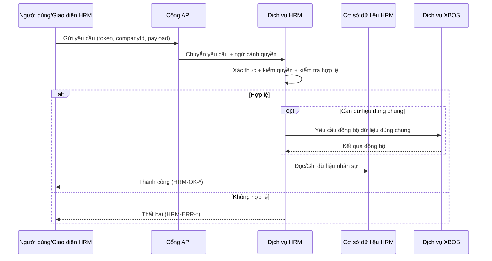

# SRS Phân Hệ HRM

## 1. Mục Đích

Đặc tả yêu cầu phần mềm cho HRM theo mức triển khai, bảo đảm:

- đồng nhất hoàn toàn với BRD HRM 2.2,
- phản ánh thực tế HRM là một phân hệ nghiệp vụ trong hệ sinh thái,
- sử dụng thuật ngữ Việt hóa đầy đủ,
- đặc tả rõ nhánh điều kiện if/else, kiểm tra hợp lệ, thành công/thất bại, mã lỗi.

### 1.1 Tham chiếu bắt buộc — phạm vi dữ liệu toàn hệ

Mọi use case HRM có truy cập dữ liệu theo tenant phải **bổ sung** hành vi từ `UC-ECO-SCOPE-01` và `UC-ECO-SCOPE-02` trong `docs/ecosystem/SRS.md` (và quy tắc nghiệp vụ `docs/ecosystem/BRD.md`). Không lặp lại toàn văn; khi bổ sung phân hệ khác trong hệ sinh thái, chỉ cần tham chiếu cùng bộ tài liệu ecosystem.

## 2. Danh Sách Use Case Chuẩn

| Mã use case | Tên | Điểm vào API chính |
|---|---|---|
| UC-HRM-01 | Kiểm tra trạng thái dịch vụ | `GET /api/hrm` |
| UC-HRM-02 | Tạo quản trị nền tảng | `POST /api/hrm/admin/platform-admin` |
| UC-HRM-03 | Tạo/cập nhật quản trị doanh nghiệp | `POST|PATCH /api/hrm/admin/company-admin` |
| UC-HRM-04 | Mời nhân viên hàng loạt | `POST /api/hrm/admin/invite-employees` |
| UC-HRM-05 | Cập nhật thông tin nhạy cảm tài khoản | `POST /api/hrm/admin/reset-user-password` |
| UC-HRM-06 | Đồng bộ dữ liệu dùng chung từ XBOS | `POST /api/hrm/catalog-sync/pull` |
| UC-HRM-07 | Lấy dữ liệu dùng chung theo khóa | `GET /api/hrm/catalog-sync/catalog/:catalogKey?target=...` |
| UC-HRM-08 | Liệt kê dữ liệu dùng chung theo phân hệ đích | `GET /api/hrm/catalog-sync/catalogs?target=...` |

## 3. Luồng Nghiệp Vụ Tổng Quát (Sequence)

## 4. Đặc Tả Use Case Chi Tiết

### UC-HRM-01 - Kiểm tra trạng thái dịch vụ

- If dịch vụ sẵn sàng -> `HRM-OK-HEALTH`.
- Else -> `HRM-ERR-SERVICE-UNAVAILABLE`.

### UC-HRM-02 - Tạo quản trị nền tảng

- If người gọi không có quyền nền tảng -> `HRM-ERR-FORBIDDEN`.
- Else if payload thiếu trường bắt buộc -> `HRM-ERR-VALIDATION`.
- Else if tài khoản đã tồn tại ở vai trò này -> `HRM-ERR-CONFLICT`.
- Else -> tạo thành công.

### UC-HRM-03 - Tạo/Cập Nhật quản trị doanh nghiệp

- If phạm vi công ty không hợp lệ -> `HRM-ERR-SCOPE-INVALID`.
- Else if dữ liệu định danh không hợp lệ -> `HRM-ERR-VALIDATION`.
- Else if tạo mới và chưa tồn tại -> tạo thành công.
- Else if cập nhật và đã tồn tại -> cập nhật thành công.
- Else -> `HRM-ERR-ADMIN-NOT-FOUND`.

### UC-HRM-04 - Mời nhân viên hàng loạt

- If danh sách rỗng -> `HRM-ERR-VALIDATION`.
- Else xử lý từng bản ghi:
  - If bản ghi hợp lệ -> tạo lời mời thành công.
  - Else -> gán lỗi cho bản ghi đó.
- If có bản ghi lỗi -> không dừng toàn bộ lô, vẫn trả kết quả theo từng bản ghi.

### UC-HRM-05 - Cập nhật thông tin nhạy cảm tài khoản

- If không đủ quyền nhạy cảm -> `HRM-ERR-FORBIDDEN`.
- Else if tài khoản không tồn tại -> `HRM-ERR-USER-NOT-FOUND`.
- Else if dữ liệu mới vi phạm chính sách -> `HRM-ERR-VALIDATION`.
- Else -> cập nhật thành công và ghi nhật ký.

### UC-HRM-06 - Đồng bộ dữ liệu dùng chung từ XBOS

- If thiếu khóa danh mục hoặc phân hệ đích -> `HRM-ERR-VALIDATION`.
- Else gọi XBOS:
  - If XBOS trả lỗi -> `HRM-ERR-DONG-BO-DANH-MUC`.
  - Else -> cập nhật ảnh chụp dữ liệu dùng chung tại HRM.

### UC-HRM-07 - Lấy dữ liệu dùng chung theo khóa

- If không có dữ liệu theo khóa -> `HRM-ERR-DANH-MUC-KHONG-TON-TAI`.
- Else if sai quyền/phạm vi -> `HRM-ERR-FORBIDDEN`.
- Else -> trả dữ liệu thành công.

### UC-HRM-08 - Liệt kê dữ liệu dùng chung theo phân hệ đích

- If phân hệ đích không hợp lệ -> `HRM-ERR-TARGET-INVALID`.
- Else -> trả danh sách theo điều kiện lọc.

## 5. Ma Trận Kiểm Tra Hợp Lệ Dữ Liệu

| Thành phần | Quy tắc | Mã lỗi |
|---|---|---|
| `token` | hợp lệ, chưa hết hạn | `HRM-ERR-AUTH-INVALID` |
| `role` | đúng vai trò yêu cầu | `HRM-ERR-FORBIDDEN` |
| `tenantId/companyId` | đúng phạm vi của người gọi | `HRM-ERR-SCOPE-INVALID` |
| `email` | đúng định dạng, không rỗng | `HRM-ERR-VALIDATION` |
| `inviteItems[]` | tối thiểu 1 bản ghi, kiểm tra từng bản ghi | `HRM-ERR-BATCH-ITEM-INVALID` |
| `catalogKey/target` | đúng quy tắc đồng bộ từ XBOS | `HRM-ERR-DONG-BO-DANH-MUC` |

## 6. Danh Mục Mã Lỗi Chuẩn

| Mã lỗi | HTTP | Ý nghĩa |
|---|---|---|
| `HRM-ERR-AUTH-INVALID` | 401 | Token không hợp lệ/hết hạn |
| `HRM-ERR-FORBIDDEN` | 403 | Không đủ quyền thao tác |
| `HRM-ERR-SCOPE-INVALID` | 403 | Sai phạm vi tenant/công ty |
| `HRM-ERR-VALIDATION` | 400 | Dữ liệu đầu vào không hợp lệ |
| `HRM-ERR-CONFLICT` | 409 | Xung đột dữ liệu đã tồn tại |
| `HRM-ERR-ADMIN-NOT-FOUND` | 404 | Không tìm thấy quản trị doanh nghiệp |
| `HRM-ERR-USER-NOT-FOUND` | 404 | Không tìm thấy tài khoản người dùng |
| `HRM-ERR-BATCH-ITEM-INVALID` | 400 | Có bản ghi trong lô không hợp lệ |
| `HRM-ERR-DONG-BO-DANH-MUC` | 502 | Lỗi đồng bộ dữ liệu dùng chung |
| `HRM-ERR-DANH-MUC-KHONG-TON-TAI` | 404 | Không có dữ liệu dùng chung theo khóa |
| `HRM-ERR-TARGET-INVALID` | 400 | Phân hệ đích không hợp lệ |
| `HRM-ERR-SERVICE-UNAVAILABLE` | 503 | Dịch vụ tạm không sẵn sàng |

## 7. Danh Mục Mã Thành Công

| Mã thành công | HTTP | Use case |
|---|---|---|
| `HRM-OK-HEALTH` | 200 | UC-HRM-01 |
| `HRM-OK-PLATFORM-ADMIN-CREATED` | 201 | UC-HRM-02 |
| `HRM-OK-COMPANY-ADMIN-SAVED` | 200/201 | UC-HRM-03 |
| `HRM-OK-BATCH-PROCESSED` | 200 | UC-HRM-04 |
| `HRM-OK-USER-SENSITIVE-UPDATED` | 200 | UC-HRM-05 |
| `HRM-OK-DONG-BO-DANH-MUC` | 200 | UC-HRM-06 |
| `HRM-OK-DANH-MUC-GET` | 200 | UC-HRM-07 |
| `HRM-OK-DANH-MUC-LIST` | 200 | UC-HRM-08 |

## 8. Quy Tắc Xử Lý Lô (UC-HRM-04)

- Mỗi bản ghi phải có `status`, `code`, `message`.
- Bản ghi lỗi không hoàn tác bản ghi thành công.
- Kết quả bắt buộc có:
  - `totalItems`,
  - `successCount`,
  - `failedCount`,
  - `itemResults[]`.

## 9. Yêu Cầu Phi Chức Năng

- Bảo mật: bắt buộc xác thực, kiểm quyền, kiểm tra phạm vi.
- Độ tin cậy: nhánh lỗi không tạo thay đổi trạng thái ngoài ý định.
- Hiệu năng: xử lý lô và truy vấn danh sách đáp ứng ổn định.
- Khả năng vận hành: nhật ký có mã tương quan giao dịch, không lộ dữ liệu nhạy cảm.

## 10. Tiêu Chí Chấp Nhận

- Use case UC-HRM-01..08 có kịch bản thành công/thất bại rõ ràng.
- Mã lỗi và HTTP status đúng bảng chuẩn tại mục 6.
- Nội dung use case đồng nhất với BRD HRM 2.2 và thuật ngữ Việt hóa.
