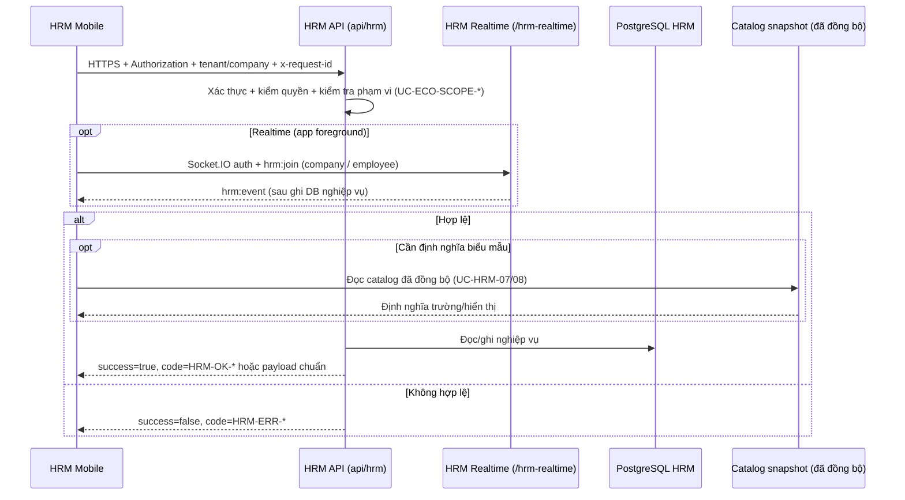

# SRS Ứng Dụng Di Động HRM (HRM Mobile)

## 1. Mục Đích

Đặc tả yêu cầu phần mềm cho **HRM Mobile**, bảo đảm:

- đồng nhất với `docs/hrm/BRD_MOBILE.md` phiên bản **1.1**,
- bổ sung cho `docs/hrm/SRS.md` (HRM lõi) mà **không** thay thế mã use case `UC-HRM-01`..`08`,
- thuật ngữ Việt hóa đầy đủ,
- đặc tả rõ nhánh **if/else**, kiểm tra hợp lệ, thành công/thất bại, mã lỗi (API + lớp client).

### 1.1 Tham chiếu bắt buộc — phạm vi dữ liệu toàn hệ

Mọi use case mobile có truy cập dữ liệu theo tenant phải **bổ sung** hành vi từ `UC-ECO-SCOPE-01` và `UC-ECO-SCOPE-02` trong `docs/ecosystem/SRS.md` (và quy tắc `docs/ecosystem/BRD.md`). Không lặp lại toàn văn.

### 1.2 Tham chiếu API HRM

Mobile là **consumer** của `hrm-api` (tiền tố toàn cục `api/hrm`). Các endpoint chi tiết theo từng module triển khai trong `apps/api/hrm-api/src/**/*controller.ts`. Khi contract thay đổi, cập nhật bảng tại mục 3 và ma trận mục 11.

### 1.3 Quy tắc giao hàng (bắt buộc)

Tuân thủ **mục 1.1** `docs/hrm/BRD.md` và **mục 1.1** `docs/hrm/BRD_MOBILE.md`: cập nhật SRS Mobile (và BRD/TechSpec mobile liên quan) **trước hoặc cùng** thay đổi code trong `apps/mobile/hrm-mobile`.

## 2. Danh Sách Use Case Chuẩn (Mobile)

| Mã use case | Tên | Điểm vào kỹ thuật chính |
|---|---|---|
| UC-HRM-MOB-01 | Đăng nhập và thiết lập phiên an toàn | Luồng xác thực (SSO/OAuth hoặc nhà cung cấp hiện hữu) + `GET /api/hrm` |
| UC-HRM-MOB-02 | Chọn và xác nhận phạm vi công ty | Ngữ cảnh `tenantId` / `companyId` trên mọi request |
| UC-HRM-MOB-03 | Xem bảng điều khiển cá nhân | Gọi ghép nhiều API read (employees, attendance, operations, …) |
| UC-HRM-MOB-04 | Ghi nhận chấm công / điểm danh | `POST /api/hrm/attendance/...` (theo DTO hiện có) |
| UC-HRM-MOB-05 | Xem lịch sử chấm công | `GET /api/hrm/attendance/...` |
| UC-HRM-MOB-06 | Tạo đơn chỉnh sửa chấm công hoặc đơn nghỉ phép | `POST /api/hrm/attendance/update-requests`, `POST /api/hrm/attendance/leave-requests` |
| UC-HRM-MOB-07 | Xem danh sách đơn và trạng thái | `GET /api/hrm/attendance/update-requests`, `GET /api/hrm/attendance/leave-requests` |
| UC-HRM-MOB-08 | Phê duyệt hoặc từ chối đơn chờ (chấm công + nghỉ) | `POST .../update-requests/:id/approve|reject`, `POST .../leave-requests/:id/approve|reject` |
| UC-HRM-MOB-09 | Xem tóm tắt lương theo kỳ | `GET /api/hrm/payroll/...` |
| UC-HRM-MOB-10 | Xem hợp đồng và bảo hiểm | `GET /api/hrm/contracts-insurance/...` |
| UC-HRM-MOB-11 | Quản lý công việc và yêu cầu dịch vụ | `GET|POST|PATCH /api/hrm/operations/...` |
| UC-HRM-MOB-12 | Xem và cập nhật hồ sơ cá nhân | `GET|PATCH /api/hrm/employees/...`, `.../employee-metadata/...` |
| UC-HRM-MOB-13 | Nhận thông báo | In-app + **Socket.IO** + `GET /api/hrm/notifications/inbox`; đăng ký `POST .../push-tokens`; push FCM/Expo tuỳ chọn — xem `TECHSPEC_MOBILE.md` |
| UC-HRM-MOB-14 | Làm việc ngoại tuyến có kiểm soát | Cache read-only cục bộ |
| UC-HRM-MOB-15 | Đăng xuất và thu hồi phiên | Xoá token an toàn + revoke nếu có endpoint |

## 3. Luồng Kỹ Thuật Tổng Quát (Sequence)



## 4. Đặc Tả Use Case Chi Tiết

### UC-HRM-MOB-01 — Đăng nhập và thiết lập phiên an toàn

- If thông tin đăng nhập không hợp lệ -> hiển thị lỗi xác thực; không lưu mật khẩu dạng rõ.
- Else if xác thực thành công nhưng **thiếu** ngữ cảnh tenant/công ty khả dụng -> `HRM-ERR-SCOPE-INVALID` hoặc màn hình hướng dẫn liên hệ quản trị.
- Else if `GET /api/hrm` trả lỗi mạng/timeout -> `HRM-MOB-ERR-NETWORK` (client).
- Else -> lưu token theo chuẩn `TECHSPEC_MOBILE.md`; chuyển UC-HRM-MOB-02 hoặc UC-HRM-MOB-03.

### UC-HRM-MOB-02 — Chọn và xác nhận phạm vi công ty

- If người dùng chỉ có **một** công ty hợp lệ -> tự gán ngầm, không bắt chọn lại mỗi lần mở app (có thể đổi trong Cài đặt).
- Else if nhiều công ty -> buộc chọn trước khi vào chức năng ghi dữ liệu.
- Else if công ty chọn không thuộc phạm vi token -> `HRM-ERR-SCOPE-INVALID`.
- Else -> ghi nhận `companyId` đang hoạt động vào state ứng dụng.

#### Delta FR-HRM-MOB-OU-01 (ADD 2026-07-23 · orphan #2)

- Bộ lọc / Scope hiển thị đơn vị: nếu copy = **công ty / ĐVTV** → nhãn **Plane A** (cùng SoT **FR-HRM-EMP-COL-01** trên web) — **cấm** «Khối … X.E».
- Nếu giữ surface **đơn vị vận hành (Plane B)** → copy tách rõ; không ghi đè nghĩa «công ty».
- AC: AC-MOB-OU-01..02 — `docs/program/deltas/BA_HRM_ORPHAN_TO_SRS_01_20260723.md` §16.2.

### UC-HRM-MOB-03 — Xem bảng điều khiển cá nhân

- If token hết hạn -> `HRM-ERR-AUTH-INVALID` -> điều hướng UC-HRM-MOB-01.
- Else if một trong các API tổng hợp lỗi -> hiển thị **partial state** (card lỗi theo module), không crash toàn màn hình.
- Else -> hiển thị tóm tắt: trạng thái chấm công hôm nay, số đơn đang xử lý, việc gấp (nếu có dữ liệu).

#### Delta FR-HRM-MOB-HUB-01 (ADD 2026-07-23 · orphan #17)

- Section Home (sinh nhật, who’s-out, celebration) có **limit + TZ + leave_type label** khóa trong FR — xem delta §16.17; AC-MOB-HUB-01..03.

### UC-HRM-MOB-04 — Ghi nhận chấm công / điểm danh

- If đang ngoại tuyến (P2 chưa bật) -> `HRM-MOB-ERR-OFFLINE`; không gọi API.
- Else if payload vi phạm validation server -> `HRM-ERR-VALIDATION`.
- Else if trùng luật nghiệp vụ (ví dụ đã chấm) -> `HRM-ERR-CONFLICT` hoặc mã nghiệp vụ cụ thể do BE trả.
- Else -> thành công; làm mới UC-HRM-MOB-05.

### UC-HRM-MOB-05 — Xem lịch sử chấm công

- If không có dữ liệu trong phạm vi -> danh sách rỗng có thông điệp nghiệp vụ.
- Else if lỗi phân trang (page không hợp lệ) -> `HRM-ERR-VALIDATION`.
- Else -> hiển thị theo trang; giữ `x-request-id` để hỗ trợ.

### UC-HRM-MOB-06 — Tạo đơn chỉnh sửa chấm công hoặc đơn nghỉ phép

- If thiếu trường bắt buộc theo DTO server (mã nhân viên, UUID công ty, ngày, loại đơn, v.v.) -> `HRM-ERR-VALIDATION` kèm chi tiết trường.
- Else if người dùng không có quyền tạo loại đơn đó -> `HRM-ERR-FORBIDDEN`.
- Else if tạo **đơn nghỉ** (`POST .../leave-requests`) thành công -> server fanout `leave_request.created` (SRS `UC-HRM-10`); client có thể làm mới UC-HRM-MOB-07 / UC-HRM-MOB-13.
- Else if tạo **đơn chỉnh sửa chấm công** (`POST .../update-requests`) thành công -> fanout `attendance_update_request.created` (`UC-HRM-09`).
- Else -> thành công; điều hướng UC-HRM-MOB-07.

### UC-HRM-MOB-07 — Xem danh sách đơn và trạng thái

- If lọc không hợp lệ -> `HRM-ERR-VALIDATION`.
- Else -> hiển thị danh sách **update-requests** và/hoặc **leave-requests** theo tab hoặc màn hình riêng; hỗ trợ kéo để làm mới.

### UC-HRM-MOB-08 — Phê duyệt hoặc từ chối đơn chờ (chấm công + nghỉ)

- If vai trò không phải quản lý có quyền -> `HRM-ERR-FORBIDDEN`.
- Else if đơn không ở trạng thái cho phép quyết định -> `HRM-ERR-VALIDATION` hoặc `HRM-ERR-CONFLICT`.
- Else if quyết định **đơn nghỉ** -> gọi `POST .../leave-requests/:id/approve|reject` với `reviewer_name` (và tuỳ chọn `reviewer_employee_id`); server fanout `leave_request.approved|rejected`.
- Else if quyết định **đơn chỉnh sửa chấm công** -> `POST .../update-requests/:id/approve|reject` với `approver_name` theo contract.
- Else -> cập nhật thành công; ghi nhật ký phía server.

### UC-HRM-MOB-09 — Xem tóm tắt lương theo kỳ

- If không có kỳ lương khả dụng -> màn hình rỗng có hướng dẫn.
- Else if dữ liệu nhạy cảm bị chính sách che -> chỉ hiển thị phần được phép.
- Else -> hiển thị tóm tắt; không bắt buộc in PDF trên mobile tại P1.

### UC-HRM-MOB-10 — Xem hợp đồng và bảo hiểm

- If không có bản ghi -> thông báo rõ.
- Else -> read-only; tải tệp (nếu có) theo policy bảo mật và dung lượng.

### UC-HRM-MOB-11 — Quản lý công việc và yêu cầu dịch vụ nội bộ

- If thao tác vượt quyền -> `HRM-ERR-FORBIDDEN`.
- Else -> mapping đúng DTO operations hiện có.

### UC-HRM-MOB-12 — Xem và cập nhật hồ sơ cá nhân

- If trường thuộc nhóm chỉ đọc theo policy -> chặn sửa UI.
- Else if vi phạm validation metadata -> `HRM-ERR-VALIDATION`.
- Else -> cập nhật thành công.

### UC-HRM-MOB-13 — Nhận thông báo

- If chỉ in-app (pull) -> hiển thị badge theo sự kiện đã fetch; làm mới thủ công hoặc khi focus màn hình; đọc **hộp thư đã lưu** qua `GET /api/hrm/notifications/inbox?company_id=&employee_id=` (UUID công ty + UUID nhân viên xem).
- Else if **realtime** đã bật và app đang chạy -> mở Socket.IO namespace `/hrm-realtime` (path `/socket.io/`), xác thực giống REST (`Authorization` hoặc `internalApiKey` trong handshake `auth`), gửi `hrm:join` với `companyUuid` và tùy chọn `employeeId`; nhận `hrm:event` (ví dụ `attendance_update_request.*`).
- Else if push nền (Expo / FCM) đã cấu hình -> `POST /api/hrm/notifications/push-tokens` sau khi có quyền thông báo; xử lý tap mở đúng màn hình (deep link, backlog).
- Else if đánh dấu đã đọc (tin cá nhân) -> `PATCH /api/hrm/notifications/inbox/:id/read?company_id=` + body `{ viewer_employee_id }` khớp `recipient_employee_id` trên hàng đích.
- Else -> không hiển thị cấu hình push ảo; realtime có thể tắt nếu thiếu UUID công ty hoặc lỗi mạng (`HRM-MOB-ERR-NETWORK`).

### UC-HRM-MOB-14 — Làm việc ngoại tuyến có kiểm soát (P2)

- If không có cache -> thông báo ngoại tuyến.
- Else -> chỉ đọc dữ liệu đã cache; hiển thị banner “chỉ xem”.
- If người dùng cố ghi khi offline -> `HRM-MOB-ERR-OFFLINE`.

### UC-HRM-MOB-15 — Đăng xuất và thu hồi phiên

- If revoke không có trên server -> xoá cục bộ token + state.
- Else -> gọi revoke rồi xoá cục bộ.

## 5. Ma Trận Kiểm Tra Hợp Lệ (Mobile + API)

| Thành phần | Quy tắc | Mã lỗi |
|---|---|---|
| `Authorization` | hợp lệ, chưa hết hạn | `HRM-ERR-AUTH-INVALID` |
| `tenantId` / `companyId` | khớp phạm vi token | `HRM-ERR-SCOPE-INVALID` |
| `x-request-id` | UUID hoặc chuỗi duy nhất mỗi request | Khuyến nghị; lỗi server vẫn map `HRM-ERR-*` |
| Payload theo DTO | đúng schema | `HRM-ERR-VALIDATION` |
| Mạng không khả dụng | không gửi được request | `HRM-MOB-ERR-NETWORK` |
| Thiết bị offline (P2 tắt) | chặn ghi | `HRM-MOB-ERR-OFFLINE` |

## 6. Danh Mục Mã Lỗi Bổ Sung (Lớp Client)

| Mã lỗi | Ý nghĩa | Ghi chú |
|---|---|---|
| `HRM-MOB-ERR-NETWORK` | Không kết nối được máy chủ / timeout | Không map trực tiếp sang HTTP |
| `HRM-MOB-ERR-OFFLINE` | Thiết bị không mạng và chức năng không cho ghi | P0/P1 mặc định |
| `HRM-MOB-ERR-SESSION-EXPIRED` | Phiên cục bộ hết hạn trước khi nhận 401 | Điều hướng đăng nhập |

Các mã `HRM-ERR-*` và `HRM-OK-*` từ `docs/hrm/SRS.md` **áp dụng nguyên vẹn** cho phản hồi API.

## 7. Luồng Phê Duyệt Đơn (Sequence — P1)

```mermaid
sequenceDiagram
  participant Q as Quản lý (Mobile)
  participant A as HRM API
  participant N as Nhân viên (hệ thống thông báo)

  Q->>A: Lấy danh sách đơn chờ (GET)
  A-->>Q: Danh sách + trạng thái
  Q->>A: Gửi quyết định (PATCH/POST theo contract)
  alt Quyết định hợp lệ
    A-->>Q: Thành công
    A-->>N: Socket.IO `hrm:event` tới app đang mở (room employee); push nền tuỳ chọn
  else Không hợp lệ
    A-->>Q: HRM-ERR-* 
  end
```

## 8. Yêu Cầu Phi Chức Năng

- Bảo mật: lưu trữ credential theo `TECHSPEC_MOBILE.md`; không chụp màn hình mặc định trên màn nhạy cảm (tuỳ nền tảng).
- Hiệu năng: giới hạn đồng thời request tổng hợp dashboard (ví dụ tối đa 4 song song).
- Khả năng vận hành: log client (không PII) kèm `x-request-id` khi báo lỗi.

## 9. Tiêu Chí Chấp Nhận

- Mỗi use case `UC-HRM-MOB-*` có ít nhất một kịch bản **thành công** và một **thất bại** trong kế hoạch kiểm thử.
- Mọi response lỗi từ API phải map được sang mã `HRM-ERR-*` hiển thị cho người dùng cuối (không hiển thị stack trace).
- Tuân thủ tham chiếu `UC-ECO-SCOPE-01/02` trên mọi luồng có dữ liệu tenant.

## 10. Ma Trận Truy Vết (BRD Mobile → SRS Mobile)

| BRD (UC-HRM-MOB-*) | SRS (mục đặc tả) |
|---|---|
| UC-HRM-MOB-01 | Mục 4.1 |
| UC-HRM-MOB-02 | Mục 4.2 |
| UC-HRM-MOB-03 | Mục 4.3 |
| UC-HRM-MOB-04 | Mục 4.4 |
| UC-HRM-MOB-05 | Mục 4.5 |
| UC-HRM-MOB-06 | Mục 4.6 |
| UC-HRM-MOB-07 | Mục 4.7 |
| UC-HRM-MOB-08 | Mục 4.8, 7 |
| UC-HRM-MOB-09 | Mục 4.9 |
| UC-HRM-MOB-10 | Mục 4.10 |
| UC-HRM-MOB-11 | Mục 4.11 |
| UC-HRM-MOB-12 | Mục 4.12 |
| UC-HRM-MOB-13 | Mục 4.13 |
| UC-HRM-MOB-14 | Mục 4.14 |
| UC-HRM-MOB-15 | Mục 4.15 |
