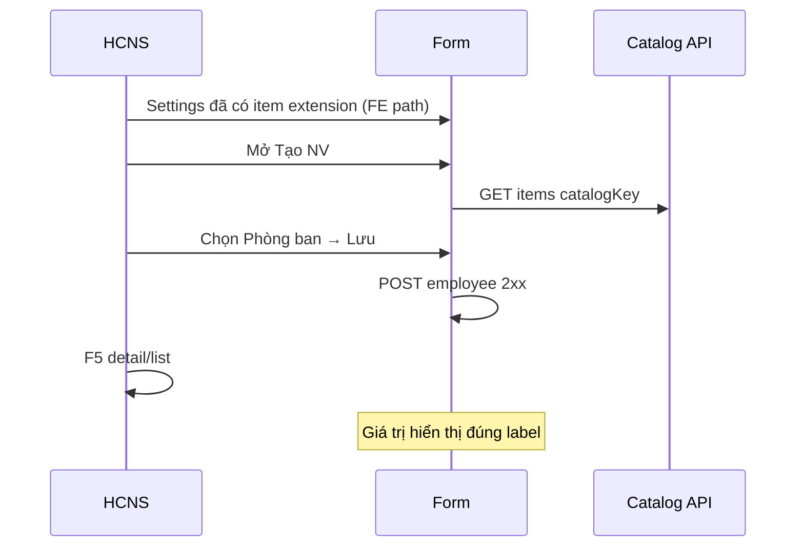

# UI_SCREEN_SPEC — Consumer catalog (Nhân sự + Tuyển dụng)

| Meta | Value |
|------|--------|
| **Screen ID** | `UI-CATALOG-CONSUMER-EMP-REC` |
| **work_item_id** | `PO-HRM-SETTINGS-CATALOG-CONSUMER-FE-01` |
| **ref_srs** | **UF-HRM-10** · FR-HRM-08 · §16 O4 consumer |
| **ref_matrix** | `HRM_MENU_DATA_LINKAGE_MATRIX.md` — employee create · REC forms |
| **ref_api** | `API_DESIGN_HRM_SETTINGS_CATALOG.md` · items effective per `catalogKey` |
| **honesty** | `settings_catalog_e2e_ready=false` until QA full consumer matrix |

---

## 1. Screen ID + route (in-scope consumer)

| Màn | Route / entry |
|-----|----------------|
| Tạo/sửa NV | `/employees` → create/edit form |
| Tuyển dụng (JD/REQ) | `/recruitment` · form có picker catalog |
| Hợp đồng (đã partial) | Contracts create — **Phòng ban** REQUIRED (`PO-HRM-SETTINGS-FIDELITY-FE-03`) |

**SoT catalog:** Settings sync + extension (`UI-SETTINGS-CATALOGS-SYNC`) — consumer **đọc effective items**, không duplicate XBOS merge logic trên FE.

---

## 2. Mục đích

Form nghiệp vụ dùng **Select/combobox** từ catalog đã đồng bộ (phòng ban, chức danh, loại HĐ, …) — giá trị lưu = `item_key` / code the API_DESIGN, nhãn = label VI.

---

## 3. IA pattern

```text
Form field (label SRS)
  └─ SettingsDialogSelectContent / catalog picker
       └─ GET effective items by catalogKey + scope company
```

**Cấm:** free-text SoT cho field đã khóa catalog trong SRS/TechSpec.

---

## 4. Field map (P1 — rà soát khi code)

| Form | Field UI | catalogKey (ví dụ) | Ghi chú |
|------|----------|-------------------|---------|
| Employee create | Phòng ban | `departments` | FK soft / code |
| Employee create | Chức danh | `positions` | tenant catalog |
| REC requisition | Loại JD / ngạch | theo matrix REC | picker not stub |
| Contract create | Phòng ban | `departments` | **must_keep** fidelity FE-03 |

Mở rộng: đối chiếu `HRM_MENU_DATA_LINKAGE_MATRIX` từng menu — thêm dòng vào bảng này khi BA xác nhận.

---

## 5. Luồng tương tác (U65)



**Không seed:** item catalog phải tạo qua Settings (tab catalog) trước khi QA consumer PASS.

---

## 6. Empty / error

| Trạng thái | UX |
|------------|-----|
| Catalog trống | Inline hint + link **Cài đặt → Danh mục** |
| Sync chưa chạy | CTA đồng bộ XBOS (admin) |
| 409 scope | Banner scope — không list rỗng im lặng |

---

## 7. AC UI

| AC | Bước | Network | FE sau 2xx |
|----|------|---------|------------|
| EMP-CAT-01 | Tạo NV chọn phòng ban | GET items 2xx · POST employee 2xx | List/detail hiển thị label |
| REC-CAT-01 | Form REC picker | GET items 2xx | Lưu + F5 |
| REG | Vitest consumer hooks | — | Không regression Settings W3 sealed |

**Evidence:** `docs/qa/evidence/po-hrm-settings-catalog-consumer-fe-02.md`

**must_keep:** W3 F5 catalog tabs (`SETW3QC1`) — không sửa focus store cùng lúc Claude consumer trừ peer PARK.
