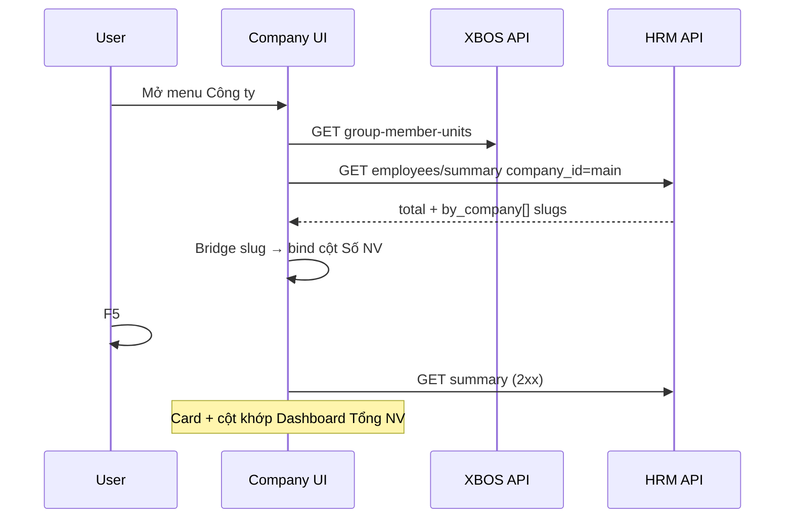

# UI_SCREEN_SPEC — Embed · Quản lý công ty (headcount + ngành)

| Meta | Value |
|------|--------|
| **Screen ID** | `UI-CO-COMPANY-HEADCOUNT` |
| **work_item_id** | `D-HRM-CO-01-SUMMARY-BE-01` (BE) · `D-HRM-CO-01-INDUSTRY-FE-01` (industry — QA PASS) |
| **ref_srs** | **UC-HRM-CO-01** · **FR-HRM-CO-HC-01** · **FR-HRM-CO-IND-01** · **AC-CO-EMP-01..06** · **AC-CO-IND-01..04** |
| **ref_api_design** | `API_DESIGN_HRM_COMPANY_LIST.md` (Plane A list) · **`API_DESIGN_HRM_EMPLOYEES_SUMMARY.md`** (Plane B headcount SoT) |
| **ref_db** | `DB_DESIGN_HRM_CO_HC.md` · bridge **BR-INT-05** |

---

## 1. Screen ID + route

| Mục | Giá trị |
|-----|---------|
| Route | `/command-center/hrm/company` (embed) · portal `companyId=main` |
| Persona | Group CEO `ceo@xe.vn` |
| Component | Company Management (XBOS units + HRM enrich) |

---

## 2. Mục đích

Hiển thị **đơn vị thành viên** (Plane A — XBOS) kèm **số nhân viên thực tế** (Plane B — HRM slug) và **ngành nghề** (business line VI, không `entity_type`).

---

## 3. IA layout

```text
┌──────────────────────────────────────────────────────────────┐
│ Card: Tổng nhân viên  ← data.total (HRM summary main)      │
├──────────────────────────────────────────────────────────────┤
│ Bảng ĐVTV: Tên | MST | … | Số NV | Ngành nghề | …           │
│   Số NV ← by_company[slug].total                             │
│   Ngành ← business_lines / catalog (XBOS), không entity_type │
└──────────────────────────────────────────────────────────────┘
```

---

## 4. Thành phần UI ↔ API

| UI | Nguồn | Field bind |
|----|--------|------------|
| Danh sách ĐVTV | XBOS `group-member-units` (+ `business_lines`) | `name`, MST, … |
| Card «Tổng nhân viên» | `GET /api/hrm/employees/summary?company_id=main` | `data.total` |
| Cột «Số nhân viên» | Cùng response | `by_company[]` where `company_id === operating_slug` → `total` |
| Cột «Ngành nghề» | XBOS / `business_lines` | Nhãn VI hoặc **«—»** nếu thiếu |
| Lỗi HRM count | Non-2xx / timeout | **«—»** — **cấm** hiển thị `0` như thành công |

**Bridge (FE/registry):** map LE/tên ĐVTV → slug ∈ `GROUP_MEMBER_SLUGS` trước khi join `by_company`.

---

## 5. Luồng tương tác



---

## 6. Empty / error / loading

| Trạng thái | Hiển thị |
|------------|----------|
| Loading | Skeleton card + bảng |
| XBOS OK, HRM fail | ĐVTV có · Số NV **«—»** |
| 0 NV thật | `0` chỉ khi API trả `total=0` / slug row `total=0` |
| Không `business_lines` | Ngành **«—»** (P2 env — không crash) |

---

## 7. AC UI (QA)

| ID | Click / Network | FE sau 2xx | testid gợi ý |
|----|-----------------|------------|--------------|
| AC-CO-EMP-01 | Card visible | ≈ Dashboard summary total | `co-total-headcount` |
| AC-CO-EMP-02 | Mỗi dòng slug | Cột = `by_company[slug].total` | `co-row-{slug}-count` |
| AC-CO-EMP-06 | F5 | Số giữ nguyên · GET summary 2xx | — |
| AC-CO-IND-01 | Cột ngành | VI label hoặc «—» | `co-row-{slug}-industry` |

**Dev BE (Claude P0):** batch enrich / scope parity với `GET /employees` · jest `hrm-list-scope` · evidence `d-hrm-co-01-summary-be-01.md`.

**must_keep:** Không UUID Plane B trong `by_company[].company_id` · không XBOS-only headcount.
