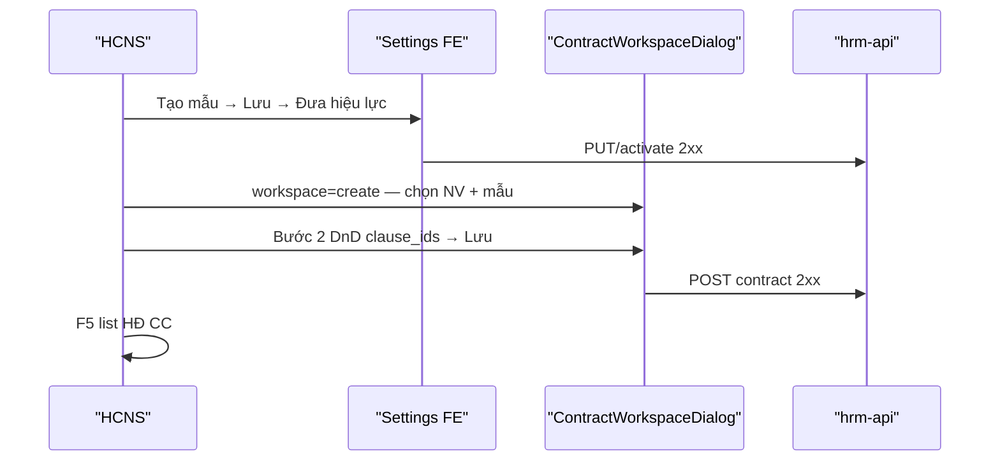

# UI_SCREEN_SPEC — Hợp đồng · Luồng U65 (mẫu active + NV-first workspace)

| Meta | Value |
|------|--------|
| **Screen ID** | `UI-CTR-CREATE-U65-TEMPLATE-PATH` |
| **work_item_id** | `HRM-CTR-U65-TPL-UV-FE-PATH-01` · **AMEND** `PO-HRM-CTR-UIUX-SPEC-PACK-G5` |
| **ref_srs** | FR-UC-BP-CORE-09 · 09d · AC-CTR-* |
| **ref_settings** | **`UI-SETTINGS-CTR-TEMPLATE-COMPOSER.md`** · **PAT-DIALOG-FULL-VIEWPORT-CC-01** |
| **ref_workspace** | **[`UI-HRM-CTR-WORKSPACE.md`](./UI-HRM-CTR-WORKSPACE.md)** — SoT dialog tạo/sửa/xem |
| **ref_audit** | `PO-HRM-CTR-CREATE-AUDIT-WAVE-01` |
| **U65** | Zero seed — mẫu HĐ **active** chỉ từ Settings FE path |
| **honesty** | `contracts_printable_ready=false` |

---

## AMEND G5 (2026-08-11)

| Trước | Sau (G5) |
|-------|----------|
| Step1 «chọn NV (inline UV)» mặc định UV | **NV-first** trên CC create — tab **Nhân viên** mặc định |
| UV implicit default | UV chỉ qua tab **«Ứng viên (Offer trước hire)»** hoặc REC CTA [`UI-HRM-CTR-HIRE-CTA.md`](./UI-HRM-CTR-HIRE-CTA.md) |
| Dialog = `ContractCreateWizardDialog` only | **SoT** = `ContractWorkspaceDialog` — xem WORKSPACE |
| Route `/contracts/create` | `/contracts?workspace=create` (+ deep-link params) |

**Deprecate:** mô tả UV-default trong §3 cũ — thay bằng WORKSPACE §5 mode matrix.

---

## 1. Screen ID + route

| Bước | Route |
|------|--------|
| A — Settings | `/settings?tab=contract-templates` |
| B — Create HĐ | CC `…/command-center/hrm/contracts` · `workspace=create` |

---

## 2. Mục đích

Khép chuỗi nghiệm thu U65: **Tạo/kích hoạt mẫu HĐ** trên Settings → **ContractWorkspaceDialog** chọn **NV** (mặc định G5) + template active → **Bước 2** kéo-thả `clause_ids` (không sửa body) → Lưu 2xx → F5.

---

## 3. IA — hai màn liên thông

```text
[A] Settings — Mẫu HĐ (composer dialog full viewport parent)
     List → Sửa/Thêm → Meta + Palette|Canvas → [Lưu] [Đưa hiệu lực]
     SoT clause body: tab Điều khoản (UI-SETTINGS-CTR-CLAUSES)

[B] ContractWorkspaceDialog (UI-HRM-CTR-WORKSPACE)
     Step1: NV-first picker + template (dropdown active only)
     Step2: Canvas DnD clause_ids từ template/palette
     → Lưu hợp đồng (POST …/contracts)
```

**Không:** soạn nội dung điều khoản tại B — chỉ reorder/select ids.

---

## 4. Thành phần UI ↔ API

| Bước | UI | API |
|------|-----|-----|
| A list | `settings-contract-templates` | `listContractTemplates` |
| A Lưu/Kích hoạt | Composer dialog | `updateContractTemplate` · `activateContractTemplate` |
| B step1 NV | `ctr-create-subject-tab-employee` (default) | `GET …/employees` · `GET …/contract-create-context` |
| B step1 UV (explicit) | `ctr-create-subject-tab-candidate` | `GET …/recruitment/candidates` |
| B step1 template | `ctr-create-template-combobox` | Active templates filter |
| B step2 | `ctr-create-clause-canvas` | `PUT …/print-overlay` · `POST …/preview` |
| B Lưu | `hdsd-contracts-form-submit` | `POST …/contracts` → `HRM-CON-201` |

**must_keep:** Full viewport modal trên **parent portal**, không kẹt iframe (`PAT-DIALOG-FULL-VIEWPORT-CC-01`).

---

## 5. Luồng U65 (QA bắt buộc)



**FAIL trước đây:** Step2 BLOCKED — không template active (DnD handle missing). **PASS target:** cả chuỗi A→B từ FE; NV-first G5.

---

## 6. Empty / error

| Trạng thái | UX |
|------------|-----|
| Không mẫu active | Step1 CTA **Đi tới Cài đặt mẫu HĐ** (`ctr-create-template-settings-cta`) |
| Template load fail | Không vào step2 mock |
| DnD error | Không storm console `@hello-pangea/dnd` |
| Honesty | `contracts_printable_ready=false` |

---

## 7. AC UI

| AC | Quan sát | SRS |
|----|----------|-----|
| CTR-U65-01 | Settings: 1 mẫu active sau FE path | 09d |
| CTR-U65-02 | Create step1: template dropdown ≥1 active; **NV tab default** | 09d · G5 |
| CTR-U65-03 | Step2: drag handle tồn tại · Lưu 2xx | 09b |
| CTR-U65-04 | F5 list có HĐ mới | FR-HRM-CI-01 #8 |
| CTR-U65-05 | UV path chỉ khi tab Offer hoặc hire CTA | G5 #2 · HIRE-CTA |

**Evidence:** `docs/qa/evidence/hrm-ctr-u65-tpl-uv-fe-path-01.md`

**Cấm:** `pnpm seed:*` template · POST API bypass inbox.

**Index:** [`UI-HRM-CTR-SPEC-INDEX.md`](./UI-HRM-CTR-SPEC-INDEX.md)
