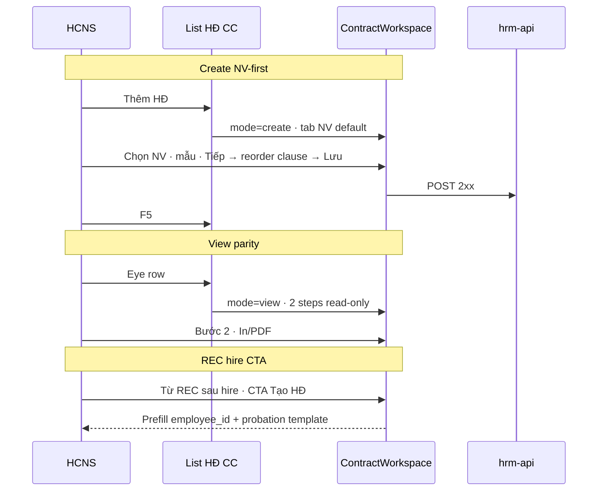

# UI_SCREEN_SPEC — Hợp đồng · ContractWorkspace (create · edit · view)

| Meta | Value |
|------|--------|
| **Screen ID** | `UI-CTR-WORKSPACE` |
| **work_item_id** | `PO-HRM-CTR-WORKSPACE-WAVE-G1` |
| **ref_ba** | `docs/program/specs/PO-HRM-CTR-WORKSPACE-NV-FIRST-BA-03.md` |
| **ref_srs** | FR-UC-BP-CORE-09 · `09a` · `09b` · FR-HRM-INT-01 · FR-HRM-RC-07 |
| **ref_pattern** | **PAT-DIALOG-FULL-VIEWPORT-CC-01** · parity `UI-SETTINGS-CTR-TEMPLATE-COMPOSER` (2-step DnD) |
| **ref_settings** | `UI-SETTINGS-CTR-CLAUSES` (body SoT) · `UI-SETTINGS-CTR-TEMPLATE-COMPOSER` |
| **supersedes_partial** | `UI-CTR-CREATE-U65-TEMPLATE-PATH` §3.B (create-only) — create path nằm trong workspace |
| **honesty** | `contracts_printable_ready=false` · **C-SLICE-≠-MODULE** |

---

## 1. Screen ID + route

| Mode | Mở từ | Route / trigger |
|------|--------|-----------------|
| **create** | List «Thêm» · Profile NV · REC CTA | CC `…/command-center/hrm/contracts` + dialog workspace |
| **edit** | List «Sửa» | Cùng workspace `mode=edit` |
| **view** | List «Eye» · deep link | Cùng workspace `mode=view` |

**testId gợi ý:** `ctr-workspace` · `ctr-workspace-step-1` · `ctr-workspace-step-2` · `ctr-workspace-mode-{create|edit|view}`

---

## 2. Mục đích

Một shell **2 bước** thống nhất cho tạo, sửa và **xem** HĐ — thay dialog registry-only khi Eye. Bước 2 luôn hiển thị canvas `clause_ids` (editable hoặc read-only). Nội dung điều khoản **không** sửa tại đây — SoT Settings.

---

## 3. IA layout

```text
ContractWorkspace (portal parent ~90%×90vh)
├─ Stepper: [1 Thông tin HĐ] [2 Điều khoản]
├─ Step 1
│    ├─ Subject: tab «Nhân viên» (DEFAULT) | «Ứng viên» (optional pre-hire)
│    ├─ CatalogSearchPicker NV/UV + search
│    ├─ Mã HĐ · Loại · Tên HĐ (read-only) · Ngày ký · Thời hạn
│    ├─ Hình thức LV · Tỉ lệ % · Trích yếu · C&B card read-only
│    └─ Link «Chỉ lưu sổ» (create)
├─ Step 2
│    ├─ Palette (clause_ids từ template/pack) — hidden drag in view
│    ├─ Canvas ordered clause_ids — DnD+Gỡ (create/edit) | read-only (view)
│    └─ Preview panel · [In] [PDF] (view + edit when can_issue)
└─ Footer: Quay lại | Tiếp | Lưu (create/edit) | Đóng (view)
```

| Không có trên workspace | Textarea sửa `body_vi` clause · honesty pipeline paragraphs |
|-------------------------|----------------------------------------------------------------|

---

## 4. Thành phần UI ↔ API

| UI | API / field |
|----|-------------|
| NV picker (default) | `GET /employees` · bind `employee_id` |
| UV picker (optional) | `GET /recruitment/candidates` · `candidate_id` khi chưa hire |
| Template select | Active `template_code` · `XEVN_PROBATION_*` prefill từ REC CTA |
| Step 2 order | `clause_ids[]` · `layout_json` — **không** PATCH body |
| Lưu create/edit | `POST/PATCH` contract + clause order |
| View load | `GET` contract by id + resolved clause snapshots |
| In / PDF | RETAIN print spine `preview` / `issue` khi `can_issue` |
| REC CTA entry | Query `?create=1&employee_id=&template_code=` hoặc state router |

---

## 5. Luồng U65 (QA bắt buộc)



---

## 6. Empty / error

| Trạng thái | UX |
|------------|-----|
| Không mẫu active | Step1 CTA **Đi tới Cài đặt mẫu HĐ** (RETAIN) |
| UV đã hire | Banner chuyển tab NV |
| View thiếu clause snapshot | Message rõ — không mock body |
| `can_issue=false` | In/PDF disabled + lý do tiếng Việt |

---

## 7. AC UI (map BA-03)

| AC | Quan sát |
|----|----------|
| AC-CTR-SUBJECT-01/02 | NV tab default · Lưu 2xx |
| AC-CTR-SUBJECT-03/04 | UV pre-hire only · profile preselect |
| AC-CTR-VIEW-01..05 | Eye = 2 bước read-only + In/PDF |
| AC-CTR-HIRE-CTA-01..04 | REC CTA → prefill → Lưu → F5 |
| AC-CTR-WS-CLAUSE-01..03 | Không inline body · order persist |
| AC-CTR-UX-06/07 | CC viewport · URL CC cho DnD (RETAIN BA-02) |

**Evidence target:** `docs/qa/evidence/po-hrm-ctr-workspace-g1-qa-01.md`

**Cấm:** registry-only Eye · UV default · seed template/body · claim printable UAT.
