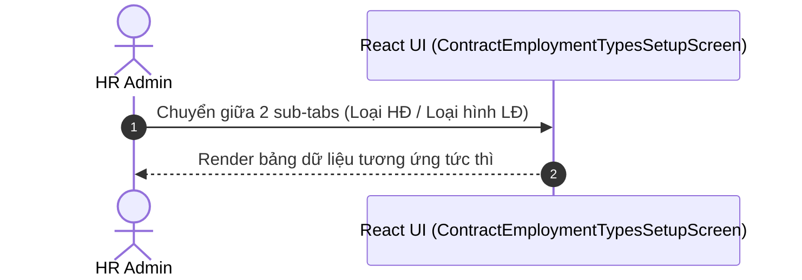

# UI Screen Spec — UI-HRM-CONTRACT-EMPLOYMENT-TYPE-01: Quản lý Loại Hợp đồng & Loại hình Lao động (Wave 4)

| Meta | Value |
|---|---|
| work_item_id | BA-PO-HRM-FE-UI-SCREEN-SPEC-CTR-EMP-01 |
| ref_srs | [BA_HRM_CONTRACT_EMPLOYMENT_TYPE_SRS_01_20260813.md](file:///C:/Users/ADMIN/OneDrive/Ta%CC%80i%20li%C3%AA%CC%A3u/Vibe%20Coding/projects/xevn-ecosystem/docs/program/deltas/BA_HRM_CONTRACT_EMPLOYMENT_TYPE_SRS_01_20260813.md) |
| ref_techspec | [BA_HRM_CONTRACT_EMPLOYMENT_TYPE_TECHSPEC_01_20260813.md](file:///C:/Users/ADMIN/OneDrive/Ta%CC%80i%20li%C3%AA%CC%A3u/Vibe%20Coding/projects/xevn-ecosystem/docs/program/deltas/BA_HRM_CONTRACT_EMPLOYMENT_TYPE_TECHSPEC_01_20260813.md) |
| ref_pattern | `PAT-SETTINGS-CATALOG-01` |
| Target Surface | Web Portal (`apps/web` - route `/hr/payroll/setup?section=contract-employment-types`) |
| Ngày | 2026-08-13 |
| Trạng thái | CONFIRMED — Enterprise Grade Standard |

---

## 1. Screen ID + Route & RBAC Persona

- **Screen ID:** `UI-HRM-CONTRACT-EMPLOYMENT-TYPE-01`
- **Route / Tab:** `/hr/payroll/setup?section=contract-employment-types`
- **Persona / RBAC:**
  - `HR Admin (Tenant)`: Quản lý và tra cứu các Loại hợp đồng lao động & Loại hình lao động áp dụng trong doanh nghiệp.

---

## 2. Mục đích (Purpose)

Giao diện quản lý 5 Loại hợp đồng lao động (Thử việc, Xác định thời hạn, Không xác định thời hạn, Mùa vụ, Cộng tác viên) và 3 Loại hình lao động (Chính thức, Thử việc, Mùa vụ). Giúp chuẩn hóa phân loại nhân sự khi lập HĐLĐ và tính lương.

---

## 3. IA Layout (Information Architecture)

```mermaid
graph TD
    Root[Header: Thiết lập lương -> Loại Hợp đồng & LHDL]
    SubNav[Sub-tabs: Loại Hợp đồng Lao động 5 | Loại hình Lao động 3]
    Table1[Table 1: Mã HĐ | Tên Loại HĐ | Thời hạn chuẩn | Trạng thái]
    Table2[Table 2: Mã Loại hình | Tên Loại hình | Trạng thái]

    Root --> SubNav
    SubNav -->|Tab Hợp đồng| Table1
    SubNav -->|Tab Loại hình| Table2
```

---

## 4. Thành phần UI & Mapping Field -> API

### 4.1. Table Loại Hợp đồng (`contract-types-table`)

| Cột UI | Label VI | Mapping Field | Format / Render |
|---|---|---|---|
| `col_code` | Mã loại hợp đồng | `item.code` | Monospace bold (`CTR_PROBATION`, `CTR_FIXED_TERM`) |
| `col_name` | Tên loại hợp đồng | `item.name` | Text VI |
| `col_duration` | Thời hạn chuẩn | `item.durationRange` | Text |
| `col_status` | Trạng thái | `item.status` | Badge xanh `Hoạt động` |

### 4.2. Table Loại hình Lao động (`employment-types-table`)

| Cột UI | Label VI | Mapping Field | Format / Render |
|---|---|---|---|
| `col_code` | Mã loại hình | `item.code` | Monospace bold (`EMP_OFFICIAL`, `EMP_PROBATION`) |
| `col_name` | Tên loại hình | `item.name` | Text VI |
| `col_status` | Trạng thái | `item.status` | Badge xanh `Hoạt động` |

---

## 5. Luồng Tương tác Sequence Diagram



---

## 6. Trạng thái Empty / Loading / Error

- **Loading:** Skeleton table 5 dòng.
- **Empty:** "Không có dữ liệu loại hợp đồng."

---

## 7. Acceptance Criteria UI (Testable AC)

| Step / Action | FE Observation / State | Network Request | `data-testid` Hint |
|---|---|---|---|
| 1. Chọn tab `contract-employment-types` | Màn hình mở sub-tab "Loại Hợp đồng Lao động" với bảng 5 loại HĐ | N/A | `[data-testid="contract-types-table"]` |
| 2. Click sub-tab "Loại hình Lao động" | Màn hình chuyển sang bảng 3 loại hình lao động | N/A | `[data-testid="tab-employment-types"]` |
