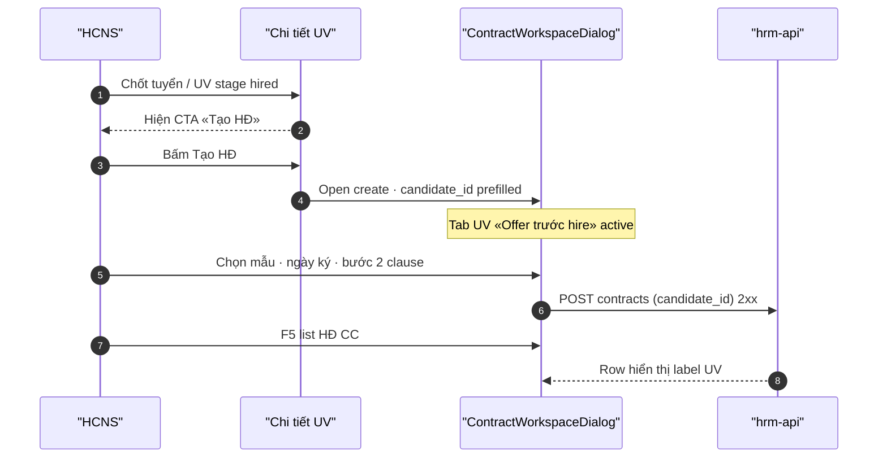

# UI_SCREEN_SPEC — REC post-hire CTA «Tạo HĐ»

| Meta | Value |
|------|--------|
| **Screen ID** | `UI-HRM-CTR-HIRE-CTA` |
| **work_item_id** | `PO-HRM-CTR-UIUX-SPEC-PACK-G5` |
| **ref_srs** | FR-HRM-INT-01 (chốt tuyển → `employee_id`) · FR-HRM-RC-03 · FR-UC-BP-CORE-09 |
| **ref_api_design** | `GET …/recruitment/candidates` · `POST …/contracts` (`candidate_id` path SA-02) |
| **ref_code** | `contractWorkspaceDeepLink.ts` · `CandidateDetailView.tsx` |
| **honesty** | `contracts_printable_ready=false` |

---

## 1. Screen ID + route

| Mục | Giá trị |
|-----|---------|
| Entry | Tuyển dụng → chi tiết ứng viên / pipeline stage **hired** |
| CTA label | **«Tạo HĐ»** (hoặc «Tạo hợp đồng») |
| Visibility | Khi UV `employee_id` đã set (INT-01) **hoặc** stage hired + policy GĐ1 |
| testId | `ctr-hire-create-contract-cta` |
| Journey | **J-HRM-CTR-HIRE-01** |

---

## 2. Mục đích

Sau chốt tuyển, HCNS tạo HĐ **không** nhập lại UV: deep-link workspace với `candidate_id` (+ `requisition_id`) — tab **Ứng viên (Offer trước hire)** pre-selected; đây là **ngoại lệ** G5 NV-first (explicit offer path trước hire formal).

---

## 3. IA layout

```text
CandidateDetailView (hoặc JobCandidatesDialog post-hire)
  └── Banner / actions bar
        └── [Tạo HĐ] ──► navigate hoặc open workspace
              prefill:
                subject_type=candidate
                candidate_id={uv.id}
                requisition_id={uv.requisition_id}
              optional: employee_id nếu INT-01 đã gắn
```

| Sau INT-01 (`employee_id` set) | Hành vi CTA |
|-------------------------------|-------------|
| Có `employee_id` | CTA có thể chuyển prefill `subject_type=employee` + lock NV — **ưu tiên** NV khi đã có sổ |
| Chưa `employee_id` | `subject_type=candidate` bắt buộc — POST `candidate_id` (G-CTR-SUBJ-01) |

---

## 4. Thành phần UI ↔ API

| UI | API | DTO |
|----|-----|-----|
| CTA click | — | build `buildContractWorkspacePath('create', { prefill })` |
| Workspace step 1 | `GET candidates` (đã chọn) | `candidate_id` · `requisition_id` |
| Lưu HĐ | `POST …/contracts` | `subject_type=candidate` · `candidate_id` · nullable `employee_id` |
| Sau hire bind | INT-01 (ngoài form) | `recruitment_candidates.employee_id` |

Deep link mẫu:

```text
/contracts?workspace=create&subject_type=candidate&candidate_id={uuid}&requisition_id={uuid}&portal=1
```

---

## 5. Luồng tương tác



---

## 6. Empty / error / loading

| Trạng thái | UX |
|------------|-----|
| UV ngoài scope | CTA disabled + tooltip |
| Chưa có mẫu active | Workspace step1 CTA Settings (CTR-U65) |
| POST yêu cầu employee_id (BE chưa EXPAND) | Banner «Cần cập nhật API — liên hệ HCNS» — G4 BLOCKED |

---

## 7. AC UI

| AC ID | Bước | Network | FE | SRS |
|-------|------|---------|-----|-----|
| AC-HIRE-01 | UV hired → CTA visible | — | `ctr-hire-create-contract-cta` | INT-01 |
| AC-HIRE-02 | Click CTA | — | Workspace mở; UV prefilled; tab UV active | RC-03 · 09 N2 |
| AC-HIRE-03 | Lưu | POST 201 `candidate_id` | List label UV — không UUID trigger | SUBJECT-02 |
| AC-HIRE-04 | CC URL evidence | — | Journey ghi `command-center/hrm/contracts` khi navigate CC | UX-07 |
| AC-HIRE-05 | F5 | GET list | HĐ còn | FR-HRM-CI-01 #8 |

**Journey J-HRM-CTR-HIRE-01:**

1. Login HCNS → Tuyển dụng → UV đã hired.
2. Bấm «Tạo HĐ».
3. Workspace bước 1: UV đã chọn; nhập ngày ký + mẫu.
4. Bước 2: DnD ≥1 clause → Lưu 2xx.
5. F5 list Hợp đồng — row hiển thị liên kết UV.

---

## 8. Cross-role handoff

| Role | Việc |
|------|------|
| dev-fe | Wire CTA + `buildContractWorkspacePath` |
| dev-be | G-CTR-SUBJ-01 nullable employee + candidate POST |
| qa | J-HRM-CTR-HIRE-01 U65 — **không** seed UV |
