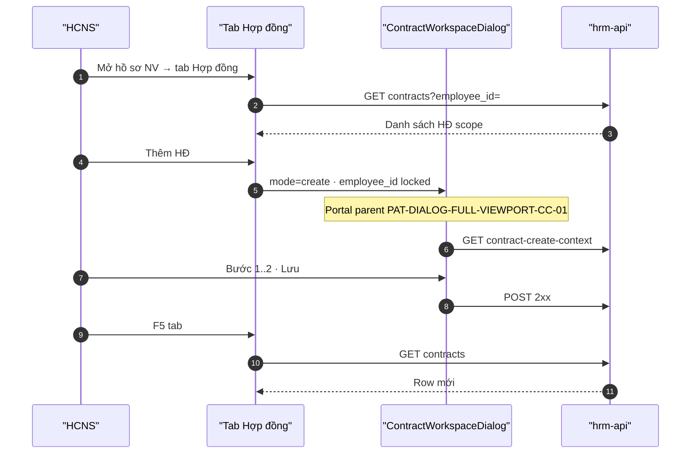

# UI_SCREEN_SPEC — Profile tab HĐ → workspace deep-link

| Meta | Value |
|------|--------|
| **Screen ID** | `UI-HRM-CTR-PROFILE-DEEP-LINK` |
| **work_item_id** | `PO-HRM-CTR-UIUX-SPEC-PACK-G5` |
| **ref_srs** | FR-UC-BP-CORE-09 · FR-HRM-INT-02 · FR-HRM-CI-01 #2/#3 |
| **ref_api_design** | `GET …/contracts?employee_id=` · `GET …/employees/{id}/contract-create-context` · POST/PATCH contracts |
| **ref_code** | `contractWorkspaceDeepLink.ts` · `EmployeeContracts.tsx` |
| **ref_adr** | ADR §3.2 deprecate legacy dialog |
| **honesty** | `contracts_printable_ready=false` |

---

## 1. Screen ID + route

| Mục | Giá trị |
|-----|---------|
| Parent | Hồ sơ nhân viên embed `/employees/{id}` tab **Hợp đồng** |
| Component list | `EmployeeContracts` |
| Launcher | Thay `handleOpenDialog` legacy → `ContractWorkspaceDialog` |
| Deep link builder | `buildContractWorkspacePath(mode, { prefill: { employee_id, subject_type: 'employee' } })` |
| testId tab | `employee-contracts-tab` · `employee-contracts-add-btn` |

---

## 2. Mục đích

Tab Hợp đồng trên hồ sơ NV mở **cùng** workspace 2 bước như Command Center — NV **khóa** theo `employeeId` profile; deprecate form `max-w-2xl` thiếu clause/DnD/portal; đảm bảo INT-02 cùng `employee_id` + scope slug.

---

## 3. IA layout

```text
EmployeeProfile
  └── Tab Hợp đồng (EmployeeContracts)
        ├── Bảng HĐ của NV (giữ)
        ├── [Thêm HĐ] ──► ContractWorkspaceDialog create
        │                 subjectLock: { type: 'employee', id: employeeId }
        │                 subjectDefault: employee (G5 NV-first)
        │                 UV tab: hidden hoặc disabled
        ├── Row [Sửa] ──► workspace edit + contractId
        ├── Row [Xem] ──► workspace view (VIEW-PARITY)
        └── Renew / Lịch sử (must_keep) ──► prefill create renewed_from
```

**Deprecate:** inline `Dialog` L912+ trong `EmployeeContracts.tsx` — `@deprecated` G3; xóa sau G4 PASS.

---

## 4. Thành phần UI ↔ API

| Action | UI | API | Prefill |
|--------|-----|-----|---------|
| List tab | Table rows | `GET …/contracts?employee_id={id}` | — |
| Thêm HĐ | Open workspace create | `POST …/contracts` | `employee_id` locked · `subject_type=employee` |
| Context C&B | Step 1 card | `GET …/employees/{id}/contract-create-context` | auto on open |
| Sửa | workspace edit | `PATCH …/contracts/{id}` | `contractId` |
| Xem | workspace view | `GET …/contracts/{id}` | VIEW-PARITY |
| Xóa (nếu giữ) | confirm dialog nhỏ | `DELETE …/contracts/{id}` | ngoài workspace |

| Field profile | Map |
|---------------|-----|
| `employeeId` prop | `subjectLock.employee_id` — **không** đổi picker |
| `employeeName` | Display trigger picker read-only |
| `department` | Hint merge §4.1 WORKSPACE |

---

## 5. Luồng tương tác



---

## 6. Empty / error / loading

| Trạng thái | Copy |
|------------|------|
| Tab empty | «Chưa có hợp đồng cho nhân viên này.» · CTA Thêm HĐ |
| NV ngoài scope | Banner scope — không mở workspace |
| Legacy dialog | **Cấm** dùng sau G3 cutover |

---

## 7. AC UI

| AC ID | Bước | Network | FE | SRS |
|-------|------|---------|-----|-----|
| AC-PROF-01 | Thêm HĐ từ profile | POST 201 | Workspace 90% viewport parent — **không** max-w-2xl | 09 · UX-06 |
| AC-PROF-02 | NV picker | — | Locked — hiển thị tên/mã NV profile | G5 NV-first · INT-02 |
| AC-PROF-03 | UV tab | — | **Ẩn** hoặc disabled trên profile | G5 #2 |
| AC-PROF-04 | DnD bước 2 | PUT overlay | PASS DnD từ profile entry | 09b |
| AC-PROF-05 | F5 tab | GET | Row mới còn | FR-HRM-CI-01 #8 |
| AC-PROF-06 | Xem row | GET | VIEW-PARITY workspace | VIEW-08 |
| AC-PROF-07 | Renew | POST | `renewed_from` prefill — must_keep renewal chain | O12 regression |

**Journey:** `J-HRM-CTR-PROFILE-01` — profile → Thêm → Lưu → F5 tab → Sửa/Xem cùng shell.

---

## 8. Navigation options

| Cách | Khi dùng |
|------|----------|
| **A — In-place modal** (khuyến nghị G3) | `ContractWorkspaceDialog` mount từ tab — portal parent vẫn bắt buộc |
| **B — Navigate CC** | `buildContractWorkspacePath` + `hrmPathWithEmbedSearch` khi cần URL evidence CC |

QA G4: ít nhất một evidence **in-place profile** + một **CC list** — cùng AC workspace.
