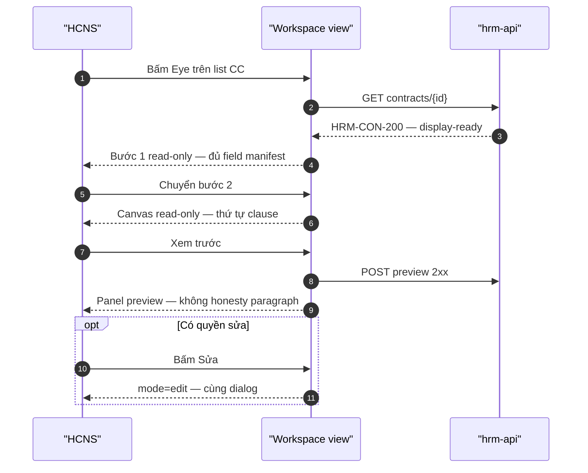

# UI_SCREEN_SPEC — View mode parity (Eye · profile read-only)

| Meta | Value |
|------|--------|
| **Screen ID** | `UI-HRM-CTR-VIEW-PARITY` |
| **work_item_id** | `PO-HRM-CTR-UIUX-SPEC-PACK-G5` |
| **ref_srs** | FR-UC-BP-CORE-09 · 09b (preview read) · 09c (PDF residual) · FR-HRM-CI-01 Diễn biến #8/#9 |
| **ref_api_design** | `GET …/contracts/{contractId}` · `POST …/contracts/{contractId}/preview` |
| **ref_workspace** | [`UI-HRM-CTR-WORKSPACE.md`](./UI-HRM-CTR-WORKSPACE.md) mode=`view` |
| **ref_adr** | ADR-HRM-CONTRACT-WORKSPACE-UNIFIED-01 §6.2 |
| **honesty** | `contracts_printable_ready=false` |

---

## 1. Screen ID + route

| Mục | Giá trị |
|-----|---------|
| Entry CC | List Hợp đồng → icon **Eye** / «Chi tiết» trên row |
| Entry profile | Tab Hợp đồng NV → «Xem» trên row |
| Deep link | `/contracts?workspace=view&contractId={uuid}` (+ embed search) |
| Component | `ContractWorkspaceDialog` `mode="view"` |
| testId root | `ctr-workspace-root` · `data-mode="view"` |

**Cấm:** dialog view chỉ grid registry tĩnh (AS-IS `Contracts.tsx` L1674+) — **không** đạt G4.

---

## 2. Mục đích

Cho phép HCNS **xem** hợp đồng đã lưu với **cùng** bố cục 2 bước như tạo/sửa: thông tin sổ + thứ tự điều khoản đã chọn + preview merge token — **không** mutate; hỗ trợ L2.5 list→detail và khóa mang FR-HRM-CI-01 #9.

---

## 3. IA layout

Giống **UI-HRM-CTR-WORKSPACE** — Stepper vẫn hiển thị «1 Thông tin chung» | «2 Điều khoản & bản in».

| Khác mutate | View |
|-------------|------|
| Input editable | `readOnly` / text display |
| DnD handles | **Ẩn** — danh sách clause có thứ tự |
| Gỡ / Đồng bộ | **Ẩn** |
| Footer Lưu | **Ẩn** |
| Footer | `[Đóng]` · optional `[Sửa]` → flip `mode=edit` same shell |

---

## 4. Thành phần UI ↔ API

| UI | API | DTO / display |
|----|-----|---------------|
| Load workspace | `GET /api/hrm/contracts-insurance/contracts/{contractId}?company_id=` | Full row § API_DESIGN §2 |
| NV/UV label | GET + enrich | `employee_name` · `candidate_label` (display-ready) |
| Ngày ký | response | `signed_at` → `dd/MM/yyyy` |
| Loại / TT | response | `contract_type` · `status` — F-04/F-05 VI |
| Trích yếu | response | `contract_abstract` |
| Hình thức LV | response | `work_arrangement` + `work_form_label_vi` |
| Tỉ lệ % | response | `salary_ratio_percent` |
| Clause list | overlay + template junction | `clause_ids[]` → titles from Settings read |
| Preview | `POST …/preview` | ephemeral — **không** persist VER |
| PDF đã phát hành | 09c residual | list versions when API exists |

---

## 5. Luồng tương tác

---

## 6. Empty / error / loading

| Trạng thái | UX |
|------------|-----|
| Loading | Skeleton step 1 |
| 404 scope | «Không tìm thấy hợp đồng trong phạm vi đơn vị.» |
| Clause trống | «Chưa chọn điều khoản trên hợp đồng này.» + CTA «Sửa» |
| Preview fail | Banner lỗi — không mock body |
| PDF chưa sẵn sàng | «Phiên bản in chưa phát hành.» — honesty false |

---

## 7. AC UI

| AC ID | Bước | Network | FE quan sát | SRS |
|-------|------|---------|-------------|-----|
| AC-VIEW-01 | Eye từ list CC | GET 200 | Mở **workspace** 90% viewport — **không** mini dialog registry-only | 09 N1 · UX-06 |
| AC-VIEW-02 | Bước 1 | — | Mọi field BA-02 manifest hiển thị read-only (kể cả ngày ký, trích yếu) | 09 N3/N6 |
| AC-VIEW-03 | Bước 2 | — | Canvas read-only; **không** drag handle | 09b view |
| AC-VIEW-04 | Preview | POST preview 2xx | Panel hiển thị; **không** `ctr-*-honesty` paragraph | UX-01 |
| AC-VIEW-05 | Không Gỡ | — | Không nút Gỡ trên canvas | DND chỉ mutate |
| AC-VIEW-06 | Sửa | PATCH sau flip | Chuyển edit không đóng shell — list→detail→edit L2.5 | J-HRM-CTR-CREATE-06 |
| AC-VIEW-07 | F5 | GET | Dữ liệu view khớp sau refresh trang list | FR-HRM-CI-01 #8 |
| AC-VIEW-08 | Profile Xem | GET | Cùng workspace — **không** `max-w-2xl` legacy | PROFILE-DL |

**Journey:** `J-HRM-CTR-VIEW-01` — CC list → Eye → bước 2 clause visible → preview → Đóng.

---

## 8. AS-IS gap (honesty)

| AS-IS | TO-BE G4 |
|-------|----------|
| View dialog: field grid only | Full workspace view |
| Không clause canvas | `ContractClauseCanvas` readOnly |
| Không preview spine | `useContractPrintSpine` readOnly |

**Không** claim PASS view parity cho đến khi AC-VIEW-01..08 browser evidence.
