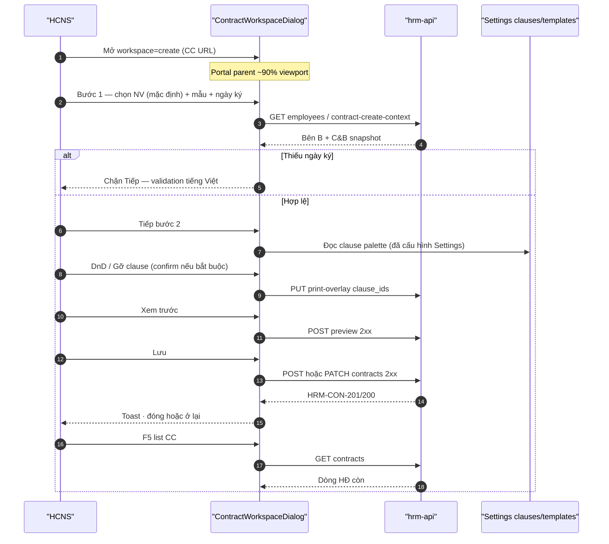

# UI_SCREEN_SPEC — ContractWorkspaceDialog (SoT chính)

| Meta | Value |
|------|--------|
| **Screen ID** | `UI-HRM-CTR-WORKSPACE` |
| **work_item_id** | `PO-HRM-CTR-UIUX-SPEC-PACK-G5` |
| **ref_srs** | FR-UC-BP-CORE-09 · 09a (clause SoT Settings) · 09b (preview) · 09c (in/PDF residual) · 09d (template catalog) · FR-HRM-CI-01 |
| **ref_techspec** | `docs/hrm/TECHSPEC.md` §14.2 |
| **ref_api_design** | `docs/hrm/API_DESIGN_HRM_CONTRACTS_INS.md` §1–§4 · §11–§12 |
| **ref_adr** | `docs/architecture/ADR-HRM-CONTRACT-WORKSPACE-UNIFIED-01.md` |
| **ref_pattern** | **PAT-DIALOG-FULL-VIEWPORT-CC-01** |
| **honesty** | `contracts_printable_ready=false` |
| **no_prompt_echo** | true |

---

## 1. Screen ID + route

| Mục | Giá trị |
|-----|---------|
| **Primary route** | Command Center embed: `/command-center/hrm/contracts` (local `:5173` hoặc pilot `:8088`) |
| **HRM path** | `/contracts` + query deep-link (xem `contractWorkspaceDeepLink.ts`) |
| **Query** | `workspace=create\|edit\|view` · `contractId` (edit/view) · `employee_id` · `candidate_id` · `subject_type` |
| **Persona** | HCNS / `ceo@xe.vn` scope hợp lệ · U65 zero-seed |
| **Component** | `ContractWorkspaceDialog` (`data-testid="ctr-workspace-root"`) |
| **Portal** | Parent CC ~**90vw × 90vh** — `data-hrm-dialog-portal="parent"` |

---

## 2. Mục đích (1 đoạn)

Cung cấp **một** bề mặt hợp đồng thống nhất (tạo · sửa · xem) cho FR-UC-BP-CORE-09: bước 1 ghi **sổ đăng ký** + chọn mẫu; bước 2 **chọn/sắp xếp** `clause_ids` từ thư viện Settings (không soạn body tại đây); merge token + preview ephemeral; Lưu → API 2xx → F5 list còn dòng HĐ. View = Edit trừ mutate — cùng layout 2 bước, canvas read-only + Xem trước/In khi BE sẵn sàng.

---

## 3. IA layout

```text
┌─────────────────────────────────────────────────────────────────────────────┐
│ Header: «Hợp đồng lao động» · mode badge · Stepper [1 Thông tin] [2 Điều khoản] │
├─────────────────────────────────────────────────────────────────────────────┤
│ Bước 1 — ContractRegistryFields (grid 12 cột)                                │
│   A Đối tượng (NV-first) · B Mã/loại/Tên HĐ · C Thời hạn · D LV & lương %    │
│   E Bên B read-only · F C&B card read-only · G GPLX DRIVER · H Trích yếu     │
├─────────────────────────────────────────────────────────────────────────────┤
│ Bước 2 — ContractClauseCanvas                                                │
│   Palette 4 col │ Canvas 8 col │ [Xem trước] [Đồng bộ thứ tự] (mutate only)   │
├─────────────────────────────────────────────────────────────────────────────┤
│ Footer: [Đóng/Hủy] [Quay lại] [Tiếp] [Lưu]  · view: [Sửa] optional          │
└─────────────────────────────────────────────────────────────────────────────┘
         ▲ Radix portal → parent Command Center (PAT-DIALOG-FULL-VIEWPORT-CC-01)
```

| Vùng | Component | Ghi chú |
|------|-----------|---------|
| Shell | `ContractWorkspaceDialog` | Mode matrix §5 |
| Bước 1 | `ContractRegistryFields` | Map API §4.1 |
| Bước 2 | `ContractClauseCanvas` + `useContractPrintSpine` | Body clause SoT Settings only §4.2 |
| Settings | **Không** embed composer | Link `UI-SETTINGS-CTR-*` |

---

## 4. Thành phần UI — field map API

### 4.1 Bước 1 — `ContractRegistryFields`

| UI field / control | Editable (create/edit) | View | API METHOD / path | DTO / response key | SRS Diễn biến |
|--------------------|------------------------|------|-------------------|-------------------|---------------|
| Tab **Nhân viên** (default G5) | ✓ toggle | read-only label | — | `subject_type=employee` | FR-UC-BP-CORE-09a N2 **AMEND G5** |
| Tab **Ứng viên (Offer trước hire)** | ✓ explicit only | read-only | — | `subject_type=candidate` | 09 · BA-02 N2 · G5 lock |
| NV picker + search | ✓ | display | `GET …/employees` | `employee_id` | FR-HRM-CI-01 #2/#3 · 09d #1 |
| UV picker + search | ✓ when tab UV | display | `GET …/recruitment/candidates` | `candidate_id` · `requisition_id?` | FR-HRM-RC-03 · 09 N2 |
| Banner REC khi NV thiếu UV | display | display | — | — | 09 N9 · BR-CTR-CREATE-08 |
| Mã HĐ | ✓ | ✓ | `POST/PATCH …/contracts` | `contract_code` | FR-HRM-CI-01 #7 |
| **Tên HĐ** | read-only derive | ✓ | display-only merge | `contract_name` | 09 N5 · AC-CTR-FIELD-01 |
| Loại HĐ | ✓ Select catalog | ✓ | `POST/PATCH` | `contract_type` | FR-HRM-CI-01 #4/#6 · F-04 FE |
| Trạng thái sổ | ✓ | ✓ | `POST/PATCH` | `status` | F-05 FE |
| Ngày bắt đầu | ✓ `dd/MM/yyyy` | ✓ | `POST/PATCH` | `start_date` | FR-HRM-CI-01 #4 · G-CI-01 |
| Ngày kết thúc | ✓ optional | ✓ | `POST/PATCH` | `end_date` | G-CI-01 |
| **Ngày ký** | ✓ **bắt buộc** | ✓ | `POST/PATCH` | `signed_at` (alias `signing_date`) | 09 N3 · AC-CTR-FIELD-02 |
| Hình thức làm việc | ✓ catalog | ✓ label | `POST/PATCH` | `work_arrangement` | 09 N4 · AC-CTR-FIELD-03 |
| Tỉ lệ hưởng lương % | ✓ 0–100 | ✓ | `POST/PATCH` | `salary_ratio_percent` | 09 N4 · no thousand group |
| Mẫu HĐ | ✓ combobox active | ✓ | Settings `listContractTemplates` + row | `template_code` | FR-UC-BP-CORE-09d · AC-CTR-CATALOG-01 |
| Phòng ban | ✓ if manifest | ✓ | display / registry | `department_key` | 09d merge |
| Địa điểm làm việc | ✓ if manifest | ✓ | `POST/PATCH` or snapshot | `work_location` | 09d |
| Bên B card | read-only | read-only | `GET …/employees/{id}/contract-create-context` | `employee_party_b` snapshot | F-CORE-CTR-CREATE-CTX-01 · 09d #2 |
| C&B card | read-only | read-only | same GET context | `compensation_package` + lines | 09d #3 · BR-CD-F5-01 |
| Khối GPLX DRIVER | ✓ when `*_DRIVER` | ✓ | `POST/PATCH` | driver cols per template manifest | 09 · O4/O11 |
| Trích yếu | ✓ textarea | ✓ | `POST/PATCH` | `contract_abstract` | 09 N6 · AC-CTR-FIELD-05 |
| Người ký DN | ✓ | ✓ | registry fields | `signer_name` · `signer_position_key` | 09d merge §2 Bên A |
| «Chỉ lưu sổ đăng ký» | link | hidden | `POST` minimal body | no `template_code` | O8 · AC-CTR-XEVN-08 |
| Ghi chú sổ | ✓ optional | ✓ | `POST/PATCH` | `notes` | FR-HRM-CI-01 |

**Cấm GĐ1:** sub-grid phụ cấp «+ Thêm» editable (AC-CTR-FIELD-04).

### 4.2 Bước 2 — `ContractClauseCanvas`

| UI | Editable | View | API | Ghi chú |
|----|----------|------|-----|---------|
| Palette clause | add to canvas | hidden add | Settings `listContractClauses` (read) | Body `body_vi` **SoT Settings** — workspace **không** textarea body |
| Canvas order | DnD + Gỡ | read-only list | `PUT …/contracts/{id}/print-overlay` | `clause_ids[]` | FR-UC-BP-CORE-09b · AC-CTR-DND-01/02 |
| Nút **Gỡ** | ✓ + confirm mandatory | **ẩn** | overlay PUT | remove id from array | 09 N8 |
| Đồng bộ thứ tự | ✓ | hidden | `PUT …/print-overlay` | persisted overlay | 09b |
| Xem trước | ✓ | ✓ | `POST …/contracts/{id}/preview` | ephemeral HTML/text | 09b · **không** INSERT VER GĐ1 |
| In / PDF | when `contractId` + BE ready | ✓ read-only | CORE-09c APIs (residual) | honesty false | 09c OUT scope G3 |

### 4.3 Hook — `useContractPrintSpine`

| Trách nhiệm | API | Không làm |
|-------------|-----|-----------|
| Load template junction + overlay | GET contract · GET template | `syncContractTemplateClauseBind` in-dialog (must_keep FE-02) |
| Preview | `POST …/preview` | Render registry fields |
| Overlay persist | `PUT …/print-overlay` | POST registry |
| VER/PDF list | residual 09c | Claim printable UAT |

---

## 5. Mode matrix `create | edit | view`

| Khía cạnh | **create** | **edit** | **view** |
|-----------|------------|----------|----------|
| Entry | CC «Thêm HĐ» · profile Thêm · hire CTA | CC/ profile «Sửa» | CC Eye · profile «Xem» |
| `subjectDefault` | **employee** (G5) · UV chỉ khi tab Offer | From row | From row display |
| `subjectLock` | optional `employee_id` / `candidate_id` prefill | locked ids | — |
| Step 1 fields | editable per §4.1 | editable | **readOnly** all |
| Step 2 DnD | ✓ | ✓ | **readOnly** canvas |
| Gỡ clause | ✓ | ✓ | **cấm** |
| Footer Lưu | ✓ | ✓ | **ẩn** — «Đóng» + optional «Sửa» |
| Portal PAT | parent 90% | same | same |
| Primary API | `POST` then PATCH/overlay | `PATCH` + overlay | `GET …/{id}` |

---

## 6. Luồng tương tác (U65)



---

## 7. Empty / error / loading

| Trạng thái | Copy (VI) | CTA |
|------------|-----------|-----|
| Loading step 1 | «Đang tải danh mục…» | — |
| Không mẫu active | «Chưa có mẫu HĐ hiệu lực.» | Link Settings `UI-SETTINGS-CTR-TEMPLATE-COMPOSER` |
| Palette trống | «Chưa có điều khoản cho pack — tạo tại Cài đặt.» | `tab=contract-clauses` |
| API 4xx | Banner tiếng Việt từ mã `HRM-CTR-*` / `HRM-CON-*` | Không crash |
| DnD storm | **FAIL** nếu `@hello-pangea/dnd` Unable to find drag handle | QA CC URL |
| Honesty | **Không** paragraph `contracts_printable_ready` trên production UI | AC-CTR-UX-01 |
| View empty clause | «HĐ chưa gắn điều khoản — mở Sửa để chọn.» | «Sửa» |

---

## 8. AC UI (testable)

| AC ID | Bước click | Network | FE sau 2xx / F5 | testid | SRS ref |
|-------|------------|---------|-----------------|--------|---------|
| AC-WS-01 | CC Thêm HĐ | — | Dialog ≥85% viewport; che sidebar CC | `ctr-workspace-root` | 09 N1 · AC-CTR-UX-06 |
| AC-WS-02 | URL CC contracts | — | DnD bước 2 PASS trên CC path | `ctr-create-step-2` | AC-CTR-UX-07 |
| AC-WS-03 | Mặc định tab NV | GET employees | UV tab label «Offer trước hire» | `ctr-create-subject-tab-employee` | G5 #2 |
| AC-WS-04 | Thiếu ngày ký → Tiếp | — | Chặn | `ctr-create-signing-date` | 09 N3 · FIELD-02 |
| AC-WS-05 | Lưu registry | POST 201 | List có dòng; F5 còn | `hdsd-contracts-form-submit` | FR-HRM-CI-01 #7/#8 |
| AC-WS-06 | DnD + Gỡ mandatory | PUT overlay | Confirm dialog; canvas cập nhật | `ctr-clause-remove-*` | 09 N7/N8 · DND-01/02 |
| AC-WS-07 | Preview | POST preview 2xx | Panel không honesty paragraph | `ctr-create-preview-panel` | 09b · UX-01 |
| AC-WS-08 | View Eye | GET by id | Cùng 2-step; fields read-only; canvas read-only | `ctr-workspace-mode=view` | VIEW-PARITY |
| AC-WS-09 | C&B card | GET create-context | Read-only; mask nếu 403 | `ctr-create-party-b-card` | 09d #3 |
| AC-WS-10 | Template XEVN_PROBATION | — | Chọn được · preview title khác FT | `ctr-create-template-combobox` | AC-CTR-CATALOG-01 |

---

## 9. SOLID component map (implementation G3)

```text
ContractWorkspaceDialog
  ├── useContractWorkspaceState (mode, step, contractId, subjectLock)
  ├── ContractRegistryFields
  │     └── consumes: contractCreateWizardState, useEmpEmploymentTypesEffective
  ├── ContractClauseCanvas
  │     └── HrmDragDropContext (inside portaled DialogContent)
  └── useContractPrintSpine
        └── previewContractPrint · putContractPrintOverlay
```

| Nguyên tắc | Áp dụng |
|------------|---------|
| **S** | Mỗi module §9 một lý do đổi |
| **O** | Thêm mode/field qua manifest — không fork dialog thứ 3 |
| **L** | View `readOnly` props không phá mutate contract |
| **I** | Registry không import DnD |
| **D** | Dialog phụ thuộc hooks — không `hrmApi` trực tiếp |

**Shim G3:** `ContractCreateWizardDialog` re-export `ContractWorkspaceDialog` mode create|edit until `Contracts.tsx` migrate.

---

## 10. Cross-ref Settings (không duplicate)

| Cần | Mở |
|-----|-----|
| Sửa body điều khoản | `UI-SETTINGS-CTR-CLAUSES.md` |
| Sửa mẫu / thứ tự mặc định template | `UI-SETTINGS-CTR-TEMPLATE-COMPOSER.md` |
| Cấu trúc in UNICOM | `PO-HRM-CONTRACT-LEGAL-PRINT-UNICOM-OUTLINE-01.md` |

---

## 11. Residual / honesty

- `contracts_printable_ready=false` — In/PDF đủ điều kiện QC khi CORE-09c BE + QA riêng.
- `candidate_id`-only POST nếu BE chưa G-CTR-SUBJ-01 → G4 BLOCKED + dev-be.
- **Không** claim module CTR UAT DONE từ slice workspace G3/G4.
