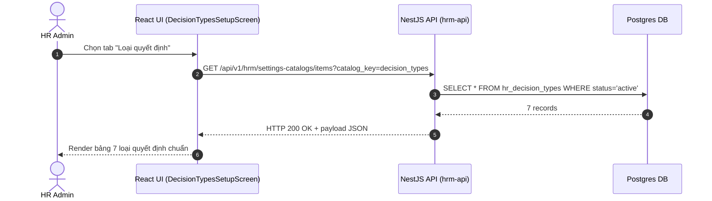

# UI Screen Spec — UI-HRM-DECISION-TYPE-01: Quản lý Danh mục Loại quyết định (Wave 2)

| Meta | Value |
|---|---|
| work_item_id | BA-PO-HRM-FE-UI-SCREEN-SPEC-DEC-01 |
| ref_srs | [BA_HRM_DECISION_TYPE_SRS_01_20260813.md](file:///C:/Users/ADMIN/OneDrive/Ta%CC%80i%20li%C3%AA%CC%A3u/Vibe%20Coding/projects/xevn-ecosystem/docs/program/deltas/BA_HRM_DECISION_TYPE_SRS_01_20260813.md) |
| ref_techspec | [BA_HRM_DECISION_TYPE_TECHSPEC_01_20260813.md](file:///C:/Users/ADMIN/OneDrive/Ta%CC%80i%20li%C3%AA%CC%A3u/Vibe%20Coding/projects/xevn-ecosystem/docs/program/deltas/BA_HRM_DECISION_TYPE_TECHSPEC_01_20260813.md) |
| ref_api_design | [BA_HRM_DECISION_TYPE_API_DESIGN_01_20260813.md](file:///C:/Users/ADMIN/OneDrive/Ta%CC%80i%20li%C3%AA%CC%A3u/Vibe%20Coding/projects/xevn-ecosystem/docs/program/deltas/BA_HRM_DECISION_TYPE_API_DESIGN_01_20260813.md) |
| ref_pattern | `PAT-SETTINGS-CATALOG-01` |
| Target Surface | Web Portal (`apps/web` - route `/hr/payroll/setup?section=decision-types`) |
| Ngày | 2026-08-13 |
| Trạng thái | CONFIRMED — Enterprise Grade Standard |

---

## 1. Screen ID + Route & RBAC Persona

- **Screen ID:** `UI-HRM-DECISION-TYPE-01`
- **Route / Tab:** `/hr/payroll/setup?section=decision-types`
- **Persona / RBAC:**
  - `HR Admin (Tenant)`: Tra cứu danh mục Loại quyết định Tập đoàn ban hành + Bổ sung loại quyết định cục bộ cấp công ty.
  - `Group Admin (XBOS Holding)`: Ban hành & chỉnh sửa loại quyết định toàn tập đoàn.

---

## 2. Mục đích (Purpose)

Giao diện quản lý danh mục Loại quyết định nhân sự (Khen thưởng, Kỷ luật, Điều chỉnh lương, Bổ nhiệm, Chấm dứt HĐLĐ, Điều chuyển, Bổ nhiệm lại). Giúp cán bộ Nhân sự đối chiếu loại quyết định chuẩn khi ban hành văn bản pháp lý, đồng thời hỗ trợ mở rộng danh mục riêng theo đặc thù chi nhánh.

---

## 3. IA Layout (Information Architecture)

```mermaid
graph TD
    Root[Header: Thiết lập lương -> Loại quyết định]
    Banner[Banner: Thống nhất danh mục hr_decision_types Dual-SoT]
    Toolbar[Toolbar: Search Input + Nút Bổ sung loại riêng]
    Table[Main Table: Mã quyết định | Tên loại | Nguồn ban hành | Trạng thái]
    Dialog[Modal Dialog: Bổ sung loại quyết định cục bộ]

    Root --> Banner
    Banner --> Toolbar
    Toolbar --> Table
    Toolbar --> Dialog
```

---

## 4. Thành phần UI & Mapping Field -> API

### 4.1. Toolbar Controls

| UI Component | Label VI | Binding Field API | Kiểu / Interaction |
|---|---|---|---|
| `search_input` | "Tìm loại quyết định..." | `searchTerm` | Text input, live filter |
| `btn_add_decision_type` | "Bổ sung loại riêng" | N/A | Trigger mở Dialog `DialogContent` |

### 4.2. Main Data Table (`decision-types-table`)

| Cột UI | Label VI | Mapping API Field | Format / Render |
|---|---|---|---|
| `col_code` | Mã loại quyết định | `item.code` | Monospace bold (`DEC_REWARD`, `DEC_DISCIPLINE`) |
| `col_name` | Tên loại quyết định | `item.name` | Text VI |
| `col_origin` | Nguồn ban hành | `item.origin` | Badge xanh `Chuẩn Tập đoàn` (Holding) hoặc Outline `Mở rộng cục bộ` |
| `col_status` | Trạng thái | `item.status` | Badge xanh `Hoạt động` |

---

## 5. Luồng Tương tác Sequence Diagram



---

## 6. Trạng thái Empty / Loading / Error

- **Loading:** Hiển thị Skeleton table 4 dòng.
- **Empty:** "Chưa có loại quyết định nào được khai báo."
- **Error:** Alert banner thông báo lỗi kết nối server.

---

## 7. Acceptance Criteria UI (Testable AC)

| Step / Action | FE Observation / State | Network Request | `data-testid` Hint |
|---|---|---|---|
| 1. Chọn tab `decision-types` | Màn hình hiển thị bảng 7 loại quyết định chuẩn từ Tập đoàn | `GET /settings-catalogs/items?catalog_key=decision_types` | `[data-testid="decision-types-setup-screen"]` |
| 2. Gõ "Khen thưởng" vào ô search | Bảng lọc còn 1 dòng `DEC_REWARD` | Live state filter | `[data-testid="search-decision-input"]` |
| 3. Click "Bổ sung loại riêng" | Hộp thoại modal mở lên với 2 ô nhập Mã & Tên | N/A | `[data-testid="btn-add-decision-type"]` |
