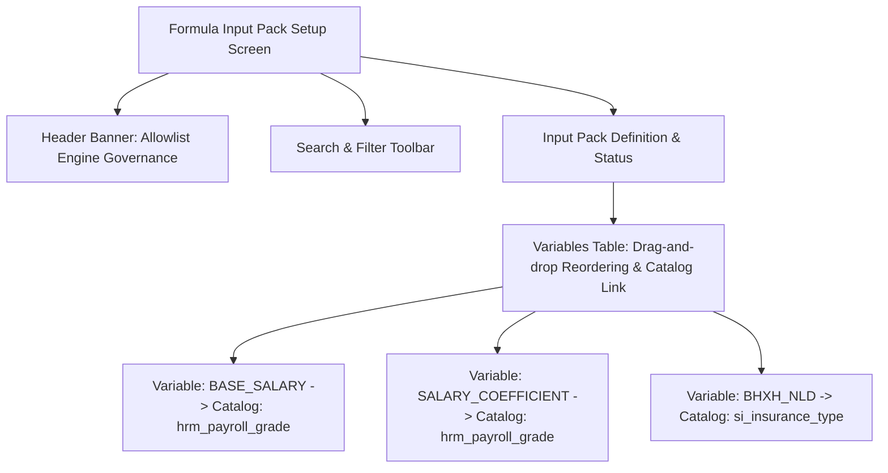

# UI-HRM-FORMULA-INPUT-PACK-01 — Wave 10 UI Screen Specification

- **Screen ID**: `UI-HRM-FORMULA-INPUT-PACK-01`
- **Screen Name**: Formula Engine Input Allowlist & Variable Binding (`/hr/settings/formula-input-pack`)
- **Version**: 1.0.0 (Enterprise Standard 7-Section Model)
- **Status**: APPROVED

---

## 1. Information Architecture & Layout

---

## 2. Field-to-API Mapping Matrix

| UI Component / Field ID | UI Element | API DTO Field | Validation & Binding Rules |
|---|---|---|---|
| `pack-code-input` | Text Input | `pack_code` | Required, uppercase alphanumerics & underscores only. |
| `variable-code-input` | Text Input | `variable_code` | Required, uppercase alphanumerics. |
| `display-name-input` | Text Input | `display_name` | Required, Vietnam text string. |
| `catalog-bind-select` | Select Combobox| `bound_catalog_key` | Single selection from active master catalogs (Waves 1-9 & 11). |
| `sign-select` | Select Combobox| `calculation_sign` | Options: `+` (Income) or `-` (Deduction). |

---

## 3. Testable Acceptance Criteria Table (`data-testid`)

| Test ID | Test Scenario | Trigger Action | Expected Outcome | `data-testid` Element |
|---|---|---|---|---|
| `AC-FORMULA-01` | Render Formula Allowlist | Open tab | Display input pack card & 18 default variables | `formula-input-pack-container` |
| `AC-FORMULA-02` | Search Variable | Type `BHXH` | Filter table rows to matching `BHXH_NLD` | `formula-variable-search` |
| `AC-FORMULA-03` | Add Custom Variable | Click Add | Insert row with catalog binding selection | `add-variable-btn` |
