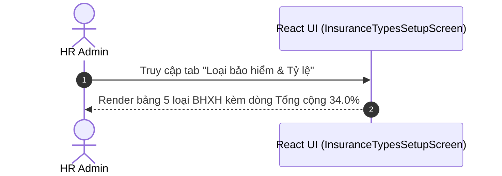

# UI Screen Spec — UI-HRM-INSURANCE-TYPE-01: Quản lý Loại bảo hiểm & Tỷ lệ trích nộp (Wave 5)

| Meta | Value |
|---|---|
| work_item_id | BA-PO-HRM-FE-UI-SCREEN-SPEC-INS-01 |
| ref_srs | [BA_HRM_INSURANCE_TYPE_SRS_01_20260813.md](file:///C:/Users/ADMIN/OneDrive/Ta%CC%80i%20li%C3%AA%CC%A3u/Vibe%20Coding/projects/xevn-ecosystem/docs/program/deltas/BA_HRM_INSURANCE_TYPE_SRS_01_20260813.md) |
| ref_techspec | [BA_HRM_INSURANCE_TYPE_TECHSPEC_01_20260813.md](file:///C:/Users/ADMIN/OneDrive/Ta%CC%80i%20li%C3%AA%CC%A3u/Vibe%20Coding/projects/xevn-ecosystem/docs/program/deltas/BA_HRM_INSURANCE_TYPE_TECHSPEC_01_20260813.md) |
| ref_pattern | `PAT-SETTINGS-CATALOG-01` |
| Target Surface | Web Portal (`apps/web` - route `/hr/payroll/setup?section=insurance-types`) |
| Ngày | 2026-08-13 |
| Trạng thái | CONFIRMED — Enterprise Grade Standard |

---

## 1. Screen ID + Route & RBAC Persona

- **Screen ID:** `UI-HRM-INSURANCE-TYPE-01`
- **Route / Tab:** `/hr/payroll/setup?section=insurance-types`
- **Persona / RBAC:**
  - `HR Admin (Tenant)`: Tra cứu xem danh mục các loại bảo hiểm bắt buộc và tỷ lệ đóng theo quy định pháp luật.

---

## 2. Mục đích (Purpose)

Hiển thị bảng tổng hợp tỷ lệ đóng BHXH, BHYT, BHTN, KPCĐ, BHTNLN cho doanh nghiệp (23.5%) và người lao động (10.5%). Hỗ trợ tính chính xác số tiền bảo hiểm trừ vào bảng lương hằng tháng.

---

## 3. IA Layout (Information Architecture)

```mermaid
graph TD
    Root[Header: Thiết lập lương -> Loại bảo hiểm & Tỷ lệ]
    Info[Info Card: Tổng tỷ lệ trích nộp DN 23.5% + NLĐ 10.5% = 34.0%]
    Table[Table: Mã BH | Tên BH | Tỷ lệ DN % | Tỷ lệ NLĐ % | Tổng % | Trạng thái]
    Footer[Footer Table: Dòng tổng cộng tỷ lệ]

    Root --> Info
    Info --> Table
    Table --> Footer
```

---

## 4. Thành phần UI & Mapping Field -> API

### 4.1. Main Data Table (`insurance-types-table`)

| Cột UI | Label VI | Mapping Field | Format / Render |
|---|---|---|---|
| `col_code` | Mã loại bảo hiểm | `item.code` | Monospace bold (`INS_BHXH`, `INS_BHYT`) |
| `col_name` | Tên loại bảo hiểm | `item.name` | Text VI |
| `col_employer_rate` | Tỷ lệ DN đóng (%) | `item.employerRate` | Number formatted purple (`17.0%`, `3.0%`) |
| `col_employee_rate` | Tỷ lệ NLĐ đóng (%) | `item.employeeRate` | Number formatted sky blue (`8.0%`, `1.5%`) |
| `col_total_rate` | Tổng tỷ lệ (%) | `employerRate + employeeRate` | Number formatted emerald bold (`25.0%`, `4.5%`) |
| `col_status` | Trạng thái | `item.status` | Badge xanh `Áp dụng` |

---

## 5. Luồng Tương tác Sequence Diagram



---

## 6. Trạng thái Empty / Loading / Error

- **Loading:** Skeleton table 5 dòng.
- **Empty:** "Không tìm thấy thông tin loại bảo hiểm."

---

## 7. Acceptance Criteria UI (Testable AC)

| Step / Action | FE Observation / State | Network Request | `data-testid` Hint |
|---|---|---|---|
| 1. Chọn tab `insurance-types` | Màn hình hiển thị bảng 5 loại BHXH chuẩn với cột Tỷ lệ DN & Tỷ lệ NLĐ | N/A | `[data-testid="insurance-types-table"]` |
| 2. Kiểm tra dòng Footer | Dòng Tổng cộng hiển thị đúng DN 23.5% và NLĐ 10.5% | N/A | `[data-testid="insurance-types-table"] tfoot` |
