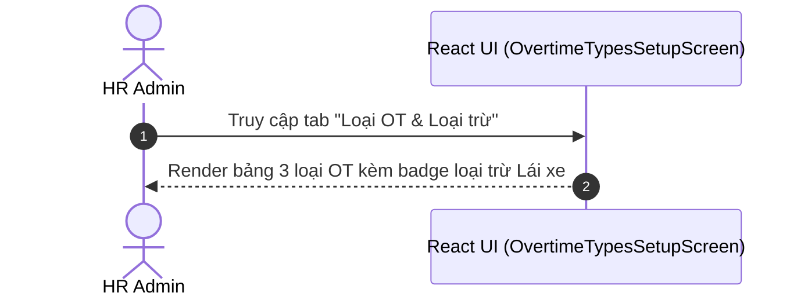

# UI Screen Spec — UI-HRM-OVERTIME-TYPE-01: Quản lý Loại OT & Quy tắc loại trừ Lái xe (Wave 6)

| Meta | Value |
|---|---|
| work_item_id | BA-PO-HRM-FE-UI-SCREEN-SPEC-OT-01 |
| ref_srs | [BA_HRM_OVERTIME_TYPE_SRS_01_20260813.md](file:///C:/Users/ADMIN/OneDrive/Ta%CC%80i%20li%C3%AA%CC%A3u/Vibe%20Coding/projects/xevn-ecosystem/docs/program/deltas/BA_HRM_OVERTIME_TYPE_SRS_01_20260813.md) |
| ref_techspec | [BA_HRM_OVERTIME_TYPE_TECHSPEC_01_20260813.md](file:///C:/Users/ADMIN/OneDrive/Ta%CC%80i%20li%C3%AA%CC%A3u/Vibe%20Coding/projects/xevn-ecosystem/docs/program/deltas/BA_HRM_OVERTIME_TYPE_TECHSPEC_01_20260813.md) |
| ref_pattern | `PAT-SETTINGS-CATALOG-01` |
| Target Surface | Web Portal (`apps/web` - route `/hr/payroll/setup?section=overtime-types`) |
| Ngày | 2026-08-13 |
| Trạng thái | CONFIRMED — Enterprise Grade Standard |

---

## 1. Screen ID + Route & RBAC Persona

- **Screen ID:** `UI-HRM-OVERTIME-TYPE-01`
- **Route / Tab:** `/hr/payroll/setup?section=overtime-types`
- **Persona / RBAC:**
  - `HR Admin (Tenant)`: Quản lý 3 mức hệ số OT và cấu hình phạm vi loại trừ không tính OT cho đối tượng đặc thù (Lái xe).

---

## 2. Mục đích (Purpose)

Hiển thị danh mục Loại làm thêm giờ (150%, 200%, 300%) và cảnh báo quy tắc loại trừ Lái xe đường dài (chỉ hưởng lương chuyến, không hưởng OT giờ).

---

## 3. IA Layout (Information Architecture)

```mermaid
graph TD
    Root[Header: Thiết lập lương -> Loại OT & Loại trừ]
    Alert[Amber Alert Card: Cảnh báo Quy tắc loại trừ Lái xe đường dài]
    Table[Table: Mã OT | Tên Loại OT | Hệ số lương | Phạm vi loại trừ | Trạng thái]

    Root --> Alert
    Alert --> Table
```

---

## 4. Thành phần UI & Mapping Field -> API

### 4.1. Main Data Table (`overtime-types-table`)

| Cột UI | Label VI | Mapping Field | Format / Render |
|---|---|---|---|
| `col_code` | Mã loại OT | `item.code` | Monospace bold (`OT_WEEKDAY`, `OT_WEEKEND`) |
| `col_name` | Tên loại OT | `item.name` | Text VI |
| `col_multiplier` | Hệ số lương làm thêm | `item.multiplier` | Clock icon + `1.5x (150%)`, `2.0x (200%)` |
| `col_excluded` | Phạm vi loại trừ | `item.excludedGroup` | Badge đỏ `Lái xe tải & Lái xe đường dài` |
| `col_status` | Trạng thái | `item.status` | Badge xanh `Áp dụng` |

---

## 5. Luồng Tương tác Sequence Diagram



---

## 6. Trạng thái Empty / Loading / Error

- **Loading:** Skeleton table 3 dòng.
- **Empty:** "Không có dữ liệu loại OT."

---

## 7. Acceptance Criteria UI (Testable AC)

| Step / Action | FE Observation / State | Network Request | `data-testid` Hint |
|---|---|---|---|
| 1. Chọn tab `overtime-types` | Màn hình hiển thị bảng 3 loại OT và banner màu cam thông báo quy tắc loại trừ Lái xe | N/A | `[data-testid="overtime-types-table"]` |
| 2. Kiểm tra cột Hệ số | Cột hệ số hiển thị chuẩn `1.5x (150%)`, `2.0x (200%)`, `3.0x (300%)` | N/A | `[data-testid="overtime-types-table"] td` |
