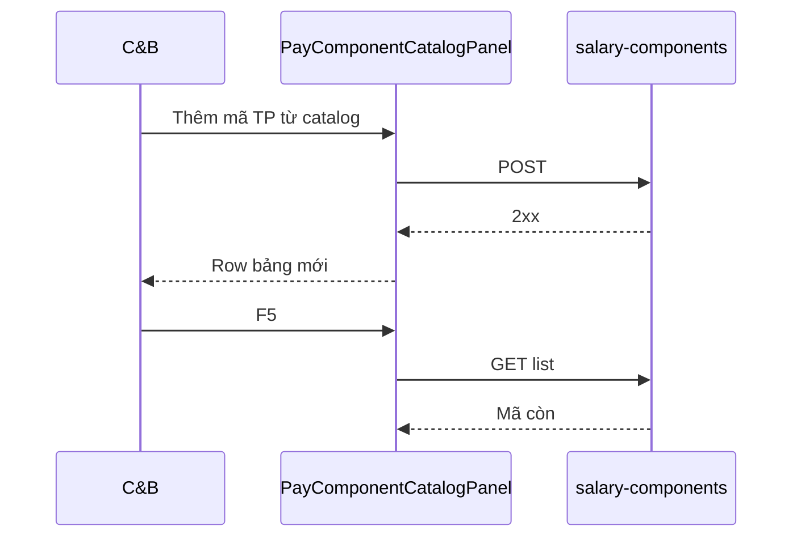

# UI_SCREEN_SPEC — Thiết lập lương · Danh mục thành phần (L1 · STP-07/08)

| Meta | Value |
|------|--------|
| **Screen ID** | `UI-HRM-PAY-STP-COMP-CATALOG` |
| **work_item_id** | `PO-HRM-PAY-CNTT-UI-SCREEN-01` |
| **ref_srs** | FR-UC-BP-PAY-STP-07 · FR-UC-BP-PAY-STP-08 · AC-PAY-COMP-01 |
| **ref_api** | F-PLT-PAY-COMP-* · `docs/hrm/API_DESIGN_HRM_PAYROLL.md` (salary_components) |
| **ref_pattern** | **PAT-SETTINGS-CATALOG-01** (list + dialog) — exception: fragment drawer STP-08 |
| **honesty** | `payroll_e2e_ready=false` |
| **no_prompt_echo** | true |

---

## 1. Screen ID + route

| Mục | Giá trị |
|-----|---------|
| **Route** | `/hr/payroll/setup/components` |
| **Persona** | C&B tập đoàn |
| **Component** | `PayComponentCatalogPanel` · `PayFragmentMapDrawer` |

---

## 2. Mục đích

**Open catalog** thành phần lương (`salary_components`) + starter CHUNG; map **fragment policy** → đề xuất mã TP (STP-08) — picker SoT cho cột mẫu; **cấm** free-text `component_code` trên mẫu (AC-PAY-COMP-01).

---

## 3. IA layout

```text
┌─────────────────────────────────────────────────────────────────────────────┐
│ Header: Danh mục thành phần lương · [Import starter CHUNG] (khi BE sẵn)    │
├─────────────────────────────────────────────────────────────────────────────┤
│ Toolbar: [Tìm mã/tên____] · [+ Thêm TP] · [Map fragment…]                   │
├─────────────────────────────────────────────────────────────────────────────┤
│ Bảng: Mã | Nhãn VI | Loại (pay_types) | Hiệu lực | Thao tác                │
├─────────────────────────────────────────────────────────────────────────────┤
│ Dialog Thêm/Sửa · Drawer Fragment map (STP-08)                               │
└─────────────────────────────────────────────────────────────────────────────┘
```

---

## 4. Thành phần UI — field map API

### 4.1 Catalog CRUD — STP-07

| UI | API | DTO | SRS Diễn biến |
|----|-----|-----|----------------|
| Mã TP | POST/PATCH | `component_code` | STP-07 #1 |
| Nhãn VI | POST/PATCH | `name_vi` / label | STP-07 |
| Loại bản chất | Select catalog | `pay_type` / nature | dual SoT PAY-02 must_keep |
| Hiệu lực | Toggle active | `status` | STP-07 |
| Lưu | POST `/salary-components` | — | #2 2xx + list |
| Ngưng | soft retire | archive | alternate |

### 4.2 Fragment map drawer — STP-08

| UI | API | Ghi chú |
|----|-----|---------|
| Chọn `fragment_id` | read decompose catalog | INV until pack mount |
| Đề xuất mã+nlabel | POST component (confirm) | BR-PAY-STP-04 |
| User reject | close drawer | no create |
| testid | `pay-fragment-map-drawer` | |

---

## 5. Luồng tương tác (U65)



---

## 6. Empty / error / loading

| Trạng thái | Copy |
|------------|------|
| Catalog trống | «Thêm thành phần hoặc import starter CHUNG.» |
| Trùng mã | 400 + field hint |
| Fragment INV | Drawer CTA «Chờ mount pack» — honest empty |

---

## 7. AC UI (QA)

| AC-ID | PASS khi | testid |
|-------|----------|--------|
| AC-PAY-COMP-01 | Picker mẫu chỉ chọn mã catalog | `pay-comp-catalog-list` |
| STP-07 | Thêm TP Lưu 2xx F5 | `pay-comp-add-btn` |
| STP-08 | Fragment confirm → mã mới list | `pay-fragment-map-drawer` |
