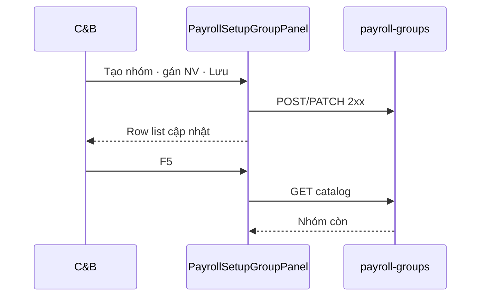

# UI_SCREEN_SPEC — Thiết lập lương · Nhóm lương (STP-09 setup)

| Meta | Value |
|------|--------|
| **Screen ID** | `UI-HRM-PAY-STP-GROUP` |
| **work_item_id** | `PO-HRM-PAY-CNTT-UI-SCREEN-01` |
| **ref_srs** | FR-UC-BP-PAY-STP-09 · FR-UC-BP-PAY-09 (runtime must_keep) · BR-BP-PAY-GRP-01 |
| **ref_api** | Payroll group CRUD — cite `PO-HRM-MVP-GD1-PAY-09-CLUSTER-API-01` |
| **ref_pattern** | Sibling `UI-PAYROLL-CLUSTER-EMBED` — **Thiết lập entry** only |
| **honesty** | `payroll_e2e_ready=false` |
| **no_prompt_echo** | true |

---

## 1. Screen ID + route

| Mục | Giá trị |
|-----|---------|
| **Route** | `/hr/payroll/setup/groups` |
| **Persona** | C&B |
| **Component** | `PayrollSetupGroupPanel` |
| **Cross-ref** | Runtime J-09 journeys: `UI-PAYROLL-CLUSTER-EMBED.md` |

---

## 2. Mục đích

**Thiết lập** danh mục nhóm lương + gán NV/rule BP (STP-09) — bổ sung UI module Thiết lập; **không REPLACE** FR-UC-BP-PAY-09 runtime GWC slice.

---

## 3. IA layout

```text
┌─────────────────────────────────────────────────────────────────────────────┐
│ Toolbar: [+ Nhóm] · Tìm mã/tên                                              │
├─────────────────────────────────────────────────────────────────────────────┤
│ Bảng nhóm: Mã | Tên | BP tag | Hiệu lực | Thao tác                          │
├─────────────────────────────────────────────────────────────────────────────┤
│ Drawer: Gán NV / rule bộ phận · effective_from                              │
└─────────────────────────────────────────────────────────────────────────────┘
```

---

## 4. Thành phần UI — field map API

| UI | API (cluster) | SRS |
|----|---------------|-----|
| CRUD nhóm | Payroll group catalog POST/PATCH | STP-09 #1 |
| Gán NV | Members / assign endpoints | STP-09 #2 |
| BP tag optional | metadata picker | map ĐPHH/TĐHK/LX/VP |
| Lưu | 2xx | AC-PAY-STP-GLOBAL-01 |
| Catalog mở | — | không hardcode 4 nhóm |

---

## 5. Luồng tương tác (U65)



---

## 6. Empty / error / loading

| Trạng thái | Copy |
|------------|------|
| Trống | «Tạo nhóm lương từ UI (U65).» |
| Trùng mã | 400 |
| NV đổi nhóm giữa kỳ | Cảnh báo — PAY-04 split runtime |

---

## 7. AC UI (QA)

| AC-ID | PASS khi | testid |
|-------|----------|--------|
| STP-09 | CRUD nhóm + gán 2xx F5 | `pay-stp-group-list` |
| BR-BP-PAY-GRP-01 | Catalog mở — không enum cứng | audit |
| Runtime | PAY-09 GWC slice không regression | cross-ref CLUSTER embed |
