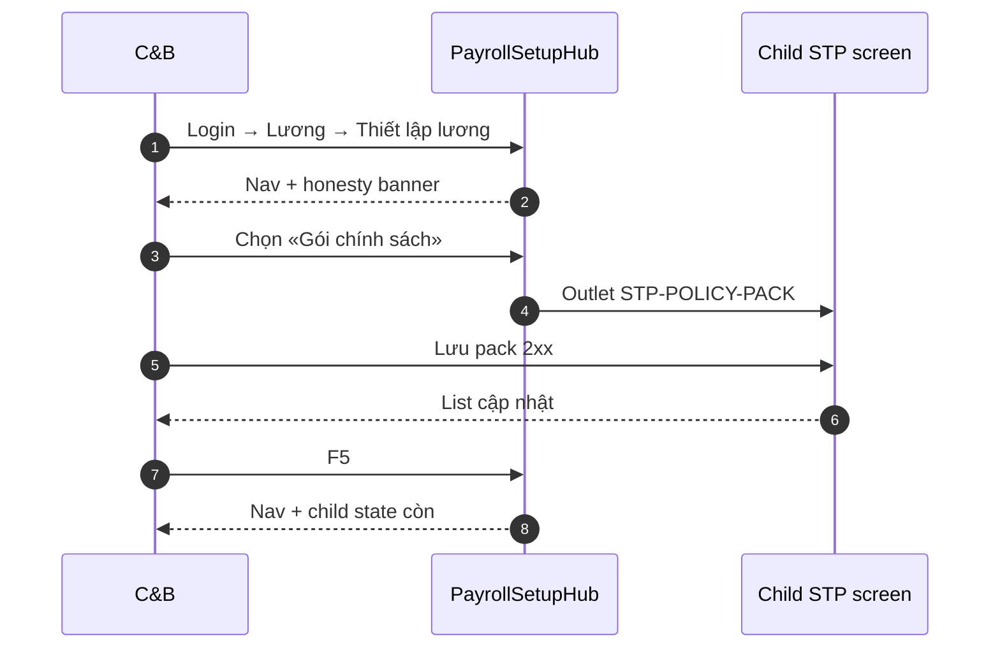

# UI_SCREEN_SPEC — Thiết lập lương · Hub (L1–L6 navigation)

| Meta | Value |
|------|--------|
| **Screen ID** | `UI-HRM-PAY-STP-HUB` |
| **work_item_id** | `PO-HRM-PAY-CNTT-UI-SCREEN-01` |
| **ref_srs** | Spine `UC-BP-PAY-STP-01..12` · `docs/program/deltas/PO-HRM-PAY-CNTT-STP-SRS-DELTA-01.md` §0 |
| **ref_sa** | `PO-HRM-PAY-CNTT-SA-01.md` §2.1 L1–L6 |
| **ref_api** | — (navigation only; child screens bind API) |
| **ref_pattern** | Payroll embed shell (sibling `UI-PAYROLL-CLUSTER-EMBED`) |
| **honesty** | `payroll_e2e_ready=false` |
| **no_prompt_echo** | true |

---

## 1. Screen ID + route

| Mục | Giá trị |
|-----|---------|
| **Route** | `/hr/payroll/setup?portal=1&tenantId=xevn&companyId=main` |
| **Alt** | Command Center embed `/command-center/hrm/payroll/setup` (khi CC routing sẵn) |
| **Persona** | C&B tập đoàn / C&B OU — `ceo@xe.vn` / `Xevn@2026` |
| **RBAC** | Quyền cấu hình lương Thiết lập; OU chỉ scope JWT — không thấy mẫu BP khác |
| **Component** | `PayrollSetupHub` (`data-testid="pay-stp-hub-root"`) |

---

## 2. Mục đích

Cung cấp **một cửa vào** module Thiết lập lương (metadata-driven ≥6 mô hình bảng pack P.CNTT) — tách khỏi **Lập bảng lương** runtime; điều hướng L1–L6 không hardcode BP; hiển thị honesty khi chưa UAT chạy kỳ.

---

## 3. IA layout

```text
┌─────────────────────────────────────────────────────────────────────────────┐
│ Header: «Thiết lập lương» · company scope label · [Làm mới scope]          │
├──────────────────┬──────────────────────────────────────────────────────────┤
│ Nav (1/4)        │ Content outlet (3/4)                                     │
│ · Gói chính sách │  → child screen theo nav                                 │
│ · Danh mục TP    │                                                          │
│ · Mẫu bảng       │  Honesty banner (sticky top content)                     │
│ · Profile nhập   │                                                          │
│ · Nhóm lương     │                                                          │
│ · (panel) Gợi ý  │  PaySetupResolvePanel read-only (optional bottom)        │
│   cấu hình       │                                                          │
└──────────────────┴──────────────────────────────────────────────────────────┘
```

| Vùng | Quy tắc |
|------|---------|
| Two-pane master-detail | Nav trái 1/4 · content phải 3/4 — `.xevn-safe-inline` |
| Không mutate tại hub | Hub chỉ nav + resolve preview — Lưu ở child screens |
| L2 Công thức | Link text «Công thức lương» → runtime/admin existing — **HOLD** eval GĐ1 |

---

## 4. Thành phần UI

| UI | Hành vi | API / data |
|----|---------|------------|
| Company scope label | Hiển thị `companyId` slug Plane B | JWT membership |
| Nav items | Route nội bộ setup cluster | — |
| Honesty banner | `payroll_e2e_ready=false` copy VI | Program flag — không claim UAT |
| Resolve preview (optional) | Mini form OU/BP tag → preview | `GET /pay-setup/resolve` — see SETUP-RESOLVE spec |
| Empty first visit | CTA «Bắt đầu: Gói chính sách CHUNG» | Spine STP-01 |

---

## 5. Luồng tương tác



---

## 6. Empty / error / loading

| Trạng thái | Copy / hành vi |
|------------|----------------|
| Loading hub | «Đang tải Thiết lập…» |
| Scope 403/409 | Banner scope — không spinner vô hạn |
| Honesty | «Thiết lập đã lưu ≠ chạy bảng lương kỳ — payroll_e2e_ready=false» |

---

## 7. AC UI (QA U65)

| AC-ID | PASS khi | testid |
|-------|----------|--------|
| AC-PAY-STP-GLOBAL-01 | Hub load 200 · nav tới policy · mutate child · F5 còn | `pay-stp-hub-root` |
| AC-PAY-STP-GLOBAL-02 | OU ĐPHH: list mẫu child không lẫn TĐHK | nav + child |
| AC-PAY-STP-GLOBAL-03 | Không enum BP cứng trong DOM nav | grep audit |
| J-HRM-PAY-STP-NAV-01 | Click path 5 nav items · URL đổi · không 404 | `pay-stp-nav-*` |
