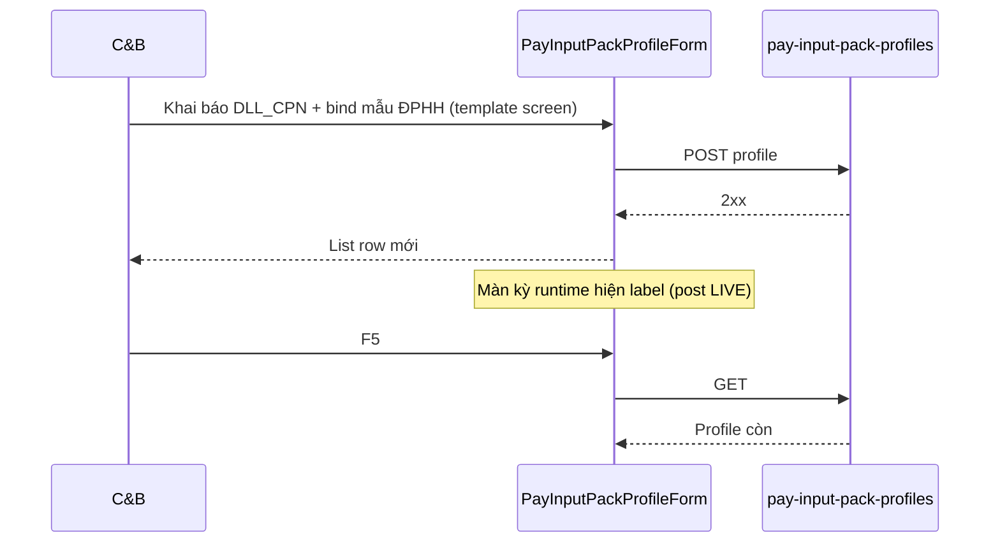

# UI_SCREEN_SPEC — Thiết lập lương · Profile nhập liệu (L5 · STP-12)

| Meta | Value |
|------|--------|
| **Screen ID** | `UI-HRM-PAY-STP-INPUT-PROFILE` |
| **work_item_id** | `PO-HRM-PAY-CNTT-UI-SCREEN-01` |
| **ref_srs** | FR-UC-BP-PAY-STP-12 · BR-PAY-STP-06 · AC-PAY-STP-04 |
| **ref_api** | F-PAY-INPUT-PROFILE-* · `PO-HRM-PAY-CNTT-API-01.md` §3 |
| **ref_pattern** | PAT-SETTINGS-CATALOG-01 (list + dialog) |
| **honesty** | `payroll_e2e_ready=false` |
| **no_prompt_echo** | true |

---

## 1. Screen ID + route

| Mục | Giá trị |
|-----|---------|
| **Route** | `/hr/payroll/setup/input-profiles` |
| **Persona** | C&B · Kế toán lương (read) |
| **Component** | `PayInputPackProfileList` · `PayInputPackProfileForm` |

---

## 2. Mục đích

Khai báo **profile nhập liệu kỳ** (`pay_input_pack_profile`): `allowedSourceKinds` (DLL_CPN · KPI · CPSC · REVENUE_DT · VP_COST…) · component bắt buộc · `columnHints` — màn nhập kỳ hiện label đúng; validate `source_kind` snapshot → `HRM-PAY-INP-PROFILE-422`.

---

## 3. IA layout

```text
┌─────────────────────────────────────────────────────────────────────────────┐
│ Toolbar: Tìm · [+ Profile mới]                                            │
├─────────────────────────────────────────────────────────────────────────────┤
│ Bảng: Mã | Tên | Kinds (summary) | Trạng thái | Thao tác                   │
├─────────────────────────────────────────────────────────────────────────────┤
│ Dialog: Mã · Tên · Multi-select allowedSourceKinds · Required components  │
│         · Column hints map (advanced) · [Lưu]                               │
└─────────────────────────────────────────────────────────────────────────────┘
```

---

## 4. Thành phần UI — field map API

### 4.1 List

| UI | API | DTO |
|----|-----|-----|
| Bảng | `GET /pay-input-pack-profiles` | `code` · `nameVi` · `status` |
| Archive | `POST …/:id/archive` | `archivedAt` |

### 4.2 Form — STP-12

| UI field | API | DTO | Rule |
|----------|-----|-----|------|
| Mã profile | POST/PATCH | `code` | open catalog |
| Tên VI | POST/PATCH | `nameVi` | required |
| Loại nguồn cho phép | Multi-select | `allowedSourceKinds[]` | non-empty POST |
| Recommended labels | picker metadata | `manual` `kpi` `dll_cpn` `cpsc` … | BR-DATA-INP-01 |
| Component bắt buộc | Multi picker catalog | `requiredComponentCodes[]` | `HRM-SC-COMP-KEY` when active |
| Column hints | JSON editor / grid | `columnHints` | shape validation GĐ1 |
| Bind mẫu | cross-ref | FK on template L6 | STP-SHEET-TEMPLATE §4.2 |
| Lưu | POST/PATCH | — | AC-PAY-STP-04 |

**Vocabulary normative (display):**

| Type key | Mô hình | Label VI gợi ý |
|----------|---------|----------------|
| `dll_cpn` | ĐPHH | DLL CPN |
| `kpi` / `kpi_tdHK` | TĐHK | KPI tổng đài |
| `bcc_std` | TG | Ngày công chuẩn |
| `cpsc` · `cldv` | LX-T | CPSC / CLDV |
| `revenue` · `advance` · `xdtn` | LX-TR | DT / Tạm ứng |
| `vp_cost` · `vp_allowance` | VP-T | CP VP / Trợ lương |

---

## 5. Luồng tương tác (U65)



---

## 6. Empty / error / loading

| Trạng thái | Copy |
|------------|------|
| `allowedSourceKinds` empty | Chặn Lưu — BR-PAY-STP-06 |
| Type orphan | Validation message VI |
| `HRM-PAY-INP-PROF-409-CODE` | Trùng mã |

---

## 7. AC UI (QA)

| AC-ID | PASS khi | testid |
|-------|----------|--------|
| AC-PAY-STP-04 | `dll_cpn` profile Lưu 2xx F5 | `pay-input-profile-kinds` |
| AC-CNTT-SETUP-04 | Period input rejects kind ∉ profile (runtime QA) | — |
| AC-PAY-STP-GLOBAL-01 | Mutate profile FE+F5 | `pay-input-profile-list` |
