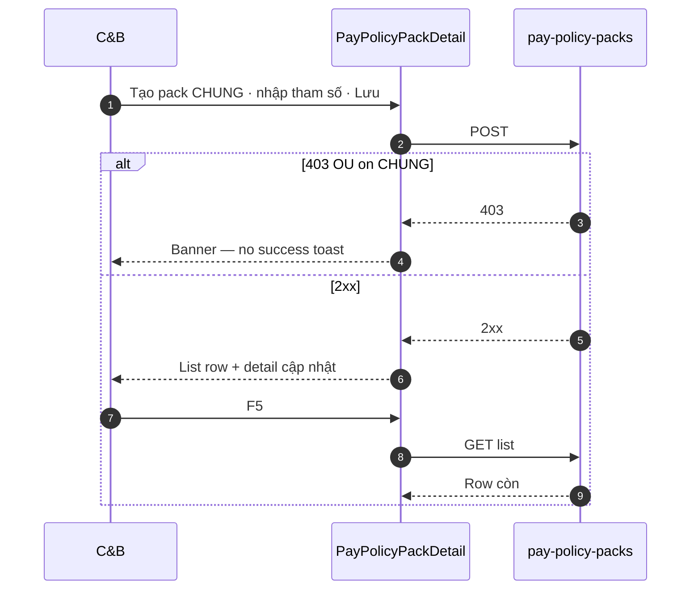

# UI_SCREEN_SPEC — Thiết lập lương · Gói chính sách (L4 · STP-01..06)

| Meta | Value |
|------|--------|
| **Screen ID** | `UI-HRM-PAY-STP-POLICY-PACK` |
| **work_item_id** | `PO-HRM-PAY-CNTT-UI-SCREEN-01` |
| **ref_srs** | FR-UC-BP-PAY-STP-01..06 · BR-PAY-STP-01..02 |
| **ref_api** | F-PAY-POLICY-PACK-* · `docs/program/specs/PO-HRM-PAY-CNTT-API-01.md` §2 |
| **ref_pattern** | List + detail two-pane (không gộp CHUNG+RIÊNG một form) |
| **honesty** | `payroll_e2e_ready=false` |
| **no_prompt_echo** | true |

---

## 1. Screen ID + route

| Mục | Giá trị |
|-----|---------|
| **Route** | `/hr/payroll/setup/policy-packs` (child of STP-HUB) |
| **Persona** | C&B tập đoàn (CHUNG) · C&B OU/BP (RIÊNG) |
| **Component** | `PayPolicyPackList` + `PayPolicyPackDetail` |

---

## 2. Mục đích

CRUD **gói chính sách lương** (`pay_policy_pack`): pack **CHUNG** (thang bậc QĐ 2A/127A) và pack **RIÊNG** theo OU/BP (ĐPHH · TĐHK · LX · VP); tham số số KPI/PCCV/BCC/geo/VP trong `rateParams` — **cấm** gộp scope CHUNG+RIÊNG trên một form.

---

## 3. IA layout

```text
┌─────────────────────────────────────────────────────────────────────────────┐
│ Toolbar: [CHUNG | RIÊNG] · BP tag filter · Tìm mã/tên · [+ Thêm gói]       │
├──────────────────┬──────────────────────────────────────────────────────────┤
│ List (1/4)       │ Detail (3/4)                                             │
│ code · name ·    │ §4.2 Registry fields                                     │
│ scope · tag ·    │ §4.3 Rate params grid (STP-03..06)                       │
│ effective        │ §4.4 Doc refs (read paths)                               │
│                  │ [Lưu] [Ngưng/Archive]                                    │
└──────────────────┴──────────────────────────────────────────────────────────┘
```

---

## 4. Thành phần UI — field map API

### 4.1 List — `PayPolicyPackList`

| UI | API | DTO field | SRS |
|----|-----|-----------|-----|
| Filter CHUNG/RIÊNG | `GET /pay-policy-packs?scope=` | `scope` | STP-01 vs STP-02 |
| Filter BP tag | `?business_line_tag=` | `businessLineTag` | STP-02 · GLOBAL-02 |
| Bảng mã/tên | `GET …/pay-policy-packs` | `code` · `nameVi` | Diễn biến #1 |
| Click row | `GET …/pay-policy-packs/:id` | full DTO | scope parity U19 |

### 4.2 Detail registry — `PayPolicyPackDetail`

| UI field | Editable | API | DTO | UC |
|----------|----------|-----|-----|-----|
| Mã pack | ✓ create | POST/PATCH | `code` | STP-01/02 |
| Tên VI | ✓ | POST/PATCH | `nameVi` | STP-01 |
| Scope | ✓ create only | POST | `scope` CHUNG\|RIENG | BR-PAY-STP-01 |
| BP tag | ✓ when RIÊNG | POST/PATCH | `businessLineTag` | STP-02 |
| Hiệu lực từ | ✓ `dd/MM/yyyy` | POST/PATCH | `effectiveFrom` | BR-PAY-STP-02 |
| Hiệu lực đến | ✓ optional | POST/PATCH | `effectiveTo` | HRM-PAY-POL-400-DATE |
| Trạng thái | ✓ | PATCH | `status` draft\|active\|retired | — |
| Lưu | — | POST/PATCH | — | AC-PAY-STP-GLOBAL-01 |

**BR-PAY-STP-01:** C&B OU mở CHUNG → 403 banner — không toast success.

### 4.3 Rate params grid (STP-03..06)

| Param key (open) | UI control | DTO | UC |
|------------------|------------|-----|-----|
| `kpi_threshold_*` | Number vi-VN | `rateParams` json | STP-03 |
| `bcc_std` | Number | `rateParams` | STP-04 |
| `route_unit_price` / geo keys | Number + catalog picker địa bàn | `rateParams` | STP-05 |
| `vp_allowance` · `vp_cost` | Money vi-VN | `rateParams` | STP-06 |

Metadata-driven keys — **cấm** Nest enum 6 tỉnh trên UI.

### 4.4 Doc refs (read-only paths GĐ1)

| UI | API | DTO |
|----|-----|-----|
| List tham chiếu QĐ/PDF | PATCH | `policyDocRefs[]` `{ docId?, path?, fragmentIds? }` |

---

## 5. Luồng tương tác (U65)



---

## 6. Empty / error / loading

| Trạng thái | Hành vi |
|------------|---------|
| List trống | «Chưa có gói — tạo từ nút Thêm (U65).» |
| `HRM-PAY-POL-409-CODE` | Toast/banner trùng mã |
| `HRM-PAY-POL-400-DATE` | Validation hiệu lực |
| Archive | `POST …/archive` — row ẩn list default |

---

## 7. AC UI (QA)

| AC-ID | PASS khi | testid |
|-------|----------|--------|
| AC-PAY-STP-01 | CHUNG pack Lưu 2xx · F5 còn | `pay-policy-pack-save` |
| AC-PAY-STP-02 | RIÊNG ĐPHH bind · list mẫu child lọc BP | `pay-policy-pack-scope-rieng` |
| AC-PAY-STP-GLOBAL-01 | Mọi mutate policy: 2xx → FE list → F5 | `pay-policy-pack-list` |
| AC-PAY-STP-GLOBAL-02 | OU scope không thấy pack BP khác | filter |
