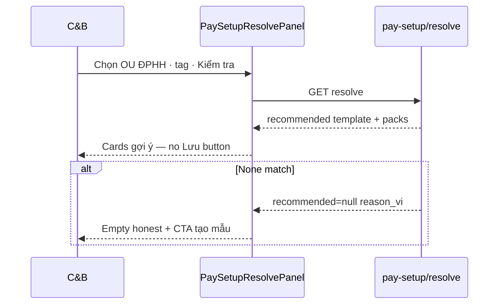

# UI_SCREEN_SPEC — Thiết lập lương · Gợi ý cấu hình (L6 · setup resolve hub)

| Meta | Value |
|------|--------|
| **Screen ID** | `UI-HRM-PAY-STP-SETUP-RESOLVE` |
| **work_item_id** | `PO-HRM-PAY-CNTT-UI-SCREEN-01` |
| **ref_srs** | UC-BP-PAY-STP-10/11 · STP-02 bind · AC-CNTT-SETUP-01..03 |
| **ref_api** | **F-PAY-SETUP-RESOLVE-01** · `GET /api/hrm/payroll/pay-setup/resolve` |
| **ref_pattern** | Read-only helper panel (hub + period form embed) |
| **honesty** | `payroll_e2e_ready=false` |
| **no_prompt_echo** | true |

---

## 1. Screen ID + route

| Mục | Giá trị |
|-----|---------|
| **Embed A** | STP-HUB bottom panel «Gợi ý cấu hình» |
| **Embed B** | Form lập kỳ runtime (cross-ref PAY-06 — read-only helper GĐ1) |
| **Component** | `PaySetupResolvePanel` · `usePaySetupResolve` |
| **testid** | `pay-setup-resolve-panel` |

---

## 2. Mục đích

**Read-only** helper: gợi ý bộ `(template, policyPack?, inputProfile?)` theo `company_id` · `ou_id?` · `business_line_tag?` · `employee_id?` · `effective_on?` — **không mutate**; FE period form hiển thị picker khi `candidates[]` > 1.

---

## 3. IA layout

```text
┌─────────────────────────────────────────────────────────────────────────────┐
│ «Gợi ý cấu hình» (read-only)                                                │
│ OU [picker] · BP tag [picker metadata] · NV [optional] · Ngày [dd/MM/yyyy]  │
│ [Kiểm tra gợi ý]                                                            │
├─────────────────────────────────────────────────────────────────────────────┤
│ Recommended: Mẫu · Gói CS · Profile — display labels                        │
│ Hoặc: candidates[] table + reason_vi khi empty                              │
└─────────────────────────────────────────────────────────────────────────────┘
```

---

## 4. Thành phần UI — field map API

| UI query | API query param | Response field |
|----------|-----------------|----------------|
| Công ty | `company_id` | scope |
| OU | `ou_id?` | ranking |
| BP tag | `business_line_tag?` | filter templates |
| NV | `employee_id?` | applicability employee |
| Ngày | `effective_on?` | active on date |
| **Kiểm tra** | `GET /pay-setup/resolve` | `recommended` · `candidates[]` |
| Empty honest | — | `recommended=null` + `reason_vi` **200** |

| Response slice | Display |
|----------------|---------|
| `recommended.template` | name · applicability |
| `recommended.policyPack?` | code · nameVi |
| `recommended.inputProfile?` | code · allowed kinds summary |
| `candidates[]` | Picker rows when tie |

**FORBIDDEN UI:** auto-create template/policy on empty.

---

## 5. Luồng tương tác



---

## 6. Empty / error / loading

| Trạng thái | Copy |
|------------|------|
| Loading | «Đang gợi ý…» |
| No match | `reason_vi` từ API — CTA link STP-SHEET-TEMPLATE |
| Scope error | 403/409 banner |

---

## 7. AC UI (QA)

| AC-ID | PASS khi | testid |
|-------|----------|--------|
| AC-CNTT-SETUP-01 | Resolve 200 với OU+tag | `pay-setup-resolve-panel` |
| AC-CNTT-SETUP-02 | Policy pack hiển thị khi bound | recommended card |
| AC-CNTT-SETUP-03 | Template+profile tuple khớp FK | recommended card |
| J-HRM-PAY-STP-RESOLVE-01 | Read-only — không POST mutate | no save button |
