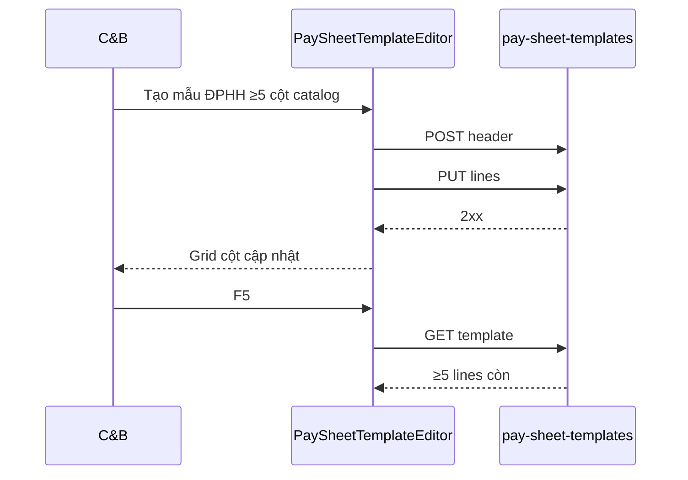

# UI_SCREEN_SPEC — Thiết lập lương · Mẫu bảng lương (L3+L6 · STP-10/11)

| Meta | Value |
|------|--------|
| **Screen ID** | `UI-HRM-PAY-STP-SHEET-TEMPLATE` |
| **work_item_id** | `PO-HRM-PAY-CNTT-UI-SCREEN-01` |
| **ref_srs** | FR-UC-BP-PAY-STP-10 · FR-UC-BP-PAY-STP-11 · AC-PAY-TPL-01..03 · AC-PAY-STP-03/05 |
| **ref_api** | F-PAY-SHEET-TPL-* · `PO-HRM-AMIS-PARITY-PAY-TPL-API-01` + CNTT EXPAND §5 |
| **ref_pattern** | List + editor two-pane; grid 12 cột cột mẫu |
| **honesty** | `payroll_e2e_ready=false` |
| **no_prompt_echo** | true |

---

## 1. Screen ID + route

| Mục | Giá trị |
|-----|---------|
| **Route** | `/hr/payroll/setup/sheet-templates` |
| **Persona** | C&B (scope OU/BP) |
| **Component** | `PaySheetTemplateList` · `PaySheetTemplateEditor` |

---

## 2. Mục đích

CRUD **mẫu bảng lương** đa OU/BP/tỉnh: header applicability · cột gắn `component_code` từ catalog · sort · optional formula override FK (published only); **bind L6** `policyPackId` · `inputPackProfileId` · `businessLineTag` — nhiều mẫu cùng BP khác applicability (STP-11).

---

## 3. IA layout

```text
┌─────────────────────────────────────────────────────────────────────────────┐
│ Toolbar: BP tag filter · policy/profile filter · [+ Mẫu mới]              │
├──────────────────┬──────────────────────────────────────────────────────────┤
│ Template list    │ Editor                                                   │
│ name · tag ·     │ §4.2 Header bind (L6)                                    │
│ applicability    │ §4.3 Lines grid (component picker · sort · OV FK)      │
│                  │ [Lưu header] [Lưu cột]                                   │
└──────────────────┴──────────────────────────────────────────────────────────┘
```

---

## 4. Thành phần UI — field map API

### 4.1 List — `PaySheetTemplateList`

| UI | API | DTO |
|----|-----|-----|
| Filter BP tag | `GET /pay-sheet-templates?business_line_tag=` | `businessLineTag` |
| Filter policy | `?policy_pack_id=` | `policyPackId` |
| Bảng mẫu | `GET /pay-sheet-templates` | `name` · applicability display |

### 4.2 Header — STP-10/11 + L6 bind

| UI field | API | DTO | UC |
|----------|-----|-----|-----|
| Tên mẫu | POST/PATCH | `name` / `nameVi` | STP-10 |
| Applicability OU/BP | POST/PATCH | applicability fields | BR-PAY-STP-03 |
| BP tag | POST/PATCH | `businessLineTag` | STP-11 |
| Mặc định | PATCH | `isDefault` | resolve rank |
| **Gói chính sách** | PATCH | `policyPackId` | STP-02 L6 |
| **Profile nhập** | PATCH | `inputPackProfileId` | STP-12 L6 |
| Lưu header | POST/PATCH `/pay-sheet-templates` | — | AC-PAY-TPL-01 |

FK archived/out scope → `HRM-PAY-SETUP-404-PACK`.

### 4.3 Lines grid — STP-10

| UI | API | DTO | Rule |
|----|-----|-----|------|
| Thêm cột | PUT `/pay-sheet-templates/:id/lines` | `componentCode` | picker catalog only |
| Sort | PUT lines | `sortOrder` | AC-PAY-TPL-02 |
| Override formula | line DTO | `overrideFormulaId` | published only BR-PAY-STP-05 |
| Free-text mã | — | — | **400** AC-PAY-COMP-01 |

### 4.4 Multi-template STP-11

| Rule | UI |
|------|-----|
| Cùng BP · khác `businessLineTag`/tỉnh | 2 headers list — không 1 row hardcode 6 tỉnh |
| Picker kỳ (runtime) | Chỉ mẫu applicability khớp NV — doc cross-ref PAY-06 |

---

## 5. Luồng tương tác (U65)



---

## 6. Empty / error / loading

| Trạng thái | Hành vi |
|------------|---------|
| Chưa có catalog TP | CTA → STP-COMP-CATALOG |
| Cột invalid | 400 banner |
| Formula chưa publish | Chặn override FK |

---

## 7. AC UI (QA)

| AC-ID | PASS khi | testid |
|-------|----------|--------|
| AC-PAY-STP-03 | Mẫu ĐPHH ≥5 cột · F5 · chọn khi tạo kỳ OU | `pay-sheet-tpl-editor` |
| AC-PAY-STP-05 | VP 2 mẫu tỉnh A/B · picker đúng tag | `pay-sheet-tpl-list` |
| AC-PAY-TPL-01 | CRUD header+lines 2xx | `pay-sheet-tpl-col-picker` |
| L6 bind | policy+profile FK Lưu 2xx | `pay-sheet-tpl-bind-policy` · `pay-sheet-tpl-bind-profile` |
