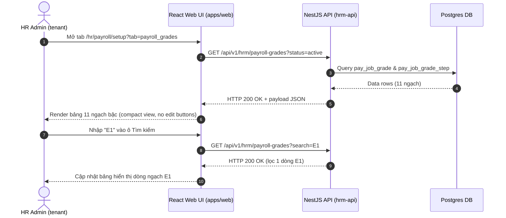

# UI Screen Spec — UI-HRM-PAYROLL-GRADE-01: Quản lý Danh mục Ngạch bậc lương (Wave 1)

| Meta | Value |
|---|---|
| work_item_id | BA-PO-HRM-FE-UI-SCREEN-SPEC-GRADE-01 |
| ref_srs | [BA_HRM_PAYROLL_GRADE_SRS_01_20260813.md](file:///C:/Users/ADMIN/OneDrive/Ta%CC%80i%20li%C3%AA%CC%A3u/Vibe%20Coding/projects/xevn-ecosystem/docs/program/deltas/BA_HRM_PAYROLL_GRADE_SRS_01_20260813.md) |
| ref_techspec | [BA_HRM_PAYROLL_GRADE_TECHSPEC_01_20260813.md](file:///C:/Users/ADMIN/OneDrive/Ta%CC%80i%20li%C3%AA%CC%A3u/Vibe%20Coding/projects/xevn-ecosystem/docs/program/deltas/BA_HRM_PAYROLL_GRADE_TECHSPEC_01_20260813.md) |
| ref_api_design | [BA_HRM_PAYROLL_GRADE_API_DESIGN_01_20260813.md](file:///C:/Users/ADMIN/OneDrive/Ta%CC%80i%20li%C3%AA%CC%A3u/Vibe%20Coding/projects/xevn-ecosystem/docs/program/deltas/BA_HRM_PAYROLL_GRADE_API_DESIGN_01_20260813.md) |
| ref_pattern | `PAT-SETTINGS-CATALOG-01` (`SettingsCatalogScreenShell` compact) |
| Target Surface | Web Portal (`apps/web` - route `/hr/payroll/setup?tab=payroll_grades`) |
| Ngày | 2026-08-13 |
| Trạng thái | CONFIRMED — Sẵn sàng cho Dev FE implement |

---

## 1. Screen ID + Route & RBAC Persona

- **Screen ID:** `UI-HRM-PAYROLL-GRADE-01`
- **Route / Tab:** `/hr/payroll/setup?tab=payroll_grades` (hoặc `/hr/settings?tab=payroll_grades`)
- **Persona / RBAC:** 
  - `HR Admin (Tenant)`: Tra cứu xem danh mục Ngạch bậc lương được Tập đoàn áp dụng (chế độ chỉ đọc `is_read_only = true`, ẩn nút Thêm/Sửa/Xóa).
  - `Group Admin (XBOS holding)`: Xem và quản lý Ban hành danh mục Ngạch bậc toàn tập đoàn (`xevn/holding`).

---

## 2. Mục đích (Purpose)

Giao diện hiển thị Bảng danh mục Ngạch bậc lương (mã `D1`-`E2`) gồm mã ngạch, tên ngạch, ngày hiệu lực và các cột thang lương theo Bậc (Bậc I, Bậc II, Bậc III...). Hỗ trợ HR Admin công ty thành viên đối chiếu mức lương ngạch bậc khi tạo hợp đồng/hồ sơ nhân sự, đảm bảo thông tin minh bạch, không vỡ layout trên màn hình nhỏ.

---

## 3. IA Layout (Information Architecture)

Sử dụng pattern **PAT-SETTINGS-CATALOG-01** (`SettingsCatalogScreenShell` `density="compact"`):

```mermaid
graph TD
    Root[Header: Cài đặt -> Danh mục Ngạch bậc lương]
    Toolbar[Toolbar: Ô tìm kiếm Mã/Tên Ngạch + Lọc trạng thái Active/Archived]
    Table[Bảng Danh mục compact: Mã ngạch | Tên ngạch | Bậc I | Bậc II | Bậc III | Ngày hiệu lực | Trạng thái]
    Pagination[Footer: Pagination 10/20/50 bản ghi per page]
    
    Root --> Toolbar
    Toolbar --> Table
    Table --> Pagination
```

---

## 4. Thành phần UI & Mapping Field -> API

### 4.1. Toolbar Controls

| UI Component | Label VI | Binding Field API | Kiểu / Interaction |
|---|---|---|---|
| `search_input` | "Tìm kiếm mã hoặc tên ngạch..." | `query.search` | Text input, debounce 300ms |
| `status_select` | "Trạng thái" | `query.status` | Select: `active` (mặc định), `archived`, `all` |
| `badge_read_only` | "Nguồn: Tập đoàn (Chỉ đọc)" | N/A | Badge xanh cyan cố định góc phải toolbar |

### 4.2. Main Data Table (`pay_job_grade`)

| Cột UI | Label VI | Mapping API Field | Format / Render |
|---|---|---|---|
| `col_code` | Mã ngạch | `item.code` | Font monospace, bold (`D1`, `E1`...) |
| `col_name` | Tên ngạch | `item.name` | Text VI, ví dụ "Ngạch D1 - Lãnh đạo cấp cao" |
| `col_step_1` | Bậc I (Lương cứng) | `item.steps[stepNumber=1].baseSalary` | Currency formatted (`15.000.000 đ`) |
| `col_step_2` | Bậc II (Lương cứng) | `item.steps[stepNumber=2].baseSalary` | Currency formatted (`17.500.000 đ`) |
| `col_step_3` | Bậc III (Lương cứng) | `item.steps[stepNumber=3].baseSalary` | Currency formatted (`20.000.000 đ` hoặc `-` nếu không có) |
| `col_effective_date` | Ngày hiệu lực | `item.effectiveDate` | Format `DD/MM/YYYY` |
| `col_status` | Trạng thái | `item.status` | Badge: Green (`Active`), Gray (`Archived`) |

---

## 5. Luồng Tương tác Sequence Diagram



---

## 6. Trạng thái Empty / Loading / Error

- **Loading State:** Hiển thị 5 dòng Skeleton Table animation compact.
- **Empty State (Chưa có dữ liệu):** 
  - Copy VI: *"Chưa có dữ liệu Ngạch bậc lương được đồng bộ từ Tập đoàn."*
  - Subtext: *"Vui lòng liên hệ Quản trị viên Tập đoàn để ban hành và áp dụng danh mục thang lương."*
  - CTA (U65 Zero-seed): Nút *"Tải lại dữ liệu"* (gọi re-fetch API), **KHÔNG** tự động seed data giả.
- **Error State (500 / Network Error):** Banner báo lỗi *"Không thể kết nối máy chủ dữ liệu lương. Vui lòng thử lại sau."* + Nút *"Thử lại"*.

---

## 7. Acceptance Criteria UI (Testable AC)

| Step / Action | FE Observation / State | Network Request | `data-testid` Hint |
|---|---|---|---|
| 1. Truy cập tab `payroll_grades` | Màn hình tải Skeleton, sau đó hiện bảng ngạch bậc đầy đủ các cột | `GET /api/v1/hrm/payroll-grades` -> `200 OK` | `[data-testid="payroll-grade-table"]` |
| 2. Kiểm tra giao diện tenant | Không xuất hiện nút "Thêm ngạch", "Sửa", "Xóa". Có Badge "Chỉ đọc" | None | `[data-testid="readonly-badge"]` |
| 3. Gõ "D1" vào ô search | Bảng cuộn và lọc còn đúng 1 bản ghi ngạch D1 | `GET /api/v1/hrm/payroll-grades?search=D1` -> `200 OK` | `[data-testid="search-grade-input"]` |
| 4. Kiểm tra format tiền | Số tiền định dạng chuẩn tiếng Việt (dấu chấm phân cách ngàn + `đ`) | None | `[data-testid="step-salary-cell"]` |
