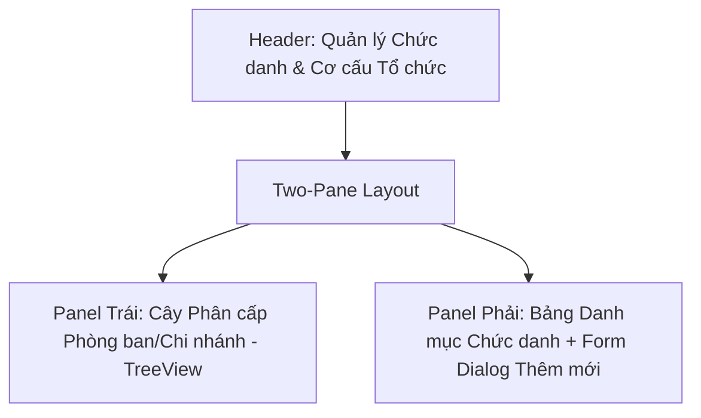
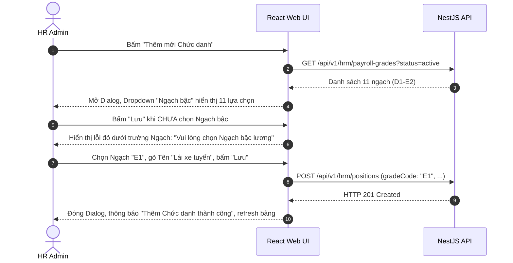

# UI Screen Spec — UI-HRM-POSITION-DEPARTMENT-01: Quản lý Chức danh & Phòng ban/Chi nhánh (Wave 3)

| Meta | Value |
|---|---|
| work_item_id | BA-PO-HRM-FE-UI-SCREEN-SPEC-POSDEPT-01 |
| ref_srs | [BA_HRM_POSITION_DEPARTMENT_SRS_01_20260813.md](file:///C:/Users/ADMIN/OneDrive/Ta%CC%80i%20li%C3%AA%CC%A3u/Vibe%20Coding/projects/xevn-ecosystem/docs/program/deltas/BA_HRM_POSITION_DEPARTMENT_SRS_01_20260813.md) |
| ref_techspec | [BA_HRM_POSITION_DEPARTMENT_TECHSPEC_01_20260813.md](file:///C:/Users/ADMIN/OneDrive/Ta%CC%80i%20li%C3%AA%CC%A3u/Vibe%20Coding/projects/xevn-ecosystem/docs/program/deltas/BA_HRM_POSITION_DEPARTMENT_TECHSPEC_01_20260813.md) |
| ref_api_design | [BA_HRM_POSITION_DEPARTMENT_API_DESIGN_01_20260813.md](file:///C:/Users/ADMIN/OneDrive/Ta%CC%80i%20li%C3%AA%CC%A3u/Vibe%20Coding/projects/xevn-ecosystem/docs/program/deltas/BA_HRM_POSITION_DEPARTMENT_API_DESIGN_01_20260813.md) |
| Target Surface | Web Portal (`apps/web` - route `/hr/payroll/setup?tab=positions_departments`) |
| Ngày | 2026-08-13 |
| Trạng thái | CONFIRMED — Sẵn sàng cho Dev FE implement |

---

## 1. Screen ID + Route & RBAC Persona

- **Screen ID:** `UI-HRM-POSITION-DEPARTMENT-01`
- **Route / Tab:** `/hr/payroll/setup?tab=positions_departments`
- **Persona / RBAC:** `HR Admin (Tenant)` (có quyền xem cây phòng ban, thêm chi nhánh local, tạo Chức danh bắt buộc gán Ngạch).

---

## 2. Mục đích (Purpose)

Giao diện quản lý song song Cây phân cấp Phòng ban/Chi nhánh (gắn Vùng lương) và Bảng danh mục Chức danh chuẩn hoá. Đảm bảo form tạo mới Chức danh ép buộc người dùng chọn đúng 1 Ngạch bậc lương (Wave 1) từ dropdown, không cho phép bỏ trống.

---

## 3. IA Layout (Information Architecture)

Giao diện chia làm 2 panel (Two-Pane Split Layout):

---

## 4. Thành phần UI & Mapping Field -> API

### 4.1. Panel Trái: Cây Phòng ban (`pay_department`)
- **Tree Node Render:** Hiển thị tên phòng ban, badge `functional` (xanh da trời, read-only) hoặc `branch` (xanh lá).
- **Branch Node:** Hiển thị thêm badge `region_code` (VD: `Vùng II`).
- **Phân cấp lồng:** Nút thu gọn/mở rộng node con (VD Chi nhánh Phù Ninh lồng dưới Chi nhánh Phú Thọ).

### 4.2. Panel Phải: Form Dialog Thêm mới Chức danh (`pay_position`)

| Component UI | Label VI | Mapping Field API | Kiểm tra Validation |
|---|---|---|---|
| `input_code` | Mã chức danh | `code` | Text required, unique |
| `input_name` | Tên chức danh | `name` | Text VI, required |
| `select_grade` | **Ngạch bậc lương** | `gradeCode` | **Select required (Dropdown 11 ngạch D1-E2)** |
| `select_dept` | Phòng ban mặc định | `defaultDepartmentId` | Select, NULLABLE |
| `input_note` | Ghi chú tham chiếu | `historicalNote` | Textarea |

---

## 5. Luồng Tương tác Sequence Diagram

---

## 6. Trạng thái Empty / Loading / Error

- **Empty Tree State:** "Chưa có cơ cấu phòng ban. Bấm Thêm chi nhánh để bắt đầu."
- **Empty Position State:** "Chưa có chức danh nào được khởi tạo."
- **Validation Error:** Đỏ viền `select_grade` nếu người dùng cố bấm Save mà bỏ trống.

---

## 7. Acceptance Criteria UI (Testable AC)

| Step / Action | FE Observation | Network Request | `data-testid` Hint |
|---|---|---|---|
| 1. Xem cây phòng ban | Cây hiển thị Phù Ninh nằm lồng dưới Phú Thọ | `GET /api/v1/hrm/departments?format=tree` | `[data-testid="dept-tree"]` |
| 2. Thử lưu Chức danh rỗng Ngạch | Form chặn lưu, hiện thông báo lỗi ngay trên UI | None | `[data-testid="grade-select-error"]` |
| 3. Chọn Ngạch E1 & Lưu thành công | Form đóng, Chức danh "Lái xe tuyến" hiện trên bảng với cột Ngạch="E1" | `POST /api/v1/hrm/positions` -> `201` | `[data-testid="pos-table-row"]` |
