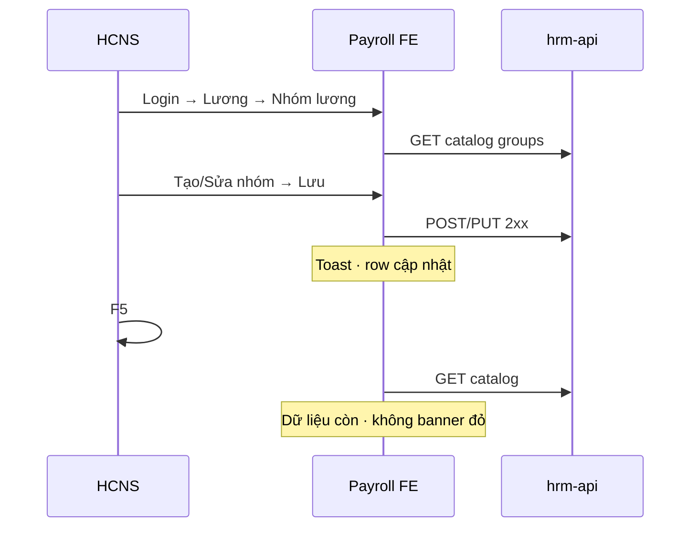

# UI_SCREEN_SPEC — Lương · Nhóm lương (PAY-09 cluster — browser)

| Meta | Value |
|------|--------|
| **Screen ID** | `UI-PAYROLL-CLUSTER-EMBED` |
| **work_item_id** | `PO-HRM-MVP-GD1-PAY-09-CLUSTER-FE-01` |
| **ref_srs** | **FR-UC-BP-PAY-09** · **UC-BP-PAY-09** |
| **ref_ba** | `docs/program/specs/PO-HRM-MVP-GD1-PAY-09-CLUSTER-BA-01.md` · **AC-PAY-GROUP-*** |
| **ref_api** | `docs/program/specs/PO-HRM-MVP-GD1-PAY-09-CLUSTER-API-01.md` |
| **QC prior** | **PAY09QC1-MSMGBGWC1** GWC — BE/API sealed · **FE HOLD** |
| **honesty** | **`payroll_e2e_ready=false`** · ≠ PAY module UAT · ≠ PAY-09 module DONE |

---

## 1. Screen ID + route

| Mục | Giá trị |
|-----|---------|
| Route | `/hr/payroll?portal=1&tenantId=xevn&companyId=main` |
| Persona | `ceo@xe.vn` / `Xevn@2026` |
| Surface | Payroll embed — tab/section **Nhóm lương** (catalog + liên quan) |

---

## 2. Mục đích

Cho HCNS **xem và thao tác UI** danh mục nhóm lương tenant, gán/resolve, phạm vi kỳ, lọc báo cáo — **bám API đã GWC** (BE-01/02), luồng **U65** (không seed).

---

## 3. IA layout (FE-01 scope)

```text
Payroll shell
├─ [J-09-01] Panel/bảng CRUD nhóm lương (catalog SoT tenant)
├─ [J-09-02] Preview thành viên / resolve rule (read + chọn)
├─ [J-09-03] Chọn kỳ / phạm vi áp dụng nhóm
└─ [J-09-04] Bộ lọc báo cáo phiếu lương theo nhóm
```

Chi tiết component map: TechSpec payroll group + OpenAPI paths trong cluster API spec.

---

## 4. Thành phần UI ↔ API (map theo journey)

| Journey | UI cần có | API (tham chiếu cluster API-01) |
|---------|-----------|----------------------------------|
| **J-HRM-PAY-09-01** | List + Thêm/Sửa/Ngưng nhóm | Payroll group CRUD catalog |
| **J-HRM-PAY-09-02** | Drawer/modal thành viên · rule resolve | Members / resolve endpoints |
| **J-HRM-PAY-09-03** | Period picker + scope label | Period scope + enroll filter |
| **J-HRM-PAY-09-04** | Filter trên báo cáo payslip | Report filter by group |

**Cấm:** hardcode nhóm demo · Nest `/core` SoT trên path payroll group.

---

## 5. Luồng tương tác (U65 tối thiểu)



**HOLD (không claim DONE slice):** **J-HRM-PAY-09-06** mid-month split live · **J-HRM-PAY-02-05** formula live — regression cite PAY02QC1/PAY04QC1.

---

## 6. Empty / error / loading

| Trạng thái | Hiển thị |
|------------|----------|
| Catalog trống (env thật) | Empty state + hướng dẫn **tạo từ UI** (U65) |
| **409 HRM-PAY-GROUP-409** | Message nghiệp vụ rõ (dual group / deny) |
| API 5xx | Banner lỗi · không spinner vô hạn |

---

## 7. AC UI (QA evidence)

| Journey | PASS khi |
|---------|----------|
| J-09-01 | CRUD 1 nhóm từ FE · Network 2xx · F5 còn |
| J-09-02 | Mở preview members · 200 · UI không mock cứng |
| J-09-03 | Chọn kỳ/scope · label khớp API |
| J-09-04 | Filter report · query khớp AC-PAY-GROUP-REPORT-FILTER |

**Evidence path:** `docs/qa/evidence/po-hrm-mvp-gd1-pay-09-cluster-fe-01.md`

**Regression:** J-HRM-PAY-01..08 subsets — không phá must_keep **PAY01QC1..PAY08QC1**.
