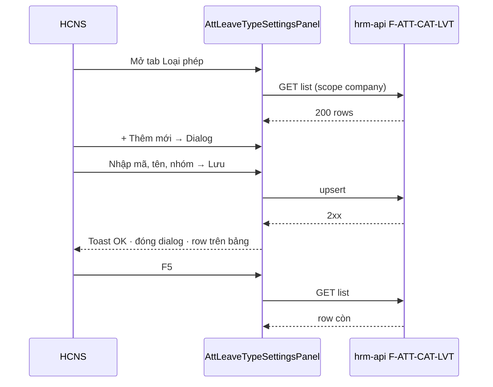

# UI_SCREEN_SPEC — Cài đặt · Loại phép (ATT)

| Meta | Value |
|------|--------|
| **Screen ID** | `UI-SETTINGS-ATT-LEAVE-TYPES` |
| **work_item_id** | `BA-PO-HRM-FE-UI-SCREEN-SPEC-PACK-01` |
| **ref_srs** | `docs/hrm/SRS.md` §16 FR-HRM-SC-LEAVE-01 · AC-PLT-ATT-LEAVE-01* (BA platform ATT) |
| **ref_api_design** | Nest `F-ATT-CAT-LVT` / `F-ATT-CAT-EFF` — list/upsert/retire (không dùng POST settings-catalogs cho mutate chính) |
| **ref_pattern** | **PAT-SETTINGS-CATALOG-01** (`SettingsCatalogScreenShell` `density="compact"`) |

---

## 1. Screen ID + route

| Mục | Giá trị |
|-----|---------|
| Route | `/settings?tab=att-leave-types` |
| testId root | `settings-tab-att-leave-types` · `settings-contract-templates` sibling pattern: panel `AttLeaveTypeSettingsPanel` |
| Persona | HCNS / admin tập đoàn (`ceo@xe.vn`) · scope `main` rollup theo `listCompanyId` |
| RBAC | Quyền cấu hình ATT catalog (admin); member CEO chỉ scope công ty mình |

---

## 2. Mục đích (SRS)

Quản trị **danh mục loại nghỉ** (mã, nhãn, nhóm phép, hiệu lực) tại Cài đặt để form **đơn nghỉ / chấm công** và picker consumer chỉ chọn mã **đã cấu hình** — U65: tạo từ FE, không seed.

---

## 3. IA layout

```text
┌─────────────────────────────────────────────────────────┐
│ Header: Loại phép · mô tả · [Làm mới]                   │
├─────────────────────────────────────────────────────────┤
│ Toolbar: [Tìm mã/tên________]              [+ Thêm mới] │
├─────────────────────────────────────────────────────────┤
│ Bảng: Mã | Tên | Nhóm | Nguồn | TT | Thao tác           │
├─────────────────────────────────────────────────────────┤
│ Pagination                                              │
└─────────────────────────────────────────────────────────┘
        Dialog Thêm/Sửa (modal, z parent trong embed)
```

| Vùng | Quy tắc |
|------|---------|
| List-only + dialog | Không form inline cố định dưới bảng |
| Honesty | Banner ATT-05 nếu `ATT_LEAVE_TYPE_UAT_HONESTY` — không claim module UAT |

---

## 4. Thành phần UI (map API)

| UI | Field / hành vi | API / DTO |
|----|-----------------|-----------|
| Cột Mã | `leave_type_key` / code mono | `HrmAttLeaveTypeRecord.code` |
| Cột Tên | Hiển thị VI | `name_vi` / `formatAttLeaveTypeDisplay` |
| Cột Nhóm | Label map | `category` → `attLeaveTypeCategoryLabel` |
| Cột Nguồn | platform / local | `source` |
| Dialog Mã * | Disabled khi sửa | `upsertAttLeaveType` |
| Dialog Nhóm | Select | `SettingsDialogSelectContent` + `ATT_LEAVE_TYPE_CATEGORIES` |
| Lưu | POST/PUT | `upsertAttLeaveType` → invalidate `ATT_LEAVE_TYPES_EFFECTIVE_QUERY_KEY` |
| Ngừng | Soft retire | `retireAttLeaveType` |

---

## 5. Luồng tương tác



---

## 6. Empty / error / loading

| Trạng thái | Copy / hành vi |
|------------|----------------|
| Loading | «Đang tải…» trong bảng |
| Empty | «Chưa có loại phép — bấm «Thêm mới» (U65).» |
| Search no match | «Không có dòng khớp tìm kiếm.» |
| API error | Banner/toast `toErrorMessage` — nút Làm mới |
| Consumer empty | Deep link CTA: consumer form hướng dẫn mở Cài đặt (ngoài tab này) |

---

## 7. AC UI (QA browser U65)

| # | Bước click | Network | FE sau 2xx | testId gợi ý |
|---|------------|---------|------------|--------------|
| 1 | Login → Cài đặt → Loại phép | GET list 200 | Bảng hoặc empty hợp lệ | `settings-tab-att-leave-types` |
| 2 | Tìm «annual» | — | Lọc client mã/tên | search input trong shell |
| 3 | + Thêm → Dialog → Lưu | upsert 2xx | Row mới · dialog đóng | `hdsd-att-leave-type-*` |
| 4 | F5 | GET 200 | Row còn | — |
| 5 | Sửa nhãn → Lưu | upsert 2xx | Cột tên đổi | — |
| 6 | Ngừng / retire | retire 2xx | TT đổi · không xóa cứng | — |
| 7 | Embed CC | — | Select trong dialog dùng `SettingsDialogSelectContent` | — |

**Residual (fidelity):** SoT song song `leave_types` trên tab Danh mục nghiệp vụ — xem `PO-HRM-SETTINGS-SRS-FIDELITY-DELTA-01.md` P0 spine.
