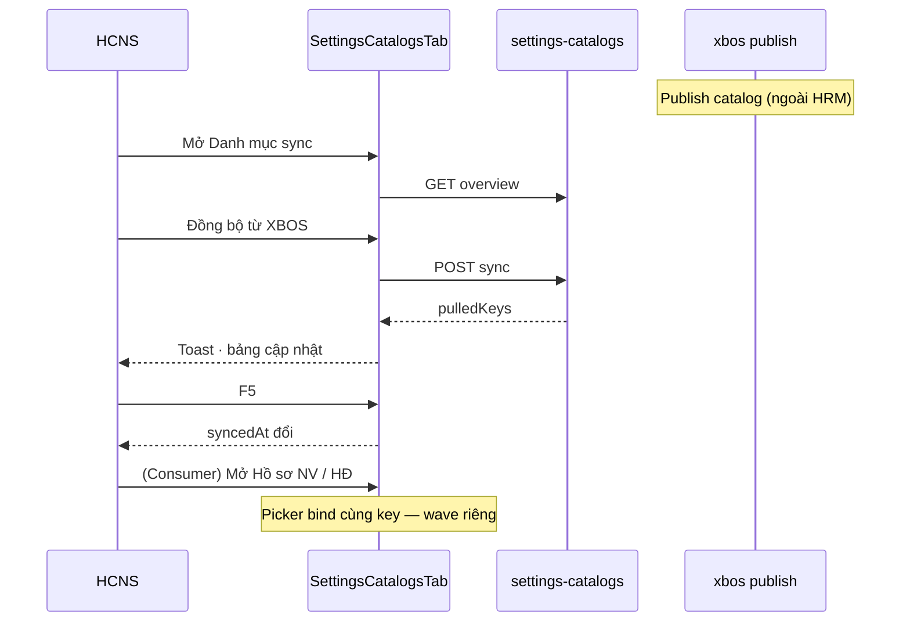

# UI_SCREEN_SPEC — Cài đặt · Danh mục (sync XBOS)

| Meta | Value |
|------|--------|
| **Screen ID** | `UI-SETTINGS-CATALOGS-SYNC` |
| **work_item_id** | `BA-PO-HRM-FE-UI-SCREEN-SPEC-PACK-01` |
| **ref_srs** | UF-HRM-10 · FR-HRM-08 · §16 O4 consumer catalog · `settings_catalog_e2e_ready=false` honesty |
| **ref_api_design** | `API_DESIGN_HRM_SETTINGS_CATALOG.md` — overview · items · sync · extension upsert |
| **ref_pattern** | Overview table + per-key drill (không full PAT-SETTINGS-CATALOG-01 cho từng key tại đây) |

---

## 1. Screen ID + route

| Mục | Giá trị |
|-----|---------|
| Route | `/settings?tab=catalogs` |
| Component | `SettingsCatalogsTab` |
| Scope | `useSettingsCatalogsOverview` — `main` holding rollup |

---

## 2. Mục đích

**Admin sync:** HCNS xem nhóm danh mục đã merge XBOS + extension, **kéo đồng bộ** từ tập đoàn, **thêm extension** theo đơn vị — là nguồn cho picker trên form HRM (không thay consumer UI).

---

## 3. IA layout

```text
┌─────────────────────────────────────────────────────────┐
│ Card: Tổng quan danh mục · [Đồng bộ từ XBOS]            │
├─────────────────────────────────────────────────────────┤
│ Bảng nhóm: Key | Label | Số item | Synced at | …        │
├─────────────────────────────────────────────────────────┤
│ Form thêm extension: chọn key · mã · nhãn · [Thêm]      │
└─────────────────────────────────────────────────────────┘
```

| Vai trò khác | `master-data` = CRUD bucket UX · PLT Nest tabs = domain catalog |

---

## 4. Thành phần UI

| UI | API |
|----|-----|
| Overview rows | `GET /settings-catalogs` overview `effectiveItems` |
| Sync | `syncSettingsCatalogsFromXbos` → toast count keys |
| Thêm item | `upsertSettingsCatalogItem` — `catalogKey` · `item_key` · `label` |
| Xóa/yêu cầu gỡ | `requestSettingsCatalogFieldRemoval` |
| Ngày sync | `formatDisplayDate(xbosSyncedAt)` dd/MM/yyyy HH:mm |
| Status label | `resolveSettingsCatalogItemStatusDisplay` |

---

## 5. Luồng tương tác



---

## 6. Empty / error / loading

| Trạng thái | Copy |
|------------|------|
| Overview loading | Spinner / skeleton |
| Key chưa sync | Số item 0 · syncedAt «—» |
| Sync fail | Toast mã lỗi API |
| Consumer empty | Form: «Chưa có danh mục — vào Cài đặt → Danh mục (sync)» |

---

## 7. AC UI

| # | Bước | Network | FE sau 2xx | Ghi chú |
|---|------|---------|------------|---------|
| 1 | Mở tab | GET overview 200 | Bảng nhóm | UF-HRM-10 L2 |
| 2 | Sync | POST sync 2xx | Toast · invalidate `SETTINGS_CATALOGS_QUERY_KEY` | U65: sau publish XBOS từ FE |
| 3 | F5 | GET | `xbosSyncedAt` hiển thị vi-VN | Không raw ISO-Z |
| 4 | Thêm extension | POST items 2xx | Item trong nhóm | Không đè master XBOS |
| 5 | **Consumer P0** | GET items key `pay_types` | Contracts/Payroll picker có label | **C-SPINE-BREAK** nếu FAIL |
| 6 | **Consumer P0** | `contract_types` | Form HĐ chọn loại | Matrix O4 SRS |
| 7 | Honesty | — | Không claim `settings_catalog_e2e_ready=true` | Đến khi matrix consumer PASS |

**ba-data deliverable:** cột **UI consumer** trên `HRM_MENU_DATA_LINKAGE_MATRIX.md` cho keys P0.
