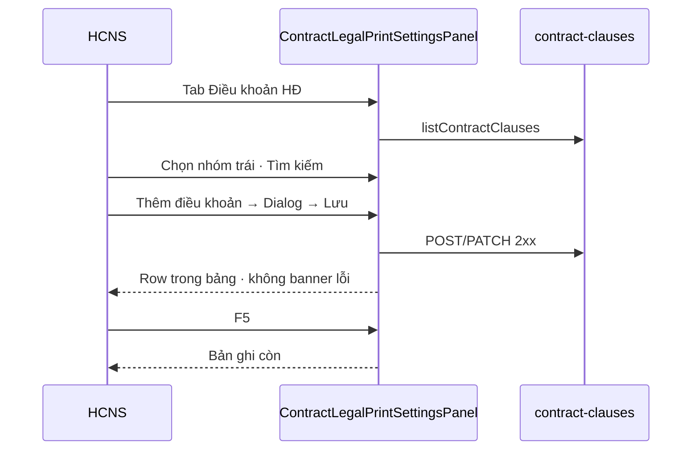

# UI_SCREEN_SPEC — Cài đặt · Điều khoản HĐ

| Meta | Value |
|------|--------|
| **Screen ID** | `UI-SETTINGS-CTR-CLAUSES` |
| **work_item_id** | `BA-PO-HRM-FE-UI-SCREEN-SPEC-PACK-01` |
| **ref_srs** | FR-UC-BP-CORE-09a · AC-CTR-CL-01 · `PO-HRM-CONTRACT-LEGAL-PRINT-SPEC-01.md` §C |
| **ref_api_design** | `contract-clauses` CRUD · activate/retire · scope `company_id` query |
| **ref_pattern** | PAT-SETTINGS-CATALOG-01 + **nhóm trái** (master filter) |

---

## 1. Screen ID + route

| Mục | Giá trị |
|-----|---------|
| Route | `/settings?tab=contract-clauses` |
| Alias | `?tab=contract-legal` → `contract-clauses` |
| Component | `ContractLegalPrintSettingsPanel` `view="clauses"` |
| testId | `settings-tab-contract-clauses` · `settings-contract-clauses` |

---

## 2. Mục đích

Quản trị **thư viện điều khoản** (mã, nhóm, tiêu đề, nội dung, pack) dùng cho mẫu HĐ và in — tách khỏi mẫu DnD, CFG số HĐ, publish thư viện.

---

## 3. IA layout

```text
┌──────────┬──────────────────────────────────────────────┐
│ Nhóm CL  │ Header + [Tìm mã/tiêu đề] [+ Thêm]          │
│ (nav)    ├──────────────────────────────────────────────┤
│          │ Bảng điều khoản                             │
│          │ Pagination                                  │
└──────────┴──────────────────────────────────────────────┘
              Dialog Thêm/Sửa (full fields clause)
```

| Không có trên màn này | Mẫu DnD · publish · merge token |
|------------------------|----------------------------------|

---

## 4. Thành phần UI

| UI | API field |
|----|-----------|
| Nhóm trái | Filter `clause_group` |
| Mã | `code` (disabled edit) |
| Nhóm | `clause_group` — Select `portalScope=iframe` toolbar; **dialog** dùng parent scope |
| Tiêu đề / body | `title_vi` · `body_vi` |
| Pack | `pack_code` |
| Kích hoạt / Ngừng | `activateContractClause` · `retireContractClause` |
| Lưu | `createContractClause` / `updateContractClause` — PATCH **không** `company_id` body |

---

## 5. Luồng tương tác



---

## 6. Empty / error / loading

| Trạng thái | Copy |
|------------|------|
| Empty all | «Chưa có điều khoản — bấm «Thêm điều khoản» (U65).» |
| Empty nhóm | Gợi ý chọn «Tất cả nhóm» hoặc thêm mới |
| Honesty | `contracts_printable_ready=false` — banner amber (không claim in UAT) |
| Load error | `ctr-legal-load-error` |

---

## 7. AC UI

| # | Bước | Network | FE sau 2xx |
|---|------|---------|------------|
| 1 | Mở tab · CC embed | GET clauses 200 | Không duplicate shell header |
| 2 | Lọc nhóm + search | — | Bảng khớp |
| 3 | Thêm → Lưu | POST 201 | Row + đóng dialog |
| 4 | F5 | GET | Row còn |
| 5 | Sửa body → Lưu | PATCH 200 | Nội dung cập nhật |
| 6 | Kích hoạt / Ngừng | POST activate/retire | Cột TT đổi |
| 7 | J-CTR settings | Click từ list HĐ (nếu có deep link) | Tab load đúng `tab=contract-clauses` |
