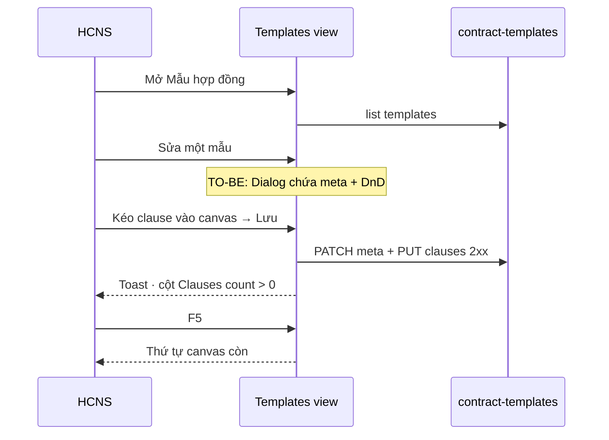

# UI_SCREEN_SPEC — Cài đặt · Mẫu hợp đồng (composer)

| Meta | Value |
|------|--------|
| **Screen ID** | `UI-SETTINGS-CTR-TEMPLATE-COMPOSER` |
| **work_item_id** | `BA-PO-HRM-FE-UI-SCREEN-SPEC-PACK-01` · FE fix `PO-HRM-CTR-TPL-DIALOG-COMPOSER-FE-01` |
| **ref_srs** | FR-UC-BP-CORE-09d · AC-CTR-TPL-* · `PO-HRM-CTR-CREATE-REDESIGN-BA-01` (2-step create parity) |
| **ref_api_design** | `contract-templates` · `PUT …/clauses` junction SoT · `syncContractTemplateClauseBind` |
| **ref_pattern** | **PAT-CTR-TEMPLATE-COMPOSER-01** (exception PAT-SETTINGS-CATALOG-01) |

---

## 1. Screen ID + route

| Mục | Giá trị |
|-----|---------|
| Route | `/settings?tab=contract-templates` |
| Component | `ContractLegalPrintSettingsPanel` `view="templates"` |
| testId list | `settings-contract-templates` · `ctr-tpl-list-table` |

---

## 2. Mục đích

Quản trị **mẫu hợp đồng open catalog**: metadata (mã, tên, pack, term, matrix…) và **thứ tự điều khoản** trên canvas DnD — Lưu ghi `clause_ids` + `layout_json` lên BE (snapshot bind).

---

## 3. IA layout (TO-BE — sponsor lock)

**AS-IS gap:** Dialog `settings-contract-templates-dialog` chỉ có tiêu đề + Đóng; composer nằm Card **dưới** list.

**TO-BE (bắt buộc):**

```text
List (shell) ──click Sửa/Thêm──► Dialog max-w-5xl (một surface)
  ├─ Meta grid (mã, tên, pack, TT, title_print, term, matrix…)
  ├─ Palette | Canvas (DnD same-node handle)
  └─ [Lưu mẫu] [Đưa hiệu lực] [Đóng]
```

Hoặc: full-page detail route — **chỉ một** surface mutate; không list + card composer song song.

---

## 4. Thành phần UI

| UI | API |
|----|-----|
| List Mã/Tên/Pack/TT/Clauses count | `listContractTemplates` |
| Filter matrix=xevn | Client filter `matrix_family` |
| Mã mẫu | `template_code` / `code` |
| Canvas order | `layout_json.clause_ids` + `PUT …/clauses` |
| Lưu | `updateContractTemplate` + `syncContractTemplateClauseBind` |
| Kích hoạt | `activateContractTemplate` |
| Palette | Clauses theo `pack_code` từ thư viện tab clauses |

---

## 5. Luồng tương tác



---

## 6. Empty / error / loading

| Trạng thái | Copy |
|------------|------|
| Empty list | «Chưa có mẫu — bấm «Thêm mẫu» (U65).» |
| Palette empty | «Không còn clause cho pack — tạo ở tab Điều khoản.» |
| Canvas empty | «Kéo điều khoản từ thư viện vào đây.» |
| CODE conflict | Banner `HRM-CTR-CL-CODE-CONFLICT` → activate bump (09a parity) |

---

## 7. AC UI (P0)

| # | Bước | Network | FE sau 2xx | FAIL nếu |
|---|------|---------|------------|----------|
| 1 | List load | GET 200 | Bảng shell | Composer full-page dưới list khi chỉ cần list |
| 2 | Thêm mẫu | — | **Dialog mở có palette+canvas** | Dialog trống, composer ở ngoài |
| 3 | DnD 2 clause → Lưu | PUT clauses 2xx | Count clauses ≥ 2 | Chỉ layout_json, junction trống |
| 4 | F5 | GET | Canvas order giữ | — |
| 5 | Đóng dialog | — | List cập nhật không cần scroll tìm composer | Card composer orphan |
| 6 | Embed CC | — | Select meta trong dialog: parent portal | iframe z dưới dialog |

**testId:** `ctr-tpl-save` · `ctr-tpl-canvas` · `ctr-tpl-palette` · `settings-contract-templates-dialog`
