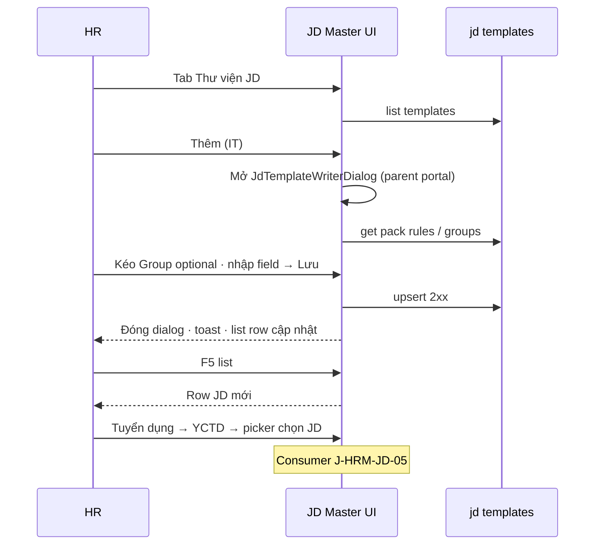

# UI_SCREEN_SPEC — Cài đặt · Thư viện JD master (planned tab)

| Meta | Value |
|------|--------|
| **Screen ID** | `UI-SETTINGS-JD-MASTER-LIST` |
| **work_item_id** | `BA-PO-HRM-FE-UI-SCREEN-SPEC-PACK-01` · FE `PO-HRM-SETTINGS-JD-MASTER-TAB-FE-01` |
| **ref_srs** | FR-UC-BP-REC-00 · FR-HRM-SC-JT-01 · `PO-HRM-JD-GROUP-SPEC-01.md` §7–11 |
| **ref_api_design** | `job_description_templates` / jd writer APIs (list, get, upsert layout) |
| **ref_pattern** | **PAT-DIALOG-FULL-VIEWPORT-CC-01** + list → **writer Dialog** (`JdTemplateWriterDialog`) — **không** PAT-SETTINGS-CATALOG-01 thuần (có DnD group) |

---

## 1. Screen ID + route

| Mục | Giá trị |
|-----|---------|
| Route (đề xuất) | `/settings?tab=jd-master-list` |
| Nav group | Tuyển dụng — **tách** với `jd-dynamic` («Cấu hình trường JD») |
| Hiện trạng | **C-ORPHAN-SCREEN** — chưa có trong `settingsNavigation.ts` |
| Persona | HRBP / recruiter admin · scope company |

---

## 2. Mục đích

Quản trị **thư viện JD theo vị trí/mã**: list → mở detail writer (resolve default pack, kéo group tùy chọn, nhập field động) — Q1 catalog (field/group/pack/rule) vẫn ở tab `jd-dynamic`.

---

## 3. IA layout

**Pattern bắt buộc:** **List-only** trên tab Settings + **một Dialog writer** full viewport (PAT-DIALOG-FULL-VIEWPORT-CC-01). **Không** tách composer ra Card dưới list; **không** dùng route `/settings/jd/:id` làm surface mutate chính trừ khi sponsor mở waiver (mặc định = Dialog).

```text
┌─────────────────────────────────────────────────────────┐
│ LIST (Settings shell, density W1.5):                     │
│ Tìm mã/tên JD · [+ Thêm JD]                              │
│ Bảng: Mã | Tên vị trí | Pack | TT | Thao tác [Sửa/Xem]   │
└─────────────────────────────────────────────────────────┘
        │
        ▼ Sửa / Thêm / Xem (read-only mode nếu SRS yêu cầu)
┌─────────────────────────────────────────────────────────┐
│ Dialog `JdTemplateWriterDialog` — parent portal CC       │
│ ~min(90vw,96rem) × ~min(90vh, calc(100vh-2rem))         │
│ Header: mã/tên JD · Pack resolved                        │
│ Body scroll: canvas groups (always_on + optional DnD)    │
│ Dynamic fields theo jd-field-defs                        │
│ Footer sticky: [Lưu] [Hủy]                             │
└─────────────────────────────────────────────────────────┘
```

| PAT-DIALOG-FULL-VIEWPORT-CC-01 | Portal **parent** (không `portalScope="iframe"`); overlay che CC; scroll nội bộ `min-h-0 flex-1 overflow-y-auto` |
| Tab `jd-dynamic` | Chỉ CFG: field defs, group defs, default packs, pack rules — **không** DnD thư viện JD |

---

## 4. Thành phần UI

| UI | Nguồn |
|----|--------|
| List rows | `job_description_templates` list API |
| Mã / tên | `template_code` · `title` / position label |
| Pack hiển thị | Resolve `jd-pack-rules` + `jd-default-packs` |
| Writer canvas | Groups từ `jd-group-defs` · fields từ `jd-field-defs` |
| Lưu layout | PUT layout JSON / template body theo TechSpec JD |

---

## 5. Luồng tương tác



---

## 6. Empty / error / loading

| Trạng thái | Copy |
|------------|------|
| Empty list | «Chưa có mẫu JD — cấu hình pack tại «Cấu hình JD» rồi thêm từ đây (U65).» |
| Pack unresolved | «Chưa có rule pack cho vị trí này — kiểm tra Cấu hình JD.» CTA link `?tab=jd-dynamic` |
| CFG thiếu | Không crash — empty group rõ ràng |

---

## 7. AC UI

| # | Bước | Network | FE sau 2xx | FAIL nếu |
|---|------|---------|------------|------------|
| 1 | Nav có «Thư viện JD» tách «Cấu hình JD» | — | Hai tab distinct | Gộp CFG + thư viện một tab |
| 2 | List → Sửa | GET detail 200 | **Dialog** writer load pack + groups | Composer Card dưới list |
| 3 | Thêm IT → Lưu | POST/PUT 2xx | Dialog đóng · row list | Dialog trống / writer ngoài list |
| 4 | F5 | GET | Row còn | — |
| 5 | Embed CC `:5173/command-center/hrm/...` | — | Dialog ≥85% viewport width; không cắt footer | `iframe` portal · `sm:max-w-lg` |
| 6 | J-HRM-JD-05 | YCTD picker | Chọn JD vừa tạo | — |
| 7 | Không DnD group trên `jd-dynamic` | — | DnD chỉ trong writer dialog | DnD trên tab CFG |

**testId gợi ý:** `settings-jd-master-list` · `jd-master-writer-dialog` · `jd-master-save`

**Cross-nav:** `PROGRAM_JOURNEY_MAP` J-HRM-JD-05 (DRAFT) bám spec này.
