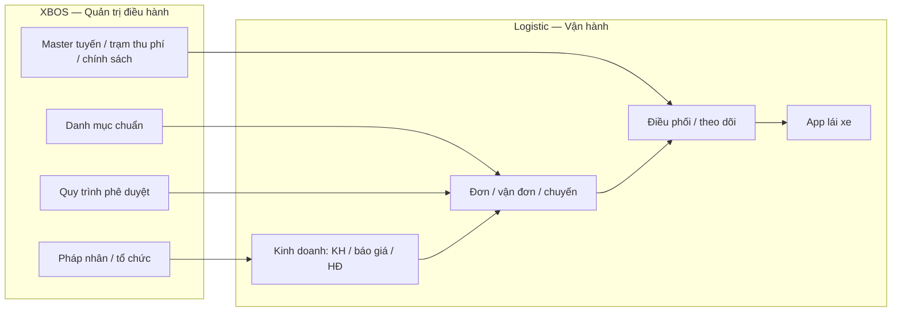

# Đối chiếu phân tích sản phẩm với biên bản họp Logistics — Chủ tịch Nam

> Căn cứ: `docs/meetings/BIEN_BAN_HOP_LOGISTICS_XEVN_NGUYENVAN.md`  
> Đối chiếu với: `DANH_MUC_XBOS_VA_USECASE_LOGISTIC.md`, prototype Logistic, SRS/BRD XBOS

---

## 1. Kết luận nhanh

| Chỉ số | Giá trị |
|--------|---------|
| **Mức khớp tổng thể (nghiệp vụ + XBOS)** | **~72%** |
| **Khớp phần vận hành / điều phối / fleet / kho (sau khi có đơn)** | **~85%** |
| **Khớp phần kinh doanh đầu chuỗi (CRM, báo giá, hợp đồng)** | **~45%** |
| **Khớp tuyến–lộ trình–trạm thu phí–SLA theo biên bản** | **~55%** |
| **Khớp app lái xe (5 bước trả hàng + lương %)** | **~50%** |
| **Phân tích hiện có vượt biên bản (prototype 54 màn, kho, AI, đối tác…)** | Có — chi tiết UI/ module chưa nói trong họp |

**Nhận định:** Khung **XBOS = nền + danh mục + quy trình**, **Logistic = giao dịch vận hành** là **đúng hướng** với lời Chủ tịch. Cần **bổ sung mạnh** khối **kinh doanh đầu chuỗi**, **master tuyến–lộ trình–thu phí**, và **app lái xe theo 5 công đoạn + tính lương**.

---

## 2. Bảng đối chiếu theo chủ đề

| # | Nội dung biên bản | Phân tích trước đây | Khớp | Ghi chú |
|---|-------------------|---------------------|------|---------|
| 1 | Hai loại hàng: tuyến cố định / phát sinh | Có loại tuyến, yêu cầu VC | 70% | Chưa tách rõ **booking lặp** vs **đơn phát sinh** làm luồng riêng |
| 2 | Chuỗi bắt đầu từ **kinh doanh** (KH, HĐ, báo giá) | Bắt đầu từ điều phối / vận đơn | 40% | Thiếu module **kinh doanh Logistic** |
| 3 | Phòng KD, VH, an toàn, QL phương tiện | Vai trò + org chung | 75% | Bổ sung danh mục **đơn vị nghiệp vụ Logistic** |
| 4 | Thiết lập **tuyến cố định** (điểm đầu–cuối, mô tả, tổng km) | Loại chuyến / tuyến | 60% | Thiếu UC **thiết lập tuyến master** |
| 5 | **Lộ trình** nhiều điểm, **km từng đoạn** | Địa điểm chuẩn | 50% | Thiếu danh mục + UC **lộ trình / đoạn / khoảng cách** |
| 6 | **Trạm thu phí** trên tuyến, tổng phí | Loại phí chung | 40% | Thiếu master **trạm thu phí** gắn tuyến |
| 7 | Chi phí tuyến theo **loại xe** | Bảng giá, loại xe | 65% | Cần gắn **ma trận tuyến × loại xe × phí** |
| 8 | SLA: **giờ vận chuyển** vs **hẹn giờ trả** | SLA chung | 35% | Thiếu danh mục **cách tính SLA chuyến** |
| 9 | Lộ trình **lưu theo khách** vs tuyến dùng chung | Chưa có | 20% | Thiếu khái niệm **mẫu tuyến / lộ trình khách** |
| 10 | Điểm trả hàng thường xuyên trên tuyến | Địa điểm | 55% | Bổ sung **điểm trả theo hợp đồng khách** |
| 11 | Khách DN + HĐ; khách lẻ / tự do | Loại KH, HĐ | 80% | Đã có; cần UC **đơn không HĐ** |
| 12 | Chuyển phát nhanh (ít ưu tiên) | Không nêu | 0% | Ghi **ngoài phạm vi giai đoạn 1** hoặc backlog |
| 13 | Xuất chuyến → vận chuyển → giao / hoàn / cả | LG-TR, LG-DP | 85% | Khớp tốt |
| 14 | Tiền đề: **master xe** (kích thước, tải trọng) | Loại xe; hồ sơ xe | 70% | Thiếu **quy cách thùng** trên XBOS/Logistic |
| 15 | Import/export danh sách xe | Chưa UC | 30% | Bổ sung UC **nhập/xuất đội xe** |
| 16 | Xe **bán / chuyển giao** | Trạng thái xe | 50% | Bổ sung trạng thái + UC |
| 17 | Lái nghỉ → gỡ gán; HRM nghỉ → bàn giao | Tuân thủ, HRM | 45% | Bổ sung UC **liên thông HRM** |
| 18 | Thứ tự: hệ thống → NS → KT → PT → VH | XBOS/HRM tách riêng | 90% | Khớp kiến trúc |
| 19 | Quy trình XBOS mở rộng dần (~20 QT VH) | Workflow XBOS | 75% | Chưa liệt kê 20 QT — bổ sung khung |
| 20 | App lái xe **bắt buộc** | 17 UC mobile chung | 60% | Thiếu **5 bước trả hàng** chi tiết |
| 21 | Trước đến: gọi KH, thăm dò đường | LG-MB gọi điều phối | 40% | Bổ sung bước 1–2 |
| 22 | Ảnh niêm phong trước/sau, cắt seal, kiểm đếm, ký | POD chung | 55% | Tách 5 UC riêng |
| 23 | App: doanh thu chuyến, khấu trừ, lương % | Chưa có | 15% | Bổ sung khối **lương vận hành trên app** |
| 24 | Phụ cấp đi đường theo **ngưỡng km** / loại xe | Chưa có | 20% | Bổ sung danh mục **chính sách đi đường** |
| 25 | ~20 loại xe, chính sách khác nhau | 3 cấp loại xe | 70% | Đủ danh mục; cần **chính sách theo loại** |
| 26 | XBOS + Logistic 2 sản phẩm | Đã mô hình 3 lớp dữ liệu | 95% | Khớp |
| 27 | Module Hành khách tách sau | Ngoài file Logistic | — | Đúng phạm vi |

---

## 3. Vai trò XBOS vs Logistic (theo biên bản)

| Thành phần | XBOS | Logistic |
|------------|------|----------|
| Phòng ban, chức danh, quyền | Có | Dùng |
| Loại xe, phí, SLA, trạm thu phí | Khai báo | Dùng khi tạo chuyến |
| Mẫu tuyến / lộ trình chuẩn | Có thể chuẩn hóa | Gán khách, tạo chuyến |
| Hợp đồng, báo giá, chào giá | Danh mục + workflow | Giao dịch |
| Chuyến đang chạy, GPS, POD | — | Có |
| Tính lương % lái xe trên app | Chính sách trên XBOS | Thực thi trên app |

---

## 4. Lộ trình sản phẩm (theo thứ tự Chủ tịch — không phải báo giá)

| Giai đoạn | Nội dung | XBOS | Logistic / khác |
|-----------|----------|------|-----------------|
| 0 | Nền móng hệ thống, server, danh mục | Khai danh mục, org, quyền | — |
| 1 | Con người | Org, chức danh, workflow NS | HRM + import NV |
| 2 | Kế toán tài chính | Workflow thu/chi (mẫu) | Module KT (sau) |
| 3 | Phương tiện, vật tư, kỹ thuật | Loại xe, chính sách | Master xe, import |
| 4 | Thiết lập tuyến–lộ trình–thu phí | Danh mục + master | Cấu hình tuyến |
| 5 | Kinh doanh → đơn | Workflow báo giá | CRM KD Logistic |
| 6 | Vận hành + app lái xe | QT vận hành | Điều phối + mobile |
| 7 | Đơn ảo / pilot | — | UAT trước go-live |

---

## 5. Danh mục & use case đã bổ sung

Đã cập nhật vào [`DANH_MUC_XBOS_VA_USECASE_LOGISTIC.md`](./DANH_MUC_XBOS_VA_USECASE_LOGISTIC.md):

- **Nhóm 17–19:** Tuyến, lộ trình, trạm thu phí, SLA, chính sách đi đường, quy cách xe  
- **Nhóm kinh doanh:** Khối use case LG-KD-*  
- **Mobile:** 5 công đoạn trả hàng + lương vận hành  
- **Liên thông HRM:** Gỡ lái xe khi nghỉ việc  

---

## 6. Khuyến nghị tài liệu tiếp theo

| Việc | Ưu tiên |
|------|---------|
| BRD Logistic — chương «Kinh doanh đầu chuỗi» | Cao |
| BRD Logistic — «Master tuyến & lộ trình» | Cao |
| SRS App lái xe — 5 bước + lương % | Cao |
| Liệt kê ~20 quy trình vận hành (tên tiếng Việt) với XBOS workflow | Trung bình |
| Chuyển phát nhanh | Thấp / backlog |
