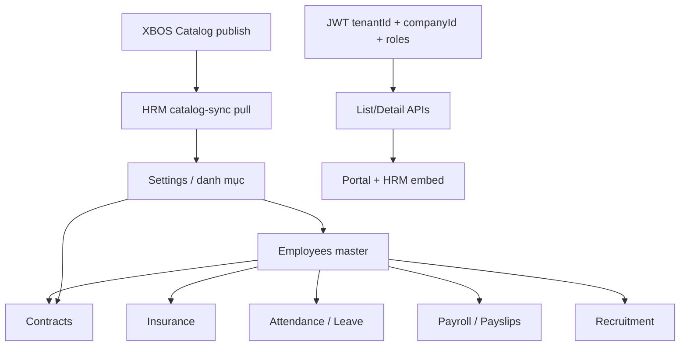

# HRM Full Fidelity Program — dữ liệu liên kết + RBAC + XBOS gốc

**work_item_id:** `HRM-FULL-FIDELITY-01`  
**Owner:** PM  
**Triggered:** User 2026-05-23 — pilot “xanh” proxy trong khi menu khác trống ≠ test chuẩn  
**Status:** **ACTIVE** (ưu tiên trước claim Phase 1 DONE)

---

## 1. Vấn đề (bằng chứng runtime)

Đo DB HRM (`xevn_hrm`) sau seed workforce:

| Bảng / menu | Số dòng | Tỷ lệ vs ~1170 NV |
|-------------|---------|-------------------|
| `employees` | **1170** | 100% |
| `employee_contracts` | **101** | ~9% |
| `employee_insurance_records` | **101** | ~9% |
| `attendance_records` | **72** | ~6% |
| `payroll_periods` | **43** | ~4% |
| `job_requisitions` | **11** | ~1% |
| `recruitment_candidates` | **13** | ~1% |
| `leave_requests` | **12** | ~1% |

**Kết luận PM:** L0/L2 smoke chỉ chứng minh **API không 400/409** — **không** chứng minh nghiệp vụ HRM hoàn chỉnh. User đúng: không thể gọi là test chuẩn.

---

## 2. Nguyên tắc sản phẩm (user lock)

1. **Danh mục:** Mọi catalog HRM **xuất phát từ XBOS** (publish → pull/sync → HRM snapshot). HRM không tự định nghĩa khung chuẩn tập đoàn.
2. **Dữ liệu vận hành:** Nếu giả định XeVN có **1000+ nhân sự**, thì **mọi menu nghiệp vụ** phải có dữ liệu **tỷ lệ và liên kết FK hợp lý** (không chỉ list NV).
3. **Phân quyền:** UI + API lọc theo **vai trò + phạm vi**:
   - **Lãnh đạo tập đoàn:** thấy toàn bộ hệ sinh thái (mọi công ty thành viên trong tenant).
   - **Lãnh đạo công ty thành viên:** chỉ công ty mình quản lý.
   - **Cấp dưới:** phạm vi thu hẹp (phòng ban / đơn vị / báo cáo trực tiếp).
   - **Kiêm nhiệm:** một user có **nhiều membership** (nhiều vai trò lãnh đạo ở nhiều công ty) → chọn scope → JWT/header khớp scope.
4. **Team:** Tự phân tích lại **100% chức năng HRM** (119 UC), tự cập nhật BRD/SRS/TECHSPEC/seed/test cho đến khi **PASS fidelity gate** (mục 5).

---

## 3. Liên kết menu (PM — khung phân tích)



| Menu HRM (embed pilot) | FK / SoT | Phụ thuộc catalog XBOS | Seed tối thiểu (gợi ý) |
|------------------------|----------|-------------------------|-------------------------|
| Nhân sự | `employees` | positions, departments, org tree | ≥1000 NV active |
| Hợp đồng | `employee_contracts.employee_id` | contract types | ≥1 hợp đồng active / NV active (hoặc ≥95% pilot) |
| Bảo hiểm | `employee_insurance_records` | insurers | ≥1 policy / NV có HĐLĐ |
| Chấm công | `attendance_records`, `leave_requests` | shifts, leave types | ≥20 ngày công/tháng/NV sample hoặc aggregate theo công ty |
| Lương | `payroll_periods`, payslips | salary templates | ≥1 kỳ lương/company/tháng + payslip lines |
| Tuyển dụng | `job_requisitions`, `recruitment_candidates` | job grades | ≥1 requisition/company + pipeline |
| Cài đặt | `hrm_catalog_snapshots` | all published keys | `sync-from-xbos` full keys |

Chi tiết: `docs/hrm/HRM_MENU_DATA_LINKAGE_MATRIX.md` (BA owner).

---

## 4. Fidelity gates (không thay P-CC smoke — bổ sung)

| Gate | Owner | Pass khi |
|------|-------|----------|
| **G-FID-01** | BA | Matrix menu ↔ UC ↔ API ↔ catalog key **100%** HRM |
| **G-FID-02** | BA-Data | Cardinality rules + scope matrix (group vs company CEO) |
| **G-FID-03** | SA | ADR RBAC ladder + multi-membership |
| **G-FID-04** | Dev-BE | Seed satellite từ workforce + list APIs filter đúng scope |
| **G-FID-05** | DevOps | `seed:hrm:fidelity` idempotent + evidence JSON |
| **G-FID-06** | Dev-FE | Không “empty OK” — hiển thị số liệu / empty có lý do |
| **G-FID-07** | QA | `verify-hrm-menu-data-density.mjs` + persona matrix PASS |
| **G-FID-08** | QC | GO chỉ khi G-FID-01..07 closed |

---

## 5. Work breakdown (dispatch)

| ID | Role | Deliverable |
|----|------|-------------|
| HRM-FIDELITY-BA-P | ba-process | `HRM_MENU_DATA_LINKAGE_MATRIX.md` + acceptance per menu |
| HRM-FIDELITY-BA-D | ba-data | `HRM_SEED_CARDINALITY_RULES.md` + scope/RBAC data matrix |
| HRM-FIDELITY-SA | sa | `ADR-HRM-RBAC-SCOPE-LADDER.md` |
| HRM-FIDELITY-BE | dev-be | `seed-hrm-satellite-from-workforce.mjs` + API scope audit |
| HRM-FIDELITY-DO | devops | Runbook + wire `seed:hrm:fidelity` vào dev-stack |
| HRM-FIDELITY-FE | dev-fe | Scope switcher + list counts; no false empty |
| HRM-FIDELITY-QA | qa | Density verify + 3 personas (group CEO, member CEO, HRBP) |

**Sprint placement:** Song song S1; **block** QC “HRM pilot complete” đến khi G-FID-07 PASS.

---

## 6. Lệnh PM (evidence)

```bash
pnpm run seed:hrm:1000-uat          # workforce (đã có)
pnpm run seed:ecosystem:full        # chỉ ~100 satellite — KHÔNG đủ
# Mới (Dev-BE): pnpm run seed:hrm:fidelity
pnpm run verify:hrm:menu-density    # QA gate
```

---

## 7. User-facing

`USER_PILOT_STATUS.md` — ghi rõ: shell PASS ≠ dữ liệu đầy đủ; đang chạy chương trình Fidelity.
