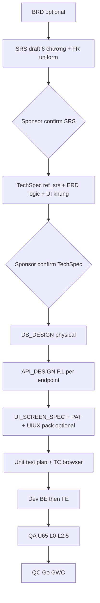

# PM / PO — Delivery pipeline + UI/UX spec (entry point)

| Meta | Value |
|------|--------|
| **work_item_id** | `PO-HRM-UIUX-PIPELINE-PLAYBOOK-01` |
| **Published** | 2026-08-11 |
| **Audience** | PM · PO · BA · SA · Dev-FE · QA · QC |
| **OS refs** | `_vibe-team-os/02-SPEC-FIRST-GATE.md` · `13` §3.4.9–11 · `37-UI-SCREEN-SPEC-SRS-FIRST-AND-REFERENCE.md` · `17-BRAND-UIUX-THEME-REMASTER.md` · `25-SOLID` · `28-FE-BE-SEPARATION` |
| **Template** | `_vibe-team-os/templates/UI_SCREEN_SPEC.md` |

---

## 1. Pipeline end-to-end (sponsor confirm gates)



**Cấm nhảy bước:** TechSpec → code khi thiếu DB_DESIGN + API_DESIGN. Dev → code khi thiếu UI_SCREEN_SPEC cho màn mutate.

---

## 2. Thứ bậc nguồn sự thật

| Lớp | Trả lời | Không được |
|-----|---------|------------|
| **SRS** | Làm gì · ai · AC sau Lưu/F5 · Diễn biến | Token CSS · layout pixel · route chi tiết |
| **TechSpec** | Kiến trúc · ERD logic · map UC · design system **khung** | Thay quyết định nghiệp vụ SRS |
| **DB_DESIGN** | Cột · FK · index · plane | — |
| **API_DESIGN** | Mục đích · nghiệp vụ BE · **bước Diễn biến SRS** · DTO↔cột | Shell UI |
| **UI_SCREEN_SPEC** | IA · field→API · testid · empty/error · PAT | Định nghĩa lại nghiệp vụ |
| **UIUX pack** (program lớn) | Index · trace matrix · component map SOLID | Duplicate SRS |
| **Enterprise reference** | Cấu trúc tài liệu quốc tế | Override SRS (**R-REF-01**) |
| **Code** | `@CODE-MEMORY` · `@UI-MEMORY` | UI «cho đẹp» lệch spec |

---

## 3. Sau «Sponsor confirm SRS» — checklist PM

| # | Việc | Owner | Output |
|---|------|-------|--------|
| 1 | TechSpec `ref_srs` từng UC in-scope | SA + BA | `TECHSPEC*.md` |
| 2 | Sponsor confirm TechSpec | Sponsor | bus `sponsor_confirm` |
| 3 | DB_DESIGN + API_DESIGN physical | SA + BA-Data | `DB_DESIGN_*.md` · `API_DESIGN_*.md` |
| 4 | UI_SCREEN_SPEC per màn mutate | BA-Process + BA-Data | `docs/<module>/ui-screens/UI-*.md` |
| 5 | PAT registry (reuse) | SA | `PAT-*.md` |
| 6 | UIUX pack (wave ≥5 màn hoặc module mới) | BA-Process | Index + trace matrix (mẫu G5 CTR) |
| 7 | Test plan | QA + Dev | UC → TC browser |
| 8 | Dispatch Dev | PM | `spec_read_ack` 5 lớp |
| 9 | QA U65 → QC | QA · QC | evidence + GWC |

---

## 4. UI/UX spec — bao gồm những gì

### 4.1 UI_SCREEN_SPEC (per màn) — 7 mục + trace

Clone: `_vibe-team-os/templates/UI_SCREEN_SPEC.md`

| # | Mục |
|---|-----|
| 1 | Screen ID · route · persona RBAC |
| 2 | Mục đích (trích SRS) |
| 3 | IA layout (Mermaid / bảng vùng) |
| 4 | Thành phần UI — **map field → API field** |
| 5 | Luồng tương tác — sequenceDiagram + FE sau 2xx + F5 |
| 6 | Empty · loading · error (VI · U65) |
| 7 | AC UI testable — click · Network · testid |

**Tham chiếu chéo bắt buộc:** `ref_srs` · `ref_api_design` · `ref_pattern` (PAT)

### 4.2 UIUX spec pack (program wave)

Dùng khi module phức tạp (vd. Hợp đồng workspace G5):

| Artifact | Nội dung |
|----------|----------|
| **Index** | Màn → file spec → UC → API → component FE → journey |
| **Per-screen specs** | UI_SCREEN_SPEC từng màn |
| **Trace matrix** | Diễn biến SRS ↔ API ↔ DTO ↔ UI AC |
| **Component map SOLID** | Một trách nhiệm / component |
| **Testid registry** | QA harness |
| **Sponsor UI locks** | Không đổi bằng reference |

Mẫu: `docs/hrm/ui-screens/UI-HRM-CTR-SPEC-INDEX.md` · `PO-HRM-CTR-UIUX-SPEC-PACK-G5.md`

### 4.3 PAT (pattern tái sử dụng)

| PAT | Dùng khi |
|-----|----------|
| `PAT-DIALOG-FULL-VIEWPORT-CC-01` | Dialog mutate nặng trên Command Center embed |
| `PAT-SETTINGS-CATALOG-01` | Tab catalog Cài đặt compact |
| Named Field MOD-CON | Template/preview token — không generic builder |

Path: `docs/hrm/ui-screens/PAT-*.md`

---

## 5. Tham chiếu SRS · TechSpec · API — cách bind

| Câu hỏi Dev/QA | Đọc |
|----------------|-----|
| Nghiệp vụ «Lưu xong thấy gì»? | SRS Diễn biến # + AC |
| Endpoint nào · DTO field? | API_DESIGN F.1 + bước SRS |
| Cột DB · FK? | DB_DESIGN |
| Layout · testid · empty state? | UI_SCREEN_SPEC §3–7 |
| Token · density · a11y? | TechSpec § UI + `17-BRAND-UIUX` |
| Component tách file nào? | UIUX pack component map |

**Ma trận trace (bắt buộc trên pack lớn):**

| Diễn biến SRS # | API METHOD path | DTO field | UI AC | testid |

---

## 6. Đồng điện UI + SOLID

### 6.1 Visual (XeVN Precision Motion)

- Primary `#1E40AF` · surface trắng · status DNA (green/orange/red)
- `.xevn-safe-inline` · grid 12 cột 4-4-4 · `rounded-card` 12px
- Chữ body sắc — cấm slate-400 cho nội dung đọc (`17`)
- Locale: ngày `dd/MM/yyyy` · tiền thousand group `vi-VN` · % exempt

### 6.2 SOLID trên FE

| Nguyên tắc | UI |
|------------|-----|
| **S** | Shell / form grid / canvas / hook state — tách file |
| **O** | PAT mở rộng IA — không fork copy-paste wizard |
| **L** | create/edit/view cùng workspace mode |
| **I** | Hook nhỏ (`useContractPrintSpine`) — không god page |
| **D** | Page phụ thuộc API contract — không join aggregate BE |

**Cấm:** FE formula payroll · FE nested write DTO · mock chart làm SoT (`28`)

---

## 7. Ai viết · ai ký

| Role | Deliverable |
|------|-------------|
| BA-Process | UI_SCREEN_SPEC §3–7 · UIUX pack trace |
| BA-Data | Field ↔ API ↔ catalog_key |
| SA | PAT · ADR · exception IA |
| ba-docs | Delta SRS khách ADD-only |
| Dev-FE | `spec_read_ack` + `@CODE-MEMORY` |
| QA | Evidence = AC UI bảng §7 |
| QC | NO-GO nếu UI lệch SRS dù reference đẹp |

---

## 8. PM dispatch Dev — read_first mẫu

```text
read_first (ordered):
  1. docs/hrm/SRS.md § UC-…
  2. docs/hrm/TECHSPEC.md § …
  3. docs/hrm/DB_DESIGN_*.md · API_DESIGN_*.md
  4. docs/hrm/ui-screens/UI-….md (+ PAT-*.md)
  5. docs/program/slices/<StoryID>.md
spec_read_ack: srs · tech_spec · db_design · api_design · ui_screen_spec
ui_reference_only: true
code_memory_required: true
```

---

## 9. QC reject nhanh

- Thiếu `ui_screen_spec` trong spec_read_ack
- Field UI không map API_DESIGN
- Modal embed iframe khi PAT yêu cầu parent CC
- AC UI không có FE sau 2xx + F5
- Component map thiếu — god dialog >400 LOC mutate

---

## 10. Liên kết project xevn-ecosystem

| Artifact | Path |
|----------|------|
| FE guide chi tiết | `docs/program/specs/PO-HRM-FE-UI-SCREEN-SPEC-GUIDE-01.md` |
| SRS-first sync | `docs/program/specs/BA-UI-SPEC-SRS-FIRST-SYNC-01.md` |
| CTR pack mẫu | `PO-HRM-CTR-UIUX-SPEC-PACK-G5.md` |
| Reference index | `docs/reference/README-UI-UX-REFERENCE-SPONSOR.md` |
| Mobile khung | `docs/UI_UX_SPEC_XEVN_HRM_MOBILE.md` |

---

## 11. Cập nhật OS khi lesson mới

Ghi bus → cập nhật file này hoặc `_vibe-team-os/37` → refresh template `UI_SCREEN_SPEC.md` — **ADD-only**, không wipe PAT đã PASS.
