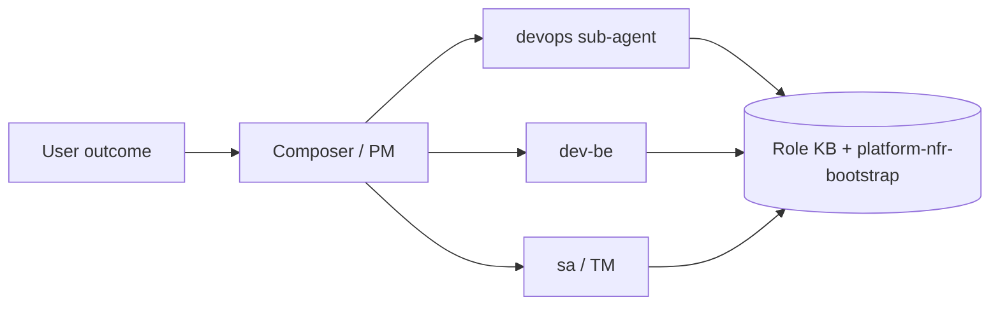

# Sub-Agent Orchestration — NFR & Production

> Cho **parent agent (Composer/PM)**: user giao việc outcome → bạn **điều phối sub-agent** → sub-agent **tự chạy lệnh** và **tự cập nhật KB** — user không cần hỏi lại logging/metrics/production.

## Mô hình

## Khi nào dispatch ai

| Tín hiệu user / bus | Sub-agent | Command |
|---------------------|-----------|---------|
| "production", "bật prod", release VPS | `devops` | `REUSABLE_SUBAGENT_COMMANDS.md` Command 4 |
| Repo mới, thiếu metrics/log | `sa` + `dev-be` | Command 5 |
| Kiến trúc NFR / RLS | `sa` | Sign-off RLS; đọc `platform-nfr-bootstrap` |
| Gate release | `qc` + `qa` | Pre-merge + `verify:production-env` evidence |
| Điều phối chung | `pm` | Command 6 |

## DevOps autonomous

- Runbook: `docs/ops/PRODUCTION_ENABLE_RUNBOOK.md`
- Agent: `.cursor/agents/devops.md`
- Skill: `.cursor/skills/devops-deploy/SKILL.md`
- **Không** paste secret vào bus/chat.

## KB cập nhật (mỗi sub-agent sau cycle)

| Role | Global KB | Repo KB |
|------|-----------|---------|
| devops | `~/.cursor/knowledge-base/devops.md` | `platform-nfr-bootstrap.md` Lessons |
| sa | `sa.md` | same |
| pm | `pm.md` | same |
| technical-manager | `technical-manager.md` | same |
| dev-be | `dev-be.md` | same |

Format: Context, Action, Outcome, Evidence, Reuse-tag (`knowledge-quality.mdc`).

## Parent agent không nên

- Đọc lại toàn bộ runbook ra chat thay vì `Task(devops, ...)`.
- Dispatch trùng DevOps khi bus đã `DISPATCHED` NFR-PROD-ENABLE.
- Claim DONE production khi `verify:production-env` chưa exit 0 trên env thật.
