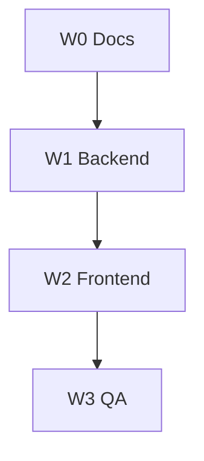

# WBS — Command Center P0

> SRS: [`../xbos/COMMAND_CENTER_P0_SRS.md`](../xbos/COMMAND_CENTER_P0_SRS.md)  
> TechSpec: [`../xbos/COMMAND_CENTER_P0_TECHSPEC.md`](../xbos/COMMAND_CENTER_P0_TECHSPEC.md)

## Sprint 0 — Tài liệu

| ID | Task | Status | Evidence |
|----|------|--------|----------|
| W0-1 | COMMAND_CENTER_P0_SRS.md | Done | `docs/xbos/COMMAND_CENTER_P0_SRS.md` |
| W0-2 | COMMAND_CENTER_P0_TECHSPEC.md | Done | `docs/xbos/COMMAND_CENTER_P0_TECHSPEC.md` |
| W0-3 | WBS + traceability links | Done | This file + SRS.md §12.3 |
| W0-4 | Registry capability rows CC-P0 | Done | seed JSON + migrate |

## Sprint 1 — Backend

| ID | Task | Deps | Status |
|----|------|------|--------|
| W1-1 | Migration shareholders, documents, matrix | — | |
| W1-2 | legal-entity-profile module | W1-1 | |
| W1-3 | Multipart upload + file GET + storage | W1-2 | |
| W1-4 | Org-units DELETE soft | — | |
| W1-5 | position-rbac matrix GET/PUT | W1-1 | |
| W1-6 | command-center workspace-meta | — | |
| W1-7 | Wire app.module + .env.example | W1-2 | |

## Sprint 2 — Frontend

| ID | Task | Deps |
|----|------|------|
| W2-1 | legalEntityProfileApi + shareholders | W1-2 |
| W2-2 | Documents upload + View | W1-3 |
| W2-3 | Departments → org-units | W1-4 |
| W2-4 | Permission matrix API | W1-5 |
| W2-5 | Remove publishVersionChange on catalogs | — |
| W2-6 | WorkflowTaskDetailDrawer | — |
| W2-7 | Metadata preview button | — |
| W2-8 | workspace-meta dashboard | W1-6 |

## Sprint 3 — QA

| ID | Task | Evidence path |
|----|------|----------------|
| W3-1 | verify-capability-e2e CC-P0 | `scripts/verify-capability-e2e.mjs` |
| W3-2 | UC-CC-P0-02 file E2E | `docs/qa/evidence/UC-CC-P0-02.md` |
| W3-3 | UC-CC-P0-04 matrix | `docs/qa/evidence/UC-CC-P0-04.md` |
| W3-4 | verify:dev-stack | CI / local log |
| W3-5 | QC e2e_pass | `xevn_ecosystem_capabilities` |

## Dependency graph

## Estimate

11–15 person-days (1 BE + 1 FE parallel).
