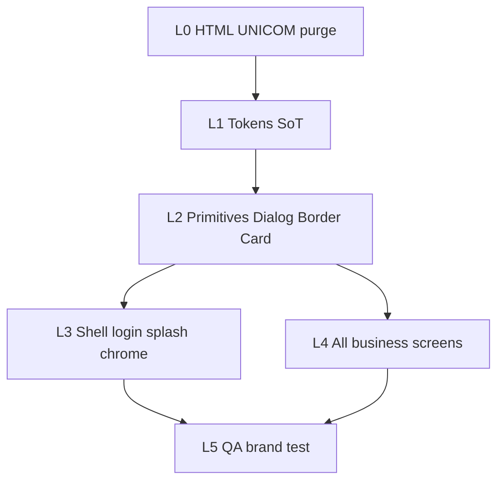

# XeVN Brand — Full FE Remaster Program

| Field | Value |
|-------|--------|
| **Program id** | `XEVN-BRAND-FULL-FE-REMASTER` |
| **Sponsor lock** | 2026-07-22 — OK proposal + **toàn bộ FE web + mobile** (popup, border, viền) + **cấm UNICOM** trên tài liệu XeVN |
| **Concept** | **XeVN Precision Motion** — `docs/program/XEVN_BRAND_UIUX_PROPOSAL.md` |
| **Status** | EXECUTING (L0 in flight → L1–L4 parallelizable after L1) |
| **Not claimed** | Phase 1 DONE · PROD-READY |

---

## 1. Vì sao không chỉ “login + header”

Sponsor yêu cầu: nhìn một cái biết **XeVN** — kể cả dialog/popup và đường viền.  
→ Thi công theo **design-system layers** (token → primitive → shell → mọi màn), không theo “vài route smoke”.

---

## 2. Wave backlog (work_item_id)

| Wave | work_item_id | Owner | Scope | Exit |
|------|--------------|-------|-------|------|
| **L0** | `D-DOCS-SHELL-XEVN-BRAND-P0-01` | ba-docs | HTML + generators — 0 UNICOM hero | AC-HTML-BRAND-01..06 |
| **L1** | `FE-XEVN-BRAND-TOKENS-L1-01` | dev-fe | CSS vars `:root` + Tailwind align; kill dual HRM shadcn primary drift plan | Evidence + READY_FOR_QA token smoke |
| **L1m** | `MOB-XEVN-BRAND-TOKENS-L1-01` | dev-mobile | Unify splash `#000`; Android `colorPrimary` → `#1E40AF`; border/radius tokens locked | Evidence |
| **L2** | `FE-XEVN-BRAND-PRIMITIVES-L2-01` | dev-fe | Dialog/Modal/Drawer/Toast/Button/Input/Card/Table — **border + radius + focus ring** từ token; mark optional on branded dialogs | Story/smoke list |
| **L2m** | `MOB-XEVN-BRAND-PRIMITIVES-L2-01` | dev-mobile | RN Modal/Alert/ActionSheet/Card/Input — cùng DNA | Evidence |
| **L3** | `FE-XEVN-BRAND-SHELL-L3-01` | dev-fe | Login dark shell + TopHeader/Sidebar mark + favicon sync | Brand test |
| **L3m** | `MOB-XEVN-BRAND-SHELL-L3-01` | dev-mobile | Splash/login/tab/header mark | Brand test |
| **L4a** | `FE-XEVN-BRAND-SCREENS-CC-XBOS-01` | dev-fe | Command Center + XBOS surfaces — no raw hex; tables/forms use L2 | Module AC |
| **L4b** | `FE-XEVN-BRAND-SCREENS-HRM-01` | dev-fe | HRM embed + portal HR panels | Module AC |
| **L4c** | `MOB-XEVN-BRAND-SCREENS-ESS-01` | dev-mobile | ESS + manager screens hex sweep → tokens | Module AC |
| **L5** | `QA-XEVN-BRAND-FULL-FE-01` | qa (+ qa-device) | Brand test matrix web+mobile; U65 sample UF | PASS_TO_PM / GWC |

---

## 3. Acceptance — “nhìn một cái là XeVN”

| ID | Criterion |
|----|-----------|
| **AC-BRAND-DNA-01** | Primary `#1E40AF` + radius card 12 / input 8 trên ≥95% controls mới/đã migrate |
| **AC-BRAND-DNA-02** | Dialog/Modal: border token + overlay shadow; không border xám generic lệch DNA |
| **AC-BRAND-DNA-03** | Shell (login/splash/header): mark XeVN hero hoặc chrome |
| **AC-BRAND-DNA-04** | Grep residual: không `logo-unicom` / UNICOM hero trên client-delivery |
| **AC-BRAND-DNA-05** | Hardcoded `#3d7de8` / random purple SaaS trên FE product → 0 trên path đã L4 |
| **AC-BRAND-DNA-06** | Mobile touch ≥44; Android splash/primary khớp SoT |

---

## 4. Out of scope (vẫn giữ)

- Đổi nghiệp vụ SRS / API / scope resolver  
- Claim Phase1 / PROD từ brand wave  
- Seed để “có data đẹp” (U65)

---

## 5. PM orchestration

1. L0 ba-docs (đang chạy) → QA docs spot.  
2. **Cùng chương trình:** L1 web + L1 mobile (tokens) → L2 primitives (popup/border) **trước** L4 màn hình.  
3. L3 shell song song L2 khi tokens ổn.  
4. L4 chia CC/XBOS · HRM · Mobile ESS — nhiều wave, không 1 PR.  
5. L5 QA brand matrix.

**Sponsor message mapping:** “toàn bộ FE” = L1→L5 complete, không = chỉ P1 login.
