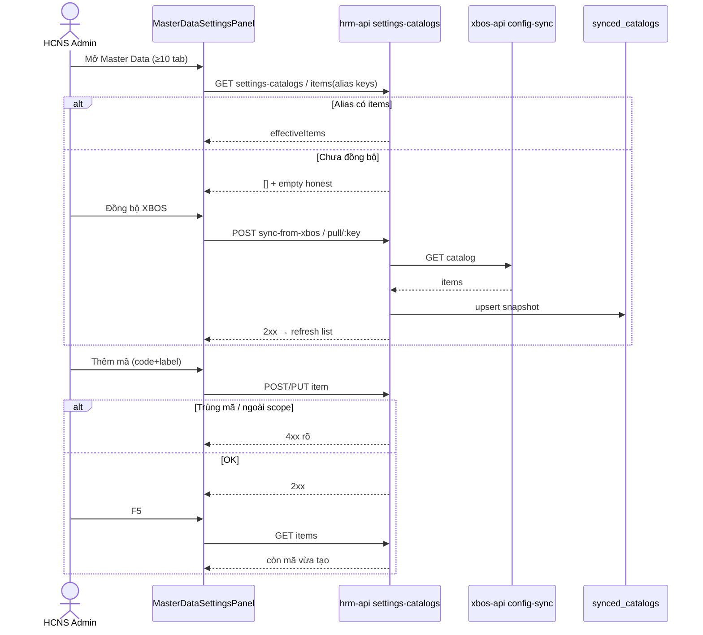

# BA-ERP-E1B-SRS-01 — Settings Master Data expand (ADD-only)

| Field | Value |
|-------|--------|
| **work_item_id** | `BA-ERP-E1B-SRS-01` |
| **cohort** | `E1-B` · alias `E-SET-UI` / `SETTINGS-UI-EXPAND` |
| **date** | 2026-07-28 |
| **lane** | governance G1 · ba-process · **docs only** |
| **change_mode** | **ADD-only** — không đè FR-HRM-SC-POS/LEAVE/DEC/PAY đã khóa; không sửa `apps/**` |
| **Team merge pointer** | `docs/hrm/SRS.md` **§16.2a** (ADD) → body SoT = **file này** |
| **Evidence** | `docs/qa/evidence/ba-erp-e1b-srs-01-20260728.md` |
| **Inputs** | `FIDELITY_PROGRAM_DISPATCH.md` Cohort 2 · `ba-hrm-erp-settings-consumer-01-20260728.md` · `qa-hrm-erp-fidelity-spot-01-20260728.md` |
| **CẤM** | Seed U65 · Phase1/PROD claim · consumer FREE_TEXT fix (thuộc **E1-A**) · XBOS apply-to-members expand (thuộc **E-XBOS-CTRL-SPEC**) |

**Mục tiêu:** Khóa AC/BR để `MasterDataSettingsPanel` mở từ **4 bucket → ≥10 bucket**, có alias key (`decision_types` ↔ `hr_decision_types`), CRUD + sync XBOS cho mỗi bucket mới — trước khi Dev FE/BE.

---

## 0. Actors & scope

| Actor | Vai trò |
|-------|---------|
| **HCNS / Admin HRM** | CRUD mã trong Cài đặt · Master Data; sync XBOS |
| **Group CEO** | Xem/rollup catalog theo partition `main`→holding (scope parity) |
| **Consumer forms** | Chỉ **đọc** `effectiveItems` sau sync (bind picker = **E1-A**, không DoD đóng E1-B) |

### In scope (E1-B)

1. Settings UI: ≥10 bucket tabs (4 hiện có + 6 mới).
2. Mỗi bucket mới: Create / Read / Update / Deactivate (ngưng) + search/filter.
3. Alias key map — đặc biệt Decisions.
4. Sync XBOS → L1 snapshot → Settings list có item (hoặc empty honest).
5. U72: tab/item label VI; code chỉ backend/Network.

### Out of scope (residual / other cohort)

| Residual | Owner cohort |
|----------|--------------|
| Consumer FREE_TEXT position / dept name-as-value | **E1-A** |
| Payroll mock + component_type bind depth | **E2** |
| `shifts` catalog vs `work_shifts` table dual-write ADR | **SA** (HOLD note §4) — Settings vẫn expose bucket `shifts` |
| XBOS `apply-to-members` allow-list expand | **E-XBOS-CTRL-SPEC** |
| Khách HTML promote full body | **ba-docs** sau sponsor OK |

---

## 1. Bucket inventory (normative ≥10)

### 1.1 Keep (must_keep — đã 🟢 Settings)

| # | Bucket UI (VI) | Canonical `catalog_key` | Alias keys (read) | FR |
|---|----------------|-------------------------|-------------------|-----|
| 1 | Chức danh | `job_titles` | `positions`, `employee_positions` | **FR-HRM-SC-POS-01** |
| 2 | Phòng ban | `departments` | `department_catalog`, `org_departments` | **FR-HRM-SC-POS-01** |
| 3 | Loại nghỉ | `leave_types` | — | **FR-HRM-SC-LEAVE-01** |
| 4 | Loại quyết định | `hr_decision_types` | `decision_types` | **FR-HRM-SC-DEC-01** + **BR-HRM-SC-ALIAS-01** |

> **Alias lock (QA spot 2026-07-28):** Live L1 có **`hr_decision_types`** (items > 0); key FE cũ `decision_types` có thể **MISS**. Settings + Decisions picker **bắt buộc** resolve theo alias list — không MISS khi một trong hai key có items.

### 1.2 ADD buckets (E1-B P0)

| # | Bucket UI (VI) | Canonical `catalog_key` | Alias keys (read) | FR (ADD) | Primary consumers (bind = E1-A) |
|---|----------------|-------------------------|-------------------|----------|--------------------------------|
| 5 | Bản chất / loại TP lương | `pay_types` | `component_types`, `salary_component_types` | **FR-HRM-SC-PAY-TYPE-01** | SalaryComponentsTab `component_type` |
| 6 | Ca làm việc | `shifts` | `work_shifts` *(catalog key only)* | **FR-HRM-SC-SHIFT-01** | Attendance shift config |
| 7 | Ngạch bậc | `job_grades` | `grades` | **FR-HRM-SC-GRADE-01** | Recruitment / JD grade |
| 8 | Kênh tuyển dụng | `recruitment_channels` | `channels` | **FR-HRM-SC-CH-01** | Candidates `source` |
| 9 | Loại hợp đồng | `contract_types` | — | **FR-HRM-SC-CT-01** | Contracts / EmployeeContracts |
| 10 | Loại hình lao động | `employment_types` | `employment_type` | **FR-HRM-SC-ET-01** | Employee / Requisition / JobPosting |

**Optional 11+ (không chặn DoD 10):** `salary_components` / `payroll_templates` (đã có **FR-HRM-SC-PAY-01** deep-link) — nếu FE thêm tab CRUD catalog thì AC-SET-UI-11 áp dụng cùng pattern.

**JT deep-link** (`FR-HRM-SC-JT-01`) giữ stub Recruitment — **không** đếm là MD bucket CRUD trong E1-B trừ khi Dev thêm tab riêng.

---

## 2. FR-HRM-SC-SET-UI-01 — Mở rộng panel Master Data (≥10 bucket)

**Purpose:** HCNS cấu hình đủ catalog ERP-class trên một panel Cài đặt — không phải sửa BE/DB hoặc hardcode FE để có mã mới.

**Mở rộng:** UC-HRM-06..08 · Settings Master Data · pointer `SRS.md` §16.2a.

### Diễn biến

| # | Actor | Tương tác | Điều kiện | Kết quả / lỗi |
|---|-------|-----------|-----------|---------------|
| 1 | Admin | Mở Cài đặt → Master Data | Auth + scope | Thấy **≥10** tab/bucket (nhãn VI) |
| 2 | Admin | Chọn bucket mới (vd. Loại HĐ) | Key trong allow-list §1.2 | List `effectiveItems` (hoặc empty honest + CTA sync) |
| 3 | Admin | Thêm mã (code + label VI) | Code hợp lệ; chưa trùng | POST/PUT 2xx; list có dòng mới |
| 4 | Admin | F5 / navigate lại | Cùng company | Dòng còn; Network body lưu **code** |
| 5 | Admin | Sửa nhãn / ngưng dùng | Item đang gắn TX | Ngưng OK; **cấm** xóa cứng mất lịch sử (cùng pattern POS/LEAVE) |
| 6 | Admin | Gõ search trên list | >10 item hoặc luôn | Lọc theo mã/nhãn |
| 7 | Admin | Đồng bộ XBOS | Catalog assigned HRM | Pull L1 → bucket có snapshot; fail → banner lỗi rõ, **không** invent item |
| 8 | Admin | Bucket alias (Loại QĐ) | Live chỉ `hr_decision_types` | Tab vẫn hiển thị items — **không** empty giả do miss `decision_types` |
| 9 | — | Thành công | AC-SET-UI-* | Handoff E1-A/QA |

### Business rules

| ID | Điều kiện | Hành động | Kết quả |
|----|-----------|-----------|---------|
| **BR-HRM-SC-SET-UI-01** | Panel Master Data | Render đúng inventory §1 (≥10) | Thiếu bucket P0 = FAIL E1-B |
| **BR-HRM-SC-ALIAS-01** | Family có nhiều key | `findCatalogRowByKeys` / BE merge theo **alias list**; writeKey = canonical hoặc first non-empty alias | Không MISS khi alias còn items |
| **BR-HRM-SC-ALIAS-02** | Decisions | Alias bắt buộc: `hr_decision_types`, `decision_types` (thứ tự resolve: ưu tiên key có `effectiveItems.length > 0`) | Consumer + Settings cùng SoT |
| **BR-HRM-SC-SYNC-01** | Sync XBOS cho bucket mới | Cùng pipe L0→L1→L2a như POS/LEAVE | Item publish hiện sau pull |
| **BR-HRM-SC-ET-CODE-01** | `employment_types` | Canonical code dùng **snake** (`full_time`, `part_time`, …) | **Cấm** drift `full-time` vs `full_time` làm hai SoT |
| **BR-HRM-MD-01** | (giữ) | Field catalog chọn = Settings SoT | Cấm free-text SoT |
| **BR-U72-NULL-01** | (giữ) | Label VI hoặc «—» | Cấm raw key trên tab/item status |

### Acceptance criteria (measurable)

| ID | Pass | Fail |
|----|------|------|
| **AC-SET-UI-01** | UI có ≥10 bucket tabs; đủ 6 ADD §1.2 | Vẫn chỉ 4 tab |
| **AC-SET-UI-02** | Mỗi bucket ADD: tạo item → list → sửa nhãn → F5 còn | Chỉ deep-link stub / không CRUD |
| **AC-SET-UI-03** | Ngưng item → form consumer mới không chọn được (khi E1-A bind); Settings list vẫn thấy lịch sử/ngưng | Xóa cứng mất mã đang gắn |
| **AC-SET-UI-04** | Search/filter trên bucket có ≥1 ký tự lọc mã/nhãn | List không lọc |
| **AC-SET-UI-05** | Alias QĐ: FE keys gồm `hr_decision_types` **và** `decision_types`; khi live chỉ một key có item → Settings **và** picker Decisions thấy item | `decision_types` MISS → fallback hardcode `DECISION_TYPES` |
| **AC-SET-UI-06** | Sync-from-xbos (hoặc pull key) cho ≥1 bucket mới → GET items 2xx; Settings refresh có data hoặc empty honest | Sync bỏ qua key mới / silent no-op |
| **AC-SET-UI-07** | Tab + status item = nhãn VI (U72); Network có `catalog_key`/`code` | Raw `employment_type` / `pay_types` trên tab title |
| **AC-SET-UI-08** | Scope: member CEO chỉ thấy/cấu hình partition mình; group CEO `main` rollup theo ADR | Leak cross-company items |
| **AC-SET-UI-09** | Empty catalog: CTA «Đồng bộ XBOS» / mở rộng — **không** seed bootstrap giả làm SoT | Invent options khi API rỗng |
| **AC-SET-UI-10** | `employment_types` codes canonical snake; UI label VI map từ catalog | Hardcode `full-time` lẫn `full_time` |

**VAL cross-ref (từ settings-consumer):** VAL-ERP-SC-02 · VAL-ERP-SC-03 · VAL-ERP-SC-05 · VAL-ERP-SC-06.

---

## 3. FR packs per new family (ADD)

Mỗi FR dưới đây **mở rộng** pattern CRUD đã có ở FR-HRM-SC-POS/LEAVE/DEC — không thay thế FR cũ.

### 3.1 FR-HRM-SC-PAY-TYPE-01 — Bản chất thành phần lương (`pay_types`)

| | |
|--|--|
| **Purpose** | Catalog bản chất TP (`Lương` / `Phụ cấp` / `Khấu trừ` / …) CRUD Settings — SalaryComponents chọn `component_type` = **code** catalog. |
| **Khác FR-HRM-SC-PAY-01** | PAY-01 = thành phần/instance (`salary_components`); PAY-TYPE-01 = **nature enum** SoT. |
| **Diễn biến tối thiểu** | Settings CRUD `pay_types` → (E1-A/E2) SalaryComponents picker bind → Lưu → F5. |
| **AC** | **AC-SC-PAY-TYPE-01** CRUD Settings; **AC-SC-PAY-TYPE-02** không hardcode `componentTypes = […]` làm SoT khi catalog có items; **AC-SC-PAY-TYPE-03** mã lạ → validation lỗi. |

### 3.2 FR-HRM-SC-SHIFT-01 — Ca làm việc (`shifts`)

| | |
|--|--|
| **Purpose** | Catalog ca (mã + nhãn + khung giờ meta tùy chọn) trên Settings. |
| **HOLD** | Dual model `work_shifts` TX table — SA ADR trước khi dual-write; E1-B chỉ bắt buộc **Settings bucket + pull**. |
| **AC** | **AC-SC-SHIFT-01** bucket CRUD/list; **AC-SC-SHIFT-02** sync pull key `shifts`; **AC-SC-SHIFT-03** empty honest (không copy giả từ Attendance). |

### 3.3 FR-HRM-SC-GRADE-01 — Ngạch bậc (`job_grades`)

| | |
|--|--|
| **Purpose** | Catalog ngạch/band CRUD Settings; recruitment/JD chọn grade bằng code. |
| **AC** | **AC-SC-GRADE-01** CRUD; **AC-SC-GRADE-02** sync; **AC-SC-GRADE-03** U72 label. |

### 3.4 FR-HRM-SC-CH-01 — Kênh tuyển dụng (`recruitment_channels`)

| | |
|--|--|
| **Purpose** | Nguồn ứng viên = catalog Settings — **cấm** `getSourceConfig` hardcode làm SoT duy nhất khi catalog có items. |
| **AC** | **AC-SC-CH-01** CRUD; **AC-SC-CH-02** sync; **AC-SC-CH-03** (E1-A) Candidates source picker = code. |

### 3.5 FR-HRM-SC-CT-01 — Loại hợp đồng (`contract_types`)

| | |
|--|--|
| **Purpose** | Một SoT loại HĐ cho Contracts page **và** EmployeeContracts — parity P0-CI-TYPE. |
| **AC** | **AC-SC-CT-01** CRUD Settings; **AC-SC-CT-02** sync/overview key hiện trên panel; **AC-SC-CT-03** (E1-A) cả hai form dùng cùng catalog — **cấm** `CONTRACT_TYPES_KEYS` hardcode khi items > 0. |

### 3.6 FR-HRM-SC-ET-01 — Loại hình lao động (`employment_types`)

| | |
|--|--|
| **Purpose** | Catalog loại hình LĐ (toàn thời gian, bán thời gian, …) — một code set toàn module. |
| **AC** | **AC-SC-ET-01** CRUD; **AC-SC-ET-02** BR-HRM-SC-ET-CODE-01; **AC-SC-ET-03** (E1-A) EmployeeForm / Requisition / JobPosting bind catalog. |

### 3.7 FR-HRM-SC-DEC-01 — delta alias (không thay FR gốc)

| ID | Pass | Fail |
|----|------|------|
| **AC-SC-DEC-ALIAS-01** | Settings bucket Loại QĐ resolve `hr_decision_types` \| `decision_types` | Chỉ `decision_types` → list trống dù live có 3 items |
| **AC-SC-DEC-ALIAS-02** | Decisions create picker cùng alias list | Fallback hardcode khi catalog live có data |

---

## 4. Sequence (happy + exception)

---

## 5. Traceability

| Spec | API | DB | FE (target E1-B) | QA |
|------|-----|----|------------------|-----|
| FR-HRM-SC-SET-UI-01 · AC-SET-UI-01..10 | `GET/POST …/settings-catalogs*` · `sync-from-xbos` · `pull/:key` | `synced_catalogs` · extension | `MasterDataSettingsPanel` buckets + `HRM_MASTER_DATA_CATALOG_KEYS` aliases | Browser CRUD ≥3 bucket mới + alias QĐ |
| FR-HRM-SC-*-01 (§3) | items mutate | L1/L2a | New tabs | Spot per family |
| BR-HRM-SC-ALIAS-01/02 | mergeEffective aliases | catalog_key TEXT | `decisionTypes: ['hr_decision_types','decision_types']` | AC-SET-UI-05 · AC-SC-DEC-ALIAS-* |
| BR-HRM-MD-01 · AC-HRM-PICKER-01 | assert (E1-A) | — | Consumers | E1-A / E2 |

**DB/API design delta (sau WI này — U71):** SA/BA-data phải ADD rows vào `DB_DESIGN_HRM_SETTINGS_CATALOG.md` §2 + `API_DESIGN_HRM_SETTINGS_CATALOG.md` (mục đích + bước SRS) cho 6 key mới **trước** Dev claim — work_item gợi ý: `SA-ERP-E1B-DB-API-01`.

---

## 6. Dev / QA expectations (handoff)

| Role | Expectation |
|------|-------------|
| **SA / ba-data** | Catalog key + alias table vào DB/API_DESIGN; resolve writeKey |
| **dev-fe** | Expand `MdBucket` + tabs; alias arrays; CRUD dialogs reuse; U72 labels |
| **dev-be** | Alias normalize trên GET items / assert; sync pull cover keys mới; không phá POS/LEAVE |
| **qa** | U65 browser: ≥3 bucket ADD CRUD+F5; alias QĐ không MISS; sync path; **không** seed |
| **E1-A** | Consumer bind sau Settings có SoT |

**Must_keep:** EmployeeForm JT/dept · LeaveTab · Decisions type picker pattern · Settings merge L0→L1→L2a · 4 bucket hiện có không regress.

---

## 7. Open risks / clarifications

| ID | Risk | Resolution |
|----|------|------------|
| R-E1B-01 | `pay_types` vs reuse `salary_components` nature field | Spec: **tách** PAY-TYPE catalog; PAY-01 giữ instance |
| R-E1B-02 | `shifts` vs `work_shifts` | Settings bucket = catalog; TX table ADR = SA HOLD |
| R-E1B-03 | Canonical Decisions key rename | Prefer live `hr_decision_types` + alias `decision_types`; không wipe write path cũ trong một PR nếu BE còn DEC_KEY cũ — alias dual-read bắt buộc |
| R-E1B-04 | SRS.md dirty (wave khác) | Body SoT = **delta path này**; pointer §16.2a only |

---

**ack_status target:** `PASS_TO_PM` sau evidence file.
